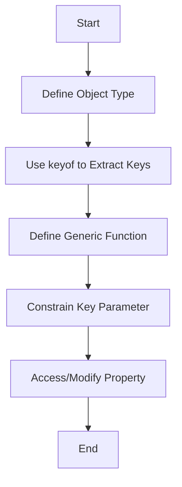

## 8.6 Using `keyof` and Generics

In this section, we will delve into the powerful combination of `keyof` and generics in TypeScript. These features allow us to write more flexible and type-safe code, particularly when dealing with object properties. By the end of this section, you'll understand how to use `keyof` within generic type parameters, create type-safe property getters and setters, and prevent runtime errors due to invalid property access.

### Understanding `keyof`

Before we dive into using `keyof` with generics, let's first understand what `keyof` does. In TypeScript, `keyof` is an operator that takes an object type and produces a string or numeric literal union of its keys. This means that if you have an object type, `keyof` can be used to get a type that represents all the keys of that object.

#### Example: Basic `keyof` Usage

Consider the following example:

```typescript
interface Person {
  name: string;
  age: number;
  email: string;
}

type PersonKeys = keyof Person; // "name" | "age" | "email"
```

In this example, `PersonKeys` is a union type of the keys of the `Person` interface: `"name" | "age" | "email"`. This is useful when you want to restrict a variable to only hold one of the keys of an object.

### Using `keyof` with Generics

Now that we understand `keyof`, let's explore how it can be combined with generics. Generics allow us to create components that work with a variety of types, while `keyof` ensures that we only access valid properties of those types.

#### Creating a Type-Safe Property Getter

One common use case for `keyof` and generics is creating a type-safe property getter. This ensures that you can only access properties that exist on the object, preventing runtime errors.

```typescript
function getProperty<T, K extends keyof T>(obj: T, key: K): T[K] {
  return obj[key];
}

const person: Person = {
  name: "Alice",
  age: 30,
  email: "alice@example.com"
};

const name = getProperty(person, "name"); // Valid
// const invalid = getProperty(person, "address"); // Error: Argument of type '"address"' is not assignable to parameter of type 'keyof Person'.
```

In this example, `getProperty` is a generic function that takes an object `obj` of type `T` and a key `key` of type `K`. The constraint `K extends keyof T` ensures that `key` is a valid key of `obj`. This prevents accessing properties that do not exist on the object, which would otherwise lead to runtime errors.

#### Creating a Type-Safe Property Setter

Similarly, we can create a type-safe property setter using `keyof` and generics:

```typescript
function setProperty<T, K extends keyof T>(obj: T, key: K, value: T[K]): void {
  obj[key] = value;
}

setProperty(person, "age", 31); // Valid
// setProperty(person, "age", "thirty-one"); // Error: Argument of type 'string' is not assignable to parameter of type 'number'.
```

Here, `setProperty` ensures that the value being set is of the correct type for the specified key. This type safety is crucial for maintaining the integrity of our data structures.

### Benefits of Using `keyof` with Generics

Using `keyof` with generics offers several benefits:

1. **Type Safety**: By ensuring that only valid keys are accessed or modified, we reduce the risk of runtime errors due to typos or incorrect property access.

2. **Code Reusability**: Generic functions and components can be reused with different types, making our code more flexible and maintainable.

3. **Improved Intellisense**: In modern code editors, using `keyof` with generics provides better autocompletion and type checking, enhancing the developer experience.

4. **Self-Documenting Code**: The constraints and types used in generic functions make the code more readable and understandable, serving as documentation for how the function should be used.

### Patterns for Type-Safe Property Access

Let's explore some common patterns for type-safe property access using `keyof` and generics.

#### Pattern 1: Safe Object Access

This pattern involves creating utility functions that safely access properties on objects:

```typescript
function safeGet<T, K extends keyof T>(obj: T, key: K): T[K] | undefined {
  return key in obj ? obj[key] : undefined;
}

const email = safeGet(person, "email"); // "alice@example.com"
const address = safeGet(person, "address"); // undefined
```

In this pattern, we use the `in` operator to check if the key exists in the object before accessing it. This prevents accessing undefined properties.

#### Pattern 2: Dynamic Object Manipulation

When working with dynamic data, we often need to manipulate objects based on runtime conditions. Using `keyof` and generics, we can ensure these manipulations are type-safe:

```typescript
function updateObject<T, K extends keyof T>(obj: T, updates: Partial<T>): void {
  for (const key in updates) {
    if (key in obj) {
      obj[key] = updates[key] as T[K];
    }
  }
}

updateObject(person, { age: 32, email: "alice.new@example.com" });
```

Here, `updateObject` takes an object and a partial update object. It iterates over the keys of the update object and applies changes to the original object, ensuring that only valid keys are updated.

### Visualizing `keyof` and Generics

To better understand how `keyof` and generics work together, let's visualize the process using a flowchart.



**Caption**: This flowchart illustrates the process of using `keyof` and generics to access or modify object properties safely.

### Try It Yourself

Now that we've covered the basics, it's time to experiment with `keyof` and generics. Here are some exercises to try:

1. **Create a Type-Safe Property Remover**: Write a function that removes a property from an object, ensuring that only valid keys can be removed.

2. **Extend the `updateObject` Function**: Modify the `updateObject` function to return a new object with the updates applied, rather than modifying the original object.

3. **Build a Type-Safe Object Merger**: Create a function that merges two objects, ensuring that only properties with matching keys and types are merged.

### Conclusion

In this section, we've explored how to use `keyof` with generics to create type-safe applications in TypeScript. By leveraging these features, we can write more robust and maintainable code, reducing the risk of runtime errors and improving the overall developer experience.

### Additional Resources

- [TypeScript Handbook: Generics](https://www.typescriptlang.org/docs/handbook/generics.html)
- [TypeScript Handbook: keyof](https://www.typescriptlang.org/docs/handbook/2/keyof-types.html)
- [MDN Web Docs: JavaScript Data Types and Data Structures](https://developer.mozilla.org/en-US/docs/Web/JavaScript/Data_structures)

## Quiz Time!



### What does the `keyof` operator do in TypeScript?

- [x] It creates a union type of the keys of an object type.
- [ ] It creates a new object with the keys of another object.
- [ ] It removes keys from an object type.
- [ ] It converts an object type to a string.

> **Explanation:** The `keyof` operator takes an object type and produces a union type of its keys.

### How does `keyof` improve type safety?

- [x] By ensuring only valid keys are accessed or modified.
- [ ] By allowing any key to be accessed.
- [ ] By converting all keys to strings.
- [ ] By removing invalid keys from an object.

> **Explanation:** `keyof` ensures that only valid keys are accessed or modified, preventing runtime errors.

### What is a benefit of using `keyof` with generics?

- [x] Code reusability and flexibility.
- [ ] It makes code execution faster.
- [ ] It allows for dynamic typing.
- [ ] It simplifies the syntax of TypeScript.

> **Explanation:** Using `keyof` with generics allows for code reusability and flexibility by working with various types.

### What does the constraint `K extends keyof T` ensure in a generic function?

- [x] That `K` is a valid key of `T`.
- [ ] That `K` is a string.
- [ ] That `K` is a number.
- [ ] That `K` is an object.

> **Explanation:** The constraint `K extends keyof T` ensures that `K` is a valid key of the type `T`.

### Which pattern uses `keyof` to safely access properties?

- [x] Safe Object Access
- [ ] Dynamic Object Creation
- [ ] Object Cloning
- [ ] Key Removal

> **Explanation:** The Safe Object Access pattern uses `keyof` to safely access properties on objects.

### What is the purpose of the `in` operator in the `safeGet` function?

- [x] To check if a key exists in an object.
- [ ] To add a key to an object.
- [ ] To remove a key from an object.
- [ ] To convert a key to a string.

> **Explanation:** The `in` operator checks if a key exists in an object before accessing it.

### How does `setProperty` ensure type safety?

- [x] By ensuring the value is of the correct type for the specified key.
- [ ] By converting all values to strings.
- [ ] By allowing any value to be set.
- [ ] By removing the key from the object.

> **Explanation:** `setProperty` ensures the value is of the correct type for the specified key, maintaining type safety.

### What does the `updateObject` function do?

- [x] It updates an object with a partial update object.
- [ ] It creates a new object from scratch.
- [ ] It deletes properties from an object.
- [ ] It converts an object to a string.

> **Explanation:** The `updateObject` function updates an object with a partial update object, ensuring only valid keys are updated.

### What is a key benefit of using type-safe property access?

- [x] Reducing the risk of runtime errors.
- [ ] Making code execution slower.
- [ ] Allowing dynamic typing.
- [ ] Simplifying the syntax of TypeScript.

> **Explanation:** Type-safe property access reduces the risk of runtime errors by ensuring only valid keys are accessed.

### True or False: `keyof` can be used to create a union type of both string and numeric keys.

- [x] True
- [ ] False

> **Explanation:** `keyof` can create a union type of both string and numeric keys of an object type.


