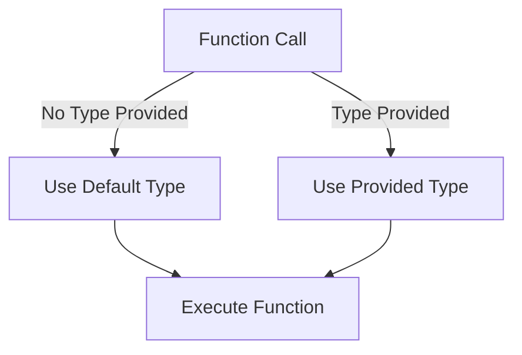

## 8.7 Generic Default Parameters

In this section, we'll explore the concept of generic default parameters in TypeScript. Generics are a powerful feature that allows us to create reusable components that work with a variety of types. By providing default types for generic parameters, we can simplify the usage of these components, making them more flexible and easier to use.

### Understanding Generic Default Parameters

Generic default parameters allow you to specify a default type for a generic parameter. This means that if the user of your function or class does not provide a specific type, TypeScript will use the default type you have specified. This feature is particularly useful when you have a common type that is frequently used, and you want to avoid repetitive type annotations.

#### Specifying Default Types

To specify a default type for a generic parameter, you simply assign a type to the generic parameter in the angle brackets. Here's the basic syntax:

```typescript
function exampleFunction<T = DefaultType>(param: T): T {
  return param;
}
```

In this example, `DefaultType` is the default type for the generic parameter `T`. If no type is provided when calling `exampleFunction`, TypeScript will assume `T` is `DefaultType`.

### Code Example: Default Types in Functions

Let's look at a practical example to see how default types can simplify function usage:

```typescript
// A function to wrap a value in an array
function wrapInArray<T = string>(value: T): T[] {
  return [value];
}

// Using the function with a specific type
const numberArray = wrapInArray<number>(42); // [42]

// Using the function without specifying a type
const stringArray = wrapInArray("Hello"); // ["Hello"]
```

In this example, `wrapInArray` has a default type of `string` for its generic parameter `T`. When we call `wrapInArray` with a number, we explicitly specify the type. However, when we call it with a string, we don't need to specify the type, as the default type `string` is used.

### Default Types in Classes

Just like functions, classes can also benefit from generic default parameters. This is particularly useful in scenarios where a class is designed to work with a common type, but flexibility is still desired.

```typescript
class Box<T = string> {
  private contents: T;

  constructor(value: T) {
    this.contents = value;
  }

  getContents(): T {
    return this.contents;
  }
}

// Creating a Box with a specific type
const numberBox = new Box<number>(123);
console.log(numberBox.getContents()); // 123

// Creating a Box without specifying a type
const stringBox = new Box("TypeScript");
console.log(stringBox.getContents()); // "TypeScript"
```

In this example, the `Box` class has a default type of `string` for its generic parameter `T`. This allows us to create instances of `Box` without specifying a type, simplifying the code when the default type is appropriate.

### Combining Default Types with Constraints

Constraints are used in generics to restrict the types that can be used as arguments. When combined with default types, constraints ensure that the default type adheres to the specified conditions.

```typescript
interface Identifiable {
  id: number;
}

function processItem<T extends Identifiable = { id: number }>(item: T): number {
  return item.id;
}

// Using the function with a specific type
const customItem = { id: 10, name: "Custom" };
console.log(processItem(customItem)); // 10

// Using the function without specifying a type
const defaultItem = { id: 5 };
console.log(processItem(defaultItem)); // 5
```

In this example, the function `processItem` has a constraint that requires `T` to have an `id` property. The default type `{ id: number }` satisfies this constraint, allowing us to use the function without specifying a type when the default is suitable.

### Best Practices for Using Default Generic Types

1. **Use Default Types for Common Scenarios**: If a particular type is frequently used with your generic function or class, consider making it the default type to reduce boilerplate code.

2. **Ensure Default Types Meet Constraints**: When using constraints, always ensure that your default type satisfies them to avoid compilation errors.

3. **Avoid Overcomplicating with Defaults**: While default types can simplify code, overusing them can lead to confusion. Use them judiciously to maintain code clarity.

4. **Document Default Behavior**: Clearly document the default types and their intended usage to help other developers understand the behavior of your code.

### Try It Yourself

To reinforce your understanding, try modifying the examples above. For instance, change the default type in the `wrapInArray` function to `number` and observe how it affects the function's behavior. Experiment with adding constraints to the `Box` class and see how it impacts the instantiation of objects.

### Visualizing Generic Default Parameters

Let's use a diagram to visualize the concept of generic default parameters in a function:



**Diagram Description**: This flowchart illustrates the decision-making process when calling a function with a generic default parameter. If no type is provided, the default type is used. Otherwise, the provided type is used.

### Further Reading

For more information on generics and default types, consider exploring the following resources:

- [TypeScript Handbook: Generics](https://www.typescriptlang.org/docs/handbook/2/generics.html)
- [MDN Web Docs: JavaScript Data Types and Data Structures](https://developer.mozilla.org/en-US/docs/Web/JavaScript/Data_structures)

### Summary

Generic default parameters in TypeScript provide a powerful way to simplify code and enhance flexibility. By specifying default types, you can reduce the need for repetitive type annotations and make your code more concise. Remember to use default types judiciously, ensuring they meet any constraints and documenting their behavior for clarity.

## Quiz Time!



### What is the purpose of generic default parameters in TypeScript?

- [x] To provide a default type for a generic parameter if none is specified
- [ ] To enforce strict type checking
- [ ] To eliminate the need for generics
- [ ] To automatically convert types

> **Explanation:** Generic default parameters allow a function or class to have a default type, simplifying usage when a specific type is not provided.

### How do you specify a default type for a generic parameter?

- [x] By assigning a type to the generic parameter in angle brackets
- [ ] By using the `default` keyword
- [ ] By declaring the type in the function body
- [ ] By using a separate configuration file

> **Explanation:** You specify a default type by assigning it to the generic parameter within angle brackets, e.g., `function example<T = DefaultType>()`.

### What happens if you call a function with a generic default parameter without specifying a type?

- [x] The function uses the default type
- [ ] The function throws an error
- [ ] The function uses `any` type
- [ ] The function does not execute

> **Explanation:** If no type is specified, the function uses the default type provided for the generic parameter.

### Can default types be used in classes as well as functions?

- [x] True
- [ ] False

> **Explanation:** Default types can be used in both classes and functions to simplify their usage.

### What should you ensure when combining default types with constraints?

- [x] The default type satisfies the constraints
- [ ] The default type is always `any`
- [ ] The constraints are ignored
- [ ] The default type is `null`

> **Explanation:** When using constraints, ensure that the default type satisfies them to avoid compilation errors.

### Which of the following is a best practice for using default generic types?

- [x] Use default types for common scenarios
- [ ] Use default types for every generic parameter
- [ ] Avoid using default types altogether
- [ ] Use default types only in complex functions

> **Explanation:** Default types should be used for common scenarios to reduce boilerplate code and simplify usage.

### What is a potential downside of overusing default generic types?

- [x] It can lead to confusion
- [ ] It makes the code more efficient
- [ ] It eliminates the need for type annotations
- [ ] It improves code readability

> **Explanation:** Overusing default types can lead to confusion, so they should be used judiciously.

### How can you document the behavior of default generic types?

- [x] Clearly document the default types and their intended usage
- [ ] Avoid documenting default types
- [ ] Use inline comments only
- [ ] Rely on code comments alone

> **Explanation:** Clear documentation helps other developers understand the behavior and usage of default generic types.

### Which of the following is a correct example of a function with a generic default parameter?

- [x] `function example<T = string>(param: T): T { return param; }`
- [ ] `function example<T>(param: T = string): T { return param; }`
- [ ] `function example<T>(param: T): T = string { return param; }`
- [ ] `function example<T>(param: T): T { return param = string; }`

> **Explanation:** The correct syntax for specifying a default type is `function example<T = string>(param: T): T`.

### Default types can simplify code by reducing the need for what?

- [x] Repetitive type annotations
- [ ] Function declarations
- [ ] Variable declarations
- [ ] Code comments

> **Explanation:** Default types reduce the need for repetitive type annotations, making the code more concise.


