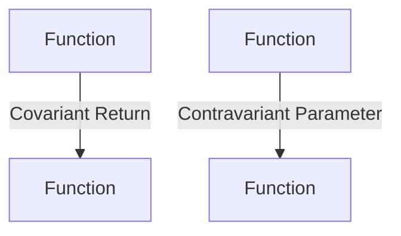

## 8.8 Variance in Generics

In this section, we will delve into the concept of variance in generics, specifically focusing on covariance and contravariance. These concepts are crucial for understanding how TypeScript's type system handles the relationships between different types, especially when dealing with generics. By the end of this section, you'll have a solid grasp of how variance affects function parameters, return types, and the implementation of interfaces and subclasses.

### Introduction to Variance

Variance describes how subtyping between more complex types relates to subtyping between their components. In simpler terms, it helps us understand how types can be substituted for one another in a program. There are two main types of variance:

- **Covariance**: This allows a type to be substituted with its subtype. It's like saying, "If `Dog` is a subtype of `Animal`, then `List<Dog>` is a subtype of `List<Animal>`."
- **Contravariance**: This allows a type to be substituted with its supertype. It's like saying, "If `Animal` is a supertype of `Dog`, then `Function<Animal>` can be substituted with `Function<Dog>`."

### Covariance in TypeScript

Covariance is the more intuitive of the two variances. It allows you to use a more specific type where a more general type is expected. In TypeScript, arrays are covariant. This means you can assign an array of a subtype to an array of a supertype.

#### Example of Covariance

Let's look at a simple example to illustrate covariance:

```typescript
class Animal {
    speak() {
        console.log("Animal speaks");
    }
}

class Dog extends Animal {
    bark() {
        console.log("Dog barks");
    }
}

let animals: Animal[] = [];
let dogs: Dog[] = [new Dog(), new Dog()];

// Covariance allows this assignment
animals = dogs;

// Let's see what happens when we call methods
animals.forEach(animal => animal.speak()); // Works fine
// animals.forEach(animal => animal.bark()); // Error: Property 'bark' does not exist on type 'Animal'.
```

In this example, `dogs` is an array of `Dog`, which is a subtype of `Animal`. Because arrays are covariant, we can assign `dogs` to `animals`. However, when we try to call `bark()` on `animals`, TypeScript throws an error because `bark()` is not a method on `Animal`.

### Contravariance in TypeScript

Contravariance is less intuitive but equally important. It allows you to use a more general type where a more specific type is expected. This is particularly relevant for function parameters.

#### Example of Contravariance

Consider the following example:

```typescript
class AnimalHandler {
    handle(animal: Animal) {
        console.log("Handling an animal");
    }
}

class DogHandler extends AnimalHandler {
    handle(dog: Dog) {
        console.log("Handling a dog");
    }
}

function processAnimal(handler: (animal: Animal) => void) {
    let animal = new Animal();
    handler(animal);
}

let dogHandler = new DogHandler();

// Contravariance allows this assignment
processAnimal(dogHandler.handle);
```

In this example, `DogHandler` is a subtype of `AnimalHandler`. The `processAnimal` function expects a handler that can process an `Animal`. Due to contravariance, we can pass `dogHandler.handle` to `processAnimal`, even though `dogHandler.handle` is more specific.

### Variance in Function Parameters and Return Types

Variance plays a crucial role in how function parameters and return types are handled in TypeScript. Let's explore this further.

#### Function Parameters

Function parameters are contravariant. This means you can pass a function with more specific parameter types to a function expecting more general parameter types.

```typescript
function feedAnimal(feed: (animal: Animal) => void) {
    let animal = new Animal();
    feed(animal);
}

function feedDog(dog: Dog) {
    console.log("Feeding a dog");
}

// Contravariance allows this
feedAnimal(feedDog);
```

In this example, `feedAnimal` expects a function that can feed an `Animal`. However, we can pass `feedDog` to `feedAnimal` because of contravariance.

#### Function Return Types

Function return types are covariant. This means you can return a more specific type where a more general type is expected.

```typescript
function getAnimal(): Animal {
    return new Animal();
}

function getDog(): Dog {
    return new Dog();
}

// Covariance allows this
let animalGetter: () => Animal = getDog;
```

Here, `getDog` returns a `Dog`, which is a subtype of `Animal`. We can assign `getDog` to `animalGetter` because of covariance.

### Implications for Subclassing and Interface Implementation

Variance has significant implications for subclassing and interface implementation in TypeScript. Understanding these implications can help you design more flexible and reusable code.

#### Subclassing

When subclassing, you can leverage variance to create more specific implementations of methods. This allows subclasses to handle more specific types while still adhering to the contract of the superclass.

```typescript
class AnimalFeeder {
    feed(animal: Animal) {
        console.log("Feeding an animal");
    }
}

class DogFeeder extends AnimalFeeder {
    feed(dog: Dog) {
        console.log("Feeding a dog");
    }
}

let feeder: AnimalFeeder = new DogFeeder();
feeder.feed(new Dog());
```

In this example, `DogFeeder` provides a more specific implementation of the `feed` method. Due to contravariance, `DogFeeder` can be used wherever `AnimalFeeder` is expected.

#### Interface Implementation

Interfaces can also benefit from variance. When implementing an interface, you can use more specific types for method parameters and more general types for return types.

```typescript
interface Handler<T> {
    handle(item: T): void;
}

class AnimalHandler implements Handler<Animal> {
    handle(animal: Animal) {
        console.log("Handling an animal");
    }
}

class DogHandler implements Handler<Dog> {
    handle(dog: Dog) {
        console.log("Handling a dog");
    }
}

let handler: Handler<Animal> = new DogHandler();
handler.handle(new Dog());
```

In this example, `DogHandler` implements `Handler<Dog>`, but due to variance, it can be assigned to `handler` of type `Handler<Animal>`.

### Visualizing Variance

To better understand variance, let's visualize it using a diagram. This diagram illustrates how covariance and contravariance work with function parameters and return types.



In this diagram, `Function<Animal>` can have a covariant return type of `Function<Dog>`, and `Function<Dog>` can have a contravariant parameter type of `Function<Animal>`.

### Try It Yourself

To reinforce your understanding of variance, try modifying the examples above. Experiment with different types and see how TypeScript's type system handles them. Here are a few suggestions:

- Change the parameter types in the `feedAnimal` and `feedDog` functions and observe the effects.
- Modify the return types in the `getAnimal` and `getDog` functions and see how TypeScript responds.
- Create your own classes and interfaces to explore how variance affects subclassing and interface implementation.

### Key Takeaways

- **Covariance** allows a type to be substituted with its subtype.
- **Contravariance** allows a type to be substituted with its supertype.
- Function parameters are contravariant, while function return types are covariant.
- Variance has significant implications for subclassing and interface implementation, allowing for more flexible and reusable code.

### Further Reading

For more information on variance in TypeScript, consider exploring the following resources:

- [TypeScript Handbook: Generics](https://www.typescriptlang.org/docs/handbook/2/generics.html)
- [MDN Web Docs: Variance](https://developer.mozilla.org/en-US/docs/Glossary/Variance)
- [TypeScript Deep Dive: Generics](https://basarat.gitbook.io/typescript/type-system/generics)

## Quiz Time!



### What is covariance?

- [x] Allows a type to be substituted with its subtype.
- [ ] Allows a type to be substituted with its supertype.
- [ ] Allows a type to be substituted with any type.
- [ ] Does not allow any substitution.

> **Explanation:** Covariance allows a type to be substituted with its subtype, making it more flexible in certain contexts.

### What is contravariance?

- [ ] Allows a type to be substituted with its subtype.
- [x] Allows a type to be substituted with its supertype.
- [ ] Allows a type to be substituted with any type.
- [ ] Does not allow any substitution.

> **Explanation:** Contravariance allows a type to be substituted with its supertype, which is useful for function parameters.

### Which of the following is an example of covariance?

- [x] Assigning an array of `Dog` to an array of `Animal`.
- [ ] Assigning a function that takes `Animal` to a function that takes `Dog`.
- [ ] Assigning a function that returns `Animal` to a function that returns `Dog`.
- [ ] Assigning a variable of type `Animal` to a variable of type `Dog`.

> **Explanation:** Covariance allows an array of a subtype (`Dog`) to be assigned to an array of a supertype (`Animal`).

### Which of the following is an example of contravariance?

- [ ] Assigning an array of `Dog` to an array of `Animal`.
- [x] Assigning a function that takes `Dog` to a function that takes `Animal`.
- [ ] Assigning a function that returns `Animal` to a function that returns `Dog`.
- [ ] Assigning a variable of type `Animal` to a variable of type `Dog`.

> **Explanation:** Contravariance allows a function that takes a more specific type (`Dog`) to be assigned to a function that takes a more general type (`Animal`).

### In TypeScript, function parameters are:

- [ ] Covariant
- [x] Contravariant
- [ ] Invariant
- [ ] Bivariant

> **Explanation:** Function parameters in TypeScript are contravariant, meaning they can accept a more general type than specified.

### In TypeScript, function return types are:

- [x] Covariant
- [ ] Contravariant
- [ ] Invariant
- [ ] Bivariant

> **Explanation:** Function return types in TypeScript are covariant, allowing a more specific type to be returned.

### Which of the following best describes variance?

- [x] The relationship between subtyping of complex types and their components.
- [ ] The ability to change types dynamically at runtime.
- [ ] The process of converting one type to another.
- [ ] The enforcement of strict type checking.

> **Explanation:** Variance describes how subtyping between complex types relates to subtyping between their components.

### Can a `DogHandler` be used where an `AnimalHandler` is expected due to variance?

- [x] Yes
- [ ] No

> **Explanation:** Due to contravariance, a `DogHandler` can be used where an `AnimalHandler` is expected if it handles a more specific type.

### What does covariance allow in terms of function return types?

- [x] Returning a more specific type than expected.
- [ ] Returning a more general type than expected.
- [ ] Returning any type.
- [ ] Returning no type.

> **Explanation:** Covariance allows a function to return a more specific type than what is generally expected.

### True or False: Variance is only applicable to arrays in TypeScript.

- [ ] True
- [x] False

> **Explanation:** Variance is applicable to arrays, function parameters, return types, and more in TypeScript.


