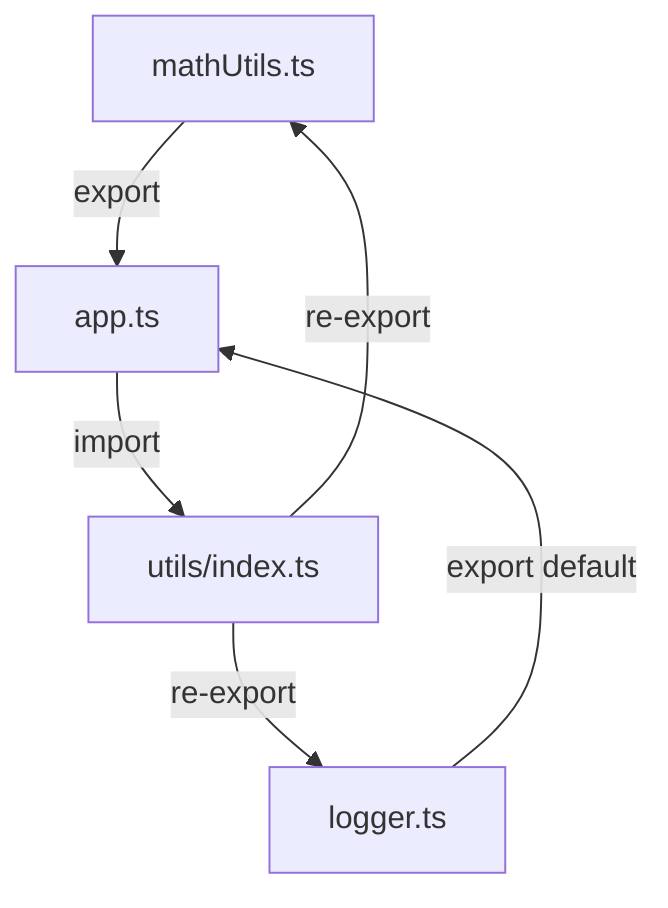

## 9.1 Modules in TypeScript

Welcome to the world of modules in TypeScript! In this section, we will explore how modules can help you organize and manage your code effectively. Understanding modules is crucial for building scalable and maintainable applications, especially as your codebase grows. Let's dive into the concepts, syntax, and best practices for using modules in TypeScript.

### Understanding Modules

Modules are a way to organize code into separate files and namespaces, making it easier to manage and maintain. They allow you to encapsulate code, exposing only what is necessary and keeping the rest private. This encapsulation helps in avoiding name collisions and makes the code more modular and reusable.

In TypeScript, modules are based on the ES6 (ECMAScript 2015) module system, which is now widely supported in modern JavaScript environments. Modules are defined using `export` and `import` statements, enabling you to share code between different files.

### Why Use Modules?

Modules are essential for several reasons:

1. **Code Organization**: They help in organizing code into logical units, making it easier to navigate and understand.
2. **Reusability**: Modules promote code reuse by allowing you to import and use code across different parts of your application.
3. **Maintainability**: By breaking down code into smaller, manageable pieces, modules make it easier to maintain and update your codebase.
4. **Scalability**: As your application grows, modules help in scaling by providing a clear structure and separation of concerns.

### ES6 Module Syntax

Let's start by exploring the basic syntax for defining and using modules in TypeScript.

#### Exporting from a Module

To make code available from a module, you use the `export` keyword. There are two main types of exports: named exports and default exports.

**Named Exports**

Named exports allow you to export multiple values from a module. You can export variables, functions, classes, or interfaces.

```typescript
// mathUtils.ts

// Exporting a function
export function add(a: number, b: number): number {
    return a + b;
}

// Exporting a variable
export const PI = 3.14;

// Exporting a class
export class Calculator {
    multiply(a: number, b: number): number {
        return a * b;
    }
}
```

**Default Exports**

A module can have a single default export. This is useful when you want to export a single value or entity from a module.

```typescript
// logger.ts

// Exporting a default function
export default function log(message: string): void {
    console.log(message);
}
```

#### Importing from a Module

To use code from another module, you use the `import` statement.

**Importing Named Exports**

When importing named exports, you must use the same names as the exported entities.

```typescript
// app.ts

import { add, PI, Calculator } from './mathUtils';

console.log(add(2, 3)); // Output: 5
console.log(PI); // Output: 3.14

const calculator = new Calculator();
console.log(calculator.multiply(4, 5)); // Output: 20
```

**Importing Default Exports**

Default exports can be imported with any name you choose.

```typescript
// app.ts

import log from './logger';

log('Hello, TypeScript!'); // Output: Hello, TypeScript!
```

### Combining Named and Default Exports

You can combine named and default exports in a single module.

```typescript
// shapes.ts

export default class Circle {
    constructor(public radius: number) {}

    area(): number {
        return Math.PI * this.radius * this.radius;
    }
}

export function squareArea(side: number): number {
    return side * side;
}
```

```typescript
// app.ts

import Circle, { squareArea } from './shapes';

const circle = new Circle(5);
console.log(circle.area()); // Output: 78.53981633974483

console.log(squareArea(4)); // Output: 16
```

### Splitting Code into Multiple Files

Modules allow you to split your code into multiple files, each representing a logical unit or feature. This separation makes it easier to manage and navigate your codebase.

**Example: Organizing a Simple Application**

Let's consider a simple application with a few modules:

1. `mathUtils.ts` - Contains mathematical utility functions.
2. `logger.ts` - Provides logging functionality.
3. `app.ts` - The main application file.

```typescript
// mathUtils.ts

export function add(a: number, b: number): number {
    return a + b;
}

export const PI = 3.14;
```

```typescript
// logger.ts

export default function log(message: string): void {
    console.log(message);
}
```

```typescript
// app.ts

import { add, PI } from './mathUtils';
import log from './logger';

log(`The sum of 2 and 3 is ${add(2, 3)}`);
log(`The value of PI is ${PI}`);
```

### Best Practices for Module Organization

1. **Logical Grouping**: Group related functionalities into a single module. For example, all mathematical operations can be placed in a `mathUtils` module.

2. **Consistent Naming**: Use consistent and meaningful names for your modules and exports. This makes it easier to understand and use them.

3. **Single Responsibility**: Each module should have a single responsibility. Avoid placing unrelated functionalities in the same module.

4. **Avoid Circular Dependencies**: Be cautious of circular dependencies, where two or more modules depend on each other. This can lead to complex and hard-to-debug issues.

5. **Use Index Files**: For larger projects, consider using an `index.ts` file to re-export modules. This can simplify imports in other parts of your application.

```typescript
// utils/index.ts

export * from './mathUtils';
export { default as log } from './logger';
```

```typescript
// app.ts

import { add, PI, log } from './utils';

log(`The sum of 2 and 3 is ${add(2, 3)}`);
log(`The value of PI is ${PI}`);
```

### How Modules Help in Scaling Applications

As applications grow, managing code becomes increasingly challenging. Modules provide a structured way to organize code, making it easier to scale applications. They allow teams to work on different parts of the application independently, promoting collaboration and reducing conflicts.

Modules also enhance code readability and maintainability by providing clear boundaries and separation of concerns. This modular approach makes it easier to refactor and update code without affecting other parts of the application.

### Try It Yourself

Now that we've covered the basics of modules, it's time to experiment! Try creating your own modules and importing them into a main application file. Here are a few ideas to get you started:

- Create a module for string utilities with functions like `capitalize` and `reverse`.
- Develop a module for date utilities with functions to format and parse dates.
- Build a simple application that uses these modules to perform various operations.

### Visualizing Module Imports and Exports

To help visualize how modules interact, let's use a Mermaid.js diagram to represent the flow of imports and exports in our example application.



**Diagram Description**: This diagram illustrates the flow of exports and imports between modules. The `mathUtils.ts` and `logger.ts` modules export their functionalities, which are then imported into `app.ts`. The `utils/index.ts` file re-exports these modules, simplifying the import process in `app.ts`.

### References and Further Reading

- [MDN Web Docs: Modules](https://developer.mozilla.org/en-US/docs/Web/JavaScript/Guide/Modules)
- [TypeScript Handbook: Modules](https://www.typescriptlang.org/docs/handbook/modules.html)
- [JavaScript Info: Modules](https://javascript.info/modules)

### Key Takeaways

- Modules help organize code into separate files, promoting reusability and maintainability.
- Use `export` and `import` statements to share code between modules.
- Named exports allow multiple exports per module, while default exports provide a single export.
- Follow best practices for module organization to avoid common pitfalls and enhance code readability.
- Modules are essential for scaling applications and managing larger codebases.

## Quiz Time!



### What is the primary purpose of modules in TypeScript?

- [x] To organize code into separate files and namespaces
- [ ] To execute code faster
- [ ] To compile TypeScript to JavaScript
- [ ] To create user interfaces

> **Explanation:** Modules help organize code into separate files and namespaces, making it easier to manage and maintain.

### Which keyword is used to make code available from a module?

- [ ] import
- [x] export
- [ ] require
- [ ] include

> **Explanation:** The `export` keyword is used to make code available from a module.

### How many default exports can a module have?

- [x] One
- [ ] Two
- [ ] Unlimited
- [ ] None

> **Explanation:** A module can have only one default export.

### What is the correct way to import a named export?

- [ ] import { default } from './module';
- [x] import { namedExport } from './module';
- [ ] import namedExport from './module';
- [ ] import * as namedExport from './module';

> **Explanation:** Named exports are imported using curly braces with the exact name of the export.

### What is a best practice for module organization?

- [x] Group related functionalities into a single module
- [ ] Place all code in one module
- [ ] Use random names for modules
- [ ] Avoid using modules

> **Explanation:** Grouping related functionalities into a single module is a best practice for module organization.

### What problem can circular dependencies cause?

- [ ] Faster execution
- [ ] Improved readability
- [x] Complex and hard-to-debug issues
- [ ] Reduced file size

> **Explanation:** Circular dependencies can lead to complex and hard-to-debug issues.

### How can you simplify imports in larger projects?

- [ ] Use more default exports
- [ ] Avoid using modules
- [x] Use an index file to re-export modules
- [ ] Use random file names

> **Explanation:** Using an index file to re-export modules can simplify imports in larger projects.

### What is the benefit of using modules for scaling applications?

- [x] They provide a structured way to organize code
- [ ] They make code run faster
- [ ] They reduce the need for comments
- [ ] They eliminate the need for testing

> **Explanation:** Modules provide a structured way to organize code, making it easier to scale applications.

### Which statement is true about default exports?

- [x] They can be imported with any name
- [ ] They must be imported with the same name
- [ ] They cannot be used with named exports
- [ ] They are faster than named exports

> **Explanation:** Default exports can be imported with any name you choose.

### True or False: Modules are only useful for small applications.

- [ ] True
- [x] False

> **Explanation:** Modules are useful for both small and large applications, helping to organize and manage code effectively.


