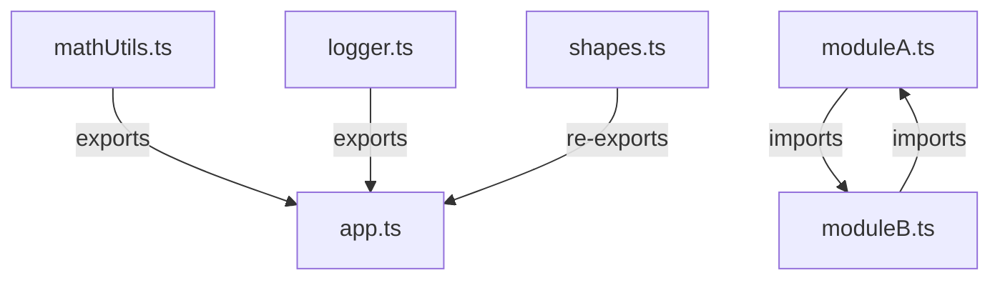

## 9.2 Exporting and Importing Declarations

In modern web development, organizing code into manageable and reusable pieces is crucial. TypeScript, building upon JavaScript's module system, offers a robust way to export and import declarations. This section will guide you through the various ways to export and import declarations in TypeScript, ensuring your code remains clean, efficient, and maintainable.

### Understanding Modules

Modules are a way to separate your code into distinct files, each encapsulating specific functionality. This separation helps in maintaining a clean codebase, promoting reusability, and enhancing collaboration among developers.

**Key Concepts:**

- **Modules**: Files that contain code, which can be exported and imported.
- **Export**: Making parts of a module available to other modules.
- **Import**: Bringing in functionality from other modules.

### Export Patterns in TypeScript

TypeScript supports several export patterns, each serving different purposes. Let's explore these patterns with examples.

#### Named Exports

Named exports allow you to export multiple values from a module. Each value is exported with a specific name, and you can export as many values as needed.

**Example:**

```typescript
// mathUtils.ts
export const pi = 3.14;

export function calculateCircumference(diameter: number): number {
    return diameter * pi;
}

export class Circle {
    constructor(public radius: number) {}

    area(): number {
        return pi * this.radius * this.radius;
    }
}
```

In the example above, we export a constant `pi`, a function `calculateCircumference`, and a class `Circle`. These can be imported individually or collectively in another module.

#### Default Exports

Default exports are used when a module exports a single value or entity. This is useful when a module is designed to export one main functionality.

**Example:**

```typescript
// logger.ts
export default function logMessage(message: string): void {
    console.log(`Log: ${message}`);
}
```

Here, the `logMessage` function is the default export of the `logger.ts` module. A module can only have one default export.

#### Re-exports

Re-exports allow you to export declarations from another module. This is useful for creating a single entry point for multiple modules.

**Example:**

```typescript
// shapes.ts
export { Circle } from './mathUtils';
export { default as log } from './logger';
```

In this example, we re-export the `Circle` class from `mathUtils.ts` and the default export from `logger.ts` under the alias `log`.

### Importing Declarations

Once you have exported declarations, you can import them into other modules. Let's see how to import the different types of exports.

#### Importing Named Exports

When importing named exports, you must use the exact name used in the export.

**Example:**

```typescript
// app.ts
import { pi, calculateCircumference, Circle } from './mathUtils';

console.log(`The value of pi is ${pi}`);
console.log(`Circumference: ${calculateCircumference(10)}`);

const myCircle = new Circle(5);
console.log(`Area of the circle: ${myCircle.area()}`);
```

In this example, we import `pi`, `calculateCircumference`, and `Circle` from `mathUtils.ts` and use them in `app.ts`.

#### Importing Default Exports

Default exports can be imported with any name, as they are the primary export of the module.

**Example:**

```typescript
// app.ts
import logMessage from './logger';

logMessage('This is a default export example.');
```

Here, we import the default export from `logger.ts` and use it as `logMessage`.

#### Importing All Exports

You can import all exports from a module using the `* as` syntax. This is useful when you want to access all exports under a single namespace.

**Example:**

```typescript
// app.ts
import * as MathUtils from './mathUtils';

console.log(`The value of pi is ${MathUtils.pi}`);
console.log(`Circumference: ${MathUtils.calculateCircumference(10)}`);

const myCircle = new MathUtils.Circle(5);
console.log(`Area of the circle: ${myCircle.area()}`);
```

In this example, all exports from `mathUtils.ts` are imported under the namespace `MathUtils`.

### Managing Circular Dependencies

Circular dependencies occur when two or more modules depend on each other, creating a loop. This can lead to runtime errors and unexpected behavior.

**Example of Circular Dependency:**

```typescript
// moduleA.ts
import { functionB } from './moduleB';

export function functionA() {
    console.log('Function A');
    functionB();
}

// moduleB.ts
import { functionA } from './moduleA';

export function functionB() {
    console.log('Function B');
    functionA();
}
```

In this example, `moduleA.ts` imports `functionB` from `moduleB.ts`, and `moduleB.ts` imports `functionA` from `moduleA.ts`, creating a circular dependency.

**Avoiding Circular Dependencies:**

- **Refactor Code**: Break down modules into smaller, independent units.
- **Use Interfaces**: Define interfaces in a separate module to reduce direct dependencies.
- **Lazy Loading**: Import modules within functions to delay loading until necessary.

### Best Practices for Exports and Imports

To maintain a clean and efficient codebase, follow these best practices:

- **Keep Exports Minimal**: Export only what is necessary. Avoid exporting everything from a module.
- **Use Descriptive Names**: Use clear and descriptive names for exports to improve readability.
- **Organize Imports**: Group and order imports logically, separating third-party imports from local imports.
- **Avoid Wildcard Imports**: Import only the necessary parts of a module to reduce memory usage and improve performance.

### Try It Yourself

Experiment with the following code examples to reinforce your understanding:

1. **Modify the `mathUtils.ts` module** to add a new function `calculateArea(radius: number): number` and export it. Import and use this function in `app.ts`.

2. **Create a new module `rectangle.ts`** with a default export function `calculateRectangleArea(length: number, width: number): number`. Import this function in `app.ts` and calculate the area of a rectangle.

3. **Refactor the circular dependency example** by creating a new module `common.ts` that exports a shared interface or utility function.

### Visual Aids

To better understand the flow of exports and imports, let's visualize the relationships between modules using a diagram.



**Diagram Explanation**: 

- `mathUtils.ts` and `logger.ts` export declarations used in `app.ts`.
- `shapes.ts` re-exports declarations from other modules for use in `app.ts`.
- `moduleA.ts` and `moduleB.ts` illustrate a circular dependency.

### Further Reading

For more information on modules and best practices, consider exploring the following resources:

- [MDN Web Docs: Import](https://developer.mozilla.org/en-US/docs/Web/JavaScript/Reference/Statements/import)
- [MDN Web Docs: Export](https://developer.mozilla.org/en-US/docs/Web/JavaScript/Reference/Statements/export)
- [TypeScript Handbook: Modules](https://www.typescriptlang.org/docs/handbook/modules.html)

## Quiz Time!



### Which of the following is a named export?

- [x] `export const pi = 3.14;`
- [ ] `export default function logMessage() {}`
- [ ] `import * as MathUtils from './mathUtils';`
- [ ] `import logMessage from './logger';`

> **Explanation:** A named export uses the `export` keyword followed by a declaration, such as `const`, `function`, or `class`.

### How many default exports can a module have?

- [ ] Zero
- [ ] Two
- [x] One
- [ ] Unlimited

> **Explanation:** A module can have only one default export, which represents the main functionality of the module.

### What is the purpose of re-exports?

- [ ] To create circular dependencies
- [x] To consolidate exports from multiple modules
- [ ] To import all exports under a single namespace
- [ ] To export everything from a module

> **Explanation:** Re-exports allow you to consolidate exports from multiple modules into a single module, providing a unified entry point.

### Which syntax is used to import all exports from a module under a single namespace?

- [ ] `import default from './module';`
- [ ] `import { all } from './module';`
- [x] `import * as Namespace from './module';`
- [ ] `import * from './module';`

> **Explanation:** The `import * as Namespace from './module';` syntax imports all exports under the specified namespace.

### What is a potential issue with circular dependencies?

- [x] Runtime errors and unexpected behavior
- [ ] Improved performance
- [ ] Easier code maintenance
- [ ] Reduced memory usage

> **Explanation:** Circular dependencies can lead to runtime errors and unexpected behavior, as modules depend on each other in a loop.

### How can you avoid circular dependencies?

- [x] Refactor code into smaller modules
- [ ] Use wildcard imports
- [ ] Export everything from a module
- [ ] Import all exports under a single namespace

> **Explanation:** Refactoring code into smaller, independent modules helps avoid circular dependencies.

### Which of the following is a best practice for managing imports?

- [ ] Use wildcard imports for all modules
- [x] Group and order imports logically
- [ ] Import everything from a module
- [ ] Use non-descriptive names for imports

> **Explanation:** Grouping and ordering imports logically improves code readability and maintainability.

### What is the advantage of using default exports?

- [ ] Allows multiple exports with the same name
- [ ] Improves memory usage
- [x] Simplifies importing a single main functionality
- [ ] Reduces code complexity

> **Explanation:** Default exports simplify importing a single main functionality from a module.

### Which of the following is NOT a type of export in TypeScript?

- [ ] Named export
- [ ] Default export
- [ ] Re-export
- [x] Circular export

> **Explanation:** Circular export is not a recognized type of export in TypeScript.

### True or False: A module can have multiple named exports.

- [x] True
- [ ] False

> **Explanation:** A module can have multiple named exports, each with a unique name.



By understanding and effectively using exports and imports, you can create a modular and maintainable codebase in TypeScript. Keep practicing and experimenting with different patterns to find what works best for your projects!
