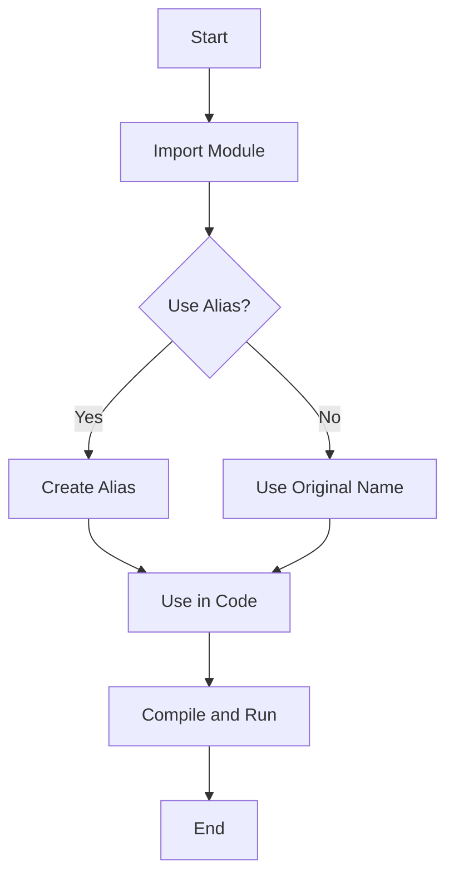

## 9.3 Aliases and Advanced Import Techniques

In this section, we will delve into the world of module imports in TypeScript, focusing on creating aliases and exploring advanced import techniques. Understanding these concepts will help you write more efficient, organized, and maintainable code. Let's get started!

### Understanding Module Imports

Before we dive into aliases and advanced techniques, let's briefly review how module imports work in TypeScript. Modules are a way to encapsulate code, making it reusable and easier to manage. TypeScript uses the ES6 module syntax, which includes `import` and `export` statements to handle dependencies.

#### Basic Import Syntax

Here's a simple example of importing a module:

```typescript
// mathUtils.ts
export function add(a: number, b: number): number {
    return a + b;
}

// main.ts
import { add } from './mathUtils';

console.log(add(2, 3)); // Output: 5
```

In this example, we export a function `add` from `mathUtils.ts` and import it into `main.ts`.

### Creating Aliases with `import as`

Aliases allow you to rename imports to avoid naming conflicts or to make your code more readable. This is particularly useful when dealing with modules that have similar names or when you want to give a more descriptive name to an imported entity.

#### Using `import as`

You can create an alias for an imported module or specific exports using the `as` keyword. Here's how:

```typescript
// mathUtils.ts
export function subtract(a: number, b: number): number {
    return a - b;
}

// main.ts
import { subtract as minus } from './mathUtils';

console.log(minus(5, 3)); // Output: 2
```

In this example, we import the `subtract` function as `minus`, making it clear in the code that this function is used for subtraction.

#### When to Use Aliases

- **Avoiding Naming Conflicts**: If two modules export entities with the same name, aliases help prevent conflicts.
- **Improving Readability**: Aliases can make your code more descriptive and easier to understand.
- **Simplifying Long Module Names**: If a module has a long or complex name, an alias can make it more manageable.

### Importing Entire Modules vs. Specific Exports

TypeScript allows you to import entire modules or specific exports, depending on your needs.

#### Importing Specific Exports

Importing specific exports is efficient when you only need a few functions or variables from a module. This reduces the memory footprint of your application.

```typescript
// stringUtils.ts
export function capitalize(str: string): string {
    return str.charAt(0).toUpperCase() + str.slice(1);
}

export function lowercase(str: string): string {
    return str.toLowerCase();
}

// main.ts
import { capitalize } from './stringUtils';

console.log(capitalize('hello')); // Output: Hello
```

#### Importing Entire Modules

Sometimes, you might want to import an entire module. This is useful when you need most or all of the exports from a module.

```typescript
// stringUtils.ts
export function capitalize(str: string): string {
    return str.charAt(0).toUpperCase() + str.slice(1);
}

export function lowercase(str: string): string {
    return str.toLowerCase();
}

// main.ts
import * as stringUtils from './stringUtils';

console.log(stringUtils.capitalize('hello')); // Output: Hello
console.log(stringUtils.lowercase('WORLD')); // Output: world
```

In this example, we import all exports from `stringUtils.ts` as `stringUtils`, allowing us to access all functions under this namespace.

### Advanced Import Patterns

As your TypeScript projects grow, you may encounter scenarios where basic import techniques are not sufficient. Let's explore some advanced patterns that can enhance your code organization and performance.

#### Dynamic Imports

Dynamic imports allow you to load modules asynchronously, which can improve the performance of your application by reducing the initial load time. This is particularly useful for large applications where not all modules are needed immediately.

```typescript
// main.ts
async function loadModule() {
    const { default: module } = await import('./heavyModule');
    module.doSomething();
}

loadModule();
```

In this example, `heavyModule` is loaded only when `loadModule` is called, reducing the initial load time of the application.

#### Use Cases for Dynamic Imports

- **Code Splitting**: Load only the necessary parts of your application when needed.
- **Lazy Loading**: Defer loading of non-critical resources until they are needed.
- **Conditional Loading**: Load modules based on certain conditions, such as user actions or device capabilities.

### Best Practices for Importing Modules

To maintain readable and maintainable code, consider the following best practices:

- **Use Descriptive Aliases**: When creating aliases, choose names that clearly describe the purpose of the imported entity.
- **Organize Imports**: Group related imports together and separate them from unrelated ones. This improves readability and makes it easier to manage dependencies.
- **Limit Import Scope**: Import only what you need to minimize the memory footprint and improve performance.
- **Consistent Naming Conventions**: Follow consistent naming conventions for aliases and imports to avoid confusion.
- **Document Imports**: Use comments to explain complex import patterns or the reason for using certain aliases.

### Try It Yourself

Experiment with the following code example to reinforce your understanding of aliases and advanced import techniques:

```typescript
// mathOperations.ts
export function multiply(a: number, b: number): number {
    return a * b;
}

export function divide(a: number, b: number): number {
    return a / b;
}

// main.ts
import { multiply as times, divide as over } from './mathOperations';

console.log(times(4, 5)); // Output: 20
console.log(over(20, 4)); // Output: 5
```

**Challenge**: Modify the code to use dynamic imports for the `mathOperations` module and observe the behavior.

### Visual Aids

To better understand how aliases and imports work, let's visualize the process using a flowchart.



**Caption**: This flowchart illustrates the decision-making process when importing modules and using aliases.

### References and Links

For further reading on TypeScript modules and imports, consider the following resources:

- [MDN Web Docs: Import](https://developer.mozilla.org/en-US/docs/Web/JavaScript/Reference/Statements/import)
- [TypeScript Handbook: Modules](https://www.typescriptlang.org/docs/handbook/modules.html)

### Engagement and Reinforcement

To reinforce your learning, try answering the following questions:

- What are the benefits of using aliases in TypeScript?
- How can dynamic imports improve the performance of your application?
- Why is it important to limit the scope of imports?

### Summary

In this section, we've explored how to create aliases for modules and use advanced import techniques in TypeScript. By understanding these concepts, you can write more efficient and maintainable code. Remember to use aliases thoughtfully, organize your imports, and consider dynamic imports for performance optimization.

## Quiz Time!



### What is an alias in TypeScript imports?

- [x] A way to rename an imported module or export
- [ ] A method to import all exports from a module
- [ ] A function to export modules
- [ ] A keyword to declare variables

> **Explanation:** An alias in TypeScript imports is a way to rename an imported module or export using the `as` keyword.

### When should you use aliases in TypeScript?

- [x] To avoid naming conflicts
- [x] To improve code readability
- [ ] To increase code complexity
- [ ] To duplicate code

> **Explanation:** Aliases are used to avoid naming conflicts and improve code readability, making the code more understandable and maintainable.

### How do you import all exports from a module in TypeScript?

- [x] Using `import * as alias from 'module'`
- [ ] Using `import { all } from 'module'`
- [ ] Using `import module from 'module'`
- [ ] Using `import alias from 'module'`

> **Explanation:** To import all exports from a module, use the syntax `import * as alias from 'module'`.

### What is a dynamic import in TypeScript?

- [x] An import that loads modules asynchronously
- [ ] An import that loads modules synchronously
- [ ] An import that duplicates modules
- [ ] An import that deletes modules

> **Explanation:** A dynamic import in TypeScript loads modules asynchronously, which can improve application performance by reducing initial load time.

### What are the benefits of dynamic imports?

- [x] Code splitting
- [x] Lazy loading
- [ ] Increased memory usage
- [ ] Slower application performance

> **Explanation:** Dynamic imports allow for code splitting and lazy loading, which can improve application performance by loading only necessary modules.

### Which keyword is used to create an alias for an import?

- [x] `as`
- [ ] `from`
- [ ] `with`
- [ ] `alias`

> **Explanation:** The `as` keyword is used to create an alias for an import in TypeScript.

### What is the purpose of organizing imports in TypeScript?

- [x] To improve code readability
- [x] To make it easier to manage dependencies
- [ ] To increase code complexity
- [ ] To duplicate code

> **Explanation:** Organizing imports improves code readability and makes it easier to manage dependencies, enhancing maintainability.

### How can you limit the scope of imports in TypeScript?

- [x] By importing only what you need
- [ ] By importing all exports
- [ ] By duplicating imports
- [ ] By using dynamic imports

> **Explanation:** Limiting the scope of imports by importing only what you need reduces memory usage and improves performance.

### What is a best practice for naming aliases in TypeScript?

- [x] Use descriptive names
- [ ] Use random names
- [ ] Use single-letter names
- [ ] Use numbers

> **Explanation:** Using descriptive names for aliases makes the code more understandable and maintainable.

### True or False: Dynamic imports can be used for conditional loading of modules.

- [x] True
- [ ] False

> **Explanation:** Dynamic imports can be used for conditional loading of modules, allowing you to load modules based on specific conditions.


