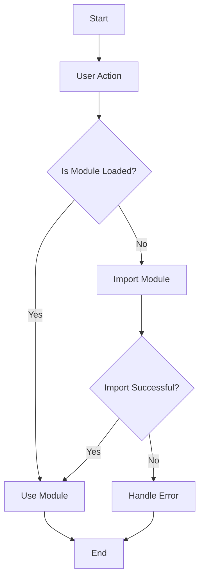

## 9.5 Dynamic Imports

In this section, we will explore the concept of dynamic imports in TypeScript, a powerful feature that allows us to load modules on demand. This technique can significantly enhance the performance of our applications by reducing the initial load time and enabling code splitting. Let's dive in and understand how dynamic imports work, their benefits, and how to implement them effectively.

### Introduction to Dynamic Imports

Dynamic imports are a way to load JavaScript modules asynchronously and on-demand. Unlike static imports, which are loaded at the beginning of the application, dynamic imports allow us to load modules only when they are needed. This is particularly useful for large applications where not all code is required immediately.

**Static Import Example:**

```typescript
import { myFunction } from './myModule';

// Use the imported function
myFunction();
```

In the above example, `myFunction` is imported statically, meaning it is loaded at the start of the application. This can lead to longer initial load times, especially if the module is large or not immediately needed.

**Dynamic Import Example:**

```typescript
async function loadMyModule() {
    const module = await import('./myModule');
    module.myFunction();
}

// Call the function when needed
loadMyModule();
```

Here, the `import()` function is used to load `myModule` dynamically. The module is only fetched when `loadMyModule` is called, which can be triggered by a user action or another event.

### Benefits of Dynamic Imports

1. **Performance Optimization**: By loading only the necessary parts of the application at any given time, dynamic imports can significantly reduce the initial load time, improving the user experience.

2. **Code Splitting**: Dynamic imports enable code splitting, a technique where the application is divided into smaller chunks that can be loaded independently. This is particularly useful for single-page applications (SPAs) where different pages or components can be loaded as needed.

3. **Lazy Loading**: With dynamic imports, we can implement lazy loading, where certain parts of the application are loaded only when they are needed. This is beneficial for loading large libraries or components that are not required immediately.

### Implementing Dynamic Imports

Let's look at how to implement dynamic imports in a TypeScript project. We'll cover the syntax, handling promises, and some practical examples.

#### Syntax of Dynamic Imports

The `import()` function is used for dynamic imports. It returns a promise that resolves to the module object. Here's the basic syntax:

```typescript
import(moduleSpecifier)
    .then(module => {
        // Use the module
    })
    .catch(error => {
        // Handle any errors
    });
```

#### Example: Code Splitting with Dynamic Imports

Suppose we have a large application with multiple features, and we want to load each feature only when it's needed. Here's how we can achieve this using dynamic imports:

```typescript
async function loadFeature(featureName: string) {
    try {
        const featureModule = await import(`./features/${featureName}`);
        featureModule.initialize();
    } catch (error) {
        console.error(`Failed to load feature: ${featureName}`, error);
    }
}

// Load a feature based on user action
document.getElementById('loadFeatureButton')?.addEventListener('click', () => {
    loadFeature('featureA');
});
```

In this example, we dynamically import a feature module based on the user's action. The module is loaded only when the user clicks the button, reducing the initial load time of the application.

#### Handling Promises from Dynamic Imports

Since dynamic imports return promises, we need to handle them appropriately. This involves using `async/await` or `.then()` and `.catch()` to manage the asynchronous nature of the imports.

**Using `async/await`:**

```typescript
async function loadModule() {
    try {
        const module = await import('./myModule');
        module.myFunction();
    } catch (error) {
        console.error('Error loading module:', error);
    }
}
```

**Using `.then()` and `.catch()`:**

```typescript
import('./myModule')
    .then(module => {
        module.myFunction();
    })
    .catch(error => {
        console.error('Error loading module:', error);
    });
```

### Considerations and Limitations

While dynamic imports offer many advantages, there are some considerations and limitations to keep in mind:

1. **Network Latency**: Dynamic imports rely on network requests to fetch the modules. This can introduce latency, especially if the user has a slow internet connection. It's important to balance the benefits of reduced initial load time with the potential delay in loading modules dynamically.

2. **Error Handling**: Since dynamic imports are asynchronous, it's crucial to handle errors gracefully. This includes managing network failures or issues with the module itself.

3. **Browser Support**: Dynamic imports are supported in most modern browsers, but it's always a good idea to check compatibility, especially if your application needs to support older browsers.

4. **Security Considerations**: Be cautious when dynamically importing modules based on user input, as this can introduce security vulnerabilities if not handled properly.

### Try It Yourself

To get a hands-on understanding of dynamic imports, try modifying the examples provided:

- Change the module path in the dynamic import to see how it affects the loading behavior.
- Add error handling to manage scenarios where the module fails to load.
- Experiment with loading different modules based on user actions or conditions.

### Visualizing Dynamic Import Workflow

To better understand how dynamic imports work, let's visualize the workflow using a flowchart:



**Description**: This flowchart illustrates the process of dynamic imports. When a user action triggers the need for a module, the application checks if the module is already loaded. If not, it imports the module dynamically. If the import is successful, the module is used; otherwise, an error is handled.

### Conclusion

Dynamic imports are a powerful tool in TypeScript that can enhance the performance of your applications through code splitting and lazy loading. By understanding how to implement and manage dynamic imports, you can create more efficient and responsive applications. Remember to handle promises and errors carefully and be mindful of network latency and browser compatibility.

## Quiz Time!



### What is a dynamic import in TypeScript?

- [x] A way to load modules asynchronously and on-demand.
- [ ] A method to import all modules at the start of an application.
- [ ] A technique to statically link modules during compilation.
- [ ] A feature that allows importing modules without specifying paths.

> **Explanation:** Dynamic imports allow modules to be loaded asynchronously and only when needed, improving performance.

### Which function is used for dynamic imports in TypeScript?

- [ ] require()
- [x] import()
- [ ] load()
- [ ] fetch()

> **Explanation:** The `import()` function is used for dynamic imports in TypeScript.

### What is the primary benefit of using dynamic imports?

- [x] Reducing initial load time by loading modules only when needed.
- [ ] Increasing the size of the application bundle.
- [ ] Decreasing code readability.
- [ ] Improving static analysis of code.

> **Explanation:** Dynamic imports help reduce initial load time by loading only the necessary modules when required.

### How do dynamic imports handle modules?

- [ ] They load modules synchronously.
- [x] They return a promise that resolves to the module object.
- [ ] They compile modules into a single file.
- [ ] They automatically cache modules for future use.

> **Explanation:** Dynamic imports return a promise that resolves to the module object, allowing asynchronous loading.

### What is a potential drawback of dynamic imports?

- [x] Network latency can introduce delays in loading modules.
- [ ] Modules are always loaded at the start of the application.
- [ ] They do not support code splitting.
- [ ] They are not compatible with modern browsers.

> **Explanation:** Network latency can affect the time it takes to load modules dynamically, which is a consideration when using dynamic imports.

### How can you handle errors in dynamic imports?

- [ ] By ignoring them and proceeding with execution.
- [x] By using `try/catch` blocks or `.catch()` with promises.
- [ ] By recompiling the application.
- [ ] By using static imports instead.

> **Explanation:** Errors in dynamic imports can be handled using `try/catch` blocks or `.catch()` with promises.

### What is lazy loading in the context of dynamic imports?

- [x] Loading parts of the application only when they are needed.
- [ ] Loading all modules at the start of the application.
- [ ] Loading modules in a predetermined order.
- [ ] Loading modules without any user interaction.

> **Explanation:** Lazy loading refers to loading parts of the application only when they are needed, which can be achieved with dynamic imports.

### Can dynamic imports be used for code splitting?

- [x] Yes
- [ ] No

> **Explanation:** Dynamic imports enable code splitting by allowing different parts of the application to be loaded independently.

### What should you consider when using dynamic imports?

- [x] Browser support and network latency.
- [ ] The number of static imports.
- [ ] The size of the TypeScript compiler.
- [ ] The version of Node.js being used.

> **Explanation:** When using dynamic imports, consider browser support and network latency to ensure optimal performance.

### Dynamic imports are supported in most modern browsers.

- [x] True
- [ ] False

> **Explanation:** Dynamic imports are supported in most modern browsers, but it's important to check compatibility for older browsers.


