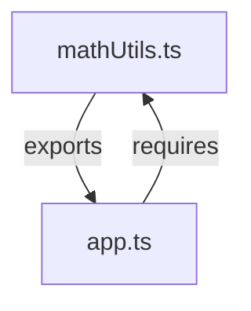

## 9.6 Working with CommonJS Modules

In this section, we will explore the CommonJS module system, which is widely used in Node.js applications. We'll learn how TypeScript interacts with CommonJS, how to import and export modules using CommonJS syntax, and how to configure the TypeScript compiler for different module systems. By the end of this section, you'll have a solid understanding of how to work with CommonJS modules in TypeScript.

### Understanding CommonJS Module Format

CommonJS is a module system that was designed to allow JavaScript to be used outside of the browser, primarily in server-side environments like Node.js. It provides a simple way to encapsulate code into modules, which can then be imported and used in other parts of an application.

#### Key Concepts of CommonJS

- **Modules**: In CommonJS, each file is treated as a separate module. This means that variables and functions defined in one file are not accessible in another file unless explicitly exported and imported.
- **`module.exports`**: This is the object that a module returns when it is required in another file. You can attach functions, objects, or variables to `module.exports` to make them available to other modules.
- **`require()`**: This function is used to import modules. It reads a JavaScript file, executes it, and returns the `module.exports` object.

### Importing and Exporting Modules with CommonJS

Let's look at how to use CommonJS syntax to import and export modules in TypeScript.

#### Exporting Modules

To export a module in CommonJS, you use the `module.exports` object. Here is a simple example:

```typescript
// mathUtils.ts
function add(a: number, b: number): number {
    return a + b;
}

function subtract(a: number, b: number): number {
    return a - b;
}

// Exporting functions using module.exports
module.exports = {
    add,
    subtract
};
```

In the example above, we define two functions, `add` and `subtract`, and export them using `module.exports`. This makes these functions available to other modules that require `mathUtils.ts`.

#### Importing Modules

To import a module in CommonJS, you use the `require()` function. Here's how you can import the `mathUtils` module we just created:

```typescript
// app.ts
const mathUtils = require('./mathUtils');

const sum = mathUtils.add(5, 3);
const difference = mathUtils.subtract(5, 3);

console.log(`Sum: ${sum}`); // Output: Sum: 8
console.log(`Difference: ${difference}`); // Output: Difference: 2
```

In this example, we use `require('./mathUtils')` to import the `mathUtils` module. We can then use the `add` and `subtract` functions as if they were defined in `app.ts`.

### Interoperability Between ES6 Modules and CommonJS

TypeScript supports both ES6 modules and CommonJS modules, and it's important to understand how they can interoperate. ES6 modules use `import` and `export` syntax, which is different from CommonJS's `require()` and `module.exports`.

#### Using ES6 Syntax with CommonJS

TypeScript allows you to use ES6 `import` and `export` syntax even when targeting CommonJS. This can make your code cleaner and more consistent with modern JavaScript standards.

Here's how you can rewrite the previous example using ES6 syntax:

```typescript
// mathUtils.ts
export function add(a: number, b: number): number {
    return a + b;
}

export function subtract(a: number, b: number): number {
    return a - b;
}
```

```typescript
// app.ts
import { add, subtract } from './mathUtils';

const sum = add(5, 3);
const difference = subtract(5, 3);

console.log(`Sum: ${sum}`); // Output: Sum: 8
console.log(`Difference: ${difference}`); // Output: Difference: 2
```

#### Configuring TypeScript for Module Systems

To ensure that TypeScript compiles your code correctly, you need to configure the module system in your `tsconfig.json` file. This file contains various settings that tell the TypeScript compiler how to process your code.

Here's an example `tsconfig.json` that sets the module system to CommonJS:

```json
{
    "compilerOptions": {
        "module": "commonjs",
        "target": "es6",
        "outDir": "./dist",
        "rootDir": "./src",
        "strict": true
    }
}
```

In this configuration:

- `"module": "commonjs"` specifies that the output should use the CommonJS module system.
- `"target": "es6"` sets the ECMAScript version to ES6.
- `"outDir": "./dist"` specifies the output directory for compiled JavaScript files.
- `"rootDir": "./src"` sets the root directory for TypeScript source files.
- `"strict": true` enables strict type-checking options.

### Try It Yourself

Now that we've covered the basics, try modifying the code examples above to experiment with CommonJS modules. Here are some suggestions:

- Add a new function to `mathUtils.ts` and export it. Then, import and use it in `app.ts`.
- Change the module system in `tsconfig.json` to `esnext` and observe the differences in the compiled output.
- Create a new module that exports a class and import it in another file.

### Visualizing Module Interactions

To help visualize how modules interact in a CommonJS system, let's use a Mermaid.js diagram to represent the flow of module imports and exports.



This diagram shows that `mathUtils.ts` exports functions, which are then required by `app.ts`.

### Key Takeaways

- CommonJS is a module system used primarily in Node.js, allowing you to encapsulate code into modules.
- Use `module.exports` to export functions, objects, or variables from a module.
- Use `require()` to import modules in CommonJS.
- TypeScript supports both CommonJS and ES6 modules, allowing you to use modern `import` and `export` syntax.
- Configure the TypeScript compiler using `tsconfig.json` to specify the module system and other options.

### Further Reading

For more information on CommonJS and module systems in JavaScript, check out the following resources:

- [Node.js Modules Documentation](https://nodejs.org/docs/latest-v14.x/api/modules.html)
- [MDN Web Docs: JavaScript Modules](https://developer.mozilla.org/en-US/docs/Web/JavaScript/Guide/Modules)
- [TypeScript Handbook: Modules](https://www.typescriptlang.org/docs/handbook/modules.html)

## Quiz Time!



### What is the primary purpose of the CommonJS module system?

- [x] To allow JavaScript to be used outside of the browser, primarily in server-side environments like Node.js.
- [ ] To replace ES6 modules in modern JavaScript.
- [ ] To provide a graphical user interface for JavaScript applications.
- [ ] To enhance the performance of JavaScript applications.

> **Explanation:** CommonJS was designed to enable JavaScript to be used in server-side environments, such as Node.js, by providing a module system.

### How do you export a function in CommonJS?

- [ ] Using the `export` keyword.
- [x] Using `module.exports`.
- [ ] Using the `import` keyword.
- [ ] Using `require()`.

> **Explanation:** In CommonJS, `module.exports` is used to export functions, objects, or variables from a module.

### Which function is used to import a module in CommonJS?

- [ ] `import()`
- [ ] `export()`
- [x] `require()`
- [ ] `include()`

> **Explanation:** The `require()` function is used to import modules in CommonJS.

### Can you use ES6 `import` and `export` syntax when targeting CommonJS in TypeScript?

- [x] Yes
- [ ] No

> **Explanation:** TypeScript allows you to use ES6 `import` and `export` syntax even when targeting CommonJS.

### What configuration option in `tsconfig.json` specifies the module system?

- [ ] `"target"`
- [x] `"module"`
- [ ] `"outDir"`
- [ ] `"rootDir"`

> **Explanation:** The `"module"` option in `tsconfig.json` specifies the module system to use, such as CommonJS or ES6.

### What does `module.exports` represent in a CommonJS module?

- [ ] The file path of the module.
- [ ] The list of dependencies for the module.
- [x] The object that a module returns when it is required in another file.
- [ ] The version number of the module.

> **Explanation:** `module.exports` is the object that a module returns when it is required in another file.

### What is the default module system used by Node.js?

- [x] CommonJS
- [ ] ES6
- [ ] AMD
- [ ] UMD

> **Explanation:** Node.js uses CommonJS as its default module system.

### Which of the following is a valid way to import a module using CommonJS syntax?

- [x] `const module = require('module');`
- [ ] `import module from 'module';`
- [ ] `export module from 'module';`
- [ ] `include module from 'module';`

> **Explanation:** `const module = require('module');` is the correct syntax for importing a module using CommonJS.

### What is the purpose of the `require()` function in CommonJS?

- [x] To read a JavaScript file, execute it, and return the `module.exports` object.
- [ ] To export functions from a module.
- [ ] To compile JavaScript code.
- [ ] To create a new JavaScript file.

> **Explanation:** The `require()` function is used to read a JavaScript file, execute it, and return the `module.exports` object.

### True or False: TypeScript can only use CommonJS modules.

- [ ] True
- [x] False

> **Explanation:** TypeScript supports both CommonJS and ES6 modules, allowing developers to choose the module system that best fits their needs.


