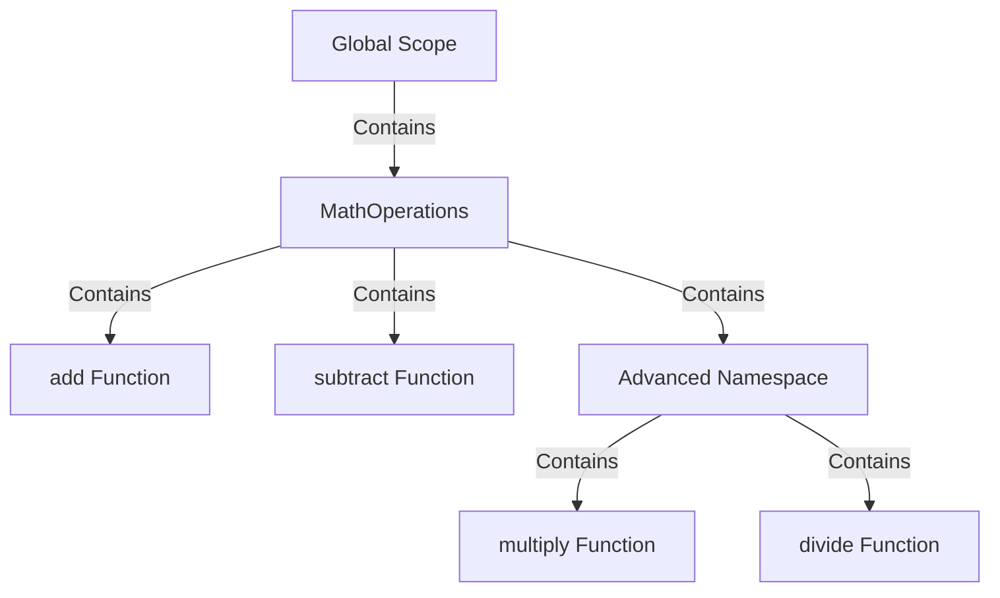

## 9.7 Namespaces for Internal Modules

In this section, we will explore the concept of namespaces in TypeScript. Namespaces provide a way to organize code and prevent global scope pollution, a common issue in large codebases. We will define what namespaces are, how to declare and use them, and discuss their differences from modules. Additionally, we'll cover when it's appropriate to use namespaces over modules and highlight their relevance in modern TypeScript development.

### What are Namespaces in TypeScript?

Namespaces in TypeScript are a way to logically group related code. They are used to organize code into a single logical unit, making it easier to manage and maintain. Namespaces can contain classes, interfaces, functions, and variables, and they help avoid naming conflicts by encapsulating these elements within a defined scope.

#### Purpose of Namespaces

The primary purpose of namespaces is to prevent global scope pollution. In JavaScript, all variables and functions are added to the global scope by default, which can lead to conflicts and difficult-to-maintain code. Namespaces allow developers to group related code together, reducing the risk of naming collisions and improving code organization.

### Declaring and Using Namespaces

Let's dive into how to declare and use namespaces in TypeScript. We'll start with a simple example to illustrate the concept.

#### Declaring a Namespace

To declare a namespace, use the `namespace` keyword followed by the name of the namespace. Inside the namespace, you can define classes, interfaces, functions, and variables.

```typescript
namespace MathOperations {
    export function add(a: number, b: number): number {
        return a + b;
    }

    export function subtract(a: number, b: number): number {
        return a - b;
    }
}
```

In this example, we have declared a namespace called `MathOperations` that contains two functions: `add` and `subtract`. The `export` keyword is used to make these functions accessible outside the namespace.

#### Using a Namespace

To use the elements defined within a namespace, you need to reference them using the namespace name.

```typescript
let sum = MathOperations.add(5, 3);
console.log(`Sum: ${sum}`); // Output: Sum: 8

let difference = MathOperations.subtract(10, 4);
console.log(`Difference: ${difference}`); // Output: Difference: 6
```

Here, we are accessing the `add` and `subtract` functions from the `MathOperations` namespace by prefixing them with the namespace name.

#### Nested Namespaces

Namespaces can also be nested within each other, allowing for more granular organization of code.

```typescript
namespace MathOperations {
    export namespace Advanced {
        export function multiply(a: number, b: number): number {
            return a * b;
        }

        export function divide(a: number, b: number): number {
            if (b === 0) {
                throw new Error("Division by zero");
            }
            return a / b;
        }
    }
}

let product = MathOperations.Advanced.multiply(4, 5);
console.log(`Product: ${product}`); // Output: Product: 20

let quotient = MathOperations.Advanced.divide(20, 4);
console.log(`Quotient: ${quotient}`); // Output: Quotient: 5
```

In this example, we have a nested namespace `Advanced` within `MathOperations`, which contains additional functions `multiply` and `divide`.

### Differences Between Namespaces and Modules

While namespaces and modules might seem similar, they serve different purposes and are used in different contexts.

#### Namespaces

- **Purpose**: Primarily used to organize code and prevent global scope pollution.
- **Usage**: Suitable for organizing code in older versions of TypeScript or when working with large codebases that require logical grouping.
- **Scope**: Elements within a namespace are accessible through the namespace name.

#### Modules

- **Purpose**: Used to organize code and manage dependencies in modern JavaScript and TypeScript applications.
- **Usage**: Preferred for code organization in modern TypeScript development, especially when using ES6 module syntax.
- **Scope**: Each module has its own scope, and elements are imported and exported using `import` and `export` statements.

### When to Use Namespaces Over Modules

Namespaces were more commonly used in older TypeScript codebases before the introduction of ES6 modules. In modern TypeScript development, modules are generally preferred due to their compatibility with the ES6 module system and better support for dependency management.

However, there are still scenarios where namespaces can be useful:

1. **Legacy Codebases**: If you're working with a legacy codebase that heavily relies on namespaces, it might be more practical to continue using them.

2. **Internal Libraries**: For internal libraries or utilities that don't need to be shared as separate modules, namespaces can provide a simple way to organize code.

3. **Simple Projects**: In small projects where dependency management is not a concern, namespaces can be a straightforward way to group related code.

### Try It Yourself

To reinforce your understanding of namespaces, try modifying the examples provided. Add more functions to the `MathOperations` namespace or create a new namespace for a different set of operations. Experiment with nested namespaces and see how they help organize your code.

### Visualizing Namespaces

Let's visualize how namespaces work using a simple diagram. This will help you understand how namespaces encapsulate code and prevent global scope pollution.



In this diagram, the `MathOperations` namespace is encapsulated within the global scope. It contains the `add` and `subtract` functions, as well as the nested `Advanced` namespace, which further contains the `multiply` and `divide` functions.

### References and Links

For further reading on namespaces and modules in TypeScript, consider exploring the following resources:

- [TypeScript Handbook: Namespaces](https://www.typescriptlang.org/docs/handbook/namespaces.html)
- [MDN Web Docs: JavaScript Modules](https://developer.mozilla.org/en-US/docs/Web/JavaScript/Guide/Modules)
- [TypeScript Handbook: Modules](https://www.typescriptlang.org/docs/handbook/modules.html)

### Engagement and Reinforcement

To engage with the material, consider these questions:

- How do namespaces help prevent global scope pollution?
- What are the key differences between namespaces and modules?
- In what scenarios might you choose to use namespaces over modules?

### Exercises

1. Create a namespace called `StringUtilities` that contains functions for common string operations, such as converting to uppercase and reversing a string.

2. Implement a nested namespace within `StringUtilities` for advanced string operations, such as finding palindromes or counting vowels.

3. Compare the use of namespaces and modules in a small project. Identify the pros and cons of each approach.

### Summary

In this section, we explored the concept of namespaces in TypeScript. We learned how namespaces help organize code and prevent global scope pollution. We also discussed the differences between namespaces and modules, and when it might be appropriate to use namespaces over modules. By experimenting with the examples and exercises provided, you can gain a deeper understanding of how namespaces can be used effectively in your TypeScript projects.

## Quiz Time!



### What is the primary purpose of namespaces in TypeScript?

- [x] To organize code and prevent global scope pollution
- [ ] To manage dependencies in modern applications
- [ ] To replace the use of classes
- [ ] To improve performance

> **Explanation:** Namespaces are used to organize code and prevent global scope pollution by encapsulating related code within a defined scope.

### How do you declare a namespace in TypeScript?

- [x] Using the `namespace` keyword
- [ ] Using the `module` keyword
- [ ] Using the `class` keyword
- [ ] Using the `function` keyword

> **Explanation:** The `namespace` keyword is used to declare a namespace in TypeScript.

### Which keyword is used to make elements accessible outside a namespace?

- [x] `export`
- [ ] `import`
- [ ] `public`
- [ ] `external`

> **Explanation:** The `export` keyword is used to make elements within a namespace accessible outside of it.

### What is a key difference between namespaces and modules?

- [x] Modules have their own scope, while namespaces are accessed using the namespace name
- [ ] Namespaces are used for dependency management, while modules are not
- [ ] Modules are only used in older TypeScript versions
- [ ] Namespaces are always preferred over modules

> **Explanation:** Modules have their own scope and use `import` and `export` statements, while namespaces are accessed using the namespace name.

### When might you choose to use namespaces over modules?

- [x] In legacy codebases
- [ ] In all modern TypeScript projects
- [ ] When working with ES6 modules
- [ ] When using third-party libraries

> **Explanation:** Namespaces might be used in legacy codebases or simple projects where dependency management is not a concern.

### What is encapsulated within a namespace?

- [x] Classes, interfaces, functions, and variables
- [ ] Only classes and interfaces
- [ ] Only functions and variables
- [ ] Only modules

> **Explanation:** Namespaces can encapsulate classes, interfaces, functions, and variables.

### What is a nested namespace?

- [x] A namespace defined within another namespace
- [ ] A namespace that contains only functions
- [ ] A namespace that is not exported
- [ ] A namespace that is used for modules

> **Explanation:** A nested namespace is a namespace defined within another namespace, allowing for more granular organization.

### Which keyword is used to import elements from a module?

- [x] `import`
- [ ] `export`
- [ ] `namespace`
- [ ] `require`

> **Explanation:** The `import` keyword is used to import elements from a module.

### In what scenario might namespaces be more practical than modules?

- [x] When working with internal libraries that don't need to be shared as separate modules
- [ ] When using ES6 modules
- [ ] When managing complex dependencies
- [ ] When using third-party libraries

> **Explanation:** Namespaces can be more practical for internal libraries or utilities that don't need to be shared as separate modules.

### True or False: Namespaces are the preferred method for organizing code in modern TypeScript development.

- [ ] True
- [x] False

> **Explanation:** Modules are generally preferred for organizing code in modern TypeScript development due to their compatibility with the ES6 module system and better support for dependency management.


