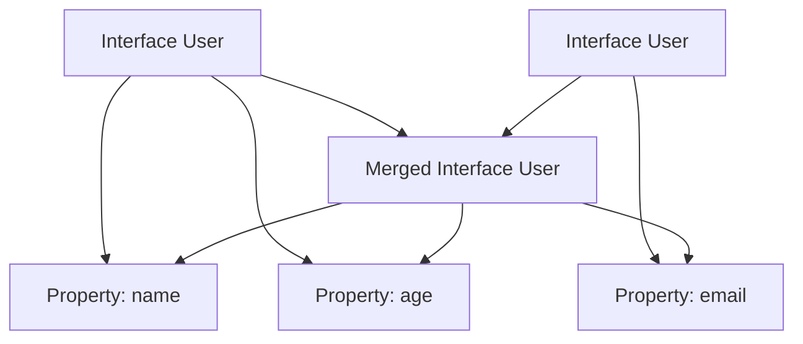

## 9.8 Ambient Namespaces and Declaration Merging

In this section, we will delve into the concepts of ambient namespaces and declaration merging in TypeScript. These advanced features allow you to extend existing code and integrate with third-party libraries seamlessly. Understanding these concepts will empower you to write more flexible and maintainable TypeScript code.

### Understanding Ambient Namespaces

Ambient namespaces are a way to declare types and interfaces that exist outside of your TypeScript code. They are particularly useful when you need to describe the shape of objects or modules that are provided by external libraries or scripts. To declare an ambient namespace, we use the `declare` keyword.

#### Declaring Ambient Namespaces

The `declare` keyword is used to tell TypeScript that a variable, function, class, or namespace exists, but its implementation is provided elsewhere. This is common when working with JavaScript libraries that do not have TypeScript type definitions.

Here's a simple example of declaring an ambient namespace:

```typescript
declare namespace MyLibrary {
    function greet(name: string): void;
    const version: string;
}
```

In this example, we're telling TypeScript that there is a namespace called `MyLibrary` which contains a function `greet` and a constant `version`. The actual implementation of these is assumed to be provided by an external script.

#### Using Ambient Namespaces

Once declared, you can use the ambient namespace in your TypeScript code just like any other namespace:

```typescript
MyLibrary.greet("World");
console.log(MyLibrary.version);
```

### Declaration Merging in TypeScript

Declaration merging is a powerful feature in TypeScript that allows you to merge multiple declarations into a single entity. This is particularly useful when you need to extend existing types or interfaces without modifying their original source code.

#### How Declaration Merging Works

When TypeScript encounters multiple declarations with the same name, it merges them into a single declaration. This can happen with interfaces, namespaces, and other types. Let's explore how this works with an example:

```typescript
interface User {
    name: string;
    age: number;
}

interface User {
    email: string;
}

// Merged interface
const user: User = {
    name: "Alice",
    age: 30,
    email: "alice@example.com"
};
```

In this example, the `User` interface is declared twice, each time with different properties. TypeScript merges these declarations into a single interface with all properties.

#### Augmenting Existing Namespaces or Types

Declaration merging allows you to augment existing namespaces or types, which is particularly useful when working with third-party libraries. For instance, you might want to add a new method to a built-in type like `String`.

```typescript
interface String {
    toUpperCaseFirst(): string;
}

String.prototype.toUpperCaseFirst = function () {
    return this.charAt(0).toUpperCase() + this.slice(1);
};

// Usage
const greeting = "hello";
console.log(greeting.toUpperCaseFirst()); // Outputs: "Hello"
```

In this example, we augment the `String` interface to include a new method `toUpperCaseFirst`. This method is then implemented on the `String` prototype.

### Use Cases for Declaration Merging

Declaration merging is useful in several scenarios:

1. **Extending Third-Party Libraries**: When you need to add additional functionality to a library without modifying its source code.
2. **Polyfilling**: Adding methods to built-in types to ensure compatibility across different environments.
3. **Modular Code**: Splitting large interfaces or types across multiple files for better organization.

### Caution with Declaration Merging

While declaration merging is a powerful feature, it should be used with caution. Unintended side effects can occur if multiple declarations conflict or if the merged declaration does not match the expected shape. Here are some tips to avoid issues:

- **Namespace Conflicts**: Ensure that merged namespaces do not have conflicting members.
- **Type Safety**: Verify that merged types maintain type safety and do not introduce errors.
- **Documentation**: Document any merged declarations to ensure other developers understand the changes.

### Try It Yourself

To get hands-on experience with ambient namespaces and declaration merging, try modifying the examples provided. For instance, add a new method to the `Array` prototype or create an ambient namespace for a fictional library. Experiment with merging interfaces and observe how TypeScript handles the merged declarations.

### Visual Aids

Below is a diagram illustrating how declaration merging works in TypeScript:



**Diagram Description**: This diagram shows two separate `User` interfaces, each with different properties. They are merged into a single interface with all properties combined.

### References and Links

For further reading on ambient namespaces and declaration merging, consider the following resources:

- [TypeScript Handbook - Declaration Merging](https://www.typescriptlang.org/docs/handbook/declaration-merging.html)
- [MDN Web Docs - JavaScript Prototypes](https://developer.mozilla.org/en-US/docs/Web/JavaScript/Inheritance_and_the_prototype_chain)
- [DefinitelyTyped - TypeScript Type Definitions](https://github.com/DefinitelyTyped/DefinitelyTyped)

### Engagement and Reinforcement

To reinforce your understanding, consider these questions:

- How would you declare an ambient namespace for a library that provides a `calculate` function?
- What happens if two merged interfaces have conflicting property types?
- How can you ensure type safety when augmenting built-in types?

### Exercises

1. Create an ambient namespace for a fictional library called `MathLib` that includes a `sum` function and a `PI` constant.
2. Augment the `Array` interface to include a method `last` that returns the last element of the array.
3. Merge two interfaces `Person` and `Employee` to create a single interface with properties from both.

### Summary

In this section, we've explored ambient namespaces and declaration merging in TypeScript. These features allow you to extend existing code and integrate with third-party libraries effectively. By understanding how to declare ambient namespaces and merge declarations, you can write more flexible and maintainable TypeScript code.

## Quiz Time!



### What is the purpose of the `declare` keyword in TypeScript?

- [x] To declare types and interfaces that exist outside of TypeScript code
- [ ] To define new variables within a TypeScript module
- [ ] To import external modules into TypeScript
- [ ] To create new classes in TypeScript

> **Explanation:** The `declare` keyword is used to declare types and interfaces that are provided by external libraries or scripts, allowing TypeScript to understand their shape.

### How does TypeScript handle multiple declarations with the same name?

- [x] It merges them into a single declaration
- [ ] It throws a compilation error
- [ ] It ignores the subsequent declarations
- [ ] It creates separate entities for each declaration

> **Explanation:** TypeScript merges multiple declarations with the same name into a single declaration, combining their properties and methods.

### What is a common use case for declaration merging?

- [x] Extending third-party libraries
- [ ] Creating new TypeScript modules
- [ ] Importing JavaScript files
- [ ] Writing CSS styles

> **Explanation:** Declaration merging is commonly used to extend third-party libraries by adding additional functionality without modifying the original source code.

### What should you be cautious of when using declaration merging?

- [x] Namespace conflicts and type safety
- [ ] Variable hoisting
- [ ] Function overloading
- [ ] Module imports

> **Explanation:** When using declaration merging, it's important to be cautious of namespace conflicts and ensure that the merged types maintain type safety.

### Which of the following is an example of augmenting a built-in type?

- [x] Adding a method to the `String` prototype
- [ ] Creating a new class in TypeScript
- [ ] Importing a module using `require`
- [ ] Declaring a new variable

> **Explanation:** Augmenting a built-in type involves adding methods or properties to existing prototypes, such as the `String` prototype.

### What is the result of merging two interfaces with conflicting property types?

- [x] TypeScript will throw a compilation error
- [ ] TypeScript will merge the properties with the same type
- [ ] TypeScript will ignore the conflicting properties
- [ ] TypeScript will create a new type with both properties

> **Explanation:** If two interfaces have conflicting property types, TypeScript will throw a compilation error to prevent type mismatches.

### How can you extend a third-party library using ambient namespaces?

- [x] By declaring an ambient namespace with additional methods
- [ ] By modifying the library's source code
- [ ] By creating a new TypeScript module
- [ ] By importing the library using `import`

> **Explanation:** You can extend a third-party library by declaring an ambient namespace and adding additional methods or properties to it.

### What is the benefit of using ambient namespaces?

- [x] They allow you to describe the shape of objects provided by external libraries
- [ ] They enable you to create new classes in TypeScript
- [ ] They simplify the process of importing modules
- [ ] They improve the performance of TypeScript code

> **Explanation:** Ambient namespaces allow you to describe the shape of objects or modules provided by external libraries, enabling TypeScript to understand their structure.

### Which keyword is used to declare an ambient namespace?

- [x] declare
- [ ] import
- [ ] export
- [ ] namespace

> **Explanation:** The `declare` keyword is used to declare an ambient namespace, indicating that its implementation is provided elsewhere.

### True or False: Declaration merging can only be used with interfaces.

- [ ] True
- [x] False

> **Explanation:** Declaration merging can be used with interfaces, namespaces, and other types, allowing you to extend and combine multiple declarations.


