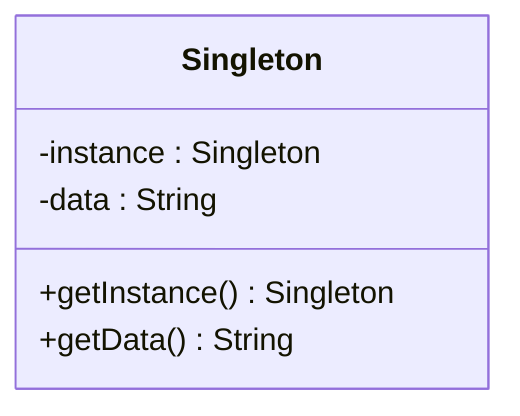

## 1.1 Understanding Design Patterns

In the vast landscape of software development, design patterns serve as a guiding light, offering tried-and-tested solutions to recurring design problems. As we delve into the world of design patterns, particularly in the context of JavaScript and TypeScript, we aim to understand their essence, importance, and application in crafting robust, maintainable, and scalable software solutions.

### What Are Design Patterns?

Design patterns are essentially blueprints or templates for solving common problems in software design. They are not finished designs that can be directly transformed into code; rather, they are descriptions or solutions to problems that occur repeatedly in various contexts. The concept of design patterns was popularized by the "Gang of Four" (GoF) in their seminal book, "Design Patterns: Elements of Reusable Object-Oriented Software," which categorized patterns into creational, structural, and behavioral types.

**Definition**: A design pattern is a general, reusable solution to a commonly occurring problem within a given context in software design.

### The Importance of Design Patterns

Design patterns play a crucial role in software development for several reasons:

1. **Reusability**: They provide a proven solution that can be reused across different projects, saving time and effort.
2. **Maintainability**: By using well-defined patterns, code becomes more organized and easier to maintain.
3. **Scalability**: Patterns help in designing systems that can scale efficiently as requirements grow.
4. **Communication**: They offer a common vocabulary for developers, making it easier to communicate complex ideas succinctly.

### Real-World Analogies

To better grasp the concept of design patterns, let's consider some real-world analogies:

- **Blueprints for Buildings**: Just as architects use blueprints to design buildings, software developers use design patterns to design software systems. A blueprint provides a standard way of constructing a building, ensuring stability and functionality. Similarly, design patterns provide a standard approach to solving software design issues.

- **Recipes in Cooking**: A recipe provides a step-by-step guide to preparing a dish, ensuring consistency and quality. In software development, a design pattern serves as a recipe for solving a particular problem, ensuring that the solution is effective and efficient.

### Design Patterns in JavaScript and TypeScript

JavaScript and TypeScript, being versatile languages, offer unique opportunities and challenges when it comes to implementing design patterns. Let's explore how design patterns are particularly relevant in these languages:

1. **Dynamic Nature of JavaScript**: JavaScript's dynamic nature allows for flexible and creative implementations of design patterns. For instance, the Prototype pattern can be naturally implemented using JavaScript's prototypal inheritance.

2. **Type Safety in TypeScript**: TypeScript enhances JavaScript with static typing, making it easier to implement patterns that require strict type checks, such as the Factory Method or Singleton patterns.

3. **Asynchronous Programming**: Patterns like the Observer or the Promise-based Monad pattern are particularly useful in handling asynchronous operations, a common scenario in JavaScript and TypeScript applications.

### Improving Code Maintainability and Scalability

Design patterns significantly contribute to the maintainability and scalability of code:

- **Maintainability**: Patterns encourage the use of modular and organized code structures, making it easier to update and manage codebases. For example, the Decorator pattern allows for adding new functionalities without altering existing code.

- **Scalability**: By providing a clear structure and separation of concerns, design patterns facilitate the development of scalable systems. The Model-View-Controller (MVC) pattern, for instance, separates data handling from user interface logic, allowing each component to scale independently.

### Code Example: Singleton Pattern in JavaScript

Let's illustrate the Singleton pattern, which ensures a class has only one instance and provides a global point of access to it.

```javascript
// Singleton Pattern in JavaScript
class Singleton {
  constructor() {
    if (Singleton.instance) {
      return Singleton.instance;
    }
    Singleton.instance = this;
    this.data = "Singleton Instance";
  }

  getData() {
    return this.data;
  }
}

// Usage
const instance1 = new Singleton();
const instance2 = new Singleton();

console.log(instance1 === instance2); // true
console.log(instance1.getData()); // "Singleton Instance"
```

In this example, the `Singleton` class ensures that only one instance of the class is created. Subsequent calls to the constructor return the same instance, demonstrating the Singleton pattern's ability to control instance creation.

### Try It Yourself

Experiment with the Singleton pattern by modifying the class to include additional methods or properties. Observe how the pattern maintains a single instance, regardless of the changes you make.

### Visualizing Design Patterns

To better understand how design patterns fit into the software development process, let's visualize the interaction between different components using a class diagram.



**Diagram Description**: This class diagram represents the Singleton pattern, illustrating the private instance variable and the public methods for accessing the instance and its data.

### References and Further Reading

For those interested in diving deeper into design patterns, consider exploring the following resources:

- [MDN Web Docs on JavaScript Patterns](https://developer.mozilla.org/en-US/docs/Web/JavaScript/Guide/Design_Patterns)
- [Refactoring Guru: Design Patterns](https://refactoring.guru/design-patterns)
- [TypeScript Design Patterns](https://www.typescriptlang.org/docs/handbook/design-patterns.html)

### Knowledge Check

To reinforce your understanding of design patterns, consider the following questions:

1. What is a design pattern, and why is it important in software development?
2. How does the Singleton pattern ensure only one instance of a class is created?
3. What are some real-world analogies that help explain design patterns?
4. How do design patterns improve code maintainability and scalability?

### Embrace the Journey

As we conclude this section, remember that understanding and applying design patterns is a journey. These patterns are tools in your developer toolkit, ready to be used when the right problem arises. Keep experimenting, stay curious, and enjoy the process of crafting elegant software solutions.

## Quiz Time!



### What is a design pattern?

- [x] A reusable solution to a common problem in software design.
- [ ] A specific implementation of a programming language feature.
- [ ] A type of algorithm used in data processing.
- [ ] A graphical representation of a software architecture.

> **Explanation:** A design pattern is a general, reusable solution to a commonly occurring problem within a given context in software design.

### Why are design patterns important in software development?

- [x] They provide proven solutions that enhance reusability and maintainability.
- [ ] They are mandatory for all software projects.
- [ ] They replace the need for testing in software development.
- [ ] They are only applicable to object-oriented programming.

> **Explanation:** Design patterns offer proven solutions that improve code reusability, maintainability, and scalability, making them valuable in software development.

### Which of the following is a real-world analogy for design patterns?

- [x] Blueprints for buildings.
- [ ] A random collection of ideas.
- [ ] A specific programming language syntax.
- [ ] A type of hardware component.

> **Explanation:** Blueprints for buildings are analogous to design patterns as they provide a standard way of constructing a structure, ensuring stability and functionality.

### How does the Singleton pattern ensure only one instance of a class is created?

- [x] By storing the instance in a static variable and returning it on subsequent calls.
- [ ] By using multiple constructors to create instances.
- [ ] By creating a new instance every time it is called.
- [ ] By using a different class for each instance.

> **Explanation:** The Singleton pattern uses a static variable to store the instance and returns the same instance on subsequent calls, ensuring only one instance is created.

### What role do design patterns play in improving code maintainability?

- [x] They encourage modular and organized code structures.
- [ ] They make code more complex and harder to understand.
- [ ] They eliminate the need for documentation.
- [ ] They require frequent rewriting of code.

> **Explanation:** Design patterns promote modular and organized code structures, making it easier to update and manage codebases, thereby improving maintainability.

### In what way do design patterns contribute to code scalability?

- [x] By providing clear structure and separation of concerns.
- [ ] By increasing the number of lines of code.
- [ ] By making code dependent on specific hardware.
- [ ] By requiring constant refactoring.

> **Explanation:** Design patterns facilitate scalable systems by providing a clear structure and separation of concerns, allowing components to scale independently.

### How does JavaScript's dynamic nature benefit the implementation of design patterns?

- [x] It allows for flexible and creative implementations.
- [ ] It restricts the use of certain patterns.
- [ ] It makes patterns less effective.
- [ ] It complicates the implementation process.

> **Explanation:** JavaScript's dynamic nature allows for flexible and creative implementations of design patterns, making it easier to adapt patterns to specific needs.

### What advantage does TypeScript offer when implementing design patterns?

- [x] Enhanced type safety and static typing.
- [ ] Limited support for object-oriented programming.
- [ ] Reduced code readability.
- [ ] Increased complexity in pattern implementation.

> **Explanation:** TypeScript offers enhanced type safety and static typing, making it easier to implement patterns that require strict type checks.

### Which design pattern is particularly useful for handling asynchronous operations in JavaScript?

- [x] Observer pattern.
- [ ] Singleton pattern.
- [ ] Factory pattern.
- [ ] Decorator pattern.

> **Explanation:** The Observer pattern is useful for handling asynchronous operations, as it allows for managing events and changes in state effectively.

### True or False: Design patterns are specific to JavaScript and TypeScript.

- [ ] True
- [x] False

> **Explanation:** False. Design patterns are not specific to any programming language; they are general solutions applicable across various languages and contexts.


