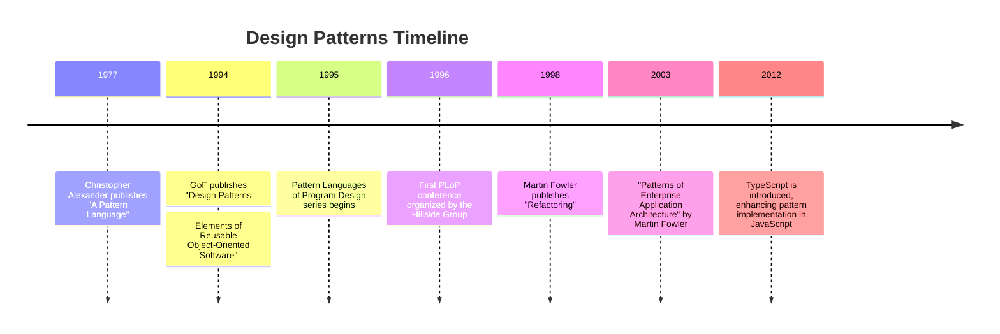

## 1.2 The History of Design Patterns

Design patterns have become a cornerstone of modern software engineering, providing developers with proven solutions to common problems. Understanding their history not only enriches our knowledge but also helps us appreciate their significance in today's programming landscape, especially in languages like JavaScript and TypeScript.

### The Inception of Design Patterns

The concept of design patterns in software engineering was inspired by the work of architect Christopher Alexander, who introduced the idea of patterns in architecture. Alexander's book, "A Pattern Language: Towns, Buildings, Construction," published in 1977, laid the groundwork for pattern-based thinking. He proposed that recurring problems in architecture could be solved using time-tested solutions, which he called "patterns."

#### The "Gang of Four" and Their Seminal Book

The formal introduction of design patterns to software engineering came with the publication of "Design Patterns: Elements of Reusable Object-Oriented Software" in 1994 by Erich Gamma, Richard Helm, Ralph Johnson, and John Vlissides, collectively known as the "Gang of Four" (GoF). This book identified 23 classic design patterns, categorized into creational, structural, and behavioral patterns, providing a common vocabulary for software developers.

The GoF book was revolutionary because it distilled complex design concepts into easily understandable patterns, each with a name, intent, applicability, structure, participants, collaborations, consequences, and implementation guidelines. This structured approach made it easier for developers to communicate and apply these patterns in their work.

### Significant Developments and Publications

Following the GoF book, the interest in design patterns grew rapidly. Several key publications and developments have shaped the field:

- **1995: The Pattern Languages of Program Design Series**: This series of books, edited by James O. Coplien and Douglas C. Schmidt, expanded on the GoF patterns by exploring new patterns and pattern languages, further enriching the design pattern literature.

- **1996: The Hillside Group and Pattern Languages of Programs (PLoP) Conferences**: The Hillside Group was formed to promote the use of patterns in software development. They organized the first PLoP conference in 1994, which became an annual event where developers could share and discuss new patterns.

- **1998: "Refactoring: Improving the Design of Existing Code" by Martin Fowler**: This book introduced the concept of refactoring, which often involves applying design patterns to improve code structure and maintainability.

- **2003: "Patterns of Enterprise Application Architecture" by Martin Fowler**: This book provided patterns specifically for enterprise applications, addressing scalability, maintainability, and performance.

### Influence on Modern Software Engineering Practices

Design patterns have profoundly influenced modern software engineering practices. They provide a shared language for developers, enabling clearer communication and collaboration. Patterns encapsulate best practices, reducing the need to reinvent solutions and allowing developers to focus on higher-level design and functionality.

#### Benefits in Software Development

1. **Code Reusability**: Patterns promote code reuse by providing templates for solving common problems, reducing development time and effort.

2. **Improved Communication**: By using a common vocabulary, developers can communicate complex design ideas more effectively.

3. **Scalability and Maintainability**: Patterns help create scalable and maintainable code by promoting separation of concerns and modular design.

4. **Educational Value**: Patterns serve as educational tools, helping developers understand and apply proven design principles.

### Adaptation in JavaScript and TypeScript

JavaScript, with its dynamic nature and widespread use in web development, has seen a unique adaptation of design patterns. TypeScript, as a superset of JavaScript with static typing, further enhances the application of design patterns by providing type safety and better tooling support.

#### JavaScript and Design Patterns

JavaScript's flexibility allows developers to implement design patterns in various ways, often leveraging its prototype-based inheritance and first-class functions. Common patterns in JavaScript include:

- **Module Pattern**: Encapsulates private and public methods and variables, similar to classes in other languages.

- **Observer Pattern**: Used extensively in event-driven programming, allowing objects to subscribe to events and react to changes.

- **Singleton Pattern**: Ensures a class has only one instance, often used in managing global application state.

#### TypeScript and Design Patterns

TypeScript's static typing and class-based syntax make it well-suited for implementing classical design patterns. It provides:

- **Interfaces and Generics**: Allow for more robust implementations of patterns like Factory and Strategy.

- **Decorators**: Enable the implementation of the Decorator pattern, adding functionality to classes dynamically.

- **Type Safety**: Ensures that patterns are implemented correctly, reducing runtime errors.

### Timeline of Important Events

Here's a brief timeline highlighting key events in the history of design patterns:



### Try It Yourself

To better understand how design patterns can be adapted in JavaScript and TypeScript, let's explore a simple example of the Singleton pattern in both languages.

#### Singleton Pattern in JavaScript

```javascript
// Singleton Pattern in JavaScript

const Singleton = (function () {
  let instance;

  function createInstance() {
    const object = new Object("I am the instance");
    return object;
  }

  return {
    getInstance: function () {
      if (!instance) {
        instance = createInstance();
      }
      return instance;
    },
  };
})();

const instance1 = Singleton.getInstance();
const instance2 = Singleton.getInstance();

console.log(instance1 === instance2); // true
```

In this example, the Singleton pattern ensures that only one instance of the object is created. Try modifying the `createInstance` function to return different objects and observe the behavior.

#### Singleton Pattern in TypeScript

```typescript
// Singleton Pattern in TypeScript

class Singleton {
  private static instance: Singleton;
  private constructor() {}

  public static getInstance(): Singleton {
    if (!Singleton.instance) {
      Singleton.instance = new Singleton();
    }
    return Singleton.instance;
  }
}

const instance1 = Singleton.getInstance();
const instance2 = Singleton.getInstance();

console.log(instance1 === instance2); // true
```

In TypeScript, we use a private constructor to prevent direct instantiation and a static method to control the creation of the instance. Experiment by adding properties or methods to the `Singleton` class.

### Knowledge Check

Before we conclude, let's reinforce what we've learned with a few questions:

- What inspired the concept of design patterns in software engineering?
- Who are the "Gang of Four" and what is their contribution to design patterns?
- How have design patterns influenced modern software engineering practices?
- What are some common design patterns used in JavaScript and TypeScript?
- How does TypeScript enhance the implementation of design patterns?

### Embrace the Journey

Remember, understanding the history of design patterns is just the beginning. As you continue to explore and apply these patterns in JavaScript and TypeScript, you'll develop more maintainable and scalable applications. Keep experimenting, stay curious, and enjoy the journey!

## Quiz Time!



### What inspired the concept of design patterns in software engineering?

- [x] Christopher Alexander's work in architecture
- [ ] The invention of the internet
- [ ] The development of JavaScript
- [ ] The creation of the first computer

> **Explanation:** Christopher Alexander's work on patterns in architecture inspired the concept of design patterns in software engineering.

### Who are the "Gang of Four"?

- [x] Erich Gamma, Richard Helm, Ralph Johnson, John Vlissides
- [ ] Bill Gates, Steve Jobs, Linus Torvalds, Tim Berners-Lee
- [ ] Ada Lovelace, Alan Turing, Grace Hopper, Donald Knuth
- [ ] Jeff Bezos, Elon Musk, Mark Zuckerberg, Larry Page

> **Explanation:** The "Gang of Four" refers to Erich Gamma, Richard Helm, Ralph Johnson, and John Vlissides, who authored the seminal book on design patterns.

### What is the primary benefit of design patterns in software development?

- [x] They provide reusable solutions to common problems
- [ ] They increase the complexity of code
- [ ] They eliminate the need for testing
- [ ] They are only useful in JavaScript

> **Explanation:** Design patterns provide reusable solutions to common problems, improving code maintainability and scalability.

### How does TypeScript enhance the implementation of design patterns?

- [x] By providing static typing and better tooling support
- [ ] By making code run faster
- [ ] By eliminating the need for design patterns
- [ ] By making JavaScript obsolete

> **Explanation:** TypeScript enhances design pattern implementation with static typing and better tooling support, ensuring type safety and reducing errors.

### Which design pattern ensures a class has only one instance?

- [x] Singleton Pattern
- [ ] Observer Pattern
- [ ] Factory Pattern
- [ ] Decorator Pattern

> **Explanation:** The Singleton Pattern ensures that a class has only one instance and provides a global point of access to it.

### What year was the GoF book on design patterns published?

- [x] 1994
- [ ] 1984
- [ ] 2004
- [ ] 2014

> **Explanation:** The GoF book, "Design Patterns: Elements of Reusable Object-Oriented Software," was published in 1994.

### What is the purpose of the PLoP conferences?

- [x] To share and discuss new patterns in software development
- [ ] To promote the use of JavaScript
- [ ] To eliminate the need for design patterns
- [ ] To develop new programming languages

> **Explanation:** The PLoP conferences, organized by the Hillside Group, aim to share and discuss new patterns in software development.

### Which book introduced the concept of refactoring in the context of design patterns?

- [x] "Refactoring: Improving the Design of Existing Code" by Martin Fowler
- [ ] "Design Patterns: Elements of Reusable Object-Oriented Software" by GoF
- [ ] "A Pattern Language" by Christopher Alexander
- [ ] "Patterns of Enterprise Application Architecture" by Martin Fowler

> **Explanation:** Martin Fowler's book "Refactoring: Improving the Design of Existing Code" introduced the concept of refactoring, often involving design patterns.

### What is a common design pattern used in event-driven programming in JavaScript?

- [x] Observer Pattern
- [ ] Singleton Pattern
- [ ] Factory Pattern
- [ ] Decorator Pattern

> **Explanation:** The Observer Pattern is commonly used in event-driven programming, allowing objects to subscribe to events and react to changes.

### True or False: Design patterns are only applicable to object-oriented programming languages.

- [ ] True
- [x] False

> **Explanation:** False. While design patterns originated in the context of object-oriented programming, they can be adapted for use in other paradigms, including functional programming.


