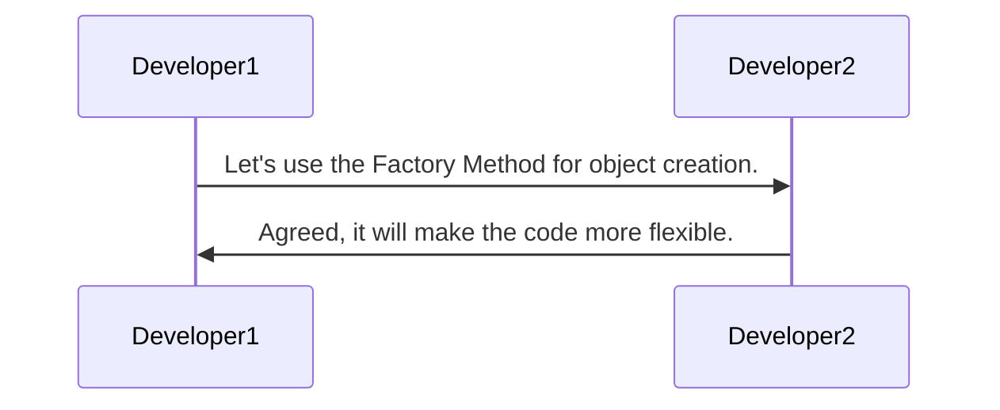
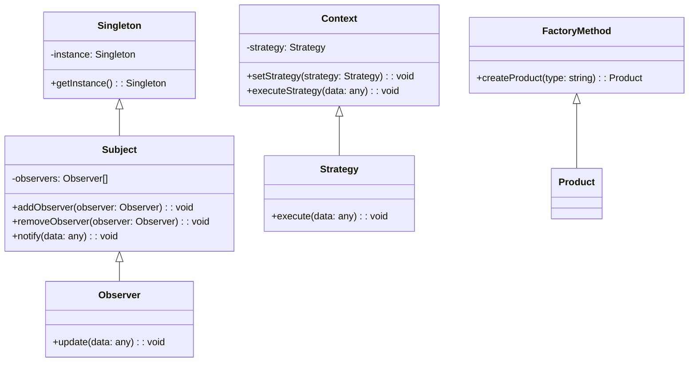

## 1.3 Benefits of Using Design Patterns

In the world of software development, design patterns serve as a powerful toolset that enhances the quality and efficiency of code. They provide a structured approach to solving common design problems, making code more maintainable, scalable, and readable. In this section, we will delve into the myriad benefits of using design patterns in JavaScript and TypeScript, providing practical examples and insights into how they facilitate better communication among developers, promote code reuse, and reduce development time.

### Enhancing Code Maintainability

One of the primary benefits of design patterns is their ability to improve code maintainability. By providing a clear and consistent structure, design patterns make it easier for developers to understand and modify existing code. This is particularly important in large projects where multiple developers are involved.

#### Example: Singleton Pattern for Configuration Management

Consider a scenario where you need to manage application configuration settings. Using the Singleton pattern ensures that there is only one instance of the configuration manager, making it easy to maintain and update.

```javascript
// JavaScript Singleton Pattern
class ConfigurationManager {
  constructor() {
    if (ConfigurationManager.instance) {
      return ConfigurationManager.instance;
    }
    this.settings = {};
    ConfigurationManager.instance = this;
  }

  set(key, value) {
    this.settings[key] = value;
  }

  get(key) {
    return this.settings[key];
  }
}

const configManager = new ConfigurationManager();
configManager.set('apiUrl', 'https://api.example.com');
console.log(configManager.get('apiUrl')); // Output: https://api.example.com
```

In this example, the Singleton pattern ensures that the configuration manager is easy to maintain, as all configuration settings are centralized in one instance.

### Improving Code Scalability

Design patterns also play a crucial role in enhancing the scalability of applications. By providing a blueprint for structuring code, they allow developers to build systems that can easily accommodate growth and change.

#### Example: Observer Pattern for Event Handling

The Observer pattern is commonly used in scenarios where an object needs to notify multiple observers about changes in its state. This pattern is particularly useful in event-driven architectures, where scalability is a key concern.

```typescript
// TypeScript Observer Pattern
interface Observer {
  update(data: any): void;
}

class Subject {
  private observers: Observer[] = [];

  addObserver(observer: Observer) {
    this.observers.push(observer);
  }

  removeObserver(observer: Observer) {
    this.observers = this.observers.filter(obs => obs !== observer);
  }

  notify(data: any) {
    this.observers.forEach(observer => observer.update(data));
  }
}

class ConcreteObserver implements Observer {
  update(data: any) {
    console.log(`Observer received data: ${data}`);
  }
}

const subject = new Subject();
const observer1 = new ConcreteObserver();
const observer2 = new ConcreteObserver();

subject.addObserver(observer1);
subject.addObserver(observer2);

subject.notify('Event data'); // Both observers receive the data
```

In this example, the Observer pattern allows the system to scale by easily adding or removing observers without modifying the subject.

### Facilitating Communication Among Developers

Design patterns provide a common language for developers, making it easier to communicate complex design ideas. When developers are familiar with design patterns, they can quickly understand the architecture of a system and collaborate more effectively.

#### Example: Using Design Patterns as a Communication Tool

Imagine a team discussing the implementation of a new feature. By referring to design patterns, such as the Factory Method or Strategy pattern, team members can quickly convey their ideas without needing to explain every detail.



In this diagram, we see how design patterns can serve as a shorthand for discussing design decisions, facilitating clearer and more efficient communication.

### Promoting Code Reuse

Another significant benefit of design patterns is their ability to promote code reuse. By providing reusable solutions to common problems, design patterns reduce the need to reinvent the wheel, saving time and effort.

#### Example: Factory Method Pattern for Object Creation

The Factory Method pattern is a classic example of promoting code reuse. It defines an interface for creating objects but allows subclasses to alter the type of objects that will be created.

```javascript
// JavaScript Factory Method Pattern
class Product {
  constructor(name) {
    this.name = name;
  }
}

class ProductFactory {
  createProduct(type) {
    switch (type) {
      case 'A':
        return new Product('Product A');
      case 'B':
        return new Product('Product B');
      default:
        throw new Error('Invalid product type');
    }
  }
}

const factory = new ProductFactory();
const productA = factory.createProduct('A');
console.log(productA.name); // Output: Product A
```

In this example, the Factory Method pattern allows for the creation of different types of products without duplicating code, promoting reuse and flexibility.

### Reducing Development Time

By providing proven solutions to common problems, design patterns can significantly reduce development time. Developers can leverage these patterns to quickly implement complex features without having to design solutions from scratch.

#### Example: Strategy Pattern for Algorithm Selection

The Strategy pattern is useful in scenarios where multiple algorithms are available for a task. By encapsulating each algorithm in a separate class, developers can easily switch between them, reducing development time.

```typescript
// TypeScript Strategy Pattern
interface Strategy {
  execute(data: any): void;
}

class ConcreteStrategyA implements Strategy {
  execute(data: any) {
    console.log(`Executing strategy A with data: ${data}`);
  }
}

class ConcreteStrategyB implements Strategy {
  execute(data: any) {
    console.log(`Executing strategy B with data: ${data}`);
  }
}

class Context {
  private strategy: Strategy;

  setStrategy(strategy: Strategy) {
    this.strategy = strategy;
  }

  executeStrategy(data: any) {
    this.strategy.execute(data);
  }
}

const context = new Context();
context.setStrategy(new ConcreteStrategyA());
context.executeStrategy('Sample data'); // Output: Executing strategy A with data: Sample data

context.setStrategy(new ConcreteStrategyB());
context.executeStrategy('Sample data'); // Output: Executing strategy B with data: Sample data
```

In this example, the Strategy pattern allows developers to quickly implement and switch between different algorithms, saving time and effort.

### Solving Complex Design Challenges

Design patterns are invaluable when it comes to solving complex design challenges. They provide a structured approach to tackling difficult problems, ensuring that solutions are robust and scalable.

#### Example: Composite Pattern for Hierarchical Structures

The Composite pattern is particularly useful for representing hierarchical structures, such as file systems or organizational charts. It allows developers to treat individual objects and compositions of objects uniformly.

```typescript
// TypeScript Composite Pattern
interface Component {
  operation(): void;
}

class Leaf implements Component {
  operation() {
    console.log('Leaf operation');
  }
}

class Composite implements Component {
  private children: Component[] = [];

  add(component: Component) {
    this.children.push(component);
  }

  remove(component: Component) {
    this.children = this.children.filter(child => child !== component);
  }

  operation() {
    console.log('Composite operation');
    this.children.forEach(child => child.operation());
  }
}

const leaf1 = new Leaf();
const leaf2 = new Leaf();
const composite = new Composite();

composite.add(leaf1);
composite.add(leaf2);
composite.operation();
// Output:
// Composite operation
// Leaf operation
// Leaf operation
```

In this example, the Composite pattern provides a flexible solution for managing hierarchical structures, making it easier to solve complex design challenges.

### Try It Yourself

To deepen your understanding of design patterns, try modifying the examples provided. For instance, in the Singleton pattern example, add a method to remove a configuration setting. In the Observer pattern example, create a new observer that logs data to a file instead of the console. Experimenting with these patterns will help solidify your understanding and demonstrate their versatility.

### Visualizing Design Patterns

To further illustrate the benefits of design patterns, let's visualize how they interact within a system. The following diagram shows a high-level overview of how different design patterns can be integrated into a single application.



This diagram illustrates how different design patterns can be used together to create a robust and scalable application architecture.

### References and Further Reading

For more information on design patterns and their applications, consider exploring the following resources:

- [MDN Web Docs: Design Patterns](https://developer.mozilla.org/en-US/docs/Web/JavaScript/Guide/Design_Patterns)
- [Refactoring Guru: Design Patterns](https://refactoring.guru/design-patterns)
- [W3Schools: JavaScript Design Patterns](https://www.w3schools.com/js/js_design_patterns.asp)

### Knowledge Check

To reinforce your understanding of the benefits of design patterns, consider the following questions:

1. How do design patterns improve code maintainability?
2. In what ways do design patterns enhance communication among developers?
3. How can design patterns reduce development time?
4. What role do design patterns play in solving complex design challenges?

### Embrace the Journey

Remember, this is just the beginning. As you continue to explore and apply design patterns in your projects, you'll discover new ways to enhance your code's quality and efficiency. Keep experimenting, stay curious, and enjoy the journey!

---

## Quiz Time!



### How do design patterns improve code maintainability?

- [x] By providing a clear and consistent structure
- [ ] By increasing code complexity
- [ ] By making code harder to understand
- [ ] By introducing more bugs

> **Explanation:** Design patterns improve code maintainability by providing a clear and consistent structure that makes it easier to understand and modify existing code.

### What is a key benefit of using the Singleton pattern?

- [x] Ensuring a class has only one instance
- [ ] Allowing multiple instances of a class
- [ ] Making code less readable
- [ ] Increasing memory usage

> **Explanation:** The Singleton pattern ensures that a class has only one instance, which is useful for managing shared resources like configuration settings.

### How do design patterns facilitate communication among developers?

- [x] By providing a common language
- [ ] By making code more complex
- [ ] By reducing code readability
- [ ] By introducing more technical jargon

> **Explanation:** Design patterns provide a common language that allows developers to quickly convey complex design ideas, facilitating clearer communication.

### What is a primary advantage of the Factory Method pattern?

- [x] Promoting code reuse
- [ ] Increasing code duplication
- [ ] Making code harder to maintain
- [ ] Reducing flexibility

> **Explanation:** The Factory Method pattern promotes code reuse by defining an interface for creating objects, allowing for flexible and reusable code.

### How can design patterns reduce development time?

- [x] By providing proven solutions to common problems
- [ ] By requiring more time to implement
- [ ] By making code more complex
- [ ] By introducing more bugs

> **Explanation:** Design patterns reduce development time by providing proven solutions to common problems, allowing developers to implement complex features more quickly.

### What role do design patterns play in solving complex design challenges?

- [x] Providing a structured approach
- [ ] Making problems more difficult
- [ ] Increasing code complexity
- [ ] Reducing code readability

> **Explanation:** Design patterns provide a structured approach to solving complex design challenges, ensuring robust and scalable solutions.

### How does the Observer pattern enhance scalability?

- [x] By allowing easy addition or removal of observers
- [ ] By making code less flexible
- [ ] By increasing code complexity
- [ ] By reducing code readability

> **Explanation:** The Observer pattern enhances scalability by allowing easy addition or removal of observers without modifying the subject, making the system more flexible.

### What is a common use case for the Composite pattern?

- [x] Representing hierarchical structures
- [ ] Managing flat data structures
- [ ] Reducing code readability
- [ ] Increasing code complexity

> **Explanation:** The Composite pattern is commonly used for representing hierarchical structures, such as file systems or organizational charts.

### How do design patterns promote code reuse?

- [x] By providing reusable solutions to common problems
- [ ] By increasing code duplication
- [ ] By making code harder to understand
- [ ] By introducing more bugs

> **Explanation:** Design patterns promote code reuse by providing reusable solutions to common problems, reducing the need to reinvent the wheel.

### True or False: Design patterns can reduce development time by providing proven solutions to common problems.

- [x] True
- [ ] False

> **Explanation:** True. Design patterns reduce development time by providing proven solutions to common problems, allowing developers to implement features more efficiently.


