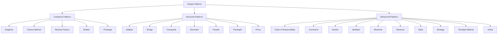

## 1.4 Types of Design Patterns

Design patterns are essential tools in software development that provide proven solutions to common problems. They help developers create more maintainable, scalable, and efficient code. In this section, we will explore the three main categories of design patterns: Creational, Structural, and Behavioral. Each category addresses specific types of problems and offers patterns that can be adapted to JavaScript and TypeScript development.

### Overview of Design Pattern Categories

Design patterns are generally divided into three categories:

1. **Creational Patterns**: These patterns deal with object creation mechanisms, trying to create objects in a manner suitable to the situation. The basic form of object creation could result in design problems or added complexity to the design. Creational design patterns solve this problem by controlling this object creation process.

2. **Structural Patterns**: These patterns deal with object composition or structure. They help ensure that if one part of a system changes, the entire system doesn't need to change. Structural patterns ease the design by identifying a simple way to realize relationships between entities.

3. **Behavioral Patterns**: These patterns are concerned with algorithms and the assignment of responsibilities between objects. They help in defining how objects interact in a system and how responsibilities are distributed among them.

Let's delve deeper into each category to understand their purpose and the specific patterns they encompass.

### Creational Design Patterns

Creational patterns focus on the process of object creation. They abstract the instantiation process, making it more flexible and reusable. This category of patterns is particularly useful when a system needs to be independent of how its objects are created, composed, and represented.

#### Purpose of Creational Patterns

- **Encapsulation of Object Creation**: They encapsulate the knowledge about which concrete classes the system uses.
- **Flexibility**: They provide flexibility in terms of what gets created, who creates it, how it gets created, and when it gets created.
- **Control Over Instantiation**: They offer more control over the instantiation process.

#### Common Creational Patterns

1. **Singleton**: Ensures a class has only one instance and provides a global point of access to it.
2. **Factory Method**: Defines an interface for creating an object, but lets subclasses alter the type of objects that will be created.
3. **Abstract Factory**: Provides an interface for creating families of related or dependent objects without specifying their concrete classes.
4. **Builder**: Separates the construction of a complex object from its representation, allowing the same construction process to create different representations.
5. **Prototype**: Creates new objects by copying an existing object, known as the prototype.

#### Problems Addressed by Creational Patterns

- **Complex Object Creation**: Simplifying the process of creating complex objects.
- **Decoupling**: Reducing the dependency on specific classes for object creation.
- **Reusability**: Enhancing the reusability of code by abstracting the instantiation process.

### Structural Design Patterns

Structural patterns deal with the composition of classes or objects. They help ensure that if one part of a system changes, the entire system doesn't need to change. These patterns focus on simplifying the structure by identifying a simple way to realize relationships between entities.

#### Purpose of Structural Patterns

- **Simplification**: They simplify the structure by identifying a simple way to realize relationships between entities.
- **Flexibility**: They provide flexibility in terms of how classes and objects are composed to form larger structures.
- **Decoupling**: They help in decoupling the interface and implementation of classes and objects.

#### Common Structural Patterns

1. **Adapter**: Allows incompatible interfaces to work together by converting the interface of a class into another interface that clients expect.
2. **Bridge**: Decouples an abstraction from its implementation so that the two can vary independently.
3. **Composite**: Composes objects into tree structures to represent part-whole hierarchies, allowing clients to treat individual objects and compositions of objects uniformly.
4. **Decorator**: Adds responsibilities to objects dynamically without altering their structure.
5. **Facade**: Provides a simplified interface to a complex subsystem.
6. **Flyweight**: Reduces the cost of creating and manipulating a large number of similar objects.
7. **Proxy**: Provides a surrogate or placeholder for another object to control access to it.

#### Problems Addressed by Structural Patterns

- **Complex Structures**: Simplifying complex structures by identifying a simple way to realize relationships between entities.
- **Interface Incompatibility**: Allowing incompatible interfaces to work together.
- **Efficient Object Management**: Managing a large number of objects efficiently.

### Behavioral Design Patterns

Behavioral patterns are concerned with algorithms and the assignment of responsibilities between objects. They help in defining how objects interact in a system and how responsibilities are distributed among them.

#### Purpose of Behavioral Patterns

- **Communication**: They facilitate communication between objects.
- **Responsibility Distribution**: They help in distributing responsibilities among objects.
- **Flexibility**: They provide flexibility in terms of how algorithms are implemented and how responsibilities are distributed.

#### Common Behavioral Patterns

1. **Chain of Responsibility**: Passes a request along a chain of handlers, allowing multiple objects to handle the request without coupling the sender to a specific receiver.
2. **Command**: Encapsulates a request as an object, thereby allowing for parameterization of clients with queues, requests, and operations.
3. **Iterator**: Provides a way to access the elements of an aggregate object sequentially without exposing its underlying representation.
4. **Mediator**: Reduces coupling between components by introducing a mediator object that handles communication between them.
5. **Memento**: Captures and externalizes an object's internal state without violating encapsulation, allowing the object to be restored to this state later.
6. **Observer**: Defines a one-to-many dependency between objects so that when one object changes state, all its dependents are notified and updated automatically.
7. **State**: Allows an object to alter its behavior when its internal state changes.
8. **Strategy**: Defines a family of algorithms, encapsulates each one, and makes them interchangeable.
9. **Template Method**: Defines the skeleton of an algorithm in an operation, deferring some steps to subclasses.
10. **Visitor**: Represents an operation to be performed on the elements of an object structure, allowing new operations to be defined without changing the classes of the elements on which it operates.

#### Problems Addressed by Behavioral Patterns

- **Complex Algorithms**: Simplifying complex algorithms by distributing responsibilities among objects.
- **Communication Between Objects**: Facilitating communication between objects.
- **Dynamic Behavior**: Allowing objects to change behavior dynamically.

### Visualizing Design Patterns

To better understand the relationships and purposes of these design patterns, let's visualize them using a diagram.

**Diagram Description**: This diagram categorizes design patterns into Creational, Structural, and Behavioral groups, showing the specific patterns that belong to each category.

### Preparing for Detailed Exploration

Now that we have a clear understanding of the types of design patterns and their purposes, we are ready to explore each pattern in detail. In the subsequent sections, we will delve into each pattern, providing code examples and explanations of how they can be implemented in JavaScript and TypeScript. We will also discuss the specific problems each pattern addresses and how they can be applied to real-world scenarios.

Remember, design patterns are not just about solving problems; they are about creating a shared language for developers to communicate complex ideas more effectively. As we progress through this guide, keep an open mind and consider how each pattern can be adapted to your own projects.

### Try It Yourself

To get a hands-on understanding of these design patterns, try implementing a simple version of each pattern in JavaScript or TypeScript. Start with the Singleton pattern, as it is one of the simplest to understand and implement. Modify the code to see how changes affect the pattern's behavior. This experimentation will deepen your understanding and prepare you for more complex patterns.

### Knowledge Check

Before moving on, let's reinforce what we've learned:

- **What are the three main categories of design patterns?**
- **What is the primary purpose of Creational patterns?**
- **How do Structural patterns help in software design?**
- **What problems do Behavioral patterns address?**

### Embrace the Journey

Design patterns are powerful tools in a developer's toolkit. As you continue to learn and apply these patterns, you'll find that they not only solve specific problems but also enhance your overall approach to software design. Keep experimenting, stay curious, and enjoy the journey!

## Quiz Time!



### What are the three main categories of design patterns?

- [x] Creational, Structural, Behavioral
- [ ] Functional, Procedural, Object-Oriented
- [ ] Static, Dynamic, Hybrid
- [ ] Abstract, Concrete, Hybrid

> **Explanation:** The three main categories of design patterns are Creational, Structural, and Behavioral, each addressing different aspects of software design.

### Which pattern ensures a class has only one instance?

- [x] Singleton
- [ ] Factory Method
- [ ] Prototype
- [ ] Builder

> **Explanation:** The Singleton pattern ensures a class has only one instance and provides a global point of access to it.

### What is the primary purpose of Structural patterns?

- [x] Simplifying the structure by identifying a simple way to realize relationships between entities.
- [ ] Facilitating communication between objects.
- [ ] Encapsulating object creation.
- [ ] Defining a family of algorithms.

> **Explanation:** Structural patterns simplify the structure by identifying a simple way to realize relationships between entities.

### Which pattern is concerned with algorithms and the assignment of responsibilities between objects?

- [x] Behavioral Patterns
- [ ] Creational Patterns
- [ ] Structural Patterns
- [ ] Functional Patterns

> **Explanation:** Behavioral patterns are concerned with algorithms and the assignment of responsibilities between objects.

### Which pattern provides an interface for creating families of related or dependent objects?

- [x] Abstract Factory
- [ ] Singleton
- [ ] Builder
- [ ] Prototype

> **Explanation:** The Abstract Factory pattern provides an interface for creating families of related or dependent objects without specifying their concrete classes.

### Which pattern allows incompatible interfaces to work together?

- [x] Adapter
- [ ] Bridge
- [ ] Composite
- [ ] Decorator

> **Explanation:** The Adapter pattern allows incompatible interfaces to work together by converting the interface of a class into another interface that clients expect.

### What problem does the Flyweight pattern address?

- [x] Reducing the cost of creating and manipulating a large number of similar objects.
- [ ] Simplifying complex algorithms.
- [ ] Facilitating communication between objects.
- [ ] Encapsulating object creation.

> **Explanation:** The Flyweight pattern addresses the problem of reducing the cost of creating and manipulating a large number of similar objects.

### Which pattern defines a one-to-many dependency between objects?

- [x] Observer
- [ ] Chain of Responsibility
- [ ] Command
- [ ] State

> **Explanation:** The Observer pattern defines a one-to-many dependency between objects so that when one object changes state, all its dependents are notified and updated automatically.

### Which pattern allows an object to alter its behavior when its internal state changes?

- [x] State
- [ ] Strategy
- [ ] Template Method
- [ ] Visitor

> **Explanation:** The State pattern allows an object to alter its behavior when its internal state changes.

### True or False: The Command pattern encapsulates a request as an object.

- [x] True
- [ ] False

> **Explanation:** The Command pattern encapsulates a request as an object, allowing for parameterization of clients with queues, requests, and operations.


