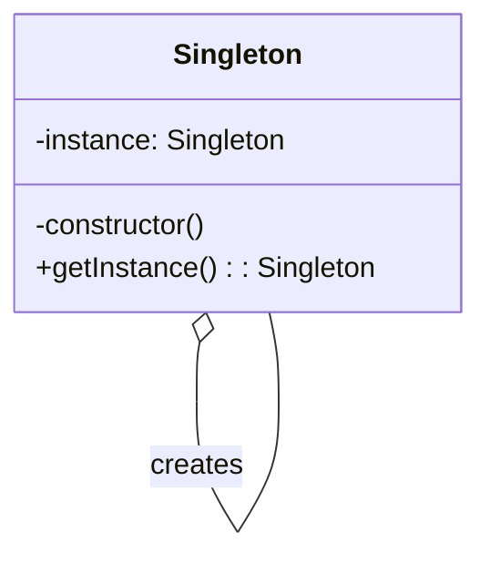

## 1.5 Design Patterns in JavaScript and TypeScript

Design patterns provide a structured approach to solving common software design problems. When implementing these patterns in JavaScript and TypeScript, it's essential to consider the unique features and paradigms of each language. In this section, we will explore how design patterns are adapted and implemented in JavaScript and TypeScript, highlighting the language-specific features that influence their application.

### Understanding JavaScript's Unique Features

JavaScript is a versatile, prototype-based language with several features that impact how design patterns are implemented:

- **Prototype-Based Inheritance**: Unlike class-based languages, JavaScript uses prototypes for inheritance. This allows objects to inherit properties and methods directly from other objects.
  
- **First-Class Functions**: Functions in JavaScript are first-class citizens, meaning they can be assigned to variables, passed as arguments, and returned from other functions. This feature is pivotal in implementing patterns like Strategy and Command.

- **Dynamic Typing**: JavaScript is dynamically typed, which offers flexibility but can lead to runtime errors if not carefully managed.

- **Closures**: JavaScript's closures allow functions to capture variables from their surrounding scope, enabling powerful encapsulation techniques.

### TypeScript's Influence on Design Patterns

TypeScript builds on JavaScript by adding static typing and other features that facilitate the implementation of design patterns:

- **Static Typing**: TypeScript's type system allows developers to define interfaces and types, making code more predictable and reducing runtime errors.

- **Class Syntax**: TypeScript supports class-based syntax, making it easier to implement patterns that rely on classes, such as Singleton and Factory.

- **Access Modifiers**: TypeScript introduces access modifiers (public, private, protected), which help enforce encapsulation and control access to class members.

- **Generics**: TypeScript's generics provide a way to create reusable components and are particularly useful in patterns like Factory and Strategy.

### Implementing a Simple Design Pattern: Singleton

Let's compare how the Singleton pattern is implemented in JavaScript and TypeScript. The Singleton pattern ensures a class has only one instance and provides a global point of access to it.

#### Singleton in JavaScript

```javascript
// Singleton pattern in JavaScript
const Singleton = (function() {
  let instance;

  function createInstance() {
    const object = new Object("I am the instance");
    return object;
  }

  return {
    getInstance: function() {
      if (!instance) {
        instance = createInstance();
      }
      return instance;
    }
  };
})();

const instance1 = Singleton.getInstance();
const instance2 = Singleton.getInstance();

console.log(instance1 === instance2); // true
```

**Explanation**: In JavaScript, we use an IIFE (Immediately Invoked Function Expression) to create a closure that holds the instance. The `getInstance` method checks if an instance exists; if not, it creates one.

#### Singleton in TypeScript

```typescript
// Singleton pattern in TypeScript
class Singleton {
  private static instance: Singleton;
  private constructor() {}

  static getInstance(): Singleton {
    if (!Singleton.instance) {
      Singleton.instance = new Singleton();
    }
    return Singleton.instance;
  }
}

const instance1 = Singleton.getInstance();
const instance2 = Singleton.getInstance();

console.log(instance1 === instance2); // true
```

**Explanation**: In TypeScript, we leverage class syntax and static properties to implement the Singleton pattern. The constructor is private, preventing direct instantiation. The `getInstance` method ensures only one instance is created.

### Challenges and Best Practices

#### Challenges

1. **Dynamic Typing in JavaScript**: Without static types, managing complex patterns can lead to runtime errors.
2. **Prototypal Inheritance**: Adapting class-based patterns to JavaScript's prototype-based inheritance can be challenging.
3. **TypeScript Complexity**: While TypeScript's features add robustness, they also introduce complexity, particularly for developers new to static typing.

#### Best Practices

1. **Use TypeScript for Complex Patterns**: Leverage TypeScript's static typing and class features for more complex patterns.
2. **Embrace JavaScript's Functional Nature**: Use first-class functions and closures to implement patterns like Strategy and Command.
3. **Modularize Code**: Break down patterns into smaller, reusable modules to improve maintainability.
4. **Leverage TypeScript's Interfaces**: Use interfaces to define contracts for your patterns, ensuring consistency and predictability.

### Language-Specific Adaptations

#### JavaScript Adaptations

- **Module Pattern**: JavaScript's module pattern is a variation of the Singleton pattern, using closures to encapsulate private data.

```javascript
// Module pattern in JavaScript
const CounterModule = (function() {
  let counter = 0;

  return {
    increment: function() {
      counter++;
    },
    getCounter: function() {
      return counter;
    }
  };
})();

CounterModule.increment();
console.log(CounterModule.getCounter()); // 1
```

**Explanation**: This pattern uses a closure to encapsulate the `counter` variable, providing controlled access through the `increment` and `getCounter` methods.

#### TypeScript Adaptations

- **Decorator Pattern**: TypeScript's decorators provide a powerful way to modify class behavior, akin to the Decorator pattern.

```typescript
// Decorator example in TypeScript
function Log(target: any, propertyKey: string, descriptor: PropertyDescriptor) {
  const originalMethod = descriptor.value;
  descriptor.value = function(...args: any[]) {
    console.log(`Calling ${propertyKey} with arguments: ${args}`);
    return originalMethod.apply(this, args);
  };
  return descriptor;
}

class Calculator {
  @Log
  add(a: number, b: number): number {
    return a + b;
  }
}

const calculator = new Calculator();
calculator.add(2, 3); // Logs: Calling add with arguments: 2,3
```

**Explanation**: The `Log` decorator modifies the `add` method to log its arguments before execution, demonstrating how decorators can enhance functionality.

### Visualizing Design Patterns

To better understand the interaction of objects in design patterns, let's visualize the Singleton pattern using a class diagram.



**Diagram Description**: This class diagram illustrates the Singleton pattern, showing the static `instance` property and the `getInstance` method responsible for creating and returning the single instance.

### Try It Yourself

Experiment with the provided code examples by:

- Modifying the Singleton pattern to include additional methods or properties.
- Implementing a different pattern, such as Factory or Observer, in both JavaScript and TypeScript.
- Using TypeScript's generics to create a type-safe version of a pattern.

### References and Links

- [MDN Web Docs: JavaScript](https://developer.mozilla.org/en-US/docs/Web/JavaScript)
- [TypeScript Documentation](https://www.typescriptlang.org/docs/)
- [Design Patterns: Elements of Reusable Object-Oriented Software](https://en.wikipedia.org/wiki/Design_Patterns)

### Knowledge Check

- What are the key features of JavaScript that influence design pattern implementation?
- How does TypeScript's static typing enhance the use of design patterns?
- Can you describe the Singleton pattern and its implementation in both JavaScript and TypeScript?
- What are some challenges when applying design patterns in JavaScript and TypeScript?
- How can TypeScript's decorators be used to implement the Decorator pattern?

### Embrace the Journey

Remember, mastering design patterns in JavaScript and TypeScript is a journey. Each pattern you learn adds a tool to your developer toolkit, enabling you to write more maintainable and scalable code. Keep experimenting, stay curious, and enjoy the process of becoming a more proficient developer.

## Quiz Time!



### What is a unique feature of JavaScript that affects design pattern implementation?

- [x] Prototype-Based Inheritance
- [ ] Static Typing
- [ ] Class-Based Inheritance
- [ ] Access Modifiers

> **Explanation:** JavaScript uses prototype-based inheritance, which is different from class-based inheritance found in many other languages.

### How does TypeScript's static typing influence design patterns?

- [x] It makes code more predictable and reduces runtime errors.
- [ ] It complicates the implementation of design patterns.
- [ ] It has no effect on design patterns.
- [ ] It makes code less flexible.

> **Explanation:** Static typing in TypeScript provides predictability and reduces runtime errors, making design patterns more robust.

### In the Singleton pattern, what ensures only one instance is created in TypeScript?

- [x] Private constructor and static getInstance method
- [ ] Public constructor
- [ ] Dynamic typing
- [ ] Prototype-based inheritance

> **Explanation:** The private constructor prevents direct instantiation, and the static `getInstance` method ensures only one instance is created.

### Which JavaScript feature allows functions to capture variables from their surrounding scope?

- [x] Closures
- [ ] Static Typing
- [ ] Class Syntax
- [ ] Access Modifiers

> **Explanation:** Closures in JavaScript allow functions to capture and remember variables from their surrounding scope.

### What is a challenge when applying design patterns in JavaScript?

- [x] Dynamic Typing
- [ ] Static Typing
- [ ] Access Modifiers
- [ ] Class-Based Inheritance

> **Explanation:** Dynamic typing can lead to runtime errors, making it challenging to manage complex patterns.

### How can TypeScript's decorators be used in design patterns?

- [x] To modify class behavior, similar to the Decorator pattern
- [ ] To enforce static typing
- [ ] To create Singleton instances
- [ ] To implement closures

> **Explanation:** TypeScript's decorators can modify class behavior, similar to how the Decorator pattern works.

### What is a best practice when using design patterns in JavaScript?

- [x] Embrace JavaScript's functional nature
- [ ] Avoid using functions
- [ ] Use only class-based patterns
- [ ] Ignore prototype-based inheritance

> **Explanation:** Embracing JavaScript's functional nature allows for effective implementation of patterns like Strategy and Command.

### What is the primary benefit of using TypeScript for complex patterns?

- [x] Static typing and class features
- [ ] Dynamic typing
- [ ] Prototype-based inheritance
- [ ] Lack of access modifiers

> **Explanation:** TypeScript's static typing and class features provide robustness and clarity, making it suitable for complex patterns.

### Which pattern is a variation of the Singleton pattern in JavaScript?

- [x] Module Pattern
- [ ] Decorator Pattern
- [ ] Factory Pattern
- [ ] Observer Pattern

> **Explanation:** The Module pattern in JavaScript uses closures to encapsulate private data, similar to the Singleton pattern.

### True or False: TypeScript's generics are useful in the Factory pattern.

- [x] True
- [ ] False

> **Explanation:** Generics in TypeScript allow for creating reusable components, which is beneficial in implementing the Factory pattern.


