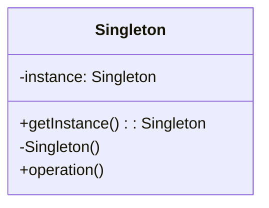
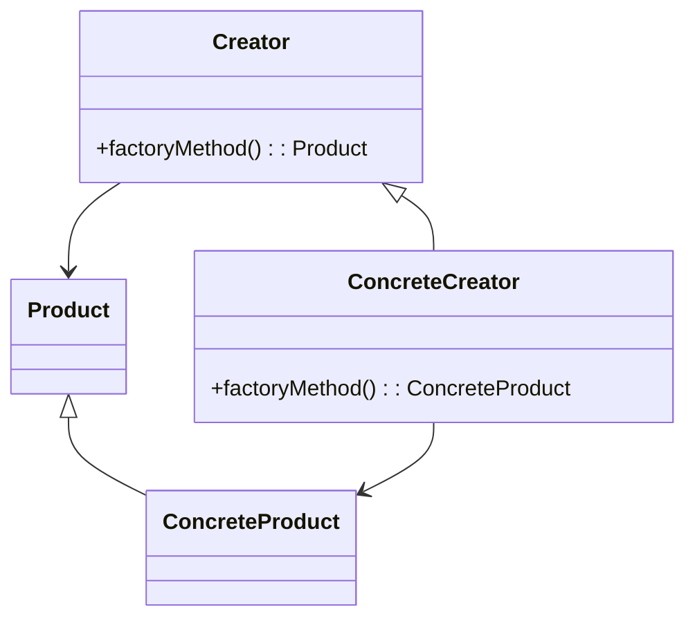

## 10.1 Recap of Key Concepts

As we reach the conclusion of our journey through design patterns in JavaScript and TypeScript, it's essential to reflect on the key concepts we've explored. Design patterns are more than just theoretical constructs; they are practical solutions to common problems in software design. By understanding and applying these patterns, we can write code that is not only functional but also maintainable, scalable, and efficient.

### Understanding Design Patterns

Design patterns are standardized solutions to recurring design problems. They provide a template for how to solve a problem in a way that is proven to be effective. Throughout this guide, we've delved into various design patterns, categorized into creational, structural, and behavioral patterns, each serving a unique purpose in software development.

### The Importance of Design Patterns

Design patterns are crucial for several reasons:

1. **Improved Code Maintainability**: By using design patterns, we can create code that is easier to understand and modify. This is because patterns provide a clear structure and reduce complexity.

2. **Enhanced Scalability**: Patterns allow us to build systems that can grow and evolve over time without requiring significant rewrites.

3. **Increased Development Efficiency**: With a set of proven solutions at our disposal, we can avoid reinventing the wheel and focus on solving new problems.

4. **Facilitated Communication**: Design patterns provide a common vocabulary for developers, making it easier to discuss and share ideas.

### Key Patterns and Their Applications

Let's recap some of the key design patterns we've covered and their applications in JavaScript and TypeScript:

#### Creational Patterns

- **Singleton Pattern**: Ensures a class has only one instance and provides a global point of access to it. This pattern is useful in scenarios where a single instance is needed to coordinate actions across a system, such as a configuration manager or a connection pool.

- **Factory Method Pattern**: Defines an interface for creating an object but allows subclasses to alter the type of objects that will be created. This pattern is beneficial when the exact type of object to be created is determined by subclasses.

- **Abstract Factory Pattern**: Provides an interface for creating families of related or dependent objects without specifying their concrete classes. It's particularly useful when a system needs to be independent of how its objects are created.

- **Builder Pattern**: Separates the construction of a complex object from its representation, allowing the same construction process to create different representations. This pattern is ideal for constructing complex objects with numerous optional parameters.

- **Prototype Pattern**: Creates new objects by copying an existing object, known as the prototype. This pattern is useful when the cost of creating a new instance of an object is more expensive than copying an existing one.

#### Structural Patterns

- **Adapter Pattern**: Allows incompatible interfaces to work together. This pattern is useful when integrating new components into an existing system without modifying its source code.

- **Bridge Pattern**: Decouples an abstraction from its implementation, allowing them to vary independently. This pattern is beneficial when both the abstractions and their implementations should be extensible by subclassing.

- **Composite Pattern**: Composes objects into tree structures to represent part-whole hierarchies. This pattern is ideal for building complex UI components or data structures.

- **Decorator Pattern**: Adds responsibilities to objects dynamically without altering their structure. This pattern is useful for extending the behavior of objects in a flexible and reusable way.

- **Facade Pattern**: Provides a simplified interface to a complex subsystem. This pattern is beneficial for reducing the complexity of interacting with a system.

- **Flyweight Pattern**: Reduces memory usage by sharing as much data as possible with similar objects. This pattern is useful in applications where many objects need to be created and memory usage is a concern.

- **Proxy Pattern**: Provides a surrogate or placeholder for another object to control access to it. This pattern is useful for lazy loading, access control, and logging.

#### Behavioral Patterns

- **Chain of Responsibility Pattern**: Passes a request along a chain of handlers, allowing multiple objects to handle the request. This pattern is useful for decoupling sender and receiver.

- **Command Pattern**: Encapsulates a request as an object, thereby allowing for parameterization of clients with queues, requests, and operations. This pattern is ideal for implementing undo/redo functionality.

- **Iterator Pattern**: Provides a way to access elements of a collection sequentially without exposing its underlying representation. This pattern is useful for traversing complex data structures.

- **Mediator Pattern**: Reduces coupling between components by introducing a mediator that handles communication between them. This pattern is beneficial in complex systems where components need to interact with each other.

- **Memento Pattern**: Captures and externalizes an object's internal state so that it can be restored later. This pattern is useful for implementing undo mechanisms.

- **Observer Pattern**: Defines a one-to-many dependency between objects so that when one object changes state, all its dependents are notified. This pattern is ideal for implementing event handling systems.

- **State Pattern**: Allows an object to alter its behavior when its internal state changes. This pattern is useful for state machines and UI components.

- **Strategy Pattern**: Defines a family of algorithms, encapsulates each one, and makes them interchangeable. This pattern is beneficial for implementing algorithms that can be selected at runtime.

- **Template Method Pattern**: Defines the skeleton of an algorithm in a method, deferring some steps to subclasses. This pattern is useful for implementing invariant parts of an algorithm once and allowing subclasses to provide behavior.

- **Visitor Pattern**: Represents an operation to be performed on elements of an object structure. This pattern is useful for adding new operations to existing object structures without modifying them.

### Applying Design Patterns in Practice

Understanding design patterns is just the beginning. The real value comes from applying them in real-world projects. Here are some ways to implement these concepts:

1. **Identify Reusable Solutions**: Look for recurring problems in your projects and apply the appropriate design patterns to solve them.

2. **Refactor Legacy Code**: Use design patterns to improve the structure and maintainability of existing codebases.

3. **Collaborate with Team Members**: Use design patterns as a common language to discuss and implement solutions with your team.

4. **Experiment and Iterate**: Don't be afraid to experiment with different patterns and iterate on your solutions. Design patterns are guidelines, not strict rules.

### Visualizing Design Patterns

To further aid your understanding, let's visualize some of the key concepts using diagrams.

#### Singleton Pattern

*Figure 1: Singleton Pattern - Ensures a class has only one instance.*

#### Factory Method Pattern

*Figure 2: Factory Method Pattern - Defines an interface for creating an object.*

### Try It Yourself

To solidify your understanding, try modifying the code examples provided in this guide. For instance, you can:

- Implement a new type of product in the Factory Method Pattern.
- Create a new decorator in the Decorator Pattern.
- Add a new state in the State Pattern.

### Knowledge Check

Before we conclude, let's reinforce what we've learned with a few questions:

- What are the main benefits of using design patterns?
- How can design patterns improve code maintainability?
- In what scenarios would you use the Singleton Pattern?
- How does the Observer Pattern facilitate event handling?

### Embrace the Journey

Remember, this is just the beginning. As you continue your journey in software development, you'll encounter new challenges and opportunities to apply design patterns. Keep experimenting, stay curious, and enjoy the journey!

## Quiz Time!



### What is the primary benefit of using design patterns in software development?

- [x] They provide proven solutions to common problems.
- [ ] They increase the complexity of the code.
- [ ] They are only useful for large projects.
- [ ] They eliminate the need for testing.

> **Explanation:** Design patterns provide proven solutions to common problems, making code more maintainable and scalable.

### Which pattern ensures a class has only one instance?

- [x] Singleton Pattern
- [ ] Factory Method Pattern
- [ ] Observer Pattern
- [ ] Strategy Pattern

> **Explanation:** The Singleton Pattern ensures a class has only one instance and provides a global point of access to it.

### In which pattern do subclasses decide which class to instantiate?

- [x] Factory Method Pattern
- [ ] Singleton Pattern
- [ ] Decorator Pattern
- [ ] Proxy Pattern

> **Explanation:** In the Factory Method Pattern, subclasses decide which class to instantiate.

### What is the main purpose of the Adapter Pattern?

- [x] To allow incompatible interfaces to work together.
- [ ] To add responsibilities to objects dynamically.
- [ ] To provide a simplified interface to a complex subsystem.
- [ ] To compose objects into tree structures.

> **Explanation:** The Adapter Pattern allows incompatible interfaces to work together by converting the interface of a class into another interface that clients expect.

### How does the Observer Pattern facilitate event handling?

- [x] By defining a one-to-many dependency between objects.
- [ ] By decoupling an abstraction from its implementation.
- [ ] By providing a surrogate for another object.
- [ ] By encapsulating a request as an object.

> **Explanation:** The Observer Pattern defines a one-to-many dependency between objects, allowing for event handling where changes in one object trigger updates in others.

### Which pattern is ideal for implementing undo/redo functionality?

- [x] Command Pattern
- [ ] State Pattern
- [ ] Memento Pattern
- [ ] Visitor Pattern

> **Explanation:** The Command Pattern encapsulates a request as an object, making it ideal for implementing undo/redo functionality.

### What is the main advantage of the Flyweight Pattern?

- [x] It reduces memory usage by sharing common parts.
- [ ] It provides a simplified interface to a complex subsystem.
- [ ] It allows incompatible interfaces to work together.
- [ ] It separates the construction of a complex object from its representation.

> **Explanation:** The Flyweight Pattern reduces memory usage by sharing as much data as possible with similar objects.

### Which pattern allows an object to alter its behavior when its internal state changes?

- [x] State Pattern
- [ ] Strategy Pattern
- [ ] Template Method Pattern
- [ ] Chain of Responsibility Pattern

> **Explanation:** The State Pattern allows an object to alter its behavior when its internal state changes.

### What is the main purpose of the Decorator Pattern?

- [x] To add responsibilities to objects dynamically.
- [ ] To provide a simplified interface to a complex subsystem.
- [ ] To compose objects into tree structures.
- [ ] To allow incompatible interfaces to work together.

> **Explanation:** The Decorator Pattern adds responsibilities to objects dynamically without altering their structure.

### True or False: Design patterns are strict rules that must be followed exactly.

- [ ] True
- [x] False

> **Explanation:** Design patterns are guidelines, not strict rules. They provide a template for solving problems but can be adapted to fit specific needs.


