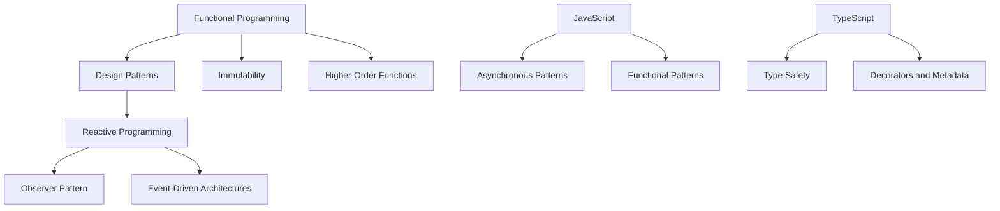

## 10.2 The Future of Design Patterns

As we stand on the cusp of a new era in software development, the role and nature of design patterns are evolving. With the advent of new technologies and paradigms such as functional programming, reactive programming, and the increasing complexity of software systems, design patterns are adapting to meet the demands of modern software development. In this section, we'll explore these emerging trends, discuss the potential for new patterns, and reflect on how JavaScript and TypeScript adaptations of patterns may continue to develop.

### The Influence of New Technologies and Paradigms

#### Functional Programming

Functional programming (FP) has gained significant traction in recent years, influencing the way we think about design patterns. FP emphasizes immutability, first-class functions, and pure functions, which can lead to more predictable and maintainable code. Let's explore how FP is shaping the future of design patterns:

- **Immutability and State Management**: Traditional design patterns often rely on mutable state, but with FP, immutability is a core principle. This shift has led to the development of patterns that emphasize immutable data structures and state management, such as the use of Redux in JavaScript applications.

- **Higher-Order Functions**: In FP, functions are first-class citizens, allowing for the creation of higher-order functions that can manipulate other functions. This capability has influenced patterns like the Strategy Pattern, where different algorithms can be encapsulated and passed around as functions.

- **Currying and Partial Application**: These FP techniques allow for the transformation of functions into more flexible and reusable components. They encourage the development of patterns that leverage function composition and modularity.

```javascript
// Example of currying in JavaScript
const add = (a) => (b) => a + b;
const addFive = add(5);
console.log(addFive(10)); // Outputs: 15
```

#### Reactive Programming

Reactive programming is another paradigm that is influencing the evolution of design patterns. It focuses on asynchronous data streams and the propagation of change, which can lead to more responsive and scalable applications.

- **Observer Pattern**: This pattern is at the heart of reactive programming. Libraries like RxJS in JavaScript have popularized the use of observables, which are a key component of reactive systems.

- **Event-Driven Architectures**: Reactive programming encourages the use of event-driven architectures, where components react to changes in data streams. This approach has led to the development of patterns that emphasize decoupling and scalability.

```javascript
// Example using RxJS for reactive programming
import { fromEvent } from 'rxjs';
import { map } from 'rxjs/operators';

const clicks = fromEvent(document, 'click');
const positions = clicks.pipe(map(event => ({ x: event.clientX, y: event.clientY })));
positions.subscribe(pos => console.log(pos));
```

### The Emergence of New Patterns

As programming practices evolve, so too do the design patterns we use. Here are some potential areas where new patterns may emerge:

- **Microservices and Serverless Architectures**: The shift towards microservices and serverless architectures is driving the need for patterns that address distributed systems, scalability, and fault tolerance.

- **Machine Learning and AI**: As machine learning and AI become more integrated into software systems, new patterns may emerge to address the unique challenges of these domains, such as data pipeline management and model deployment.

- **Blockchain and Decentralized Applications**: The rise of blockchain technology and decentralized applications is creating a need for patterns that address consensus, security, and data integrity.

### Adaptations in JavaScript and TypeScript

JavaScript and TypeScript continue to be at the forefront of web development, and their adaptations of design patterns are evolving to meet the needs of modern applications.

#### JavaScript Adaptations

- **Asynchronous Patterns**: JavaScript's asynchronous nature has led to the development of patterns that handle concurrency and asynchronous operations, such as Promises and async/await.

- **Functional Patterns**: With the rise of functional programming in JavaScript, patterns that leverage functions as first-class citizens are becoming more prevalent.

#### TypeScript Adaptations

- **Type Safety**: TypeScript's type system allows for the creation of patterns that emphasize type safety and robustness. This is particularly useful in large codebases where maintaining consistency is crucial.

- **Decorators and Metadata**: TypeScript's support for decorators and metadata has opened up new possibilities for patterns that leverage these features for dependency injection and aspect-oriented programming.

```typescript
// Example of a TypeScript decorator
function Log(target: any, propertyKey: string, descriptor: PropertyDescriptor) {
    const originalMethod = descriptor.value;
    descriptor.value = function (...args: any[]) {
        console.log(`Calling ${propertyKey} with`, args);
        return originalMethod.apply(this, args);
    };
}

class Calculator {
    @Log
    add(a: number, b: number): number {
        return a + b;
    }
}

const calculator = new Calculator();
calculator.add(2, 3); // Logs: Calling add with [2, 3]
```

### Staying Current with Industry Trends

To remain competitive in the ever-evolving field of software development, it's crucial to stay informed about industry trends and continuously adapt your skills. Here are some strategies to help you stay current:

- **Engage with the Community**: Participate in online forums, attend conferences, and join local meetups to connect with other developers and learn about the latest trends.

- **Continuous Learning**: Take advantage of online courses, tutorials, and books to deepen your understanding of new technologies and paradigms.

- **Experiment and Innovate**: Don't be afraid to experiment with new patterns and technologies in your projects. Innovation often comes from trying new approaches and learning from failures.

### Visualizing the Future of Design Patterns

To better understand the future of design patterns, let's visualize how these patterns interact with modern technologies and paradigms.



**Diagram Description**: This diagram illustrates the influence of functional programming and reactive programming on design patterns, as well as the adaptations in JavaScript and TypeScript.

### Conclusion

The future of design patterns is bright and full of potential. As new technologies and paradigms continue to emerge, design patterns will evolve to meet the demands of modern software development. By staying informed and continuously adapting your skills, you can remain at the forefront of this exciting field. Remember, this is just the beginning. As you progress, you'll build more complex and interactive applications. Keep experimenting, stay curious, and enjoy the journey!

## Quiz Time!



### Which programming paradigm emphasizes immutability and first-class functions?

- [x] Functional Programming
- [ ] Object-Oriented Programming
- [ ] Procedural Programming
- [ ] Logic Programming

> **Explanation:** Functional programming emphasizes immutability and treats functions as first-class citizens, allowing them to be passed around and manipulated like other data types.

### What is a key component of reactive systems that is often used in JavaScript?

- [x] Observables
- [ ] Promises
- [ ] Callbacks
- [ ] Generators

> **Explanation:** Observables are a key component of reactive systems, allowing for the creation and manipulation of asynchronous data streams.

### Which pattern is at the heart of reactive programming?

- [x] Observer Pattern
- [ ] Singleton Pattern
- [ ] Factory Pattern
- [ ] Strategy Pattern

> **Explanation:** The Observer Pattern is central to reactive programming, as it allows objects to subscribe to and react to changes in data streams.

### What is a potential area for new design patterns to emerge?

- [x] Microservices and Serverless Architectures
- [ ] Desktop Applications
- [ ] Static Websites
- [ ] Command-Line Tools

> **Explanation:** The shift towards microservices and serverless architectures creates a need for new patterns that address distributed systems and scalability.

### How does TypeScript enhance design patterns?

- [x] By providing type safety and support for decorators
- [ ] By simplifying syntax
- [ ] By reducing code size
- [ ] By increasing execution speed

> **Explanation:** TypeScript enhances design patterns by providing type safety, which helps maintain consistency in large codebases, and support for decorators, which enable aspect-oriented programming.

### What is a benefit of using higher-order functions in design patterns?

- [x] They allow for more flexible and reusable components.
- [ ] They increase code complexity.
- [ ] They reduce code readability.
- [ ] They limit function usage.

> **Explanation:** Higher-order functions allow for the creation of more flexible and reusable components by enabling functions to be passed around and manipulated.

### What is a common use case for the Strategy Pattern in functional programming?

- [x] Encapsulating algorithms as functions
- [ ] Managing state transitions
- [ ] Creating complex object hierarchies
- [ ] Simplifying interfaces

> **Explanation:** In functional programming, the Strategy Pattern can be used to encapsulate algorithms as functions, allowing them to be easily swapped and reused.

### Which JavaScript feature is commonly used in asynchronous patterns?

- [x] Promises
- [ ] Classes
- [ ] Modules
- [ ] Prototypes

> **Explanation:** Promises are a key feature in JavaScript used to handle asynchronous operations, allowing for cleaner and more manageable code.

### What is a key advantage of using decorators in TypeScript?

- [x] They enable aspect-oriented programming.
- [ ] They simplify variable declarations.
- [ ] They increase execution speed.
- [ ] They reduce code size.

> **Explanation:** Decorators in TypeScript enable aspect-oriented programming by allowing behavior to be added to classes and methods in a declarative way.

### True or False: The future of design patterns is static and unchanging.

- [ ] True
- [x] False

> **Explanation:** The future of design patterns is dynamic and evolving, influenced by new technologies and programming paradigms.


