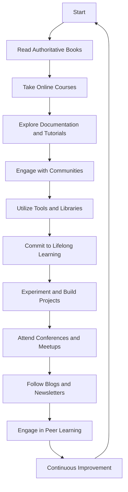

## 10.3 Further Learning Resources

As we conclude our exploration of design patterns in JavaScript and TypeScript, it's essential to recognize that learning is a continuous journey. The field of software development is ever-evolving, and staying updated with the latest trends, tools, and best practices is crucial for professional growth. In this section, we will provide you with a comprehensive list of resources to further your understanding and application of design patterns and software architecture. These resources include authoritative books, online courses, communities, and tools that will enhance your skills and knowledge.

### 1. Authoritative Books

Books are a timeless resource for in-depth learning and understanding. Here are some highly recommended books that delve into design patterns and software architecture:

#### 1.1 "Design Patterns: Elements of Reusable Object-Oriented Software" by Erich Gamma, Richard Helm, Ralph Johnson, and John Vlissides (Gang of Four)

This book is often referred to as the "bible" of design patterns. It introduces 23 classic design patterns and provides a comprehensive guide to understanding and applying them in software development. Although the examples are in C++, the concepts are universal and can be adapted to JavaScript and TypeScript.

#### 1.2 "JavaScript Patterns" by Stoyan Stefanov

This book focuses on patterns and best practices specific to JavaScript. It covers a range of topics, including object creation, code reuse, and design patterns, making it an excellent resource for JavaScript developers.

#### 1.3 "Learning JavaScript Design Patterns" by Addy Osmani

Addy Osmani's book is a practical guide to implementing design patterns in JavaScript. It covers both classical and modern design patterns, with examples and explanations tailored to JavaScript's unique features.

#### 1.4 "TypeScript Quickly" by Yakov Fain and Anton Moiseev

For those looking to deepen their understanding of TypeScript, this book provides a comprehensive introduction to TypeScript and its features. It also covers design patterns and how they can be implemented using TypeScript.

#### 1.5 "Patterns of Enterprise Application Architecture" by Martin Fowler

This book is an excellent resource for understanding architectural patterns and their application in enterprise software development. It provides insights into designing scalable and maintainable applications.

### 2. Online Courses and Tutorials

Online courses and tutorials offer interactive and engaging ways to learn. Here are some platforms and courses that provide valuable content on design patterns and software architecture:

#### 2.1 Coursera

- **Course: "Design Patterns" by University of Alberta**  
  This course provides an introduction to design patterns and their application in software development. It covers creational, structural, and behavioral patterns with practical examples.

- **Course: "Object-Oriented Design" by University of Alberta**  
  This course focuses on object-oriented design principles and patterns, providing a solid foundation for understanding and applying design patterns.

#### 2.2 Udemy

- **Course: "JavaScript Design Patterns" by Dmitri Nesteruk**  
  This course covers a wide range of design patterns and demonstrates how to implement them in JavaScript. It includes practical examples and exercises to reinforce learning.

- **Course: "TypeScript Design Patterns" by Packt Publishing**  
  This course explores design patterns in the context of TypeScript, highlighting the benefits of using TypeScript's features to implement patterns effectively.

#### 2.3 Pluralsight

- **Course: "Design Patterns in JavaScript" by Brice Wilson**  
  This course provides an overview of design patterns and their implementation in JavaScript. It includes examples and exercises to help you apply the patterns in real-world scenarios.

- **Course: "TypeScript Fundamentals" by Dan Wahlin**  
  This course offers a comprehensive introduction to TypeScript, covering its features and how they can be used to implement design patterns.

### 3. Documentation and Tutorials

Official documentation and tutorials are invaluable resources for learning and reference. Here are some key resources for JavaScript and TypeScript:

#### 3.1 MDN Web Docs

The [MDN Web Docs](https://developer.mozilla.org/en-US/) is an extensive resource for JavaScript developers. It provides detailed documentation on JavaScript features, APIs, and best practices. The MDN also includes tutorials and guides on various topics, including design patterns.

#### 3.2 TypeScript Handbook

The [TypeScript Handbook](https://www.typescriptlang.org/docs/handbook/intro.html) is the official documentation for TypeScript. It offers a comprehensive guide to TypeScript's features and capabilities, including examples and explanations of how to use them effectively.

#### 3.3 JavaScript.info

[JavaScript.info](https://javascript.info/) is a comprehensive tutorial on modern JavaScript. It covers a wide range of topics, from basic syntax to advanced concepts, including design patterns and best practices.

### 4. Active Communities and Forums

Engaging with communities and forums can provide valuable insights, support, and networking opportunities. Here are some active communities where you can connect with other developers:

#### 4.1 Stack Overflow

[Stack Overflow](https://stackoverflow.com/) is a popular platform for asking and answering programming-related questions. It's an excellent resource for finding solutions to specific problems and learning from the experiences of other developers.

#### 4.2 Reddit

Subreddits like [r/javascript](https://www.reddit.com/r/javascript/) and [r/typescript](https://www.reddit.com/r/typescript/) are active communities where developers share news, tutorials, and discussions related to JavaScript and TypeScript.

#### 4.3 Dev.to

[Dev.to](https://dev.to/) is a community of software developers where you can find articles, tutorials, and discussions on a wide range of topics, including design patterns and software architecture.

#### 4.4 GitHub

[GitHub](https://github.com/) is not only a platform for hosting code but also a community where developers collaborate on projects. You can find repositories related to design patterns and contribute to open-source projects.

### 5. Tools and Libraries

Utilizing tools and libraries can facilitate the implementation of design patterns and improve your development workflow. Here are some recommended tools and libraries:

#### 5.1 ESLint

[ESLint](https://eslint.org/) is a popular tool for identifying and fixing problems in JavaScript code. It can help enforce coding standards and best practices, including the use of design patterns.

#### 5.2 TypeScript Compiler

The [TypeScript Compiler](https://www.typescriptlang.org/) is an essential tool for TypeScript development. It provides type checking and transpilation, helping you implement design patterns with type safety.

#### 5.3 Lodash

[Lodash](https://lodash.com/) is a utility library that provides a wide range of functions for working with arrays, objects, and other data structures. It can simplify the implementation of certain design patterns.

#### 5.4 RxJS

[RxJS](https://rxjs.dev/) is a library for reactive programming using observables. It can be used to implement design patterns related to event handling and asynchronous programming.

### 6. Commitment to Lifelong Learning

In the ever-evolving field of software development, a commitment to lifelong learning is essential. Here are some strategies to help you stay updated and continue growing as a developer:

#### 6.1 Attend Conferences and Meetups

Attending conferences and meetups is a great way to learn from industry experts, network with other developers, and stay informed about the latest trends and technologies.

#### 6.2 Follow Blogs and Newsletters

Subscribe to blogs and newsletters that focus on JavaScript, TypeScript, and software architecture. This will keep you informed about new developments and best practices.

#### 6.3 Experiment and Build Projects

Practical experience is one of the best ways to learn. Experiment with new tools and technologies, and build projects that challenge you to apply design patterns and architectural principles.

#### 6.4 Engage in Peer Learning

Collaborate with other developers to learn from each other's experiences and perspectives. Peer learning can provide valuable insights and help you grow as a developer.

### Visualizing the Learning Path

To help you visualize the journey of continuous learning, here is a flowchart that outlines the steps and resources for furthering your understanding of design patterns and software architecture.

### Conclusion

Remember, this is just the beginning. As you progress, you'll build more complex and interactive applications. Keep experimenting, stay curious, and enjoy the journey! The resources provided here are just a starting point. Explore them, dive deep into the topics that interest you, and continue to expand your knowledge and skills.

## Quiz Time!



### Which book is often referred to as the "bible" of design patterns?

- [x] "Design Patterns: Elements of Reusable Object-Oriented Software" by the Gang of Four
- [ ] "JavaScript Patterns" by Stoyan Stefanov
- [ ] "Learning JavaScript Design Patterns" by Addy Osmani
- [ ] "Patterns of Enterprise Application Architecture" by Martin Fowler

> **Explanation:** The book by the Gang of Four is a foundational text in the field of design patterns.

### Which online platform offers a course titled "Design Patterns" by the University of Alberta?

- [x] Coursera
- [ ] Udemy
- [ ] Pluralsight
- [ ] LinkedIn Learning

> **Explanation:** Coursera offers the course "Design Patterns" by the University of Alberta.

### What is the primary focus of the book "JavaScript Patterns" by Stoyan Stefanov?

- [x] Patterns and best practices specific to JavaScript
- [ ] TypeScript fundamentals
- [ ] Enterprise application architecture
- [ ] Reactive programming

> **Explanation:** "JavaScript Patterns" focuses on patterns and best practices for JavaScript developers.

### Which library is recommended for reactive programming using observables?

- [x] RxJS
- [ ] Lodash
- [ ] ESLint
- [ ] TypeScript Compiler

> **Explanation:** RxJS is a library for reactive programming using observables.

### What is the main benefit of engaging with communities and forums?

- [x] Gaining insights and support from other developers
- [ ] Accessing official documentation
- [ ] Learning from authoritative books
- [ ] Taking online courses

> **Explanation:** Engaging with communities and forums allows you to gain insights and support from other developers.

### Which tool is used for identifying and fixing problems in JavaScript code?

- [x] ESLint
- [ ] Lodash
- [ ] RxJS
- [ ] TypeScript Compiler

> **Explanation:** ESLint is a tool for identifying and fixing problems in JavaScript code.

### What is the primary purpose of the TypeScript Compiler?

- [x] Type checking and transpilation
- [ ] Reactive programming
- [ ] Code linting
- [ ] Data manipulation

> **Explanation:** The TypeScript Compiler is used for type checking and transpilation.

### Which platform is known for hosting code and facilitating collaboration on projects?

- [x] GitHub
- [ ] Stack Overflow
- [ ] Reddit
- [ ] Dev.to

> **Explanation:** GitHub is a platform for hosting code and facilitating collaboration on projects.

### What is one strategy for committing to lifelong learning?

- [x] Attend conferences and meetups
- [ ] Read a single book
- [ ] Focus solely on one programming language
- [ ] Avoid online courses

> **Explanation:** Attending conferences and meetups is a strategy for committing to lifelong learning.

### True or False: "Patterns of Enterprise Application Architecture" by Martin Fowler is focused on JavaScript design patterns.

- [ ] True
- [x] False

> **Explanation:** The book focuses on architectural patterns for enterprise applications, not specifically on JavaScript design patterns.


