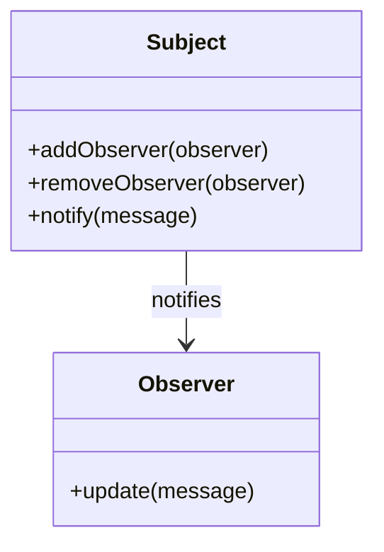

## 10.4 Final Thoughts

As we reach the conclusion of our journey through design patterns in JavaScript and TypeScript, it's essential to reflect on the knowledge we've gained and the path ahead. Design patterns are not just theoretical constructs; they are practical tools that can profoundly impact the way we write and maintain code. Let's delve into some final thoughts that will inspire you to continue mastering these patterns and applying them to your work.

### Embrace the Power of Practice

One of the most crucial steps in mastering design patterns is practice. Understanding the theory behind each pattern is important, but the real learning happens when you apply these patterns in real-world scenarios. As you work on projects, challenge yourself to identify opportunities where a design pattern could simplify your code or enhance its scalability. 

Consider setting aside time to refactor existing codebases, integrating design patterns where appropriate. This exercise not only reinforces your understanding but also improves the quality of your code. Remember, the more you practice, the more intuitive these patterns will become.

### Patience and Persistence: Keys to Mastery

Mastering design patterns, like any complex concept, requires patience and persistence. There will be times when the application of a pattern might not seem straightforward, or when you encounter challenges in adapting a pattern to fit your specific needs. During these moments, it's crucial to remain patient and persistent.

Take the time to revisit the fundamentals, review examples, and experiment with different approaches. Engage with the community, seek feedback, and learn from others' experiences. With each iteration, your understanding will deepen, and your ability to apply design patterns effectively will grow.

### The Continuous Evolution of Technology

The world of software development is in constant flux, with new technologies and methodologies emerging regularly. This evolution presents exciting opportunities for developers to innovate and push the boundaries of what's possible. Design patterns provide a solid foundation that can adapt to these changes, offering a reliable framework for tackling new challenges.

Stay curious and open to learning. Embrace new tools and languages, and explore how design patterns can be applied in different contexts. By doing so, you'll not only keep your skills relevant but also position yourself to take advantage of the latest advancements in technology.

### Words of Inspiration

As you continue your journey in mastering software development, remember that every expert was once a beginner. The path to mastery is filled with learning experiences, and each challenge you overcome contributes to your growth. Celebrate your successes, learn from your mistakes, and never stop pushing yourself to improve.

The skills you've developed through studying design patterns will serve you well in your career. They will enable you to write cleaner, more efficient code, collaborate effectively with others, and tackle complex problems with confidence. Trust in your abilities and know that you have the tools to succeed.

### A Heartfelt Thank You

Thank you for engaging with this guide on design patterns in JavaScript and TypeScript. Your commitment to learning and improving your craft is commendable, and we are confident that you will achieve great things in your career. We hope that the insights and examples provided have been valuable and that they will continue to serve you as you progress.

### Fostering a Sense of Community

We invite you to share your thoughts, feedback, and experiences with us. Whether you have questions, suggestions, or stories of how you've applied design patterns in your work, we would love to hear from you. Join our community of developers who are passionate about learning and growing together.

Consider participating in forums, attending meetups, or contributing to open-source projects. These activities not only enhance your skills but also connect you with like-minded individuals who share your passion for software development.

### The Journey Continues

As we conclude this guide, remember that this is just the beginning of your journey with design patterns. There are always new patterns to explore, new projects to tackle, and new opportunities to learn. Keep experimenting, stay curious, and enjoy the journey.

The world of software development is vast and full of potential. With the knowledge and skills you've gained, you're well-equipped to make a meaningful impact. Embrace the challenges, seize the opportunities, and continue to grow as a developer.

### Try It Yourself

To reinforce your understanding of design patterns, try implementing a small project using a combination of patterns you've learned. Experiment with different approaches, and don't be afraid to make mistakes. Each attempt will bring you closer to mastery.

Here's a simple exercise to get you started:

```javascript
// Implement a simple notification system using the Observer pattern

class Subject {
  constructor() {
    this.observers = [];
  }

  addObserver(observer) {
    this.observers.push(observer);
  }

  removeObserver(observer) {
    this.observers = this.observers.filter(obs => obs !== observer);
  }

  notify(message) {
    this.observers.forEach(observer => observer.update(message));
  }
}

class Observer {
  constructor(name) {
    this.name = name;
  }

  update(message) {
    console.log(`${this.name} received message: ${message}`);
  }
}

// Create a subject
const notificationSystem = new Subject();

// Create observers
const user1 = new Observer('User1');
const user2 = new Observer('User2');

// Add observers to the subject
notificationSystem.addObserver(user1);
notificationSystem.addObserver(user2);

// Notify observers
notificationSystem.notify('New notification!');

// Try It Yourself: Add more observers, remove an observer, or change the notification message.
```

### Visualizing the Observer Pattern

To better understand the Observer pattern, let's visualize how the subject and observers interact:



This diagram illustrates the relationship between the `Subject` and `Observer` classes, showing how the subject notifies its observers of changes.

### References and Links

For further reading and deeper dives into design patterns, consider exploring the following resources:

- [MDN Web Docs on JavaScript](https://developer.mozilla.org/en-US/docs/Web/JavaScript)
- [TypeScript Documentation](https://www.typescriptlang.org/docs/)
- [Refactoring Guru: Design Patterns](https://refactoring.guru/design-patterns)
- [W3Schools JavaScript Tutorial](https://www.w3schools.com/js/)

### Knowledge Check

To reinforce your learning, consider the following questions:

1. How can design patterns improve the maintainability of your code?
2. What are some challenges you might face when implementing design patterns?
3. Why is it important to practice applying design patterns in real-world scenarios?
4. How can engaging with the developer community enhance your understanding of design patterns?
5. What steps can you take to stay updated with the latest advancements in software development?

### Embrace the Journey

Remember, this is just the beginning. As you progress, you'll build more complex and interactive applications. Keep experimenting, stay curious, and enjoy the journey!

## Quiz Time!



### Which of the following is a key benefit of using design patterns?

- [x] Improved code maintainability
- [ ] Increased code complexity
- [ ] Reduced code readability
- [ ] Faster code execution

> **Explanation:** Design patterns help improve code maintainability by providing proven solutions to common problems, making the code easier to understand and modify.


### What is a crucial step in mastering design patterns?

- [x] Practice
- [ ] Memorization
- [ ] Avoiding challenges
- [ ] Ignoring feedback

> **Explanation:** Practice is essential for mastering design patterns, as it allows developers to apply theoretical knowledge in real-world scenarios and refine their skills.


### Why is patience important when learning design patterns?

- [x] It helps in overcoming challenges
- [ ] It prevents learning
- [ ] It leads to quick results
- [ ] It discourages experimentation

> **Explanation:** Patience is important because mastering design patterns can be challenging, and persistence is needed to overcome obstacles and deepen understanding.


### How can engaging with the developer community benefit you?

- [x] By providing feedback and learning opportunities
- [ ] By isolating you from others
- [ ] By discouraging collaboration
- [ ] By limiting your knowledge

> **Explanation:** Engaging with the developer community provides opportunities for feedback, learning, and collaboration, enhancing your understanding and skills.


### What should you do to stay updated with the latest advancements in software development?

- [x] Embrace new tools and languages
- [ ] Avoid learning new things
- [ ] Stick to outdated practices
- [ ] Ignore industry trends

> **Explanation:** Embracing new tools and languages helps you stay updated with the latest advancements, keeping your skills relevant and opening new opportunities.


### What is the Observer pattern used for?

- [x] Defining a one-to-many dependency between objects
- [ ] Creating a single instance of a class
- [ ] Separating an abstraction from its implementation
- [ ] Composing objects into tree structures

> **Explanation:** The Observer pattern defines a one-to-many dependency between objects, allowing one object to notify others of changes.


### How can you reinforce your understanding of design patterns?

- [x] Implement a small project using design patterns
- [ ] Avoid using design patterns
- [ ] Memorize definitions without practice
- [ ] Ignore real-world applications

> **Explanation:** Implementing a small project using design patterns reinforces understanding by providing practical experience and application.


### What is a benefit of refactoring existing codebases with design patterns?

- [x] Improved code quality
- [ ] Increased code complexity
- [ ] Reduced code readability
- [ ] Slower code execution

> **Explanation:** Refactoring existing codebases with design patterns improves code quality by making it more maintainable, scalable, and understandable.


### Why is it important to celebrate your successes when learning design patterns?

- [x] It boosts motivation and confidence
- [ ] It leads to complacency
- [ ] It discourages further learning
- [ ] It isolates you from others

> **Explanation:** Celebrating successes boosts motivation and confidence, encouraging continued learning and growth.


### True or False: The journey of mastering design patterns is a one-time effort.

- [ ] True
- [x] False

> **Explanation:** False. Mastering design patterns is an ongoing journey that involves continuous learning, practice, and adaptation to new challenges.


