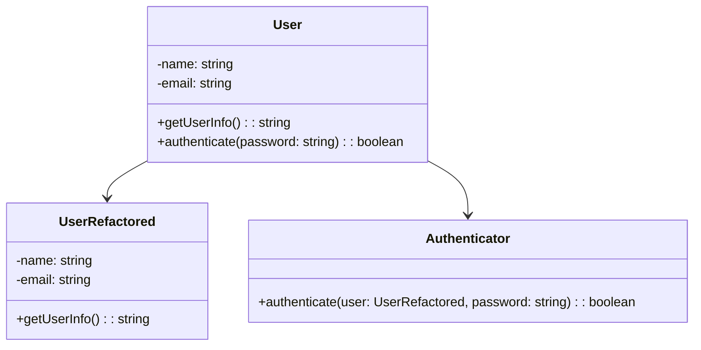

## 2.1.1 Single Responsibility Principle

The Single Responsibility Principle (SRP) is one of the five SOLID principles of object-oriented design. It states that a class or module should have only one reason to change, meaning it should have only one job or responsibility. This principle is crucial for creating maintainable and scalable software systems.

### Understanding the Single Responsibility Principle

The SRP is about ensuring that a class or module is focused on a single task or responsibility. By adhering to this principle, we can achieve a higher level of cohesion within our code, making it easier to understand, test, and maintain. When a class has multiple responsibilities, it becomes more complex and harder to manage, especially as the system evolves.

#### Definition

**Single Responsibility Principle (SRP):** A class or module should have only one reason to change, meaning it should have only one responsibility.

### Why SRP Matters

Implementing the SRP leads to several benefits:

1. **Easier Maintenance:** When a class has a single responsibility, changes to that responsibility are localized, reducing the risk of unintended side effects.
2. **Improved Code Clarity:** Classes with a single responsibility are easier to understand, as their purpose is clear and focused.
3. **Enhanced Modularity:** SRP promotes modular design, making it easier to reuse and refactor code.
4. **Better Testability:** With a single responsibility, classes are easier to test in isolation.

### Violating the SRP: A JavaScript Example

Let's look at an example of a class that violates the SRP. Consider a `User` class that handles both user data and user authentication:

```javascript
class User {
  constructor(name, email) {
    this.name = name;
    this.email = email;
  }

  getUserInfo() {
    return `Name: ${this.name}, Email: ${this.email}`;
  }

  authenticate(password) {
    // Simulate authentication logic
    return password === 'secret';
  }
}
```

In this example, the `User` class has two responsibilities: managing user data and handling authentication. This violates the SRP because changes to the authentication logic would require changes to the `User` class, even if the user data management remains unchanged.

### Refactoring to Adhere to SRP

To adhere to the SRP, we can refactor the code by separating the responsibilities into different classes:

```javascript
class User {
  constructor(name, email) {
    this.name = name;
    this.email = email;
  }

  getUserInfo() {
    return `Name: ${this.name}, Email: ${this.email}`;
  }
}

class Authenticator {
  authenticate(user, password) {
    // Simulate authentication logic
    return password === 'secret';
  }
}
```

Now, the `User` class is responsible only for managing user data, and the `Authenticator` class handles authentication. This separation makes the code more modular and easier to maintain.

### Implementing SRP in TypeScript

TypeScript, with its static typing and interfaces, can further enhance adherence to the SRP. Let's refactor the previous example using TypeScript:

```typescript
interface IUser {
  name: string;
  email: string;
  getUserInfo(): string;
}

class User implements IUser {
  constructor(public name: string, public email: string) {}

  getUserInfo(): string {
    return `Name: ${this.name}, Email: ${this.email}`;
  }
}

interface IAuthenticator {
  authenticate(user: IUser, password: string): boolean;
}

class Authenticator implements IAuthenticator {
  authenticate(user: IUser, password: string): boolean {
    // Simulate authentication logic
    return password === 'secret';
  }
}
```

In this TypeScript example, we define interfaces for the `User` and `Authenticator` classes, ensuring that each class adheres to its specific responsibility. This approach enhances code clarity and maintainability.

### Common Pitfalls and How to Avoid Them

While implementing the SRP, developers may encounter several pitfalls:

1. **Over-Engineering:** Splitting responsibilities too finely can lead to an excessive number of classes, making the system harder to manage. Aim for a balance between simplicity and adherence to SRP.
2. **Ambiguous Responsibilities:** Ensure that each class has a clear and well-defined responsibility. If a class's purpose is unclear, it may violate the SRP.
3. **Ignoring Dependencies:** When separating responsibilities, be mindful of dependencies between classes. Use dependency injection to manage dependencies effectively.

### SRP and Cohesive Design

The SRP is closely related to the concept of cohesive design. Cohesion refers to how closely related the responsibilities of a class are. A highly cohesive class has responsibilities that are strongly related, making it easier to understand and maintain. By adhering to the SRP, we naturally achieve higher cohesion in our code.

### Visualizing SRP

To better understand the SRP, let's visualize the relationship between classes before and after refactoring:



**Diagram Explanation:** The diagram shows the original `User` class with multiple responsibilities and the refactored design with separate `UserRefactored` and `Authenticator` classes, each with a single responsibility.

### Try It Yourself

To deepen your understanding of the SRP, try experimenting with the code examples:

1. **Add New Responsibilities:** Introduce a new responsibility to the `User` class, such as logging user activity. Refactor the code to adhere to the SRP.
2. **Modify Authentication Logic:** Change the authentication logic in the `Authenticator` class. Observe how the separation of responsibilities simplifies this process.

### References and Further Reading

- [SOLID Principles on Wikipedia](https://en.wikipedia.org/wiki/SOLID)
- [MDN Web Docs: Classes](https://developer.mozilla.org/en-US/docs/Web/JavaScript/Reference/Classes)
- [TypeScript Handbook: Interfaces](https://www.typescriptlang.org/docs/handbook/interfaces.html)

### Knowledge Check

Let's summarize the key takeaways from this section:

- The Single Responsibility Principle (SRP) ensures that a class or module has only one reason to change.
- Adhering to the SRP leads to easier maintenance, improved code clarity, enhanced modularity, and better testability.
- Refactoring code to adhere to the SRP involves separating responsibilities into distinct classes or modules.
- Common pitfalls include over-engineering, ambiguous responsibilities, and ignoring dependencies.
- The SRP is closely related to cohesive design and modularity.

### Embrace the Journey

Remember, mastering the SRP is a journey. As you continue to apply this principle in your projects, you'll build more maintainable and scalable software systems. Keep experimenting, stay curious, and enjoy the process!

## Quiz Time!



### What is the Single Responsibility Principle (SRP)?

- [x] A class should have only one reason to change.
- [ ] A class should handle multiple responsibilities.
- [ ] A class should be as complex as possible.
- [ ] A class should have multiple reasons to change.

> **Explanation:** The SRP states that a class should have only one reason to change, meaning it should have only one responsibility.

### Which of the following is a benefit of adhering to the SRP?

- [x] Easier maintenance
- [ ] Increased complexity
- [ ] More responsibilities per class
- [ ] Less modularity

> **Explanation:** Adhering to the SRP leads to easier maintenance, as changes are localized to specific classes with single responsibilities.

### What is a common pitfall when implementing the SRP?

- [x] Over-engineering
- [ ] Under-engineering
- [ ] Ignoring class responsibilities
- [ ] Combining unrelated classes

> **Explanation:** Over-engineering can occur when responsibilities are split too finely, leading to an excessive number of classes.

### How does the SRP relate to cohesive design?

- [x] It promotes higher cohesion by focusing on single responsibilities.
- [ ] It decreases cohesion by combining multiple responsibilities.
- [ ] It has no relation to cohesion.
- [ ] It makes classes less cohesive.

> **Explanation:** The SRP promotes higher cohesion by ensuring that each class has a single, well-defined responsibility.

### What is a sign that a class violates the SRP?

- [x] The class has multiple responsibilities.
- [ ] The class has a single responsibility.
- [ ] The class is easy to understand.
- [ ] The class is highly cohesive.

> **Explanation:** A class that has multiple responsibilities violates the SRP, as it should have only one reason to change.

### How can TypeScript enhance adherence to the SRP?

- [x] By using interfaces to define clear responsibilities
- [ ] By allowing multiple responsibilities in a single class
- [ ] By ignoring class responsibilities
- [ ] By increasing class complexity

> **Explanation:** TypeScript's interfaces can define clear responsibilities, enhancing adherence to the SRP.

### What should you do if a class has ambiguous responsibilities?

- [x] Refactor the class to have a clear, single responsibility.
- [ ] Add more responsibilities to the class.
- [ ] Ignore the ambiguity.
- [ ] Combine the class with another unrelated class.

> **Explanation:** If a class has ambiguous responsibilities, refactor it to have a clear, single responsibility.

### What is the relationship between SRP and modularity?

- [x] SRP enhances modularity by separating responsibilities.
- [ ] SRP decreases modularity by combining responsibilities.
- [ ] SRP has no effect on modularity.
- [ ] SRP makes code less modular.

> **Explanation:** SRP enhances modularity by ensuring that each class or module has a single responsibility, making the code easier to manage and reuse.

### How does SRP improve testability?

- [x] By making classes easier to test in isolation
- [ ] By making classes harder to test
- [ ] By combining multiple responsibilities in a single class
- [ ] By increasing class complexity

> **Explanation:** SRP improves testability by making classes easier to test in isolation, as each class has a single responsibility.

### True or False: SRP states that a class should handle multiple responsibilities.

- [ ] True
- [x] False

> **Explanation:** False. The SRP states that a class should have only one responsibility, not multiple.


