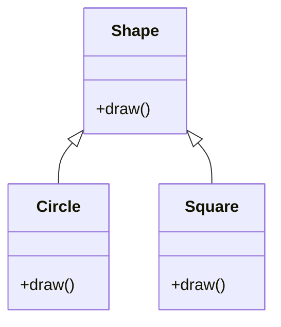

## 2.1.2 Open/Closed Principle

In the realm of software development, maintaining a balance between stability and adaptability is crucial. The Open/Closed Principle (OCP), one of the five SOLID principles of object-oriented design, provides a guideline for achieving this balance. The principle states that software entities (such as classes, modules, and functions) should be **open for extension but closed for modification**. This means that the behavior of a module can be extended without altering its source code, thus preserving its integrity while allowing for new functionality.

### Understanding the Open/Closed Principle

The Open/Closed Principle was introduced by Bertrand Meyer in his book "Object-Oriented Software Construction" in 1988. It emphasizes the importance of designing software that can evolve over time without requiring constant changes to existing code. This principle helps prevent the introduction of bugs and reduces the risk of breaking existing functionality when new features are added.

#### Key Concepts

- **Open for Extension**: A module should allow its behavior to be extended to accommodate new requirements.
- **Closed for Modification**: Once a module is developed and tested, its source code should not be changed.

By adhering to OCP, developers can create systems that are more robust and easier to maintain. Let's explore how to implement this principle in JavaScript and TypeScript.

### Implementing OCP in JavaScript and TypeScript

JavaScript and TypeScript, with their support for object-oriented programming, provide several mechanisms to implement the Open/Closed Principle. These include inheritance, interfaces, and polymorphism.

#### Using Inheritance

Inheritance allows us to create new classes based on existing ones, thereby extending their functionality without modifying their code. This is a straightforward way to adhere to the Open/Closed Principle.

```typescript
// Base class
class Shape {
  draw(): void {
    console.log("Drawing a shape");
  }
}

// Extended class
class Circle extends Shape {
  draw(): void {
    console.log("Drawing a circle");
  }
}

// Extended class
class Square extends Shape {
  draw(): void {
    console.log("Drawing a square");
  }
}

const shapes: Shape[] = [new Circle(), new Square()];
shapes.forEach(shape => shape.draw());
```

In this example, the `Shape` class is closed for modification but open for extension. We can add new shapes by creating subclasses without altering the `Shape` class itself.

#### Leveraging Interfaces and Polymorphism

TypeScript's interfaces and polymorphism provide another way to implement the Open/Closed Principle. By defining interfaces, we can ensure that new classes adhere to a specific contract, allowing for easy extension.

```typescript
// Interface
interface Drawable {
  draw(): void;
}

// Implementing the interface
class Triangle implements Drawable {
  draw(): void {
    console.log("Drawing a triangle");
  }
}

// Implementing the interface
class Rectangle implements Drawable {
  draw(): void {
    console.log("Drawing a rectangle");
  }
}

const drawables: Drawable[] = [new Triangle(), new Rectangle()];
drawables.forEach(drawable => drawable.draw());
```

Here, the `Drawable` interface defines a contract for drawing shapes. Any class implementing this interface can be added to the `drawables` array, demonstrating how interfaces facilitate the Open/Closed Principle.

### Advantages of the Open/Closed Principle

Applying the Open/Closed Principle offers several benefits:

1. **Code Stability**: By minimizing changes to existing code, we reduce the risk of introducing bugs.
2. **Ease of Maintenance**: Extending functionality through new classes is often simpler than modifying existing code.
3. **Scalability**: Systems designed with OCP in mind can grow more easily as new requirements emerge.
4. **Reusability**: Components designed to be open for extension are often more reusable across different projects.

### Challenges and Strategies

While the Open/Closed Principle offers many advantages, it can also present challenges:

- **Overuse of Inheritance**: Excessive use of inheritance can lead to complex hierarchies that are difficult to manage. Favor composition over inheritance when possible.
- **Interface Proliferation**: Creating too many interfaces can lead to confusion and increased complexity. Use interfaces judiciously and ensure they serve a clear purpose.
- **Balancing Flexibility and Complexity**: Striking the right balance between flexibility and complexity is crucial. Avoid making systems overly flexible at the expense of simplicity.

#### Strategies to Overcome Challenges

- **Use Design Patterns**: Patterns like Strategy, Decorator, and Factory Method can help implement OCP effectively.
- **Favor Composition**: Use composition to extend functionality without altering existing classes.
- **Refactor Regularly**: Regular refactoring helps keep codebases clean and manageable.

### Visualizing the Open/Closed Principle

To better understand the Open/Closed Principle, let's visualize it using a class diagram.



**Diagram Description**: This class diagram illustrates the relationship between the `Shape` class and its subclasses `Circle` and `Square`. The `Shape` class is closed for modification but open for extension, allowing new shapes to be added without altering the existing class.

### Try It Yourself

Experiment with the code examples provided. Try adding a new shape, such as a `Hexagon`, by extending the `Shape` class or implementing the `Drawable` interface. Observe how the existing code remains unchanged, demonstrating the Open/Closed Principle in action.

### References and Further Reading

- [MDN Web Docs: Object-Oriented Programming](https://developer.mozilla.org/en-US/docs/Learn/JavaScript/Objects/Object-oriented_JS)
- [TypeScript Handbook: Interfaces](https://www.typescriptlang.org/docs/handbook/interfaces.html)
- [SOLID Principles of Object-Oriented Design](https://en.wikipedia.org/wiki/SOLID)

### Knowledge Check

Before we conclude, let's reinforce our understanding with a few questions:

1. What is the Open/Closed Principle?
2. How can inheritance help implement OCP?
3. What are the advantages of using interfaces in TypeScript for OCP?
4. What challenges might arise when applying the Open/Closed Principle?
5. How can design patterns support the Open/Closed Principle?

### Embrace the Journey

Remember, mastering the Open/Closed Principle is a journey. As you continue to design and develop software, keep this principle in mind to create systems that are both stable and adaptable. Stay curious, experiment with new approaches, and enjoy the process of learning and growing as a developer.

## Quiz Time!



### What does the Open/Closed Principle state?

- [x] Software entities should be open for extension but closed for modification.
- [ ] Software entities should be closed for extension and open for modification.
- [ ] Software entities should be open for both extension and modification.
- [ ] Software entities should be closed for both extension and modification.

> **Explanation:** The Open/Closed Principle states that software entities should be open for extension but closed for modification, allowing for new functionality without altering existing code.

### How can inheritance support the Open/Closed Principle?

- [x] By allowing new classes to extend existing ones without modifying them.
- [ ] By requiring modifications to existing classes for new functionality.
- [ ] By preventing the creation of new classes.
- [ ] By eliminating the need for interfaces.

> **Explanation:** Inheritance allows new classes to extend existing ones, enabling the addition of new functionality without modifying the existing code, thus supporting the Open/Closed Principle.

### What role do interfaces play in the Open/Closed Principle?

- [x] They define contracts that new classes can implement to extend functionality.
- [ ] They require existing classes to be modified for new functionality.
- [ ] They prevent the creation of new classes.
- [ ] They eliminate the need for inheritance.

> **Explanation:** Interfaces define contracts that new classes can implement, allowing for the extension of functionality without modifying existing code, in line with the Open/Closed Principle.

### What is a potential challenge of applying the Open/Closed Principle?

- [x] Overuse of inheritance leading to complex hierarchies.
- [ ] Lack of flexibility in extending functionality.
- [ ] Inability to create new classes.
- [ ] Requirement to modify existing code for new functionality.

> **Explanation:** Overuse of inheritance can lead to complex hierarchies, making it a challenge when applying the Open/Closed Principle. It's important to balance flexibility and complexity.

### How can design patterns support the Open/Closed Principle?

- [x] By providing structured ways to extend functionality without modifying existing code.
- [ ] By requiring modifications to existing code for new functionality.
- [ ] By preventing the creation of new classes.
- [ ] By eliminating the need for interfaces.

> **Explanation:** Design patterns provide structured ways to extend functionality without modifying existing code, supporting the Open/Closed Principle.

### What is a benefit of adhering to the Open/Closed Principle?

- [x] Increased code stability and reduced risk of introducing bugs.
- [ ] Increased complexity and difficulty in maintaining code.
- [ ] Requirement to modify existing code for new functionality.
- [ ] Inability to extend functionality.

> **Explanation:** Adhering to the Open/Closed Principle increases code stability and reduces the risk of introducing bugs by minimizing changes to existing code.

### What is a strategy to overcome challenges in applying the Open/Closed Principle?

- [x] Favor composition over inheritance to avoid complex hierarchies.
- [ ] Avoid using interfaces to reduce complexity.
- [ ] Modify existing code for new functionality.
- [ ] Prevent the creation of new classes.

> **Explanation:** Favoring composition over inheritance helps avoid complex hierarchies, making it a strategy to overcome challenges in applying the Open/Closed Principle.

### What is a potential drawback of using too many interfaces?

- [x] Increased complexity and confusion.
- [ ] Lack of flexibility in extending functionality.
- [ ] Inability to create new classes.
- [ ] Requirement to modify existing code for new functionality.

> **Explanation:** Using too many interfaces can lead to increased complexity and confusion, which is a potential drawback when applying the Open/Closed Principle.

### How can regular refactoring support the Open/Closed Principle?

- [x] By keeping codebases clean and manageable.
- [ ] By requiring modifications to existing code for new functionality.
- [ ] By preventing the creation of new classes.
- [ ] By eliminating the need for interfaces.

> **Explanation:** Regular refactoring helps keep codebases clean and manageable, supporting the Open/Closed Principle by maintaining code quality.

### True or False: The Open/Closed Principle prevents the creation of new classes.

- [ ] True
- [x] False

> **Explanation:** False. The Open/Closed Principle encourages the creation of new classes to extend functionality without modifying existing code.



---
