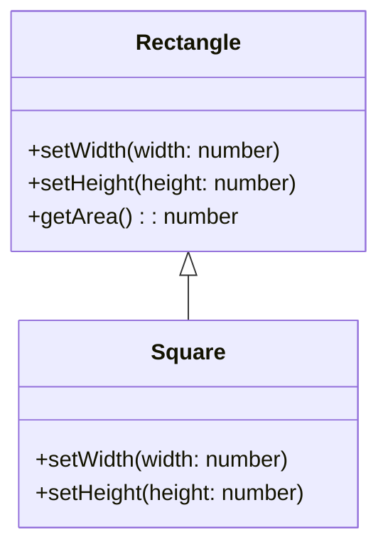

## 2.1.3 Liskov Substitution Principle

The Liskov Substitution Principle (LSP) is a fundamental concept in object-oriented programming and design, forming the 'L' in the SOLID principles. It was introduced by Barbara Liskov in 1987 and emphasizes the importance of substitutability in inheritance hierarchies. In essence, the principle states that objects of a superclass should be replaceable with objects of a subclass without affecting the correctness of the program. This principle ensures that a subclass can stand in for its superclass without altering the desirable properties of the program, such as correctness, task completion, or performance.

### Defining the Liskov Substitution Principle

The Liskov Substitution Principle is defined as follows:

> **If S is a subtype of T, then objects of type T may be replaced with objects of type S without altering any of the desirable properties of the program (correctness, task performance, etc.).**

This principle is crucial for ensuring that a program remains robust and maintainable when using inheritance. It implies that a subclass should enhance or maintain the behavior of its superclass rather than weaken it.

### Significance in Inheritance Hierarchies

In object-oriented design, inheritance is a powerful tool that allows developers to create a new class based on an existing class. However, improper use of inheritance can lead to fragile code that breaks when subclasses are substituted for their superclasses. The Liskov Substitution Principle helps prevent such issues by ensuring that subclasses adhere to the expected behavior of their superclasses.

#### Why LSP Matters

1. **Code Reusability**: LSP ensures that subclasses can be used interchangeably with their superclasses, promoting code reuse.
2. **Maintainability**: By adhering to LSP, developers can make changes to subclasses without fear of breaking existing code that relies on the superclass.
3. **Robustness**: Programs that adhere to LSP are less prone to errors when new subclasses are introduced.

### Examples of LSP Violations

Let's explore some examples where substituting a subclass for a superclass leads to unexpected behavior:

#### Example 1: Rectangle and Square

Consider a classic example involving rectangles and squares. A square is a special type of rectangle where all sides are equal. Let's see how this can lead to an LSP violation:

```typescript
class Rectangle {
    constructor(public width: number, public height: number) {}

    setWidth(width: number) {
        this.width = width;
    }

    setHeight(height: number) {
        this.height = height;
    }

    getArea(): number {
        return this.width * this.height;
    }
}

class Square extends Rectangle {
    constructor(size: number) {
        super(size, size);
    }

    setWidth(width: number) {
        this.width = width;
        this.height = width; // Violation: Changing width affects height
    }

    setHeight(height: number) {
        this.height = height;
        this.width = height; // Violation: Changing height affects width
    }
}

// Client code
function increaseRectangleWidth(rectangle: Rectangle) {
    rectangle.setWidth(rectangle.width + 1);
    console.log(rectangle.getArea());
}

const rect = new Rectangle(2, 3);
increaseRectangleWidth(rect); // Outputs: 9

const square = new Square(2);
increaseRectangleWidth(square); // Outputs: 6, but expected behavior is 9
```

In this example, substituting a `Square` for a `Rectangle` leads to unexpected behavior because the `Square` class violates the LSP by altering the behavior of the `setWidth` and `setHeight` methods.

#### Example 2: Bird and Penguin

Consider another example involving birds:

```typescript
class Bird {
    fly() {
        console.log("Flying");
    }
}

class Penguin extends Bird {
    fly() {
        throw new Error("Penguins can't fly");
    }
}

// Client code
function letBirdFly(bird: Bird) {
    bird.fly();
}

const sparrow = new Bird();
letBirdFly(sparrow); // Outputs: Flying

const penguin = new Penguin();
letBirdFly(penguin); // Throws error: Penguins can't fly
```

In this case, substituting a `Penguin` for a `Bird` violates the LSP because `Penguin` does not fulfill the contract expected of a `Bird`.

### Designing Subclasses to Adhere to LSP

To design subclasses that properly adhere to the contracts established by their superclasses, follow these guidelines:

1. **Preserve Behavior**: Ensure that subclasses do not weaken or alter the behavior of methods inherited from the superclass.
2. **Maintain Contracts**: Subclasses should honor the preconditions, postconditions, and invariants of the superclass methods.
3. **Avoid Overriding with Incompatible Implementations**: If a subclass needs to override a method, ensure that the new implementation is compatible with the superclass's expectations.

#### Role of Preconditions, Postconditions, and Invariants

- **Preconditions**: Conditions that must be true before a method is executed. Subclasses should not strengthen preconditions.
- **Postconditions**: Conditions that must be true after a method is executed. Subclasses should not weaken postconditions.
- **Invariants**: Conditions that must always be true for an object. Subclasses should maintain the invariants of the superclass.

### TypeScript's Role in Enforcing LSP

TypeScript's type system can aid in enforcing the Liskov Substitution Principle by providing compile-time checks that ensure type compatibility. Here are some ways TypeScript helps:

1. **Interface Contracts**: TypeScript interfaces allow you to define contracts that classes must adhere to, ensuring that subclasses implement required methods correctly.

```typescript
interface Flyable {
    fly(): void;
}

class Bird implements Flyable {
    fly() {
        console.log("Flying");
    }
}

class Penguin implements Flyable {
    fly() {
        console.log("Swimming instead of flying");
    }
}
```

2. **Type Checking**: TypeScript's static type checking helps catch violations of LSP at compile time, reducing runtime errors.

3. **Generics**: Generics in TypeScript allow you to create flexible and reusable components that adhere to LSP by ensuring type safety.

```typescript
class Container<T> {
    private content: T;

    constructor(content: T) {
        this.content = content;
    }

    getContent(): T {
        return this.content;
    }
}

const numberContainer = new Container<number>(42);
const stringContainer = new Container<string>("Hello");
```

### Visualizing LSP with Diagrams

To better understand the Liskov Substitution Principle, let's visualize the relationship between a superclass and its subclasses using a class diagram.



**Diagram Description**: This class diagram illustrates the inheritance relationship between `Rectangle` and `Square`. The `Square` class inherits from `Rectangle`, but its methods violate LSP by altering the expected behavior of `setWidth` and `setHeight`.

### Try It Yourself

To deepen your understanding of the Liskov Substitution Principle, try modifying the code examples provided:

1. **Rectangle and Square**: Modify the `Square` class to adhere to LSP by removing the `setWidth` and `setHeight` methods and using a different approach to handle square-specific logic.

2. **Bird and Penguin**: Implement a `Swim` interface for `Penguin` and modify the client code to handle different behaviors based on the type of bird.

### Knowledge Check

Let's reinforce your understanding of the Liskov Substitution Principle with some questions:

1. What is the main idea behind the Liskov Substitution Principle?
2. How does violating LSP affect code maintainability?
3. What role do preconditions, postconditions, and invariants play in LSP?
4. How can TypeScript's type system help enforce LSP?

### Embrace the Journey

Remember, mastering the Liskov Substitution Principle is a journey. As you continue to design and implement classes, keep experimenting with different inheritance hierarchies and observe how they adhere to LSP. Stay curious, and enjoy the process of building robust and maintainable software!

## Quiz Time!



### What is the primary goal of the Liskov Substitution Principle?

- [x] To ensure that objects of a superclass can be replaced with objects of a subclass without affecting program correctness.
- [ ] To ensure that all subclasses have the same methods as their superclasses.
- [ ] To ensure that subclasses cannot override superclass methods.
- [ ] To ensure that all classes have a default constructor.

> **Explanation:** The Liskov Substitution Principle aims to ensure that a subclass can be substituted for its superclass without altering the program's correctness.

### Which of the following is a violation of LSP?

- [x] A subclass method that throws an exception not thrown by the superclass method.
- [ ] A subclass method that adds additional functionality to the superclass method.
- [ ] A subclass method that overrides a superclass method with the same behavior.
- [ ] A subclass method that calls the superclass method.

> **Explanation:** A subclass method that throws an exception not thrown by the superclass method violates LSP because it alters the expected behavior.

### How can TypeScript help enforce LSP?

- [x] By providing static type checking to ensure type compatibility.
- [ ] By allowing dynamic typing to catch errors at runtime.
- [ ] By enforcing strict naming conventions.
- [ ] By preventing inheritance altogether.

> **Explanation:** TypeScript's static type checking helps ensure that subclasses adhere to the expected type contracts, aiding in LSP enforcement.

### What should subclasses avoid doing to adhere to LSP?

- [x] Strengthening preconditions of superclass methods.
- [ ] Adding new methods that are not in the superclass.
- [ ] Overriding methods with the same behavior.
- [ ] Implementing additional interfaces.

> **Explanation:** Subclasses should avoid strengthening preconditions, as this would violate the expectations set by the superclass.

### Which of the following is a correct implementation of LSP?

- [x] A subclass that maintains the behavior of the superclass methods.
- [ ] A subclass that changes the return type of superclass methods.
- [ ] A subclass that removes methods from the superclass.
- [ ] A subclass that requires additional parameters for superclass methods.

> **Explanation:** Maintaining the behavior of superclass methods ensures that the subclass can be substituted without altering program correctness.

### What is a precondition in the context of LSP?

- [x] A condition that must be true before a method is executed.
- [ ] A condition that must be true after a method is executed.
- [ ] A condition that is always true for an object.
- [ ] A condition that must be false before a method is executed.

> **Explanation:** A precondition is a condition that must be true before a method is executed to ensure correct behavior.

### What is an invariant in the context of LSP?

- [x] A condition that must always be true for an object.
- [ ] A condition that must be true before a method is executed.
- [ ] A condition that must be true after a method is executed.
- [ ] A condition that is sometimes true for an object.

> **Explanation:** An invariant is a condition that must always be true for an object, ensuring consistent behavior.

### How can generics in TypeScript aid in LSP?

- [x] By ensuring type safety and flexibility in reusable components.
- [ ] By allowing any type to be used interchangeably.
- [ ] By enforcing strict inheritance hierarchies.
- [ ] By preventing type checking at compile time.

> **Explanation:** Generics provide type safety and flexibility, ensuring that components adhere to expected type contracts.

### What is a postcondition in the context of LSP?

- [x] A condition that must be true after a method is executed.
- [ ] A condition that must be true before a method is executed.
- [ ] A condition that is always true for an object.
- [ ] A condition that must be false after a method is executed.

> **Explanation:** A postcondition is a condition that must be true after a method is executed to ensure correct behavior.

### True or False: LSP is only relevant in statically typed languages.

- [ ] True
- [x] False

> **Explanation:** LSP is relevant in both statically and dynamically typed languages, as it pertains to the behavior of subclasses and their substitutability for superclasses.




