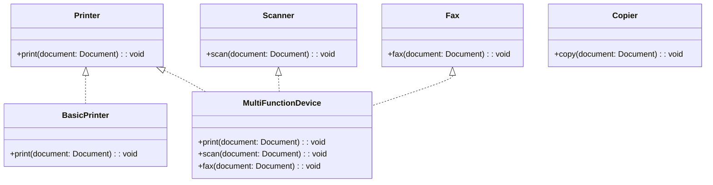

## 2.1.4 Interface Segregation Principle

In the world of object-oriented programming, design principles guide us in creating robust, maintainable, and scalable systems. One such principle, the Interface Segregation Principle (ISP), is a cornerstone of the SOLID principles. It emphasizes the importance of designing interfaces that are client-specific and not overly broad. Let's delve into the Interface Segregation Principle, understand its significance, and explore how it can be implemented in JavaScript and TypeScript.

### Understanding the Interface Segregation Principle

The Interface Segregation Principle states that "clients should not be forced to depend on interfaces they do not use." This principle advocates for creating smaller, more focused interfaces rather than large, monolithic ones. By doing so, we ensure that implementing classes are not burdened with methods they don't need, leading to more flexible and decoupled code.

#### Importance of ISP in Interface Design

The primary goal of ISP is to reduce the impact of changes in the system. When an interface is too broad, any change to it can have a ripple effect on all implementing classes, even if they do not use the changed method. By adhering to ISP, we minimize these dependencies, making our codebase more resilient to change.

### Breaking Down Monolithic Interfaces

Let's consider an example to illustrate the problem with large interfaces. Imagine a `Printer` interface that includes methods for printing, scanning, faxing, and copying:

```typescript
interface Printer {
  print(document: Document): void;
  scan(document: Document): void;
  fax(document: Document): void;
  copy(document: Document): void;
}
```

In this scenario, any class that implements the `Printer` interface must provide implementations for all four methods, even if it only needs to print documents. This violates the Interface Segregation Principle.

#### Refactoring with ISP

To adhere to ISP, we should break down the `Printer` interface into smaller, more specific interfaces:

```typescript
interface Printer {
  print(document: Document): void;
}

interface Scanner {
  scan(document: Document): void;
}

interface Fax {
  fax(document: Document): void;
}

interface Copier {
  copy(document: Document): void;
}
```

Now, a class can implement only the interfaces it needs. For example, a basic printer class would only implement the `Printer` interface:

```typescript
class BasicPrinter implements Printer {
  print(document: Document): void {
    console.log("Printing document:", document);
  }
}
```

### Implementing ISP in TypeScript

TypeScript, with its robust type system, provides excellent support for implementing the Interface Segregation Principle. By using TypeScript's interfaces, we can define clear contracts for our classes and ensure they only implement the methods they require.

#### Example: A Multi-Function Device

Consider a multi-function device that can print, scan, and fax. With ISP, we can implement this device by combining the necessary interfaces:

```typescript
class MultiFunctionDevice implements Printer, Scanner, Fax {
  print(document: Document): void {
    console.log("Printing document:", document);
  }

  scan(document: Document): void {
    console.log("Scanning document:", document);
  }

  fax(document: Document): void {
    console.log("Faxing document:", document);
  }
}
```

This approach allows us to create flexible and reusable components. If we later decide to add a copying feature, we can simply implement the `Copier` interface without affecting the existing functionality.

### Benefits of ISP

The Interface Segregation Principle offers several benefits:

1. **Decoupling**: By reducing the dependencies between classes and interfaces, ISP promotes a more decoupled architecture. This makes it easier to modify or replace components without affecting the rest of the system.

2. **Flexibility**: Smaller interfaces allow for more flexible implementations. Classes can choose to implement only the interfaces they need, leading to more tailored and efficient solutions.

3. **Maintainability**: With ISP, changes to an interface are less likely to impact unrelated classes. This reduces the risk of introducing bugs when modifying the system.

4. **Testability**: Smaller, focused interfaces make it easier to write unit tests. Each interface can be tested independently, ensuring that all functionality is covered.

### Impact of ISP on Testing and Maintainability

The Interface Segregation Principle has a profound impact on testing and maintainability. By designing interfaces that are specific to the needs of the client, we reduce the complexity of our codebase. This, in turn, makes it easier to test individual components and maintain the system over time.

#### Testing with ISP

When interfaces are small and focused, testing becomes more straightforward. Each interface represents a specific piece of functionality, allowing us to write targeted tests. For example, we can test the `Printer` interface independently of the `Scanner` interface:

```typescript
describe('BasicPrinter', () => {
  it('should print documents', () => {
    const printer = new BasicPrinter();
    const document = new Document("Test Document");
    printer.print(document);
    // Add assertions to verify the print functionality
  });
});
```

#### Maintainability with ISP

Maintaining a codebase that adheres to ISP is more manageable. When changes are required, they are often localized to a specific interface and its implementing classes. This reduces the risk of unintended side effects and makes it easier to understand the impact of changes.

### Try It Yourself

To solidify your understanding of the Interface Segregation Principle, try modifying the code examples provided. For instance, create a new interface for a `NetworkPrinter` that combines printing and faxing capabilities. Implement a class that uses this interface and test its functionality.

### Visualizing ISP

To better understand the Interface Segregation Principle, let's visualize the relationship between interfaces and classes using a class diagram.



This diagram illustrates how the `MultiFunctionDevice` class implements multiple interfaces, while the `BasicPrinter` class only implements the `Printer` interface.

### References and Further Reading

For more information on the Interface Segregation Principle and related topics, consider exploring the following resources:

- [SOLID Principles on Wikipedia](https://en.wikipedia.org/wiki/SOLID)
- [TypeScript Handbook](https://www.typescriptlang.org/docs/handbook/intro.html)
- [MDN Web Docs: Interfaces](https://developer.mozilla.org/en-US/docs/Learn/JavaScript/Objects/Object-oriented_JS#interfaces)

### Knowledge Check

To reinforce your understanding of the Interface Segregation Principle, consider the following questions:

1. What is the primary goal of the Interface Segregation Principle?
2. How does ISP improve maintainability in a codebase?
3. What are the benefits of breaking down large interfaces into smaller ones?
4. How does TypeScript support the implementation of ISP?
5. What impact does ISP have on testing?

### Embrace the Journey

Remember, mastering the Interface Segregation Principle is just one step in your journey to becoming a proficient developer. As you continue to explore design patterns and principles, you'll gain the skills needed to create more robust and maintainable systems. Keep experimenting, stay curious, and enjoy the journey!

## Quiz Time!



### What is the primary goal of the Interface Segregation Principle?

- [x] To ensure clients are not forced to depend on interfaces they do not use.
- [ ] To create as many interfaces as possible.
- [ ] To ensure all classes implement all available interfaces.
- [ ] To reduce the number of classes in a system.

> **Explanation:** The Interface Segregation Principle aims to ensure that clients are not forced to depend on interfaces they do not use, promoting more focused and specific interfaces.

### How does the Interface Segregation Principle improve maintainability?

- [x] By reducing dependencies between classes and interfaces.
- [ ] By increasing the number of methods in each interface.
- [ ] By forcing all classes to implement all methods.
- [ ] By making interfaces more complex.

> **Explanation:** ISP improves maintainability by reducing dependencies between classes and interfaces, making it easier to change and maintain the system.

### What is a benefit of breaking down large interfaces into smaller ones?

- [x] It allows classes to implement only the interfaces they need.
- [ ] It increases the complexity of the codebase.
- [ ] It forces all classes to implement all interfaces.
- [ ] It makes the codebase harder to understand.

> **Explanation:** Breaking down large interfaces into smaller ones allows classes to implement only the interfaces they need, leading to more tailored and efficient solutions.

### How does TypeScript support the implementation of ISP?

- [x] By allowing the creation of multiple, smaller interfaces.
- [ ] By forcing all classes to implement all interfaces.
- [ ] By not supporting interfaces at all.
- [ ] By making interfaces optional.

> **Explanation:** TypeScript supports ISP by allowing the creation of multiple, smaller interfaces, enabling more focused and specific implementations.

### What impact does ISP have on testing?

- [x] It makes testing more straightforward by allowing targeted tests for each interface.
- [ ] It complicates testing by increasing the number of interfaces.
- [ ] It has no impact on testing.
- [ ] It makes testing more difficult by requiring all interfaces to be tested together.

> **Explanation:** ISP makes testing more straightforward by allowing targeted tests for each interface, ensuring that all functionality is covered.

### Which of the following is an example of violating ISP?

- [x] A class implementing methods it does not use.
- [ ] A class implementing only the methods it needs.
- [ ] A class using multiple smaller interfaces.
- [ ] A class with no interfaces at all.

> **Explanation:** Violating ISP occurs when a class implements methods it does not use, leading to unnecessary dependencies.

### What is the result of adhering to ISP in terms of flexibility?

- [x] Increased flexibility due to more focused interfaces.
- [ ] Decreased flexibility due to more interfaces.
- [ ] No change in flexibility.
- [ ] Increased complexity due to more interfaces.

> **Explanation:** Adhering to ISP increases flexibility by providing more focused interfaces, allowing for more tailored implementations.

### Why is it important to have smaller, more specific interfaces?

- [x] To reduce the impact of changes in the system.
- [ ] To increase the number of methods in each interface.
- [ ] To ensure all classes implement all methods.
- [ ] To make the codebase more complex.

> **Explanation:** Smaller, more specific interfaces reduce the impact of changes in the system, making it more resilient to change.

### What is a key characteristic of a well-designed interface according to ISP?

- [x] It is specific to the needs of the client.
- [ ] It includes as many methods as possible.
- [ ] It is implemented by all classes.
- [ ] It is complex and broad.

> **Explanation:** A well-designed interface according to ISP is specific to the needs of the client, promoting more focused and efficient implementations.

### True or False: ISP encourages the creation of large, monolithic interfaces.

- [ ] True
- [x] False

> **Explanation:** False. ISP discourages the creation of large, monolithic interfaces and instead promotes smaller, more focused interfaces.


