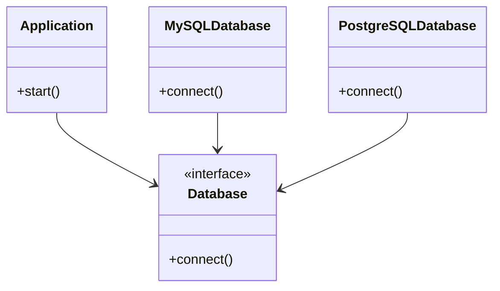

## 2.1.5 Dependency Inversion Principle

The Dependency Inversion Principle (DIP) is a cornerstone of the SOLID principles, which guide us in writing clean, maintainable, and scalable code. By adhering to DIP, we can significantly reduce coupling between high-level and low-level modules, thereby enhancing the flexibility and testability of our applications. In this section, we will delve into the intricacies of DIP, explore how to implement it using JavaScript and TypeScript, and understand its benefits in the context of software development.

### Understanding the Dependency Inversion Principle

**Definition**: The Dependency Inversion Principle states that high-level modules should not depend on low-level modules. Instead, both should depend on abstractions (e.g., interfaces or abstract classes). This principle is crucial for reducing the tight coupling between different parts of a system, allowing for easier maintenance and scalability.

**Significance**: By inverting dependencies, we ensure that high-level modules are not directly tied to the concrete implementations of low-level modules. This separation allows us to change or replace low-level modules without affecting the high-level modules, leading to more robust and adaptable systems.

### Inverting Dependencies with Interfaces and Abstract Classes

To implement DIP, we need to introduce abstractions that both high-level and low-level modules can depend on. Let's explore how to achieve this using interfaces and abstract classes in JavaScript and TypeScript.

#### JavaScript Example

In JavaScript, we can use constructor functions or ES6 classes to create abstractions. However, since JavaScript does not have built-in support for interfaces, we rely on conventions to achieve similar results.

```javascript
// Define an abstraction using a constructor function
function Database() {}

Database.prototype.connect = function() {
  throw new Error("This method must be overridden!");
};

// Low-level module
function MySQLDatabase() {}

MySQLDatabase.prototype = Object.create(Database.prototype);

MySQLDatabase.prototype.connect = function() {
  console.log("Connecting to MySQL database...");
};

// High-level module
function Application(database) {
  this.database = database;
}

Application.prototype.start = function() {
  this.database.connect();
  console.log("Application started.");
};

// Usage
const mySQLDatabase = new MySQLDatabase();
const app = new Application(mySQLDatabase);
app.start();
```

In this example, the `Database` constructor function acts as an abstraction that both the high-level `Application` and low-level `MySQLDatabase` depend on. The `Application` can work with any database that implements the `connect` method.

#### TypeScript Example

TypeScript provides a more robust way to define interfaces, making it easier to implement DIP.

```typescript
// Define an abstraction using an interface
interface Database {
  connect(): void;
}

// Low-level module
class MySQLDatabase implements Database {
  connect(): void {
    console.log("Connecting to MySQL database...");
  }
}

// High-level module
class Application {
  private database: Database;

  constructor(database: Database) {
    this.database = database;
  }

  start(): void {
    this.database.connect();
    console.log("Application started.");
  }
}

// Usage
const mySQLDatabase = new MySQLDatabase();
const app = new Application(mySQLDatabase);
app.start();
```

In TypeScript, the `Database` interface serves as the abstraction. Both `MySQLDatabase` and `Application` depend on this interface, allowing for easy substitution of different database implementations.

### Dependency Injection Techniques

Dependency Injection (DI) is a technique used to achieve DIP by providing dependencies to a class rather than having the class create them itself. This approach enhances modularity and testability.

#### Constructor Injection

Constructor injection is a common DI technique where dependencies are passed to a class through its constructor.

```typescript
class Logger {
  log(message: string): void {
    console.log(message);
  }
}

class Service {
  private logger: Logger;

  constructor(logger: Logger) {
    this.logger = logger;
  }

  performAction(): void {
    this.logger.log("Action performed.");
  }
}

// Usage
const logger = new Logger();
const service = new Service(logger);
service.performAction();
```

In this example, the `Service` class receives a `Logger` instance through its constructor, adhering to DIP by depending on an abstraction.

#### Setter Injection

Setter injection involves providing dependencies through setter methods.

```typescript
class ConfigurableService {
  private logger: Logger | null = null;

  setLogger(logger: Logger): void {
    this.logger = logger;
  }

  performAction(): void {
    if (this.logger) {
      this.logger.log("Action performed.");
    }
  }
}

// Usage
const configurableService = new ConfigurableService();
configurableService.setLogger(logger);
configurableService.performAction();
```

Setter injection allows for more flexibility, as dependencies can be changed at runtime.

### Benefits of the Dependency Inversion Principle

Implementing DIP offers several advantages, particularly in terms of testing and code flexibility.

#### Enhanced Testability

By inverting dependencies, we can easily substitute real implementations with mock objects during testing. This capability simplifies unit testing and allows us to isolate components for more effective testing.

```typescript
// Mock implementation for testing
class MockDatabase implements Database {
  connect(): void {
    console.log("Mock database connected.");
  }
}

// Test
const mockDatabase = new MockDatabase();
const testApp = new Application(mockDatabase);
testApp.start();
```

In this test scenario, we use a `MockDatabase` to verify the behavior of the `Application` without relying on a real database connection.

#### Increased Flexibility and Maintainability

DIP facilitates the replacement or modification of low-level modules without impacting high-level modules. This flexibility is crucial for maintaining and scaling applications over time.

```typescript
// New low-level module
class PostgreSQLDatabase implements Database {
  connect(): void {
    console.log("Connecting to PostgreSQL database...");
  }
}

// Usage
const postgreSQLDatabase = new PostgreSQLDatabase();
const appWithPostgres = new Application(postgreSQLDatabase);
appWithPostgres.start();
```

By introducing a new `PostgreSQLDatabase` class, we can easily switch the database implementation without altering the `Application` class.

### DIP and Other SOLID Principles

DIP complements other SOLID principles by promoting a design that is both flexible and robust.

- **Single Responsibility Principle (SRP)**: By depending on abstractions, classes can focus on a single responsibility without being concerned with the details of other modules.
- **Open/Closed Principle (OCP)**: DIP allows modules to be open for extension by introducing new implementations of abstractions, while remaining closed for modification.
- **Liskov Substitution Principle (LSP)**: By relying on abstractions, we ensure that derived classes can be substituted for base classes without affecting the correctness of the program.
- **Interface Segregation Principle (ISP)**: DIP encourages the use of specific interfaces, ensuring that classes only depend on the methods they actually use.

### Visualizing Dependency Inversion

To better understand the concept of dependency inversion, let's visualize the relationships between high-level and low-level modules using a class diagram.



**Diagram Description**: This class diagram illustrates how the `Application` class depends on the `Database` interface, while `MySQLDatabase` and `PostgreSQLDatabase` implement this interface. This setup allows the `Application` to interact with any database implementation that adheres to the `Database` interface.

### Try It Yourself

To deepen your understanding of DIP, try modifying the code examples provided:

1. **Create a new database implementation**: Add a new class that implements the `Database` interface, such as `SQLiteDatabase`, and integrate it with the `Application` class.

2. **Experiment with different injection techniques**: Modify the `Service` class to use setter injection instead of constructor injection, and observe how it affects the code structure.

3. **Implement a mock logger**: Create a mock implementation of the `Logger` class and use it to test the `Service` class.

### References and Further Reading

- [MDN Web Docs: JavaScript Classes](https://developer.mozilla.org/en-US/docs/Web/JavaScript/Reference/Classes)
- [TypeScript Handbook: Interfaces](https://www.typescriptlang.org/docs/handbook/interfaces.html)
- [SOLID Principles Explained](https://www.baeldung.com/solid-principles)

### Knowledge Check

Before moving on, take a moment to reflect on what you've learned. Consider how DIP can be applied to your current projects and how it might improve your code's flexibility and testability.

### Embrace the Journey

Remember, mastering design principles like DIP is an ongoing journey. As you continue to explore and apply these concepts, you'll find new ways to enhance your code and tackle complex challenges. Keep experimenting, stay curious, and enjoy the process!

## Quiz Time!



### What is the main goal of the Dependency Inversion Principle?

- [x] To reduce coupling between high-level and low-level modules
- [ ] To increase the number of dependencies in a system
- [ ] To ensure all modules depend on concrete implementations
- [ ] To eliminate the use of interfaces

> **Explanation:** The Dependency Inversion Principle aims to reduce coupling by ensuring high-level modules do not depend on low-level modules, but rather both depend on abstractions.

### Which of the following is a technique used to implement DIP?

- [x] Dependency Injection
- [ ] Hardcoding dependencies
- [ ] Using global variables
- [ ] Directly instantiating objects within classes

> **Explanation:** Dependency Injection is a technique that allows us to provide dependencies to a class, adhering to DIP by depending on abstractions rather than concrete implementations.

### How does DIP enhance testability?

- [x] By allowing the use of mock objects in place of real implementations
- [ ] By making it difficult to isolate components
- [ ] By increasing the complexity of the code
- [ ] By requiring more dependencies

> **Explanation:** DIP enhances testability by enabling the substitution of real implementations with mock objects, allowing for isolated and effective unit testing.

### What is constructor injection?

- [x] A technique where dependencies are passed through a class constructor
- [ ] A method of creating dependencies within a class
- [ ] A way to remove dependencies from a class
- [ ] A process of hardcoding dependencies

> **Explanation:** Constructor injection involves passing dependencies to a class through its constructor, promoting adherence to DIP.

### Which SOLID principle does DIP complement by promoting the use of specific interfaces?

- [x] Interface Segregation Principle (ISP)
- [ ] Single Responsibility Principle (SRP)
- [ ] Open/Closed Principle (OCP)
- [ ] Liskov Substitution Principle (LSP)

> **Explanation:** DIP complements the Interface Segregation Principle by encouraging the use of specific interfaces, ensuring classes depend only on the methods they need.

### What is the role of the `Database` interface in the provided TypeScript example?

- [x] It serves as an abstraction that both high-level and low-level modules depend on
- [ ] It is a concrete implementation of a database
- [ ] It directly connects to a database
- [ ] It is used to store data

> **Explanation:** The `Database` interface acts as an abstraction, allowing both high-level and low-level modules to depend on it, adhering to DIP.

### How does DIP facilitate adherence to the Open/Closed Principle?

- [x] By allowing modules to be open for extension with new implementations
- [ ] By requiring modifications to existing modules
- [ ] By increasing the number of dependencies
- [ ] By eliminating the need for interfaces

> **Explanation:** DIP facilitates adherence to the Open/Closed Principle by allowing modules to be extended with new implementations of abstractions, without modifying existing code.

### What is the benefit of using setter injection?

- [x] It allows dependencies to be changed at runtime
- [ ] It makes it harder to change dependencies
- [ ] It increases the coupling between modules
- [ ] It eliminates the need for interfaces

> **Explanation:** Setter injection provides flexibility by allowing dependencies to be changed at runtime, adhering to DIP.

### In the context of DIP, what is an abstraction?

- [x] An interface or abstract class that high-level and low-level modules depend on
- [ ] A concrete implementation of a module
- [ ] A global variable used by multiple modules
- [ ] A method that directly interacts with a database

> **Explanation:** An abstraction, such as an interface or abstract class, is a key component of DIP, allowing both high-level and low-level modules to depend on it rather than concrete implementations.

### True or False: DIP requires that all modules depend on concrete implementations.

- [ ] True
- [x] False

> **Explanation:** False. DIP requires that modules depend on abstractions rather than concrete implementations, reducing coupling and enhancing flexibility.


