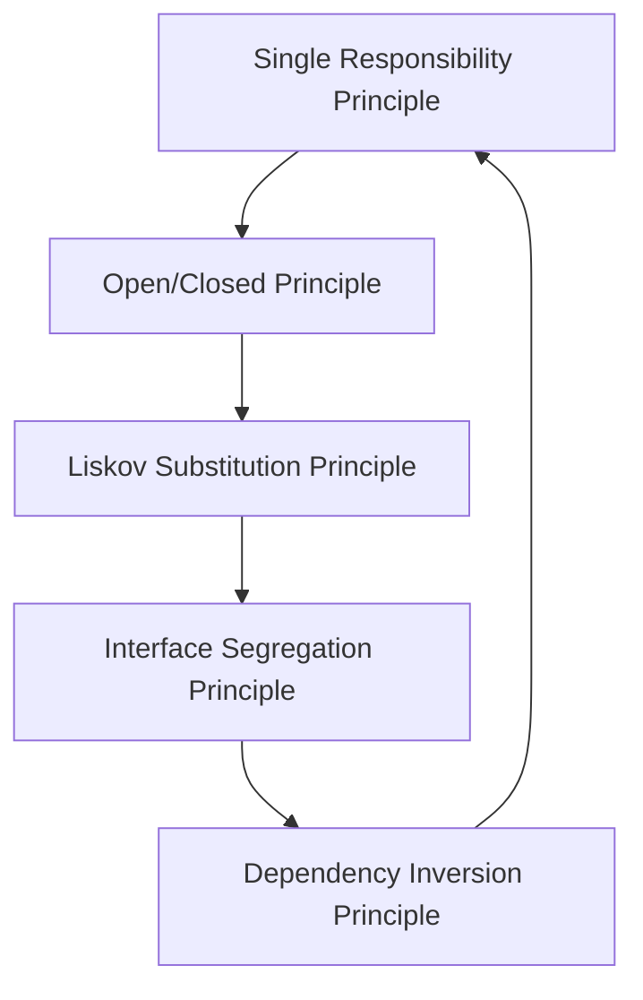

## 2.1 SOLID Principles Overview

In the world of software development, creating robust, maintainable, and scalable code is a primary goal. The SOLID principles, a set of five design principles, serve as a foundation for achieving this goal in object-oriented programming (OOP). These principles guide developers in structuring their code to be more understandable, flexible, and easier to maintain. In this section, we will delve into each of the SOLID principles, explore their significance, and demonstrate their application in JavaScript and TypeScript.

### Understanding SOLID Principles

The SOLID principles were introduced by Robert C. Martin, also known as "Uncle Bob," and they have become a cornerstone in the field of software engineering. The acronym SOLID stands for:

1. **Single Responsibility Principle (SRP)**
2. **Open/Closed Principle (OCP)**
3. **Liskov Substitution Principle (LSP)**
4. **Interface Segregation Principle (ISP)**
5. **Dependency Inversion Principle (DIP)**

By adhering to these principles, developers can create systems that are easier to manage, extend, and refactor. Let's explore each principle in detail.

### 1. Single Responsibility Principle (SRP)

**Definition**: A class should have only one reason to change, meaning it should have only one job or responsibility.

The Single Responsibility Principle emphasizes that a class should focus on a single task or functionality. This principle helps in reducing the complexity of the code by ensuring that each class is responsible for a specific aspect of the application. By doing so, changes in one part of the application are less likely to affect other parts, making the code more robust and easier to maintain.

#### Example in JavaScript

```javascript
// Before applying SRP
class UserSettings {
  constructor(user) {
    this.user = user;
  }

  changeEmail(newEmail) {
    if (this.verifyEmail(newEmail)) {
      this.user.email = newEmail;
    }
  }

  verifyEmail(email) {
    // Verification logic
    return email.includes('@');
  }
}

// After applying SRP
class UserSettings {
  constructor(user) {
    this.user = user;
  }

  changeEmail(newEmail) {
    if (EmailVerifier.verify(newEmail)) {
      this.user.email = newEmail;
    }
  }
}

class EmailVerifier {
  static verify(email) {
    // Verification logic
    return email.includes('@');
  }
}
```

In the example above, the `UserSettings` class initially had two responsibilities: changing the email and verifying it. By applying SRP, we extracted the email verification logic into a separate `EmailVerifier` class.

#### Importance of SRP

- **Improved Readability**: Classes with a single responsibility are easier to understand.
- **Enhanced Maintainability**: Changes to one responsibility do not affect others.
- **Facilitated Testing**: Smaller classes with focused responsibilities are easier to test.

### 2. Open/Closed Principle (OCP)

**Definition**: Software entities (classes, modules, functions, etc.) should be open for extension but closed for modification.

The Open/Closed Principle encourages developers to design software that can be extended without altering existing code. This is achieved by using abstractions, such as interfaces or abstract classes, which allow new functionality to be added through inheritance or composition.

#### Example in TypeScript

```typescript
// Before applying OCP
class Rectangle {
  constructor(public width: number, public height: number) {}

  area(): number {
    return this.width * this.height;
  }
}

class AreaCalculator {
  calculateArea(shape: Rectangle): number {
    return shape.area();
  }
}

// After applying OCP
interface Shape {
  area(): number;
}

class Rectangle implements Shape {
  constructor(public width: number, public height: number) {}

  area(): number {
    return this.width * this.height;
  }
}

class Circle implements Shape {
  constructor(public radius: number) {}

  area(): number {
    return Math.PI * this.radius * this.radius;
  }
}

class AreaCalculator {
  calculateArea(shape: Shape): number {
    return shape.area();
  }
}
```

By introducing a `Shape` interface, we can extend the functionality of the `AreaCalculator` without modifying its code. New shapes can be added by implementing the `Shape` interface.

#### Importance of OCP

- **Reduced Risk**: Existing code remains unchanged, minimizing the risk of introducing bugs.
- **Increased Flexibility**: New features can be added easily.
- **Enhanced Scalability**: The system can grow without significant refactoring.

### 3. Liskov Substitution Principle (LSP)

**Definition**: Objects of a superclass should be replaceable with objects of a subclass without affecting the correctness of the program.

The Liskov Substitution Principle ensures that a subclass can stand in for its superclass without altering the desirable properties of the program. This principle is crucial for achieving polymorphism in OOP.

#### Example in TypeScript

```typescript
// Before applying LSP
class Bird {
  fly(): string {
    return "Flying";
  }
}

class Penguin extends Bird {
  fly(): string {
    throw new Error("Penguins can't fly");
  }
}

// After applying LSP
class Bird {
  fly(): string {
    return "Flying";
  }
}

class FlyingBird extends Bird {}

class NonFlyingBird extends Bird {
  fly(): string {
    return "This bird can't fly";
  }
}

class Penguin extends NonFlyingBird {}
```

In the initial example, substituting a `Penguin` for a `Bird` would break the program. By refactoring the hierarchy, we ensure that all subclasses conform to the expected behavior.

#### Importance of LSP

- **Ensures Correctness**: Subtypes can be used interchangeably with their supertypes.
- **Facilitates Reusability**: Code that works with a superclass can work with any subclass.
- **Promotes Robustness**: Prevents unexpected behavior when using polymorphism.

### 4. Interface Segregation Principle (ISP)

**Definition**: Clients should not be forced to depend on interfaces they do not use.

The Interface Segregation Principle advocates for creating smaller, more specific interfaces rather than large, general-purpose ones. This principle helps in reducing the complexity of the code and ensures that classes only implement the methods they need.

#### Example in TypeScript

```typescript
// Before applying ISP
interface Machine {
  print(): void;
  scan(): void;
  fax(): void;
}

class MultiFunctionPrinter implements Machine {
  print(): void {
    console.log("Printing...");
  }

  scan(): void {
    console.log("Scanning...");
  }

  fax(): void {
    console.log("Faxing...");
  }
}

class OldPrinter implements Machine {
  print(): void {
    console.log("Printing...");
  }

  scan(): void {
    throw new Error("Scan not supported");
  }

  fax(): void {
    throw new Error("Fax not supported");
  }
}

// After applying ISP
interface Printer {
  print(): void;
}

interface Scanner {
  scan(): void;
}

interface Fax {
  fax(): void;
}

class MultiFunctionPrinter implements Printer, Scanner, Fax {
  print(): void {
    console.log("Printing...");
  }

  scan(): void {
    console.log("Scanning...");
  }

  fax(): void {
    console.log("Faxing...");
  }
}

class OldPrinter implements Printer {
  print(): void {
    console.log("Printing...");
  }
}
```

By splitting the `Machine` interface into smaller interfaces, we ensure that classes only implement the methods they need.

#### Importance of ISP

- **Reduces Complexity**: Smaller interfaces are easier to understand and implement.
- **Enhances Flexibility**: Classes can implement only the interfaces they need.
- **Improves Maintainability**: Changes to one interface do not affect unrelated classes.

### 5. Dependency Inversion Principle (DIP)

**Definition**: High-level modules should not depend on low-level modules. Both should depend on abstractions. Abstractions should not depend on details. Details should depend on abstractions.

The Dependency Inversion Principle encourages the use of abstractions to decouple high-level and low-level modules. This principle is fundamental for achieving a flexible and scalable architecture.

#### Example in TypeScript

```typescript
// Before applying DIP
class LightBulb {
  turnOn(): void {
    console.log("LightBulb is on");
  }

  turnOff(): void {
    console.log("LightBulb is off");
  }
}

class Switch {
  private bulb: LightBulb;

  constructor(bulb: LightBulb) {
    this.bulb = bulb;
  }

  operate(): void {
    this.bulb.turnOn();
  }
}

// After applying DIP
interface Switchable {
  turnOn(): void;
  turnOff(): void;
}

class LightBulb implements Switchable {
  turnOn(): void {
    console.log("LightBulb is on");
  }

  turnOff(): void {
    console.log("LightBulb is off");
  }
}

class Switch {
  private device: Switchable;

  constructor(device: Switchable) {
    this.device = device;
  }

  operate(): void {
    this.device.turnOn();
  }
}
```

By introducing the `Switchable` interface, we decouple the `Switch` class from the `LightBulb` class, allowing any switchable device to be used.

#### Importance of DIP

- **Promotes Flexibility**: High-level modules are not tied to specific implementations.
- **Enhances Testability**: Dependencies can be easily mocked or replaced.
- **Facilitates Maintenance**: Changes to low-level modules do not affect high-level modules.

### The Role of SOLID Principles in Design Patterns

Adhering to SOLID principles complements the use of design patterns by providing a strong foundation for building flexible and maintainable systems. Design patterns often rely on these principles to solve common design problems effectively. For instance:

- **SRP** is often a prerequisite for patterns like the **Decorator** or **Strategy**, where classes are designed to have specific responsibilities.
- **OCP** is central to patterns like **Factory Method** or **Observer**, where new functionality can be added without altering existing code.
- **LSP** ensures that patterns like **Template Method** or **Composite** can be used without breaking the program's logic.
- **ISP** supports patterns like **Adapter** or **Proxy**, where interfaces are tailored to specific needs.
- **DIP** is crucial for patterns like **Dependency Injection**, where high-level modules rely on abstractions rather than concrete implementations.

### Relevance of SOLID Principles in JavaScript and TypeScript

While SOLID principles originated in the context of classical OOP languages like Java or C#, they are equally relevant in JavaScript and TypeScript. These languages, especially TypeScript with its type system, provide the tools necessary to implement SOLID principles effectively.

- **JavaScript**: Although JavaScript is a prototype-based language, it supports OOP concepts such as classes and inheritance, allowing developers to apply SOLID principles.
- **TypeScript**: With its static typing and interfaces, TypeScript enhances JavaScript's capabilities, making it easier to adhere to SOLID principles and create robust applications.

### Visualizing SOLID Principles

To better understand the relationships and flow of SOLID principles, let's visualize them using a Mermaid.js diagram:



**Diagram Description**: This flowchart illustrates how each SOLID principle builds upon the previous one, creating a cohesive framework for designing robust systems.

### Try It Yourself

To deepen your understanding of SOLID principles, try modifying the examples provided:

- **SRP**: Add a new responsibility to the `UserSettings` class and refactor it to adhere to SRP.
- **OCP**: Extend the `Shape` interface with a new shape and update the `AreaCalculator` to handle it.
- **LSP**: Create a new subclass of `Bird` and ensure it adheres to LSP.
- **ISP**: Design a new class that implements only the necessary interfaces.
- **DIP**: Introduce a new switchable device and integrate it with the `Switch` class.

### Knowledge Check

Let's reinforce what we've learned with a few questions and exercises.

1. **Question**: What is the primary goal of the Single Responsibility Principle?
2. **Exercise**: Refactor a class with multiple responsibilities into separate classes.
3. **Question**: How does the Open/Closed Principle enhance code flexibility?
4. **Exercise**: Implement a new feature in a class without modifying its existing code.
5. **Question**: Why is the Liskov Substitution Principle important for polymorphism?
6. **Exercise**: Create a subclass that can replace its superclass without altering program behavior.
7. **Question**: How does the Interface Segregation Principle reduce code complexity?
8. **Exercise**: Split a large interface into smaller, more specific interfaces.
9. **Question**: What is the significance of the Dependency Inversion Principle in software design?
10. **Exercise**: Refactor a class to depend on abstractions rather than concrete implementations.

### Embrace the Journey

Remember, mastering SOLID principles is a journey. As you continue to apply these principles, you'll find your code becoming more robust, maintainable, and scalable. Keep experimenting, stay curious, and enjoy the process of becoming a more proficient developer!

## Quiz Time!



### What does the "S" in SOLID stand for?

- [x] Single Responsibility Principle
- [ ] Simple Responsibility Principle
- [ ] Single Role Principle
- [ ] Simple Role Principle

> **Explanation:** The "S" in SOLID stands for the Single Responsibility Principle, which states that a class should have only one reason to change.

### Which principle states that software entities should be open for extension but closed for modification?

- [ ] Single Responsibility Principle
- [x] Open/Closed Principle
- [ ] Liskov Substitution Principle
- [ ] Interface Segregation Principle

> **Explanation:** The Open/Closed Principle states that software entities should be open for extension but closed for modification.

### What is the main focus of the Liskov Substitution Principle?

- [ ] Reducing dependencies
- [ ] Creating small interfaces
- [x] Ensuring subclasses can replace superclasses
- [ ] Extending functionality

> **Explanation:** The Liskov Substitution Principle focuses on ensuring that subclasses can replace superclasses without affecting the correctness of the program.

### Which principle encourages the use of smaller, more specific interfaces?

- [ ] Single Responsibility Principle
- [ ] Open/Closed Principle
- [ ] Liskov Substitution Principle
- [x] Interface Segregation Principle

> **Explanation:** The Interface Segregation Principle encourages the use of smaller, more specific interfaces to reduce complexity and dependencies.

### What does the Dependency Inversion Principle emphasize?

- [x] Relying on abstractions rather than concrete implementations
- [ ] Using large interfaces
- [ ] Modifying existing code for new features
- [ ] Creating multiple responsibilities for classes

> **Explanation:** The Dependency Inversion Principle emphasizes relying on abstractions rather than concrete implementations to promote flexibility and maintainability.

### How does the Single Responsibility Principle improve code?

- [x] By ensuring classes have only one responsibility
- [ ] By creating large interfaces
- [ ] By modifying existing code
- [ ] By reducing flexibility

> **Explanation:** The Single Responsibility Principle improves code by ensuring that classes have only one responsibility, making them easier to understand and maintain.

### Which principle is crucial for achieving polymorphism in OOP?

- [ ] Single Responsibility Principle
- [ ] Open/Closed Principle
- [x] Liskov Substitution Principle
- [ ] Interface Segregation Principle

> **Explanation:** The Liskov Substitution Principle is crucial for achieving polymorphism in OOP, as it ensures that subclasses can be used interchangeably with their superclasses.

### What is the benefit of the Open/Closed Principle?

- [x] It allows new functionality to be added without altering existing code.
- [ ] It reduces the number of classes.
- [ ] It creates larger interfaces.
- [ ] It increases dependencies.

> **Explanation:** The Open/Closed Principle allows new functionality to be added without altering existing code, enhancing flexibility and reducing the risk of introducing bugs.

### How does the Interface Segregation Principle enhance flexibility?

- [x] By allowing classes to implement only the interfaces they need
- [ ] By creating large, general-purpose interfaces
- [ ] By modifying existing code
- [ ] By increasing dependencies

> **Explanation:** The Interface Segregation Principle enhances flexibility by allowing classes to implement only the interfaces they need, reducing unnecessary dependencies.

### True or False: The Dependency Inversion Principle states that high-level modules should depend on low-level modules.

- [ ] True
- [x] False

> **Explanation:** False. The Dependency Inversion Principle states that high-level modules should not depend on low-level modules; both should depend on abstractions.


