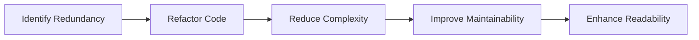

## 2.2 DRY and KISS Principles

In the realm of software development, the principles of "Don't Repeat Yourself" (DRY) and "Keep It Simple, Stupid" (KISS) are cornerstones for creating efficient, maintainable, and scalable code. These principles are not just theoretical concepts but practical guidelines that can significantly enhance the quality of your codebase. In this section, we will delve into these principles, exploring their definitions, importance, and practical applications in JavaScript and TypeScript.

### Understanding the DRY Principle

The DRY principle, coined by Andy Hunt and Dave Thomas in their book *The Pragmatic Programmer*, emphasizes the importance of reducing repetition in code. The core idea is simple: every piece of knowledge must have a single, unambiguous, authoritative representation within a system. In other words, avoid duplicating code or logic across your codebase.

#### Code Duplication: The Enemy of DRY

Code duplication can manifest in various forms, such as repeated logic, similar functions, or redundant data structures. This not only bloats the codebase but also makes maintenance a nightmare. Let's consider a simple example in JavaScript:

```javascript
// Example of code duplication
function calculateRectangleArea(width, height) {
    return width * height;
}

function calculateTriangleArea(base, height) {
    return 0.5 * base * height;
}

function calculateCircleArea(radius) {
    return Math.PI * radius * radius;
}
```

In the above code, we have three functions that calculate the area of different shapes. While they serve different purposes, the logic of calculating areas is repeated. This redundancy can be minimized by abstracting the common logic.

#### Refactoring to Eliminate Redundancy

Refactoring is the process of restructuring existing code without changing its external behavior. It helps in eliminating redundancy and adhering to the DRY principle. Let's refactor the above example:

```typescript
// Refactored code using DRY principle
type Shape = 'rectangle' | 'triangle' | 'circle';

function calculateArea(shape: Shape, ...dimensions: number[]): number {
    switch (shape) {
        case 'rectangle':
            return dimensions[0] * dimensions[1];
        case 'triangle':
            return 0.5 * dimensions[0] * dimensions[1];
        case 'circle':
            return Math.PI * Math.pow(dimensions[0], 2);
        default:
            throw new Error('Unknown shape');
    }
}
```

In this refactored code, we have a single function `calculateArea` that handles different shapes. This not only reduces duplication but also makes the code more flexible and easier to maintain.

### Understanding the KISS Principle

The KISS principle, often humorously expanded as "Keep It Simple, Stupid," advocates for simplicity in design. The idea is to avoid unnecessary complexity and ensure that code is easy to understand and modify. Simplicity is key to maintaining a clean and efficient codebase.

#### The Importance of Simplicity

Complex code can lead to several issues, such as increased likelihood of bugs, difficulty in understanding and modifying the code, and challenges in onboarding new developers. Let's examine an example of overcomplicated code:

```javascript
// Overcomplicated code
function processData(data) {
    if (data && Array.isArray(data)) {
        for (let i = 0; i < data.length; i++) {
            if (typeof data[i] === 'object' && data[i] !== null) {
                // Process each object
            }
        }
    }
}
```

The above code is unnecessarily complex due to nested conditions and loops. It can be simplified to improve readability and maintainability.

#### Simplifying Code with KISS

By applying the KISS principle, we can refactor the above code to make it more straightforward:

```typescript
// Simplified code using KISS principle
function processData(data: object[]) {
    data.forEach(item => {
        if (item) {
            // Process each object
        }
    });
}
```

This refactored code is simpler and more readable. It uses TypeScript's type annotations to ensure that `data` is an array of objects, eliminating the need for type checks.

### The Synergy of DRY and KISS

While DRY and KISS are distinct principles, they often complement each other. By reducing redundancy (DRY), you inherently simplify your code (KISS). Conversely, by keeping your code simple (KISS), you make it easier to identify and eliminate redundancy (DRY).

#### Practical Example: Combining DRY and KISS

Let's consider a practical example where both principles are applied:

```typescript
// Original code with duplication and complexity
function fetchData(url: string, method: string) {
    if (method === 'GET') {
        // Fetch data using GET
    } else if (method === 'POST') {
        // Fetch data using POST
    }
}

function handleResponse(response: any) {
    if (response.status === 200) {
        // Handle success
    } else if (response.status === 404) {
        // Handle not found
    }
}
```

In this code, we see both duplication and complexity. We can refactor it to adhere to DRY and KISS principles:

```typescript
// Refactored code using DRY and KISS principles
enum HttpMethod {
    GET = 'GET',
    POST = 'POST'
}

function fetchData(url: string, method: HttpMethod) {
    // Fetch data based on method
}

function handleResponse(response: Response) {
    switch (response.status) {
        case 200:
            // Handle success
            break;
        case 404:
            // Handle not found
            break;
        default:
            // Handle other statuses
    }
}
```

By using TypeScript's `enum` for HTTP methods and a `switch` statement for response handling, we reduce redundancy and simplify the logic.

### Visualizing DRY and KISS Principles

To better understand how DRY and KISS principles work together, let's visualize the process of refactoring code to adhere to these principles.



**Diagram Description**: This flowchart illustrates the process of applying DRY and KISS principles. It starts with identifying redundancy, followed by refactoring the code to reduce complexity, which in turn improves maintainability and enhances readability.

### Try It Yourself

To truly grasp the DRY and KISS principles, try refactoring some of your existing code. Look for areas of duplication and complexity, and apply the principles to simplify and streamline your code. Experiment with different approaches and observe how these principles can transform your codebase.

### References and Further Reading

- [MDN Web Docs: DRY Principle](https://developer.mozilla.org/en-US/docs/Glossary/DRY)
- [Wikipedia: KISS Principle](https://en.wikipedia.org/wiki/KISS_principle)
- [The Pragmatic Programmer: From Journeyman to Master](https://pragprog.com/titles/tpp20/the-pragmatic-programmer-20th-anniversary-edition/)

### Knowledge Check

To reinforce your understanding of the DRY and KISS principles, consider the following questions and challenges:

1. Identify a piece of code in your current project that violates the DRY principle. How can you refactor it?
2. Find an example of overcomplicated code. What steps can you take to simplify it?
3. How do DRY and KISS principles contribute to a more maintainable codebase?

### Embrace the Journey

Remember, mastering the DRY and KISS principles is a journey, not a destination. As you continue to develop your skills, you'll find new ways to apply these principles to create cleaner, more efficient code. Keep experimenting, stay curious, and enjoy the journey!

## Quiz Time!



### What does the DRY principle stand for?

- [x] Don't Repeat Yourself
- [ ] Do Repeat Yourself
- [ ] Don't Refactor Yourself
- [ ] Do Refactor Yourself

> **Explanation:** The DRY principle stands for "Don't Repeat Yourself," emphasizing the reduction of code duplication.

### Which of the following is a benefit of applying the DRY principle?

- [x] Reduces code duplication
- [ ] Increases code complexity
- [ ] Makes code harder to maintain
- [ ] Decreases code readability

> **Explanation:** Applying the DRY principle reduces code duplication, making the codebase easier to maintain and understand.

### What is the main goal of the KISS principle?

- [x] Keep It Simple, Stupid
- [ ] Keep It Sophisticated, Stupid
- [ ] Keep It Simple, Smart
- [ ] Keep It Sophisticated, Smart

> **Explanation:** The KISS principle stands for "Keep It Simple, Stupid," advocating for simplicity in code design.

### How can refactoring help in applying the DRY principle?

- [x] By eliminating code duplication
- [ ] By adding more code
- [ ] By increasing code complexity
- [ ] By making code less readable

> **Explanation:** Refactoring helps eliminate code duplication, thereby adhering to the DRY principle.

### Which of the following is an example of code duplication?

- [x] Repeated logic across multiple functions
- [ ] Using a single function for multiple tasks
- [ ] Abstracting common logic into a function
- [ ] Using type annotations for variables

> **Explanation:** Repeated logic across multiple functions is a form of code duplication, which the DRY principle aims to eliminate.

### What is a common issue with overcomplicated code?

- [x] Increased likelihood of bugs
- [ ] Improved readability
- [ ] Easier maintenance
- [ ] Faster execution

> **Explanation:** Overcomplicated code often leads to an increased likelihood of bugs and makes maintenance more challenging.

### How do DRY and KISS principles complement each other?

- [x] By reducing redundancy and simplifying code
- [ ] By increasing complexity and duplication
- [ ] By making code harder to understand
- [ ] By adding more features to the code

> **Explanation:** DRY and KISS principles complement each other by reducing redundancy and simplifying code, leading to a more maintainable codebase.

### What is the result of applying the KISS principle?

- [x] Simpler and more readable code
- [ ] More complex and harder to understand code
- [ ] Increased code duplication
- [ ] Decreased code efficiency

> **Explanation:** Applying the KISS principle results in simpler and more readable code, making it easier to maintain.

### Which principle emphasizes having a single, authoritative representation of knowledge in a system?

- [x] DRY
- [ ] KISS
- [ ] SOLID
- [ ] YAGNI

> **Explanation:** The DRY principle emphasizes having a single, authoritative representation of knowledge in a system to avoid duplication.

### True or False: The KISS principle encourages adding more features to make code more sophisticated.

- [ ] True
- [x] False

> **Explanation:** False. The KISS principle encourages simplicity and avoiding unnecessary complexity, not adding more features.


