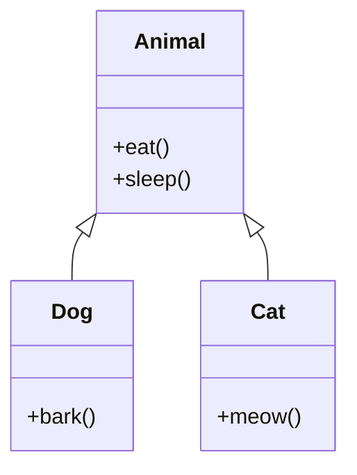
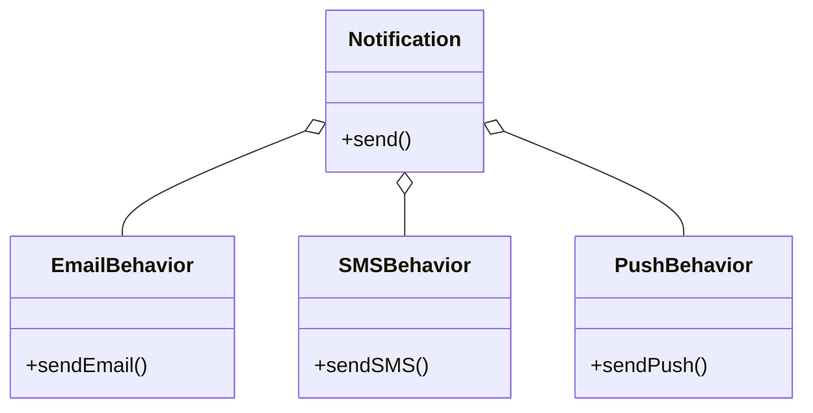

## 2.3 Composition Over Inheritance

In the realm of object-oriented programming, two fundamental concepts often come into play: inheritance and composition. These paradigms provide different approaches to building and structuring software systems. While inheritance has been a staple in object-oriented design, composition offers a more flexible and maintainable alternative. In this section, we will delve into the concept of composition, explore its advantages over inheritance, and demonstrate how to implement it in JavaScript and TypeScript.

### Understanding Composition and Inheritance

**Inheritance** is a mechanism where a new class is created from an existing class by extending its properties and behaviors. It allows for code reuse and the creation of hierarchical class structures. However, inheritance can lead to rigid and tightly coupled systems, especially when deep inheritance hierarchies are involved.

**Composition**, on the other hand, is a design principle that involves building complex objects by combining simpler ones. It focuses on assembling objects with specific functionalities rather than inheriting from a base class. This approach promotes flexibility and reusability, as components can be easily swapped or modified without affecting the entire system.

### Differences Between Composition and Inheritance

| Aspect          | Inheritance                                     | Composition                                    |
|-----------------|-------------------------------------------------|------------------------------------------------|
| Structure       | Hierarchical class structures                   | Object assembly using components               |
| Flexibility     | Rigid, tightly coupled                          | Flexible, loosely coupled                      |
| Reusability     | Limited to class hierarchies                    | High, components can be reused across systems  |
| Complexity      | Can lead to deep hierarchies                    | Simpler, flat structures                       |
| Modification    | Requires changes in base classes                | Components can be easily swapped or modified   |

### Advantages of Composition Over Inheritance

1. **Flexibility and Maintainability**: Composition allows for more flexible code structures. Components can be easily added, removed, or replaced without affecting the rest of the system. This makes maintenance and updates more manageable.

2. **Avoiding Deep Hierarchies**: Inheritance can lead to deep and complex class hierarchies, making the codebase difficult to understand and modify. Composition, by contrast, promotes flat and simple structures.

3. **Reusability**: Components in a composition-based design can be reused across different parts of the application or even in different projects, enhancing code reuse.

4. **Decoupling**: Composition encourages loose coupling between components, making it easier to isolate and test individual parts of the system.

### Implementing Composition in JavaScript

Let's explore how to implement composition in JavaScript with a practical example. Consider a scenario where we need to create different types of notifications (e.g., email, SMS, push notifications) with varying behaviors.

```javascript
// Define behavior components
const sendEmail = () => ({
  send: () => console.log("Sending email notification"),
});

const sendSMS = () => ({
  send: () => console.log("Sending SMS notification"),
});

const sendPush = () => ({
  send: () => console.log("Sending push notification"),
});

// Compose a notification object
const createNotification = (type) => {
  const notification = {};
  switch (type) {
    case "email":
      return Object.assign(notification, sendEmail());
    case "sms":
      return Object.assign(notification, sendSMS());
    case "push":
      return Object.assign(notification, sendPush());
    default:
      throw new Error("Invalid notification type");
  }
};

// Usage
const emailNotification = createNotification("email");
emailNotification.send(); // Output: Sending email notification

const smsNotification = createNotification("sms");
smsNotification.send(); // Output: Sending SMS notification
```

In this example, we define separate behavior components (`sendEmail`, `sendSMS`, `sendPush`) and compose them into a notification object using the `createNotification` function. This approach allows us to easily add new notification types or modify existing ones without altering the entire system.

### Implementing Composition in TypeScript

TypeScript's type system enhances composition by providing type safety and interfaces. Let's see how we can implement the same example in TypeScript.

```typescript
// Define behavior interfaces
interface SendBehavior {
  send: () => void;
}

// Implement behavior components
const sendEmail = (): SendBehavior => ({
  send: () => console.log("Sending email notification"),
});

const sendSMS = (): SendBehavior => ({
  send: () => console.log("Sending SMS notification"),
});

const sendPush = (): SendBehavior => ({
  send: () => console.log("Sending push notification"),
});

// Compose a notification object
const createNotification = (type: string): SendBehavior => {
  switch (type) {
    case "email":
      return sendEmail();
    case "sms":
      return sendSMS();
    case "push":
      return sendPush();
    default:
      throw new Error("Invalid notification type");
  }
};

// Usage
const emailNotification = createNotification("email");
emailNotification.send(); // Output: Sending email notification

const smsNotification = createNotification("sms");
smsNotification.send(); // Output: Sending SMS notification
```

Here, we define a `SendBehavior` interface to ensure that each behavior component implements the `send` method. This provides type safety and makes the code more robust.

### Design Patterns Leveraging Composition

Several design patterns leverage composition to achieve flexible and maintainable code structures. Let's explore a few of them:

#### Strategy Pattern

The Strategy Pattern defines a family of algorithms, encapsulates each one, and makes them interchangeable. It allows the algorithm to vary independently from the clients that use it.

```typescript
interface PaymentStrategy {
  pay: (amount: number) => void;
}

class CreditCardPayment implements PaymentStrategy {
  pay(amount: number) {
    console.log(`Paying ${amount} using Credit Card`);
  }
}

class PayPalPayment implements PaymentStrategy {
  pay(amount: number) {
    console.log(`Paying ${amount} using PayPal`);
  }
}

class ShoppingCart {
  private paymentStrategy: PaymentStrategy;

  constructor(paymentStrategy: PaymentStrategy) {
    this.paymentStrategy = paymentStrategy;
  }

  checkout(amount: number) {
    this.paymentStrategy.pay(amount);
  }
}

// Usage
const cart = new ShoppingCart(new CreditCardPayment());
cart.checkout(100); // Output: Paying 100 using Credit Card

const cart2 = new ShoppingCart(new PayPalPayment());
cart2.checkout(200); // Output: Paying 200 using PayPal
```

In this example, the `ShoppingCart` class uses a `PaymentStrategy` to handle payments. We can easily switch between different payment methods without modifying the `ShoppingCart` class.

#### Decorator Pattern

The Decorator Pattern allows behavior to be added to individual objects, either statically or dynamically, without affecting the behavior of other objects from the same class.

```typescript
interface Coffee {
  cost: () => number;
  description: () => string;
}

class SimpleCoffee implements Coffee {
  cost() {
    return 5;
  }

  description() {
    return "Simple coffee";
  }
}

class MilkDecorator implements Coffee {
  private coffee: Coffee;

  constructor(coffee: Coffee) {
    this.coffee = coffee;
  }

  cost() {
    return this.coffee.cost() + 1;
  }

  description() {
    return this.coffee.description() + ", milk";
  }
}

class SugarDecorator implements Coffee {
  private coffee: Coffee;

  constructor(coffee: Coffee) {
    this.coffee = coffee;
  }

  cost() {
    return this.coffee.cost() + 0.5;
  }

  description() {
    return this.coffee.description() + ", sugar";
  }
}

// Usage
let coffee: Coffee = new SimpleCoffee();
console.log(coffee.description() + ": $" + coffee.cost()); // Output: Simple coffee: $5

coffee = new MilkDecorator(coffee);
console.log(coffee.description() + ": $" + coffee.cost()); // Output: Simple coffee, milk: $6

coffee = new SugarDecorator(coffee);
console.log(coffee.description() + ": $" + coffee.cost()); // Output: Simple coffee, milk, sugar: $6.5
```

In this example, we use decorators to add milk and sugar to a simple coffee. The `MilkDecorator` and `SugarDecorator` classes enhance the functionality of the `SimpleCoffee` class without modifying its structure.

### When to Use Inheritance vs. Composition

While composition offers numerous advantages, there are situations where inheritance is appropriate:

- **Is-a Relationship**: Use inheritance when there is a clear "is-a" relationship between classes. For example, a `Dog` is a type of `Animal`.

- **Shared Behavior**: Inheritance is suitable when multiple classes share common behavior and properties that can be abstracted into a base class.

- **Frameworks and Libraries**: Some frameworks and libraries rely on inheritance to provide extensibility points and predefined behaviors.

In contrast, prefer composition when:

- **Flexibility is Required**: Use composition when you need to build flexible and adaptable systems that can evolve over time.

- **Avoiding Tight Coupling**: Composition is ideal when you want to avoid tight coupling between components and promote loose coupling.

- **Reusability and Modularity**: Choose composition when you want to create reusable and modular components that can be easily integrated into different parts of the application.

### Visualizing Composition vs. Inheritance

To better understand the differences between composition and inheritance, let's visualize these concepts using Mermaid.js diagrams.

#### Inheritance Hierarchy



In this diagram, `Dog` and `Cat` inherit from the `Animal` class, forming a hierarchical structure.

#### Composition Structure



In this diagram, the `Notification` class is composed of different behavior components (`EmailBehavior`, `SMSBehavior`, `PushBehavior`), illustrating a composition-based design.

### Try It Yourself

To reinforce your understanding of composition, try modifying the code examples provided:

- Add a new notification type, such as "in-app notification", and integrate it into the existing composition structure.
- Implement a new decorator for the coffee example, such as "whipped cream", and see how it affects the final cost and description.
- Experiment with the strategy pattern by adding a new payment method, such as "BitcoinPayment", and test it with the `ShoppingCart` class.

### Knowledge Check

To ensure you've grasped the concepts of composition over inheritance, consider the following questions:

1. What are the key differences between composition and inheritance?
2. How does composition promote flexibility and maintainability in software design?
3. In what scenarios would you prefer inheritance over composition?
4. How can the strategy pattern leverage composition to achieve interchangeable behaviors?
5. What are the benefits of using the decorator pattern in a composition-based design?

### Conclusion

Composition over inheritance is a powerful principle in object-oriented design that promotes flexibility, reusability, and maintainability. By focusing on assembling objects with specific functionalities, you can build adaptable systems that are easy to modify and extend. While inheritance has its place, understanding when to use composition can lead to more robust and scalable software solutions.

## Quiz Time!



### What is a key advantage of composition over inheritance?

- [x] Flexibility in modifying components
- [ ] Simplicity in class hierarchies
- [ ] Easier to understand code
- [ ] Faster execution time

> **Explanation:** Composition allows for flexible modification of components without affecting the entire system.

### In which scenario is inheritance more appropriate than composition?

- [x] When there is a clear "is-a" relationship
- [ ] When you need to avoid tight coupling
- [ ] When building modular components
- [ ] When promoting loose coupling

> **Explanation:** Inheritance is suitable when there is a clear "is-a" relationship, such as a `Dog` being a type of `Animal`.

### Which design pattern leverages composition to achieve interchangeable behaviors?

- [x] Strategy Pattern
- [ ] Singleton Pattern
- [ ] Factory Method Pattern
- [ ] Observer Pattern

> **Explanation:** The Strategy Pattern uses composition to define a family of algorithms and make them interchangeable.

### What is the primary focus of composition in software design?

- [x] Assembling objects with specific functionalities
- [ ] Creating deep class hierarchies
- [ ] Sharing behavior across classes
- [ ] Implementing predefined behaviors

> **Explanation:** Composition focuses on assembling objects with specific functionalities to build complex systems.

### How does the decorator pattern enhance objects in a composition-based design?

- [x] By adding responsibilities dynamically
- [ ] By creating hierarchical structures
- [ ] By sharing common behavior
- [ ] By defining a family of algorithms

> **Explanation:** The Decorator Pattern allows for adding responsibilities to objects dynamically without modifying their classes.

### What is a potential drawback of deep inheritance hierarchies?

- [x] Increased complexity and rigidity
- [ ] Enhanced flexibility and reusability
- [ ] Easier to understand and maintain
- [ ] Faster execution and performance

> **Explanation:** Deep inheritance hierarchies can lead to increased complexity and rigidity, making the codebase difficult to maintain.

### Which pattern allows for behavior to be added to individual objects without affecting others?

- [x] Decorator Pattern
- [ ] Singleton Pattern
- [ ] Factory Method Pattern
- [ ] Observer Pattern

> **Explanation:** The Decorator Pattern allows for behavior to be added to individual objects without affecting others.

### What is a benefit of using interfaces in TypeScript for composition?

- [x] Ensuring type safety and robustness
- [ ] Simplifying code structure
- [ ] Reducing code duplication
- [ ] Enhancing performance

> **Explanation:** Interfaces in TypeScript provide type safety and ensure that components adhere to a specific contract.

### How does composition promote loose coupling in software design?

- [x] By allowing components to be easily swapped or modified
- [ ] By creating deep class hierarchies
- [ ] By sharing behavior across classes
- [ ] By implementing predefined behaviors

> **Explanation:** Composition promotes loose coupling by allowing components to be easily swapped or modified without affecting the entire system.

### True or False: Composition is always preferable over inheritance.

- [ ] True
- [x] False

> **Explanation:** While composition offers many advantages, there are scenarios where inheritance is more appropriate, such as when there is a clear "is-a" relationship.



Remember, this is just the beginning. As you progress, you'll build more complex and interactive systems. Keep experimenting, stay curious, and enjoy the journey!
