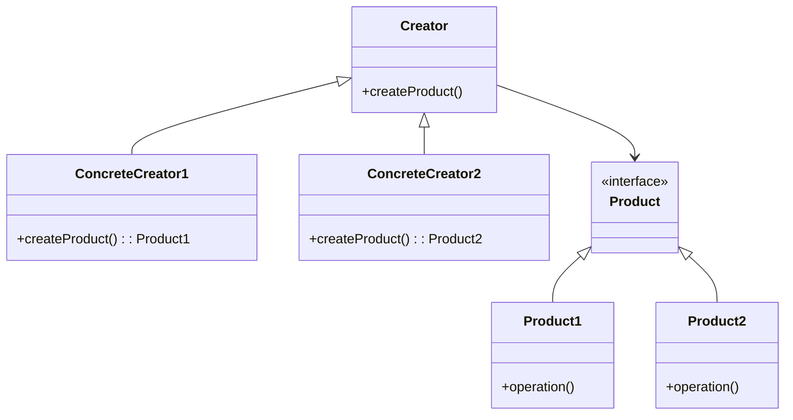

## 3.1 Overview of Creational Patterns

In the realm of software development, creating objects is a fundamental task. However, the way objects are created can significantly impact the flexibility and maintainability of a codebase. Creational design patterns offer solutions to control object creation processes, ensuring that they are efficient, scalable, and adaptable to different scenarios. In this section, we will delve into the world of creational patterns, exploring their purpose, the problems they solve, and how they contribute to writing more flexible and reusable code.

### Understanding Creational Patterns

Creational design patterns are a category of design patterns that deal with object creation mechanisms. These patterns abstract the instantiation process, allowing developers to create objects in a manner that is suitable for the situation at hand. The primary goal of creational patterns is to provide a way to decouple a client's code from the specific classes it needs to instantiate, thereby promoting flexibility and scalability.

By using creational patterns, developers can ensure that their code is not tightly coupled to specific implementations, making it easier to modify, extend, and maintain. This is particularly important in large-scale applications where changes in object creation logic can have widespread implications.

### The Purpose of Creational Patterns

The main purpose of creational patterns is to manage the complexity of object creation. In many cases, the process of creating an object can be intricate, involving multiple steps and dependencies. Creational patterns provide a structured approach to handle this complexity, allowing developers to focus on the higher-level design of their applications.

Moreover, creational patterns help in achieving the following objectives:

- **Encapsulation of Object Creation**: By encapsulating the object creation logic, creational patterns allow for more controlled and consistent instantiation of objects.
- **Decoupling of Code**: These patterns promote loose coupling by separating the creation of objects from their usage, making it easier to switch between different implementations.
- **Enhanced Flexibility**: Creational patterns enable the creation of objects in various ways, providing the flexibility to adapt to changing requirements.

### Creational Patterns Covered

In this section, we will explore the following creational patterns, each addressing specific problems related to object creation:

1. **Singleton Pattern**: Ensures that a class has only one instance and provides a global point of access to it. This pattern is useful in scenarios where a single instance is needed to coordinate actions across a system.

2. **Factory Method Pattern**: Defines an interface for creating objects but allows subclasses to alter the type of objects that will be created. This pattern is ideal for situations where a class cannot anticipate the class of objects it needs to create.

3. **Abstract Factory Pattern**: Provides an interface for creating families of related or dependent objects without specifying their concrete classes. This pattern is beneficial when a system needs to be independent of how its objects are created.

4. **Builder Pattern**: Separates the construction of a complex object from its representation, allowing the same construction process to create different representations. This pattern is suitable for constructing objects with numerous optional parameters.

5. **Prototype Pattern**: Creates new objects by copying existing ones, promoting the reuse of pre-existing objects. This pattern is useful when the cost of creating a new instance of an object is more expensive than copying an existing one.

### Problem Addressed by Each Pattern

- **Singleton Pattern**: Addresses the problem of ensuring that a class has only one instance, which is particularly useful for managing shared resources or configurations.

- **Factory Method Pattern**: Solves the issue of creating objects without specifying the exact class of object that will be created, allowing for more flexibility and scalability.

- **Abstract Factory Pattern**: Tackles the challenge of creating families of related objects without being tied to their concrete implementations, facilitating the interchangeability of product families.

- **Builder Pattern**: Deals with the complexity of constructing complex objects, enabling the creation of objects step-by-step with a clear separation between the construction and representation.

- **Prototype Pattern**: Addresses the need for creating new objects by copying existing ones, which is efficient when dealing with objects that are costly to create from scratch.

### Contribution to Flexible and Reusable Code

Creational patterns play a crucial role in enhancing the flexibility and reusability of code. By abstracting the object creation process, these patterns allow developers to write code that is more adaptable to change. Here are some ways in which creational patterns contribute to better code:

- **Improved Maintainability**: By decoupling object creation from the rest of the code, creational patterns make it easier to modify and extend the codebase without affecting existing functionality.

- **Enhanced Testability**: With creational patterns, it is easier to substitute different implementations during testing, leading to more robust and reliable tests.

- **Increased Scalability**: These patterns allow for the seamless addition of new object types and creation mechanisms, supporting the growth and evolution of the application.

- **Greater Reusability**: By providing a standardized way of creating objects, creational patterns promote the reuse of code across different parts of an application or even across different projects.

### Visualizing Creational Patterns

To better understand the relationships and interactions involved in creational patterns, let's visualize these concepts using diagrams. Below is a class diagram illustrating the general structure of creational patterns:



**Diagram Description**: This diagram represents a generic structure for creational patterns, where a `Creator` class defines a method for creating products, and concrete creators (`ConcreteCreator1` and `ConcreteCreator2`) implement this method to produce specific products (`Product1` and `Product2`).

### Code Examples

Let's explore some basic code examples to illustrate how creational patterns can be implemented in JavaScript and TypeScript.

#### Singleton Pattern Example

```javascript
// Singleton Pattern in JavaScript

class Singleton {
  constructor() {
    if (Singleton.instance) {
      return Singleton.instance;
    }
    Singleton.instance = this;
    // Initialize your singleton instance here
  }

  someMethod() {
    console.log('Singleton method called');
  }
}

const instance1 = new Singleton();
const instance2 = new Singleton();

console.log(instance1 === instance2); // true
```

**Explanation**: The `Singleton` class ensures that only one instance is created. If an instance already exists, it returns the existing instance instead of creating a new one.

#### Factory Method Pattern Example

```typescript
// Factory Method Pattern in TypeScript

interface Product {
  operation(): string;
}

class ConcreteProductA implements Product {
  public operation(): string {
    return 'Result of ConcreteProductA';
  }
}

class ConcreteProductB implements Product {
  public operation(): string {
    return 'Result of ConcreteProductB';
  }
}

abstract class Creator {
  public abstract factoryMethod(): Product;

  public someOperation(): string {
    const product = this.factoryMethod();
    return `Creator: The same creator's code has just worked with ${product.operation()}`;
  }
}

class ConcreteCreatorA extends Creator {
  public factoryMethod(): Product {
    return new ConcreteProductA();
  }
}

class ConcreteCreatorB extends Creator {
  public factoryMethod(): Product {
    return new ConcreteProductB();
  }
}

const creatorA = new ConcreteCreatorA();
console.log(creatorA.someOperation());

const creatorB = new ConcreteCreatorB();
console.log(creatorB.someOperation());
```

**Explanation**: The `Creator` class defines a factory method that returns a `Product`. Subclasses (`ConcreteCreatorA` and `ConcreteCreatorB`) implement the factory method to create specific products (`ConcreteProductA` and `ConcreteProductB`).

### Try It Yourself

To deepen your understanding of creational patterns, try modifying the code examples provided. For instance, in the Singleton pattern, add a method to reset the instance and observe how it affects the behavior. In the Factory Method pattern, create additional product classes and corresponding creators to see how easily the pattern accommodates new types.

### References and Links

For further reading on creational design patterns, consider exploring the following resources:

- [MDN Web Docs: Design Patterns](https://developer.mozilla.org/en-US/docs/Web/JavaScript/Guide/Design_Patterns)
- [Refactoring Guru: Design Patterns](https://refactoring.guru/design-patterns)
- [W3Schools: JavaScript Design Patterns](https://www.w3schools.com/js/js_design_patterns.asp)

### Knowledge Check

To reinforce your understanding of creational patterns, consider the following questions:

- What are the main objectives of creational design patterns?
- How does the Singleton pattern ensure that only one instance of a class is created?
- In what scenarios would you use the Factory Method pattern over the Abstract Factory pattern?
- How does the Builder pattern help in constructing complex objects?
- What are the benefits of using the Prototype pattern in object creation?

### Embrace the Journey

Remember, mastering creational patterns is just the beginning of your journey in software design. As you continue to explore and implement these patterns, you'll gain a deeper understanding of how to create flexible, scalable, and maintainable code. Keep experimenting, stay curious, and enjoy the process of learning and growing as a developer!

## Quiz Time!



### What is the primary purpose of creational design patterns?

- [x] To manage the complexity of object creation
- [ ] To simplify user interfaces
- [ ] To enhance security features
- [ ] To improve database performance

> **Explanation:** Creational design patterns focus on managing the complexity of object creation, ensuring that objects are created in a manner suitable to the situation.

### Which pattern ensures a class has only one instance?

- [x] Singleton Pattern
- [ ] Factory Method Pattern
- [ ] Abstract Factory Pattern
- [ ] Builder Pattern

> **Explanation:** The Singleton pattern ensures that a class has only one instance and provides a global point of access to it.

### What problem does the Factory Method pattern address?

- [x] Creating objects without specifying the exact class
- [ ] Managing complex object hierarchies
- [ ] Simplifying user input validation
- [ ] Enhancing data encryption

> **Explanation:** The Factory Method pattern addresses the problem of creating objects without specifying the exact class of object that will be created.

### How does the Abstract Factory pattern differ from the Factory Method pattern?

- [x] It creates families of related objects
- [ ] It simplifies object serialization
- [ ] It enhances network communication
- [ ] It optimizes memory usage

> **Explanation:** The Abstract Factory pattern provides an interface for creating families of related or dependent objects without specifying their concrete classes.

### What is the main advantage of the Builder pattern?

- [x] Separating construction from representation
- [ ] Enhancing user authentication
- [ ] Simplifying error handling
- [ ] Improving file I/O operations

> **Explanation:** The Builder pattern separates the construction of a complex object from its representation, allowing the same construction process to create different representations.

### Which pattern is useful for creating new objects by copying existing ones?

- [x] Prototype Pattern
- [ ] Singleton Pattern
- [ ] Factory Method Pattern
- [ ] Builder Pattern

> **Explanation:** The Prototype pattern creates new objects by copying existing ones, promoting the reuse of pre-existing objects.

### How do creational patterns contribute to code flexibility?

- [x] By decoupling object creation from usage
- [ ] By enhancing graphical user interfaces
- [ ] By improving network latency
- [ ] By optimizing database queries

> **Explanation:** Creational patterns contribute to code flexibility by decoupling object creation from their usage, making it easier to switch between different implementations.

### What is a key benefit of using the Singleton pattern?

- [x] Managing shared resources efficiently
- [ ] Simplifying user interface design
- [ ] Enhancing data encryption
- [ ] Improving file system performance

> **Explanation:** The Singleton pattern is beneficial for managing shared resources or configurations efficiently by ensuring only one instance is used.

### In the Factory Method pattern, what role does the Creator class play?

- [x] Defines an interface for creating objects
- [ ] Manages database connections
- [ ] Handles user authentication
- [ ] Optimizes memory allocation

> **Explanation:** In the Factory Method pattern, the Creator class defines an interface for creating objects, allowing subclasses to alter the type of objects that will be created.

### True or False: The Builder pattern is ideal for constructing objects with numerous optional parameters.

- [x] True
- [ ] False

> **Explanation:** True. The Builder pattern is particularly suited for constructing objects with numerous optional parameters, allowing for step-by-step construction.


