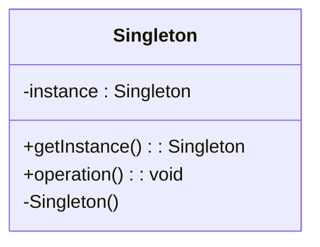

## 3.2.1 Intent and Motivation

The Singleton pattern is a creational design pattern that ensures a class has only one instance while providing a global point of access to that instance. This pattern is a cornerstone in software design, especially when managing shared resources or coordinating actions across a system. Let's delve into the intent and motivation behind the Singleton pattern, explore scenarios where it is appropriate, and discuss potential drawbacks.

### Understanding the Singleton Pattern

The Singleton pattern is akin to having a single key to a special room. Imagine a room that contains a valuable resource, such as a server configuration or a database connection. You wouldn't want multiple keys floating around, as this could lead to inconsistencies and conflicts. Instead, you have one key that everyone must use to access the room. This is the essence of the Singleton pattern: it restricts the instantiation of a class to a single object and provides a single point of access to that object.

### Intent of the Singleton Pattern

The primary intent of the Singleton pattern is to control object creation, limiting the number of instances to one. This is crucial in scenarios where having multiple instances of a class could lead to resource conflicts or inconsistent states. By ensuring that only one instance exists, the Singleton pattern helps maintain a consistent state across the application.

#### Key Objectives:

1. **Controlled Access to a Single Instance**: The Singleton pattern provides a controlled access point to the single instance, ensuring that all parts of the application use the same instance.

2. **Reduced Global State**: By centralizing the instance, the Singleton pattern reduces the need for global variables, which can lead to hard-to-track bugs and state management issues.

3. **Lazy Initialization**: The Singleton pattern often employs lazy initialization, creating the instance only when it is first needed. This can improve performance and resource management.

### Motivation for Using the Singleton Pattern

The motivation for using the Singleton pattern stems from the need to manage shared resources effectively. In many applications, certain resources or configurations need to be shared across different parts of the system. The Singleton pattern provides a structured way to manage these shared resources.

#### Common Scenarios:

1. **Configuration Settings**: In applications where configuration settings need to be accessed globally, the Singleton pattern ensures that all parts of the application use the same configuration instance.

2. **Logging**: A logging class is often implemented as a Singleton to ensure that all parts of the application log messages to the same output destination.

3. **Resource Management**: When managing resources such as database connections or thread pools, the Singleton pattern ensures that these resources are managed consistently and efficiently.

4. **State Management**: In applications where a global state needs to be maintained, the Singleton pattern provides a centralized point for managing that state.

### Code Example: Singleton Pattern in JavaScript

Let's explore how to implement the Singleton pattern in JavaScript. We'll create a simple Logger class that ensures only one instance is created.

```javascript
class Logger {
  constructor() {
    if (Logger.instance) {
      return Logger.instance;
    }
    Logger.instance = this;
    this.logs = [];
  }

  log(message) {
    this.logs.push(message);
    console.log(`Log: ${message}`);
  }

  printLogCount() {
    console.log(`${this.logs.length} Logs`);
  }
}

// Usage
const logger1 = new Logger();
logger1.log('First log');

const logger2 = new Logger();
logger2.log('Second log');

logger1.printLogCount(); // Output: 2 Logs
logger2.printLogCount(); // Output: 2 Logs
```

In this example, the `Logger` class ensures that only one instance is created. If an instance already exists, the constructor returns the existing instance.

### Code Example: Singleton Pattern in TypeScript

TypeScript enhances the Singleton pattern with type safety and interfaces. Let's implement the same Logger class in TypeScript.

```typescript
class Logger {
  private static instance: Logger;
  private logs: string[] = [];

  private constructor() {}

  static getInstance(): Logger {
    if (!Logger.instance) {
      Logger.instance = new Logger();
    }
    return Logger.instance;
  }

  log(message: string): void {
    this.logs.push(message);
    console.log(`Log: ${message}`);
  }

  printLogCount(): void {
    console.log(`${this.logs.length} Logs`);
  }
}

// Usage
const logger1 = Logger.getInstance();
logger1.log('First log');

const logger2 = Logger.getInstance();
logger2.log('Second log');

logger1.printLogCount(); // Output: 2 Logs
logger2.printLogCount(); // Output: 2 Logs
```

In the TypeScript example, we use a private constructor to prevent direct instantiation and a static method `getInstance` to control the creation of the instance.

### Visualizing the Singleton Pattern

To better understand the Singleton pattern, let's visualize its structure using a class diagram.



**Diagram Description**: The diagram illustrates the Singleton class with a private static instance and a public static method `getInstance` that returns the single instance. The `operation` method represents any operation that can be performed on the Singleton instance.

### Potential Drawbacks of the Singleton Pattern

While the Singleton pattern offers significant benefits, it also has potential drawbacks that developers should consider:

1. **Hindering Testability**: Singletons can make unit testing challenging because they introduce a global state that can lead to dependencies between tests. Mocking or stubbing the Singleton instance can be complex.

2. **Global State**: Singletons introduce a global state into the application, which can lead to tight coupling between components and make the system harder to maintain.

3. **Concurrency Issues**: In multi-threaded environments, ensuring that only one instance of the Singleton is created can be challenging and may require additional synchronization mechanisms.

4. **Overuse**: Overusing the Singleton pattern can lead to an anti-pattern known as the "God Object," where a single class becomes overly complex and difficult to manage.

### Analogies to Clarify the Concept

To further clarify the Singleton pattern, let's use some analogies:

- **President of a Country**: Just as a country typically has one president at a time, a Singleton ensures that only one instance of a class exists.

- **CEO of a Company**: A company has one CEO who oversees operations. Similarly, a Singleton manages a shared resource or configuration across an application.

- **Main Power Switch**: Think of a Singleton as the main power switch in a building. There is only one switch that controls the power supply, ensuring consistency and centralized control.

### Try It Yourself

To deepen your understanding of the Singleton pattern, try modifying the code examples provided. Here are some suggestions:

- **Add a Method**: Add a method to the `Logger` class that returns the last log message. Ensure that the method works correctly with the Singleton instance.

- **Implement Lazy Initialization**: Modify the JavaScript example to implement lazy initialization, creating the instance only when it is first needed.

- **Test Singleton Behavior**: Write a test to verify that multiple calls to `Logger.getInstance()` return the same instance.

### Knowledge Check

Before we wrap up, let's reinforce what we've learned with a few questions:

- What is the primary intent of the Singleton pattern?
- In what scenarios is the Singleton pattern most beneficial?
- What are some potential drawbacks of using the Singleton pattern?

### Conclusion

The Singleton pattern is a powerful tool in a developer's toolkit, providing a structured way to manage shared resources and maintain consistency across an application. However, like any tool, it should be used judiciously, with an awareness of its potential drawbacks. As you continue your journey in software design, remember to weigh the benefits and challenges of the Singleton pattern in the context of your specific application needs.

## Quiz Time!



### What is the primary intent of the Singleton pattern?

- [x] To ensure a class has only one instance and provide a global point of access to it.
- [ ] To allow multiple instances of a class to be created.
- [ ] To separate the construction of a complex object from its representation.
- [ ] To define a family of algorithms and make them interchangeable.

> **Explanation:** The Singleton pattern's primary intent is to ensure a class has only one instance and provide a global point of access to it.

### Which scenario is NOT appropriate for using a Singleton pattern?

- [ ] Managing configuration settings
- [ ] Logging
- [x] Implementing a user interface component
- [ ] Managing database connections

> **Explanation:** Implementing a user interface component is not typically a scenario where the Singleton pattern is appropriate, as UI components often require multiple instances.

### What is a potential drawback of using the Singleton pattern?

- [x] It can hinder testability by introducing global state.
- [ ] It allows for too many instances of a class.
- [ ] It makes code more complex and harder to understand.
- [ ] It requires extensive use of inheritance.

> **Explanation:** A potential drawback of the Singleton pattern is that it can hinder testability by introducing global state.

### How does the Singleton pattern help in resource management?

- [x] By ensuring that resources are managed consistently and efficiently.
- [ ] By allowing multiple instances to manage resources.
- [ ] By separating resource management from the rest of the application.
- [ ] By making resource management optional.

> **Explanation:** The Singleton pattern helps in resource management by ensuring that resources are managed consistently and efficiently through a single instance.

### What is lazy initialization in the context of the Singleton pattern?

- [x] Creating the instance only when it is first needed.
- [ ] Creating the instance at the start of the application.
- [ ] Creating multiple instances and using the first one.
- [ ] Avoiding the creation of an instance altogether.

> **Explanation:** Lazy initialization refers to creating the Singleton instance only when it is first needed, which can improve performance and resource management.

### Which analogy best describes the Singleton pattern?

- [x] President of a country
- [ ] A group of students
- [ ] A fleet of cars
- [ ] A collection of books

> **Explanation:** The Singleton pattern is best described by the analogy of a President of a country, as there is typically only one president at a time.

### What is the role of the `getInstance` method in the Singleton pattern?

- [x] To control the creation and access of the Singleton instance.
- [ ] To create multiple instances of the class.
- [ ] To destroy the Singleton instance.
- [ ] To modify the Singleton instance.

> **Explanation:** The `getInstance` method in the Singleton pattern controls the creation and access of the Singleton instance.

### How can the Singleton pattern introduce concurrency issues?

- [x] By requiring additional synchronization mechanisms in multi-threaded environments.
- [ ] By allowing multiple threads to create multiple instances.
- [ ] By preventing threads from accessing the Singleton instance.
- [ ] By making threads dependent on each other.

> **Explanation:** The Singleton pattern can introduce concurrency issues by requiring additional synchronization mechanisms in multi-threaded environments to ensure only one instance is created.

### What is an anti-pattern related to the overuse of the Singleton pattern?

- [x] God Object
- [ ] Factory Method
- [ ] Observer
- [ ] Strategy

> **Explanation:** The overuse of the Singleton pattern can lead to an anti-pattern known as the "God Object," where a single class becomes overly complex and difficult to manage.

### True or False: The Singleton pattern is always the best choice for managing global state.

- [ ] True
- [x] False

> **Explanation:** False. While the Singleton pattern can be useful for managing global state, it is not always the best choice and should be used judiciously, considering potential drawbacks like hindering testability and introducing global state.



Remember, this is just the beginning. As you progress, you'll build more complex and interactive applications. Keep experimenting, stay curious, and enjoy the journey!
