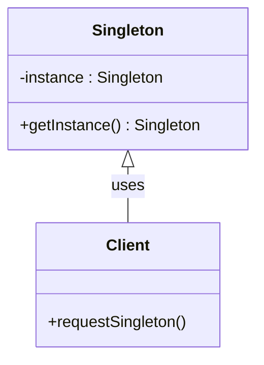

## 3.2.2 Implementation in JavaScript

In this section, we delve into the Singleton pattern, a creational design pattern that ensures a class has only one instance and provides a global point of access to it. Implementing this pattern in JavaScript can be achieved through various techniques, including closures, immediately-invoked function expressions (IIFEs), and ES6 modules. Let's explore these methods step-by-step, discuss best practices, and highlight common pitfalls.

### Understanding the Singleton Pattern

The Singleton pattern is a design pattern that restricts the instantiation of a class to a single object. This is particularly useful when exactly one object is needed to coordinate actions across the system. Common use cases include configuration settings, logging, and managing connections to a resource like a database.

### Implementing Singleton with Closures and IIFEs

Closures and IIFEs are powerful JavaScript features that can be leveraged to implement the Singleton pattern. Let's break down the process:

#### Using Closures

A closure in JavaScript is a function that retains access to its lexical scope, even when the function is executed outside that scope. This property can be used to create a private instance of a class.

```javascript
const Singleton = (function() {
    // Private variable to hold the instance
    let instance;

    // Private method to create an instance
    function createInstance() {
        const object = new Object("I am the instance");
        return object;
    }

    return {
        // Public method to get the instance
        getInstance: function() {
            if (!instance) {
                instance = createInstance();
            }
            return instance;
        }
    };
})();

// Usage
const instance1 = Singleton.getInstance();
const instance2 = Singleton.getInstance();

console.log(instance1 === instance2); // Output: true
```

**Explanation:**

- **Closure**: The `createInstance` function is enclosed within the IIFE, maintaining its state.
- **Private Instance**: The `instance` variable is private and can only be accessed through the `getInstance` method.
- **Singleton Guarantee**: The `getInstance` method ensures that only one instance is created.

#### Using Immediately-Invoked Function Expressions (IIFEs)

IIFEs are functions that are executed immediately after they are defined. They are useful for creating a singleton because they encapsulate the instance creation logic.

```javascript
const Singleton = (function() {
    let instance;

    function SingletonClass() {
        if (instance) {
            return instance;
        }
        instance = this;
        // Initialize other properties here
    }

    return SingletonClass;
})();

// Usage
const instance1 = new Singleton();
const instance2 = new Singleton();

console.log(instance1 === instance2); // Output: true
```

**Explanation:**

- **IIFE**: The `SingletonClass` is defined and immediately returned by the IIFE.
- **Instance Check**: The constructor checks if an instance already exists and returns it if so, ensuring only one instance is created.

### Implementing Singleton with ES6 Modules

ES6 modules, introduced in ECMAScript 2015, inherently support singleton behavior due to their module caching mechanism. When a module is imported, it is cached and reused, making it an ideal candidate for implementing singletons.

```javascript
// singleton.js
let instance = null;

class Singleton {
    constructor() {
        if (!instance) {
            instance = this;
            // Initialize other properties here
        }
        return instance;
    }
}

export default Singleton;

// main.js
import Singleton from './singleton.js';

const instance1 = new Singleton();
const instance2 = new Singleton();

console.log(instance1 === instance2); // Output: true
```

**Explanation:**

- **Module Caching**: The `Singleton` class is exported as a default export. When imported, it is cached, ensuring that subsequent imports return the same instance.
- **Constructor Logic**: The constructor checks if an instance exists and returns it, maintaining the singleton property.

### Best Practices for Singleton Implementation

Implementing singletons in JavaScript requires careful consideration of several factors to ensure robustness and maintainability:

1. **Lazy Initialization**: Initialize the singleton instance only when it is needed. This can save resources and improve performance.

2. **Thread Safety**: Although JavaScript is single-threaded, web workers and asynchronous operations can introduce concurrency issues. Ensure that the singleton implementation is thread-safe if used in such contexts.

3. **Avoid Global Variables**: Use closures, IIFEs, or modules to encapsulate the singleton logic and avoid polluting the global namespace.

4. **Testing**: Thoroughly test the singleton implementation to ensure it behaves as expected, especially in complex applications.

### Common Pitfalls in Singleton Implementation

While implementing the Singleton pattern, developers may encounter several pitfalls:

1. **Overuse**: Singletons can lead to tightly coupled code and global state, making testing and maintenance difficult. Use them judiciously.

2. **Memory Leaks**: Ensure that the singleton instance is properly managed and does not lead to memory leaks, especially in long-running applications.

3. **Complex Initialization**: Avoid complex initialization logic in the singleton constructor, as it can lead to unexpected behavior.

### Visualizing Singleton Pattern in JavaScript

To better understand how the Singleton pattern works in JavaScript, let's visualize the interaction between the singleton instance and the client code.



**Diagram Explanation:**

- **Singleton Class**: Contains a private `instance` and a public `getInstance` method.
- **Client**: Represents the code that uses the singleton instance.
- **Interaction**: The client requests the singleton instance through the `getInstance` method.

### Try It Yourself

Experiment with the Singleton pattern by modifying the code examples:

- **Modify the Singleton Class**: Add properties or methods to the singleton class and observe how they behave.
- **Test Lazy Initialization**: Implement lazy initialization and test its impact on performance.
- **Simulate Concurrency**: Use asynchronous operations to test the thread safety of your singleton implementation.

### References and Further Reading

- [MDN Web Docs: Closures](https://developer.mozilla.org/en-US/docs/Web/JavaScript/Closures)
- [MDN Web Docs: Modules](https://developer.mozilla.org/en-US/docs/Web/JavaScript/Guide/Modules)
- [W3Schools: JavaScript IIFE](https://www.w3schools.com/js/js_function_closures.asp)

### Knowledge Check

Before we wrap up, let's reinforce your understanding of the Singleton pattern in JavaScript with some questions and exercises.

## Quiz Time!



### What is the main purpose of the Singleton pattern?

- [x] To ensure a class has only one instance and provide a global point of access to it.
- [ ] To create multiple instances of a class.
- [ ] To encapsulate a group of related classes.
- [ ] To provide a simplified interface to a complex subsystem.

> **Explanation:** The Singleton pattern ensures that a class has only one instance and provides a global point of access to it.

### How can closures be used to implement a Singleton in JavaScript?

- [x] By creating a private instance variable and a public method to access it.
- [ ] By using global variables to store the instance.
- [ ] By creating multiple instances and choosing one randomly.
- [ ] By using a loop to check for existing instances.

> **Explanation:** Closures allow us to create a private instance variable and a public method to access it, ensuring only one instance is created.

### What is the benefit of using ES6 modules for Singleton implementation?

- [x] Modules are cached and reused, inherently supporting singleton behavior.
- [ ] Modules allow multiple instances to be created.
- [ ] Modules do not support singleton behavior.
- [ ] Modules require complex initialization logic.

> **Explanation:** ES6 modules are cached and reused, making them ideal for implementing singletons.

### Which of the following is a common pitfall when using the Singleton pattern?

- [x] Overuse leading to tightly coupled code.
- [ ] Ensuring thread safety in single-threaded applications.
- [ ] Using closures to encapsulate logic.
- [ ] Implementing lazy initialization.

> **Explanation:** Overuse of singletons can lead to tightly coupled code and global state, making testing and maintenance difficult.

### What is lazy initialization in the context of the Singleton pattern?

- [x] Initializing the singleton instance only when it is needed.
- [ ] Initializing the singleton instance at the start of the application.
- [ ] Initializing multiple instances and choosing one.
- [ ] Initializing the singleton instance in a separate thread.

> **Explanation:** Lazy initialization involves creating the singleton instance only when it is needed, saving resources.

### In the provided closure-based Singleton example, what does the `getInstance` method do?

- [x] It returns the existing instance or creates a new one if none exists.
- [ ] It creates a new instance every time it is called.
- [ ] It deletes the existing instance.
- [ ] It logs the instance to the console.

> **Explanation:** The `getInstance` method checks if an instance exists and returns it, or creates a new one if none exists.

### Why should global variables be avoided in Singleton implementations?

- [x] They can lead to namespace pollution and unintended side effects.
- [ ] They make the code easier to read.
- [ ] They improve performance.
- [ ] They are necessary for singleton behavior.

> **Explanation:** Global variables can lead to namespace pollution and unintended side effects, making the code harder to maintain.

### How does the IIFE-based Singleton pattern ensure only one instance is created?

- [x] By checking if an instance exists and returning it if so.
- [ ] By creating a new instance every time.
- [ ] By using global variables.
- [ ] By using a loop to check for existing instances.

> **Explanation:** The IIFE-based Singleton pattern checks if an instance exists and returns it, ensuring only one instance is created.

### What is a potential issue with complex initialization logic in Singleton constructors?

- [x] It can lead to unexpected behavior and difficult debugging.
- [ ] It makes the code more efficient.
- [ ] It simplifies the singleton implementation.
- [ ] It is necessary for singleton behavior.

> **Explanation:** Complex initialization logic can lead to unexpected behavior and make debugging difficult.

### True or False: ES6 modules inherently support singleton behavior due to module caching.

- [x] True
- [ ] False

> **Explanation:** ES6 modules are cached and reused, inherently supporting singleton behavior.



Remember, mastering the Singleton pattern in JavaScript is just one step in your journey to becoming a proficient developer. Keep experimenting, stay curious, and enjoy the process of learning and growing your skills!
