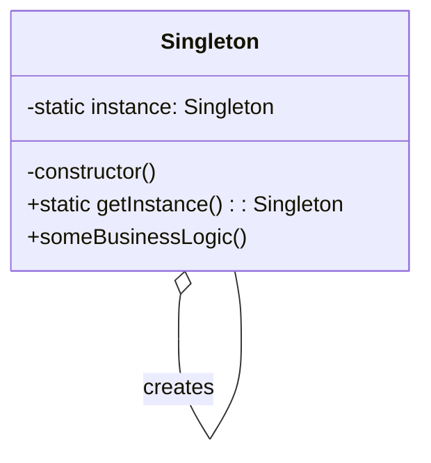

## 3.2.3 Implementation in TypeScript

In this section, we will explore how to implement the Singleton design pattern in TypeScript, leveraging its unique features such as access modifiers and type annotations. The Singleton pattern ensures that a class has only one instance and provides a global point of access to it. This pattern is particularly useful in scenarios where a single instance of a class is required to coordinate actions across the system.

### Understanding the Singleton Pattern

The Singleton pattern is a creational design pattern that restricts the instantiation of a class to one "single" instance. This is useful when exactly one object is needed to coordinate actions across the system. Common use cases include configuration settings, logging, and caching.

### Implementing Singleton in TypeScript

TypeScript, with its strong typing and access modifiers, provides a robust platform for implementing the Singleton pattern. Let's delve into the implementation details.

#### Step-by-Step Implementation

1. **Define a Singleton Class**: Start by defining a class with a private constructor. This prevents the class from being instantiated from outside the class.

2. **Create a Static Instance**: Use a static property to hold the single instance of the class.

3. **Provide a Static Method**: Implement a static method to control the access to the instance. This method checks if the instance already exists; if not, it creates one.

4. **Use Access Modifiers**: Utilize TypeScript's `private` and `protected` access modifiers to enforce the Singleton pattern.

#### TypeScript Code Example

Let's walk through a TypeScript example to illustrate these steps:

```typescript
class Singleton {
  private static instance: Singleton;
  private constructor() {
    // Private constructor ensures no external instantiation.
  }

  public static getInstance(): Singleton {
    if (!Singleton.instance) {
      Singleton.instance = new Singleton();
    }
    return Singleton.instance;
  }

  public someBusinessLogic() {
    // Business logic here
    console.log("Executing business logic.");
  }
}

// Usage
const singleton1 = Singleton.getInstance();
const singleton2 = Singleton.getInstance();

console.log(singleton1 === singleton2); // Output: true
singleton1.someBusinessLogic();
```

**Explanation**:

- **Private Constructor**: The constructor is marked private to prevent direct instantiation.
- **Static Instance**: The `instance` property is static, ensuring that it is shared across all instances of the class.
- **Static Method**: The `getInstance()` method checks if an instance already exists. If not, it creates one and returns it.

### Benefits of Using TypeScript for Singleton

- **Type Safety**: TypeScript's type system ensures that the Singleton instance is used correctly throughout the codebase.
- **IntelliSense Support**: With TypeScript, you get enhanced IntelliSense support in IDEs, making development faster and reducing errors.
- **Access Modifiers**: TypeScript's `private` and `protected` access modifiers help enforce the Singleton pattern more strictly than JavaScript.

### Integrating Singleton in Larger Projects

In larger TypeScript projects, the Singleton pattern can be integrated as part of the architecture to manage shared resources or services. For instance, a Singleton can manage a connection pool or a configuration service.

#### Example: Configuration Service Singleton

Consider a scenario where a configuration service needs to be accessed globally:

```typescript
class ConfigService {
  private static instance: ConfigService;
  private config: { [key: string]: string } = {};

  private constructor() {
    // Load configuration settings
    this.config = { apiUrl: "https://api.example.com" };
  }

  public static getInstance(): ConfigService {
    if (!ConfigService.instance) {
      ConfigService.instance = new ConfigService();
    }
    return ConfigService.instance;
  }

  public getConfig(key: string): string | undefined {
    return this.config[key];
  }
}

// Usage
const configService = ConfigService.getInstance();
console.log(configService.getConfig("apiUrl")); // Output: https://api.example.com
```

**Explanation**:

- **Configuration Storage**: The `config` object holds configuration settings.
- **Singleton Access**: The `getInstance()` method ensures that the configuration service is accessed as a Singleton.

### Visualizing the Singleton Pattern

To better understand the Singleton pattern, let's visualize its structure:



**Diagram Description**: The class diagram above shows the Singleton class with a private constructor, a static instance, and a static method to access the instance.

### Try It Yourself

Experiment with the Singleton pattern by modifying the code examples:

- **Add New Methods**: Extend the Singleton class with additional methods and observe how they are accessed.
- **Modify Configuration**: In the `ConfigService` example, add more configuration settings and test their retrieval.
- **Logging Singleton**: Implement a logging service as a Singleton and test it across different modules.

### Knowledge Check

Before we conclude, let's reinforce our understanding with a few questions:

1. What is the primary purpose of the Singleton pattern?
2. How does TypeScript's `private` constructor enforce the Singleton pattern?
3. Why is a static method used to access the Singleton instance?

### Conclusion

Implementing the Singleton pattern in TypeScript provides numerous benefits, including type safety, enhanced IntelliSense support, and strict enforcement of the pattern through access modifiers. By integrating Singletons into your TypeScript projects, you can manage shared resources efficiently and maintain a clean architecture.

Remember, this is just the beginning. As you progress, you'll build more complex and interactive applications. Keep experimenting, stay curious, and enjoy the journey!

## Quiz Time!



### What is the primary purpose of the Singleton pattern?

- [x] To ensure a class has only one instance and provide a global point of access to it.
- [ ] To allow multiple instances of a class to be created.
- [ ] To encapsulate a group of individual factories.
- [ ] To define a family of algorithms.

> **Explanation:** The Singleton pattern ensures that a class has only one instance and provides a global point of access to it, which is its primary purpose.

### How does TypeScript's `private` constructor enforce the Singleton pattern?

- [x] By preventing the class from being instantiated from outside the class.
- [ ] By allowing multiple instances to be created.
- [ ] By providing a global point of access.
- [ ] By encapsulating a group of individual factories.

> **Explanation:** A `private` constructor in TypeScript prevents the class from being instantiated from outside the class, which is crucial for enforcing the Singleton pattern.

### Why is a static method used to access the Singleton instance?

- [x] To control the access to the instance and ensure only one instance is created.
- [ ] To allow multiple instances to be created.
- [ ] To encapsulate a group of individual factories.
- [ ] To define a family of algorithms.

> **Explanation:** A static method is used to control the access to the Singleton instance, ensuring that only one instance is created and accessed globally.

### What is a common use case for the Singleton pattern?

- [x] Configuration settings management.
- [ ] Creating multiple instances of a class.
- [ ] Defining a family of algorithms.
- [ ] Encapsulating a group of individual factories.

> **Explanation:** A common use case for the Singleton pattern is managing configuration settings, where a single instance is needed to coordinate actions across the system.

### Which TypeScript feature enhances the enforcement of the Singleton pattern?

- [x] Access modifiers like `private` and `protected`.
- [ ] Public constructors.
- [ ] Multiple inheritance.
- [ ] Dynamic typing.

> **Explanation:** TypeScript's access modifiers like `private` and `protected` enhance the enforcement of the Singleton pattern by restricting access and instantiation.

### What is the benefit of using TypeScript for implementing the Singleton pattern?

- [x] Type safety and enhanced IntelliSense support.
- [ ] Dynamic typing.
- [ ] Multiple inheritance.
- [ ] Public constructors.

> **Explanation:** TypeScript provides type safety and enhanced IntelliSense support, which are significant benefits when implementing the Singleton pattern.

### How can the Singleton pattern be integrated into larger projects?

- [x] By managing shared resources or services.
- [ ] By creating multiple instances of a class.
- [ ] By defining a family of algorithms.
- [ ] By encapsulating a group of individual factories.

> **Explanation:** In larger projects, the Singleton pattern can be integrated to manage shared resources or services, ensuring a single point of access and coordination.

### What is the role of the static instance in the Singleton pattern?

- [x] To hold the single instance of the class.
- [ ] To allow multiple instances to be created.
- [ ] To encapsulate a group of individual factories.
- [ ] To define a family of algorithms.

> **Explanation:** The static instance in the Singleton pattern holds the single instance of the class, ensuring that only one instance exists.

### True or False: The Singleton pattern allows multiple instances of a class to be created.

- [ ] True
- [x] False

> **Explanation:** False. The Singleton pattern restricts the instantiation of a class to one single instance.

### What is a potential modification you can try with the Singleton pattern?

- [x] Implementing a logging service as a Singleton.
- [ ] Allowing multiple instances to be created.
- [ ] Defining a family of algorithms.
- [ ] Encapsulating a group of individual factories.

> **Explanation:** A potential modification is implementing a logging service as a Singleton, which can be tested across different modules.




