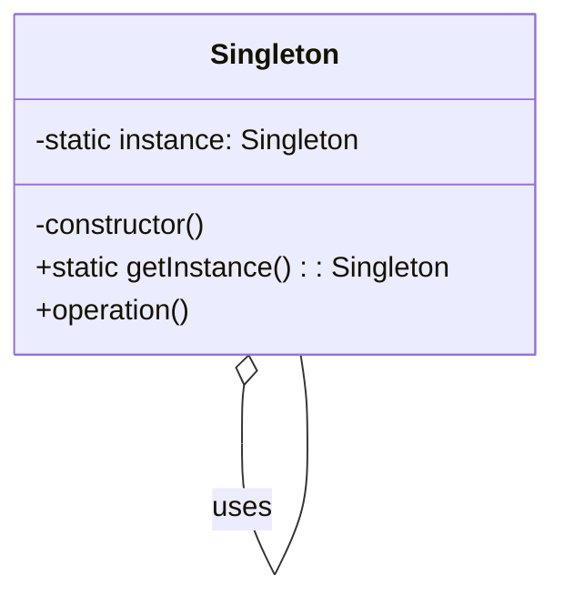

## 3.2.4 Use Cases and Examples

The Singleton pattern is a creational design pattern that ensures a class has only one instance and provides a global point of access to it. This pattern is particularly useful in scenarios where a single object needs to coordinate actions across a system. Let's delve into some real-world use cases and examples where the Singleton pattern shines, especially in JavaScript and TypeScript environments.

### Understanding the Singleton Pattern

Before we dive into specific use cases, let's briefly recap what the Singleton pattern is and why it's useful. The Singleton pattern restricts the instantiation of a class to one "single" instance. This is beneficial when exactly one object is needed to coordinate actions across the system.

#### Key Characteristics of the Singleton Pattern

- **Single Instance**: Only one instance of the class is created.
- **Global Access**: Provides a global point of access to the instance.
- **Lazy Initialization**: The instance is created only when it is needed.

### Real-World Use Cases

Let's explore some scenarios where the Singleton pattern is commonly applied:

#### 1. Logging Systems

In many applications, logging is a critical component. A logging system needs to be consistent and accessible throughout the application. Using a Singleton ensures that all parts of the application log messages in a uniform manner.

**JavaScript Example:**

```javascript
class Logger {
  constructor() {
    if (Logger.instance) {
      return Logger.instance;
    }
    this.logs = [];
    Logger.instance = this;
  }

  log(message) {
    const timestamp = new Date().toISOString();
    this.logs.push(`${timestamp} - ${message}`);
    console.log(`${timestamp} - ${message}`);
  }

  printLogCount() {
    console.log(`${this.logs.length} logs`);
  }
}

const logger1 = new Logger();
const logger2 = new Logger();

logger1.log("First log message");
logger2.log("Second log message");

logger1.printLogCount(); // Output: 2 logs
logger2.printLogCount(); // Output: 2 logs
```

**TypeScript Example:**

```typescript
class Logger {
  private static instance: Logger;
  private logs: string[] = [];

  private constructor() {}

  public static getInstance(): Logger {
    if (!Logger.instance) {
      Logger.instance = new Logger();
    }
    return Logger.instance;
  }

  public log(message: string): void {
    const timestamp = new Date().toISOString();
    this.logs.push(`${timestamp} - ${message}`);
    console.log(`${timestamp} - ${message}`);
  }

  public printLogCount(): void {
    console.log(`${this.logs.length} logs`);
  }
}

const logger1 = Logger.getInstance();
const logger2 = Logger.getInstance();

logger1.log("First log message");
logger2.log("Second log message");

logger1.printLogCount(); // Output: 2 logs
logger2.printLogCount(); // Output: 2 logs
```

#### 2. Configuration Managers

Applications often require a centralized configuration manager to handle settings and preferences. A Singleton can ensure that all parts of the application use the same configuration settings.

**JavaScript Example:**

```javascript
class ConfigurationManager {
  constructor() {
    if (ConfigurationManager.instance) {
      return ConfigurationManager.instance;
    }
    this.config = {};
    ConfigurationManager.instance = this;
  }

  set(key, value) {
    this.config[key] = value;
  }

  get(key) {
    return this.config[key];
  }
}

const config1 = new ConfigurationManager();
const config2 = new ConfigurationManager();

config1.set('apiUrl', 'https://api.example.com');
console.log(config2.get('apiUrl')); // Output: https://api.example.com
```

**TypeScript Example:**

```typescript
class ConfigurationManager {
  private static instance: ConfigurationManager;
  private config: { [key: string]: any } = {};

  private constructor() {}

  public static getInstance(): ConfigurationManager {
    if (!ConfigurationManager.instance) {
      ConfigurationManager.instance = new ConfigurationManager();
    }
    return ConfigurationManager.instance;
  }

  public set(key: string, value: any): void {
    this.config[key] = value;
  }

  public get(key: string): any {
    return this.config[key];
  }
}

const config1 = ConfigurationManager.getInstance();
const config2 = ConfigurationManager.getInstance();

config1.set('apiUrl', 'https://api.example.com');
console.log(config2.get('apiUrl')); // Output: https://api.example.com
```

#### 3. Connection Pools

In database-driven applications, managing connections efficiently is crucial. A Singleton can manage a pool of connections, ensuring that connections are reused and not created unnecessarily.

**JavaScript Example:**

```javascript
class ConnectionPool {
  constructor() {
    if (ConnectionPool.instance) {
      return ConnectionPool.instance;
    }
    this.connections = [];
    ConnectionPool.instance = this;
  }

  getConnection() {
    if (this.connections.length === 0) {
      const newConnection = {}; // Simulate a new connection
      this.connections.push(newConnection);
      return newConnection;
    }
    return this.connections.pop();
  }

  releaseConnection(connection) {
    this.connections.push(connection);
  }
}

const pool1 = new ConnectionPool();
const pool2 = new ConnectionPool();

const conn1 = pool1.getConnection();
pool2.releaseConnection(conn1);

console.log(pool1 === pool2); // Output: true
```

**TypeScript Example:**

```typescript
class ConnectionPool {
  private static instance: ConnectionPool;
  private connections: any[] = [];

  private constructor() {}

  public static getInstance(): ConnectionPool {
    if (!ConnectionPool.instance) {
      ConnectionPool.instance = new ConnectionPool();
    }
    return ConnectionPool.instance;
  }

  public getConnection(): any {
    if (this.connections.length === 0) {
      const newConnection = {}; // Simulate a new connection
      this.connections.push(newConnection);
      return newConnection;
    }
    return this.connections.pop();
  }

  public releaseConnection(connection: any): void {
    this.connections.push(connection);
  }
}

const pool1 = ConnectionPool.getInstance();
const pool2 = ConnectionPool.getInstance();

const conn1 = pool1.getConnection();
pool2.releaseConnection(conn1);

console.log(pool1 === pool2); // Output: true
```

### Implications of Using Singletons

While the Singleton pattern is useful, it comes with certain implications, especially in multi-threaded or asynchronous environments.

#### Multi-threaded Environments

In multi-threaded environments, ensuring that only one instance of a Singleton is created can be challenging. This is because multiple threads might attempt to create an instance simultaneously. To address this, consider using locks or other synchronization mechanisms.

#### Asynchronous Environments

JavaScript and TypeScript often operate in asynchronous environments, such as web applications. In such cases, ensure that the Singleton instance is initialized before it is accessed. This can be achieved using promises or async/await patterns.

### When to Use the Singleton Pattern

The Singleton pattern is best used when:

- **A single instance is required**: When only one instance of a class is needed to control actions across the system.
- **Global access is necessary**: When a global point of access is required.
- **Resource management**: When managing resources like connections or configurations that should be shared across the application.

### Alternatives to the Singleton Pattern

While the Singleton pattern is useful, it's not always the best choice. Consider alternatives when:

- **Testing is a priority**: Singletons can make unit testing challenging due to their global state.
- **Flexibility is needed**: If you need multiple instances in the future, a Singleton might limit flexibility.
- **Dependency injection**: Using dependency injection can provide more flexibility and testability compared to Singletons.

### Visualizing Singleton Pattern

To better understand how the Singleton pattern works, let's visualize it using a class diagram.



**Diagram Description**: The diagram illustrates a Singleton class with a static instance variable and a private constructor. The `getInstance` method ensures that only one instance of the Singleton class is created.

### Try It Yourself

Experiment with the Singleton pattern by modifying the code examples provided:

- **Add new methods**: Extend the Singleton classes with additional methods to see how they behave.
- **Simulate multi-threading**: Use JavaScript's `setTimeout` or `setInterval` to simulate concurrent access to the Singleton instance.
- **Implement a new use case**: Try implementing a Singleton for a different use case, such as a cache manager or a user session manager.

### Knowledge Check

- **Question**: Why is the Singleton pattern useful in logging systems?
- **Exercise**: Modify the ConfigurationManager example to include a method that returns all configuration keys.

### Embrace the Journey

Remember, mastering design patterns like the Singleton is just the beginning. As you progress, you'll build more complex and efficient applications. Keep experimenting, stay curious, and enjoy the journey!

## Quiz Time!



### What is a primary characteristic of the Singleton pattern?

- [x] It ensures only one instance of a class is created.
- [ ] It allows multiple instances of a class.
- [ ] It restricts access to class methods.
- [ ] It is used for creating multiple objects.

> **Explanation:** The Singleton pattern ensures that only one instance of a class is created and provides a global point of access to it.

### In which scenario is the Singleton pattern most useful?

- [x] When a single instance is needed to coordinate actions across a system.
- [ ] When multiple instances are required for different tasks.
- [ ] When objects need to be created dynamically.
- [ ] When a class should have multiple responsibilities.

> **Explanation:** The Singleton pattern is useful when a single instance is needed to coordinate actions across a system, ensuring consistency and resource management.

### How can you ensure a Singleton is thread-safe in a multi-threaded environment?

- [x] Use locks or synchronization mechanisms.
- [ ] Use multiple instances.
- [ ] Avoid using the Singleton pattern.
- [ ] Use asynchronous functions.

> **Explanation:** In a multi-threaded environment, using locks or synchronization mechanisms ensures that only one instance of a Singleton is created.

### What is a potential downside of using the Singleton pattern?

- [x] It can make unit testing challenging.
- [ ] It allows too many instances of a class.
- [ ] It restricts access to class methods.
- [ ] It is too complex to implement.

> **Explanation:** The global state of a Singleton can make unit testing challenging, as it introduces dependencies that are hard to isolate.

### Which of the following is an alternative to the Singleton pattern?

- [x] Dependency injection
- [ ] Factory pattern
- [x] Prototype pattern
- [ ] Observer pattern

> **Explanation:** Dependency injection and the Prototype pattern are alternatives that provide more flexibility and testability compared to Singletons.

### What is a common use case for the Singleton pattern?

- [x] Logging systems
- [ ] Dynamic object creation
- [ ] Complex algorithms
- [ ] User interface design

> **Explanation:** Logging systems benefit from the Singleton pattern as it ensures consistent and centralized logging throughout an application.

### How does the Singleton pattern provide global access?

- [x] By providing a static method to access the instance.
- [ ] By creating multiple instances.
- [ ] By restricting access to class methods.
- [ ] By using dynamic object creation.

> **Explanation:** The Singleton pattern provides a static method to access the single instance, ensuring global access.

### What is lazy initialization in the context of the Singleton pattern?

- [x] Creating the instance only when it is needed.
- [ ] Creating multiple instances at once.
- [ ] Restricting access to class methods.
- [ ] Using asynchronous functions.

> **Explanation:** Lazy initialization refers to creating the Singleton instance only when it is needed, optimizing resource usage.

### Why might you avoid using the Singleton pattern?

- [x] It can limit flexibility and testability.
- [ ] It is too simple to implement.
- [ ] It allows too many instances.
- [ ] It restricts access to class methods.

> **Explanation:** The Singleton pattern can limit flexibility and testability due to its global state, making it less suitable for certain applications.

### True or False: The Singleton pattern is always the best choice for managing shared resources.

- [ ] True
- [x] False

> **Explanation:** While the Singleton pattern is useful for managing shared resources, it is not always the best choice. Alternatives like dependency injection may offer more flexibility and testability.


