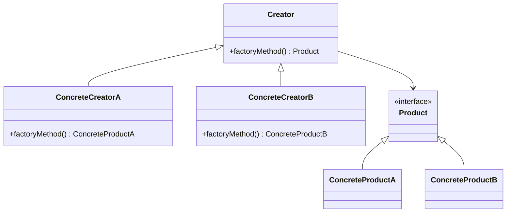
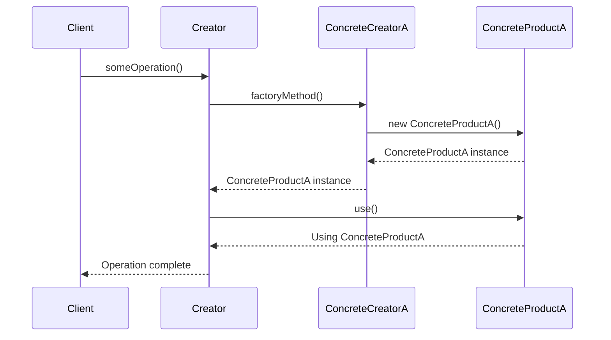

## 3.3.1 Intent and Motivation

In the realm of software design, the Factory Method pattern stands out as a pivotal creational pattern that addresses the complexities of object creation. This pattern is particularly useful when a class cannot anticipate the class of objects it must create. By defining an interface for creating objects, but allowing subclasses to decide which class to instantiate, the Factory Method pattern offers a flexible and scalable solution to object creation.

### Understanding the Factory Method Pattern

The Factory Method pattern is a design pattern that provides an interface for creating objects in a superclass, but allows subclasses to alter the type of objects that will be created. This pattern is part of the creational design patterns, which are concerned with the process of object creation. The primary goal of the Factory Method is to allow a class to defer instantiation to its subclasses, thereby promoting loose coupling and enhancing flexibility.

#### Problem Solved by the Factory Method Pattern

In traditional object-oriented programming, a class is responsible for creating its own objects. This approach can lead to a rigid and tightly coupled system, where changes to the object creation process require modifications to the class itself. This lack of flexibility can hinder the scalability and maintainability of the codebase.

The Factory Method pattern addresses this issue by decoupling the object creation process from the class itself. By defining a separate method for object creation, the pattern allows subclasses to override this method and specify the type of object to be created. This approach not only promotes loose coupling but also enhances the flexibility of the system, allowing for easier modifications and extensions.

### Promoting Loose Coupling and Flexibility

One of the key advantages of the Factory Method pattern is its ability to promote loose coupling between classes. By delegating the responsibility of object creation to subclasses, the pattern reduces the dependencies between classes, making the system more modular and easier to maintain.

Additionally, the Factory Method pattern enhances flexibility by allowing subclasses to decide which class to instantiate. This capability is particularly useful in scenarios where the exact class of objects to be created is not known at compile time. By deferring the instantiation to subclasses, the pattern enables the system to adapt to changing requirements and accommodate new types of objects without modifying existing code.

### Class Diagram of the Factory Method Pattern

To better understand the relationships involved in the Factory Method pattern, let's examine a class diagram that illustrates the key components of this pattern.



In this diagram, we have the following components:

- **Creator**: This is an abstract class that declares the factory method, which returns an object of type `Product`. The `Creator` class may also define a default implementation of the factory method that returns a generic product.

- **ConcreteCreatorA and ConcreteCreatorB**: These are subclasses of `Creator` that override the factory method to return an instance of a specific `ConcreteProduct`.

- **Product**: This is an interface or abstract class that defines the interface for objects created by the factory method.

- **ConcreteProductA and ConcreteProductB**: These are concrete implementations of the `Product` interface.

### Differences Between Factory Method and Simple Factory

It's important to distinguish between the Factory Method pattern and the Simple Factory pattern, as they are often confused.

- **Factory Method Pattern**: This pattern relies on inheritance and polymorphism. The factory method is defined in an abstract class and overridden by subclasses to create specific types of objects. This approach promotes loose coupling and flexibility, as new product types can be added without modifying existing code.

- **Simple Factory Pattern**: Also known as the static factory method, this pattern uses a single method to create objects. The method typically uses a switch or if-else statement to determine which class to instantiate. While simpler to implement, this approach can lead to tightly coupled code, as changes to the object creation process require modifications to the factory method itself.

### Code Examples in JavaScript and TypeScript

Let's explore how the Factory Method pattern can be implemented in JavaScript and TypeScript, highlighting the differences and advantages of using this pattern.

#### JavaScript Implementation

```javascript
// Product interface
class Product {
    use() {
        throw new Error("This method should be overridden!");
    }
}

// ConcreteProductA class
class ConcreteProductA extends Product {
    use() {
        console.log("Using ConcreteProductA");
    }
}

// ConcreteProductB class
class ConcreteProductB extends Product {
    use() {
        console.log("Using ConcreteProductB");
    }
}

// Creator class
class Creator {
    factoryMethod() {
        throw new Error("This method should be overridden!");
    }

    someOperation() {
        const product = this.factoryMethod();
        product.use();
    }
}

// ConcreteCreatorA class
class ConcreteCreatorA extends Creator {
    factoryMethod() {
        return new ConcreteProductA();
    }
}

// ConcreteCreatorB class
class ConcreteCreatorB extends Creator {
    factoryMethod() {
        return new ConcreteProductB();
    }
}

// Client code
const creatorA = new ConcreteCreatorA();
creatorA.someOperation(); // Output: Using ConcreteProductA

const creatorB = new ConcreteCreatorB();
creatorB.someOperation(); // Output: Using ConcreteProductB
```

In this JavaScript example, we define a `Product` class with a `use` method, which is overridden by `ConcreteProductA` and `ConcreteProductB`. The `Creator` class declares a `factoryMethod` that is overridden by `ConcreteCreatorA` and `ConcreteCreatorB` to return instances of `ConcreteProductA` and `ConcreteProductB`, respectively.

#### TypeScript Implementation

```typescript
// Product interface
interface Product {
    use(): void;
}

// ConcreteProductA class
class ConcreteProductA implements Product {
    use(): void {
        console.log("Using ConcreteProductA");
    }
}

// ConcreteProductB class
class ConcreteProductB implements Product {
    use(): void {
        console.log("Using ConcreteProductB");
    }
}

// Creator class
abstract class Creator {
    abstract factoryMethod(): Product;

    someOperation(): void {
        const product = this.factoryMethod();
        product.use();
    }
}

// ConcreteCreatorA class
class ConcreteCreatorA extends Creator {
    factoryMethod(): Product {
        return new ConcreteProductA();
    }
}

// ConcreteCreatorB class
class ConcreteCreatorB extends Creator {
    factoryMethod(): Product {
        return new ConcreteProductB();
    }
}

// Client code
const creatorA: Creator = new ConcreteCreatorA();
creatorA.someOperation(); // Output: Using ConcreteProductA

const creatorB: Creator = new ConcreteCreatorB();
creatorB.someOperation(); // Output: Using ConcreteProductB
```

In the TypeScript example, we define a `Product` interface with a `use` method, which is implemented by `ConcreteProductA` and `ConcreteProductB`. The `Creator` class is an abstract class with an abstract `factoryMethod`, which is implemented by `ConcreteCreatorA` and `ConcreteCreatorB` to return instances of `ConcreteProductA` and `ConcreteProductB`, respectively.

### Try It Yourself

To deepen your understanding of the Factory Method pattern, try modifying the code examples above. For instance, you can:

- Add a new `ConcreteProductC` class and a corresponding `ConcreteCreatorC` class.
- Experiment with different product types and observe how the pattern facilitates the addition of new products without modifying existing code.
- Implement additional methods in the `Product` interface and observe how they are inherited by all concrete products.

### Visualizing the Factory Method Pattern

To further illustrate the Factory Method pattern, let's visualize the interaction between the components using a sequence diagram.



In this sequence diagram, we see the following interactions:

- The `Client` calls the `someOperation` method on the `Creator`.
- The `Creator` delegates the object creation to the `ConcreteCreatorA` by calling its `factoryMethod`.
- The `ConcreteCreatorA` creates an instance of `ConcreteProductA` and returns it to the `Creator`.
- The `Creator` calls the `use` method on the `ConcreteProductA` instance, which performs the desired operation.

### Knowledge Check

Before we conclude, let's reinforce the key concepts covered in this section:

- **Factory Method Pattern**: A creational pattern that defines an interface for creating objects, but allows subclasses to decide which class to instantiate.
- **Loose Coupling**: The pattern promotes loose coupling by delegating object creation to subclasses, reducing dependencies between classes.
- **Flexibility**: The pattern enhances flexibility by allowing subclasses to specify the type of object to be created, accommodating changing requirements.
- **Difference from Simple Factory**: Unlike the Simple Factory pattern, the Factory Method pattern relies on inheritance and polymorphism, promoting greater flexibility and scalability.

### Embrace the Journey

Remember, the Factory Method pattern is just one of many design patterns that can help you write more maintainable and scalable code. As you continue your journey in software development, keep experimenting with different patterns, stay curious, and enjoy the process of learning and growing as a developer.

## Quiz Time!



### What is the primary intent of the Factory Method pattern?

- [x] To define an interface for creating an object, but let subclasses decide which class to instantiate.
- [ ] To create a single instance of a class.
- [ ] To provide a simplified interface to a complex subsystem.
- [ ] To compose objects into tree structures.

> **Explanation:** The Factory Method pattern defines an interface for creating objects, allowing subclasses to decide which class to instantiate, promoting flexibility and loose coupling.

### How does the Factory Method pattern promote loose coupling?

- [x] By delegating object creation to subclasses.
- [ ] By using global variables.
- [ ] By creating a single instance of a class.
- [ ] By composing objects into tree structures.

> **Explanation:** The Factory Method pattern promotes loose coupling by delegating object creation to subclasses, reducing dependencies between classes.

### What is a key difference between the Factory Method pattern and the Simple Factory pattern?

- [x] The Factory Method pattern relies on inheritance and polymorphism.
- [ ] The Simple Factory pattern uses interfaces.
- [ ] The Factory Method pattern creates a single instance of a class.
- [ ] The Simple Factory pattern is more flexible.

> **Explanation:** The Factory Method pattern relies on inheritance and polymorphism, allowing subclasses to decide which class to instantiate, unlike the Simple Factory pattern.

### In the Factory Method pattern, what role does the Creator class play?

- [x] It declares the factory method and may provide a default implementation.
- [ ] It implements the product interface.
- [ ] It creates a single instance of a class.
- [ ] It provides a simplified interface to a complex subsystem.

> **Explanation:** The Creator class declares the factory method and may provide a default implementation, allowing subclasses to override it to create specific products.

### Which of the following is a benefit of using the Factory Method pattern?

- [x] Enhanced flexibility in object creation.
- [ ] Reduced memory usage.
- [ ] Simplified interface to a complex subsystem.
- [ ] Single instance creation.

> **Explanation:** The Factory Method pattern enhances flexibility in object creation by allowing subclasses to specify the type of object to be created.

### What is the role of the Product interface in the Factory Method pattern?

- [x] It defines the interface for objects created by the factory method.
- [ ] It creates a single instance of a class.
- [ ] It provides a simplified interface to a complex subsystem.
- [ ] It composes objects into tree structures.

> **Explanation:** The Product interface defines the interface for objects created by the factory method, ensuring consistency among products.

### How does the Factory Method pattern enhance scalability?

- [x] By allowing new product types to be added without modifying existing code.
- [ ] By using global variables.
- [ ] By creating a single instance of a class.
- [ ] By composing objects into tree structures.

> **Explanation:** The Factory Method pattern enhances scalability by allowing new product types to be added without modifying existing code, promoting flexibility.

### What is the primary role of the ConcreteCreator class in the Factory Method pattern?

- [x] To override the factory method to return an instance of a specific ConcreteProduct.
- [ ] To implement the product interface.
- [ ] To create a single instance of a class.
- [ ] To provide a simplified interface to a complex subsystem.

> **Explanation:** The ConcreteCreator class overrides the factory method to return an instance of a specific ConcreteProduct, determining the type of object to be created.

### In the Factory Method pattern, what does the term "defer instantiation to subclasses" mean?

- [x] Subclasses decide which class to instantiate, not the superclass.
- [ ] The superclass creates a single instance of a class.
- [ ] The superclass provides a simplified interface to a complex subsystem.
- [ ] Subclasses compose objects into tree structures.

> **Explanation:** "Defer instantiation to subclasses" means that subclasses decide which class to instantiate, allowing for greater flexibility and loose coupling.

### True or False: The Factory Method pattern is part of the structural design patterns.

- [ ] True
- [x] False

> **Explanation:** False. The Factory Method pattern is part of the creational design patterns, which focus on the process of object creation.




