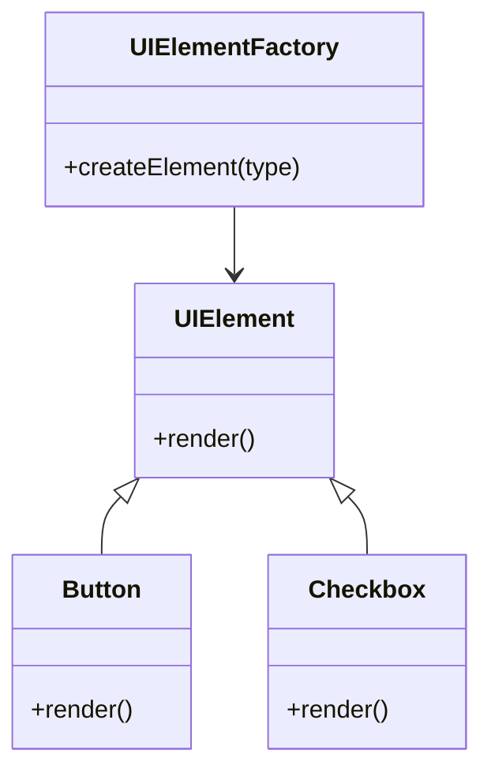

## 3.3.2 Implementation in JavaScript

The Factory Method pattern is a creational design pattern that provides an interface for creating objects in a superclass but allows subclasses to alter the type of objects that will be created. This pattern is particularly useful when the exact types of objects to be created are not known until runtime, and it promotes loose coupling by delegating the instantiation logic to subclasses.

In this section, we'll explore how to implement the Factory Method pattern in JavaScript, leveraging both functions and classes to create products. We'll also discuss how JavaScript's dynamic typing can influence the implementation and provide practical examples, such as creating different types of UI elements.

### Understanding the Factory Method Pattern

Before diving into the implementation, let's briefly understand the core components of the Factory Method pattern:

1. **Product**: This is the interface or abstract class that defines the type of objects the factory method will create.
2. **ConcreteProduct**: These are the concrete classes that implement the Product interface.
3. **Creator**: This is the class that declares the factory method, which returns an object of type Product.
4. **ConcreteCreator**: These are the subclasses that override the factory method to return an instance of a ConcreteProduct.

### Implementing the Factory Method Pattern Using Functions

JavaScript's flexibility allows us to implement the Factory Method pattern using functions. Let's start with a simple example where we create different types of buttons.

#### Step 1: Define the Product Interface

In JavaScript, we can define a simple interface using a function that all concrete products must implement.

```javascript
function Button() {
    this.render = function() {
        throw new Error("This method must be overridden!");
    };
}
```

#### Step 2: Create Concrete Products

Next, we'll create concrete button classes that implement the `render` method.

```javascript
function WindowsButton() {
    this.render = function() {
        console.log("Rendering a Windows button.");
    };
}

function MacOSButton() {
    this.render = function() {
        console.log("Rendering a MacOS button.");
    };
}
```

#### Step 3: Implement the Creator Function

The creator function will decide which type of button to create based on some condition or parameter.

```javascript
function ButtonFactory() {
    this.createButton = function(type) {
        switch(type) {
            case 'Windows':
                return new WindowsButton();
            case 'MacOS':
                return new MacOSButton();
            default:
                throw new Error("Unknown button type.");
        }
    };
}
```

#### Step 4: Using the Factory Method

Now, let's see how we can use the factory method to create buttons.

```javascript
const factory = new ButtonFactory();

const windowsButton = factory.createButton('Windows');
windowsButton.render(); // Output: Rendering a Windows button.

const macButton = factory.createButton('MacOS');
macButton.render(); // Output: Rendering a MacOS button.
```

### Implementing the Factory Method Pattern Using Classes

With the introduction of ES6, JavaScript now supports classes, which can make the implementation of design patterns more intuitive and organized.

#### Step 1: Define the Product Interface

We can use an abstract class to define the product interface.

```javascript
class Button {
    render() {
        throw new Error("This method must be overridden!");
    }
}
```

#### Step 2: Create Concrete Products

Let's create concrete button classes that extend the `Button` class.

```javascript
class WindowsButton extends Button {
    render() {
        console.log("Rendering a Windows button.");
    }
}

class MacOSButton extends Button {
    render() {
        console.log("Rendering a MacOS button.");
    }
}
```

#### Step 3: Implement the Creator Class

The creator class will have a factory method to create buttons.

```javascript
class ButtonFactory {
    createButton(type) {
        switch(type) {
            case 'Windows':
                return new WindowsButton();
            case 'MacOS':
                return new MacOSButton();
            default:
                throw new Error("Unknown button type.");
        }
    }
}
```

#### Step 4: Using the Factory Method

Here's how we can use the factory method with classes.

```javascript
const factory = new ButtonFactory();

const windowsButton = factory.createButton('Windows');
windowsButton.render(); // Output: Rendering a Windows button.

const macButton = factory.createButton('MacOS');
macButton.render(); // Output: Rendering a MacOS button.
```

### Dynamic Typing and Its Impact

JavaScript's dynamic typing allows us to create flexible and adaptable factory methods. However, it also means that we need to be cautious about type checking and error handling. In the examples above, we used simple strings to determine the type of button to create. In a more complex application, you might use more sophisticated logic or even configuration files to determine the product type.

### Practical Example: Creating UI Elements

Let's consider a more practical example where we create different types of UI elements, such as buttons and checkboxes, using the Factory Method pattern.

#### Step 1: Define the Product Interface

We'll start by defining a generic UIElement interface.

```javascript
class UIElement {
    render() {
        throw new Error("This method must be overridden!");
    }
}
```

#### Step 2: Create Concrete Products

Next, we'll create concrete classes for different UI elements.

```javascript
class Button extends UIElement {
    render() {
        console.log("Rendering a button.");
    }
}

class Checkbox extends UIElement {
    render() {
        console.log("Rendering a checkbox.");
    }
}
```

#### Step 3: Implement the Creator Class

The creator class will have a factory method to create UI elements.

```javascript
class UIElementFactory {
    createElement(type) {
        switch(type) {
            case 'Button':
                return new Button();
            case 'Checkbox':
                return new Checkbox();
            default:
                throw new Error("Unknown UI element type.");
        }
    }
}
```

#### Step 4: Using the Factory Method

Here's how we can use the factory method to create UI elements.

```javascript
const factory = new UIElementFactory();

const button = factory.createElement('Button');
button.render(); // Output: Rendering a button.

const checkbox = factory.createElement('Checkbox');
checkbox.render(); // Output: Rendering a checkbox.
```

### Visualizing the Factory Method Pattern

To better understand the Factory Method pattern, let's visualize the relationship between the classes using a class diagram.



**Diagram Description**: The diagram illustrates the relationship between the `UIElement` interface and its concrete implementations (`Button` and `Checkbox`). The `UIElementFactory` class uses the `createElement` method to instantiate these concrete classes.

### Try It Yourself

Experiment with the code examples provided. Try adding new types of UI elements, such as `TextField` or `RadioButton`, and update the factory method to handle these new types. This exercise will help solidify your understanding of the Factory Method pattern and its flexibility.

### References and Further Reading

- [MDN Web Docs: Classes](https://developer.mozilla.org/en-US/docs/Web/JavaScript/Reference/Classes)
- [MDN Web Docs: Functions](https://developer.mozilla.org/en-US/docs/Web/JavaScript/Guide/Functions)
- [W3Schools: JavaScript Functions](https://www.w3schools.com/js/js_functions.asp)

### Knowledge Check

1. What is the primary purpose of the Factory Method pattern?
2. How does JavaScript's dynamic typing affect the implementation of the Factory Method pattern?
3. Can you think of a scenario where the Factory Method pattern would be beneficial in a real-world application?

### Embrace the Journey

Remember, this is just the beginning. As you progress, you'll build more complex and interactive applications using design patterns. Keep experimenting, stay curious, and enjoy the journey!

## Quiz Time!



### What is the main purpose of the Factory Method pattern?

- [x] To define an interface for creating objects, but allow subclasses to alter the type of objects that will be created.
- [ ] To create a single instance of a class.
- [ ] To provide a simplified interface to a complex subsystem.
- [ ] To compose objects into tree structures.

> **Explanation:** The Factory Method pattern provides an interface for creating objects in a superclass, but allows subclasses to alter the type of objects that will be created.

### Which of the following is NOT a component of the Factory Method pattern?

- [ ] Product
- [ ] ConcreteProduct
- [x] Singleton
- [ ] Creator

> **Explanation:** The Singleton is not a component of the Factory Method pattern. The pattern includes Product, ConcreteProduct, Creator, and ConcreteCreator.

### How does JavaScript's dynamic typing influence the Factory Method pattern?

- [x] It allows for flexible and adaptable factory methods but requires careful type checking.
- [ ] It enforces strict type checking at compile time.
- [ ] It eliminates the need for factory methods.
- [ ] It simplifies the creation of objects.

> **Explanation:** JavaScript's dynamic typing allows for flexible and adaptable factory methods, but developers need to be cautious about type checking and error handling.

### In the provided example, what does the `createButton` method do?

- [x] It decides which type of button to create based on a parameter.
- [ ] It renders the button directly.
- [ ] It deletes an existing button.
- [ ] It updates the button's properties.

> **Explanation:** The `createButton` method in the example decides which type of button to create based on the provided type parameter.

### What is the role of the `ConcreteCreator` in the Factory Method pattern?

- [x] To override the factory method to return an instance of a ConcreteProduct.
- [ ] To define the interface for creating objects.
- [ ] To provide a single instance of a class.
- [ ] To manage the lifecycle of objects.

> **Explanation:** The `ConcreteCreator` in the Factory Method pattern overrides the factory method to return an instance of a ConcreteProduct.

### What is a practical use case for the Factory Method pattern?

- [x] Creating different types of UI elements based on user input.
- [ ] Ensuring a class has only one instance.
- [ ] Adding responsibilities to objects dynamically.
- [ ] Reducing memory usage by sharing common parts.

> **Explanation:** A practical use case for the Factory Method pattern is creating different types of UI elements based on user input or configuration.

### Which of the following is a benefit of using the Factory Method pattern?

- [x] It promotes loose coupling by delegating instantiation logic to subclasses.
- [ ] It simplifies the code by removing the need for subclasses.
- [ ] It ensures that only one instance of a class is created.
- [ ] It provides a simplified interface to a complex subsystem.

> **Explanation:** The Factory Method pattern promotes loose coupling by delegating the instantiation logic to subclasses, allowing for more flexible and maintainable code.

### What is the main difference between the Factory Method pattern and the Singleton pattern?

- [x] The Factory Method pattern focuses on creating objects, while the Singleton pattern ensures a single instance.
- [ ] The Factory Method pattern ensures a single instance, while the Singleton pattern creates objects.
- [ ] Both patterns focus on creating a single instance of a class.
- [ ] Both patterns provide a simplified interface to a complex subsystem.

> **Explanation:** The Factory Method pattern focuses on creating objects through a factory method, while the Singleton pattern ensures that only one instance of a class is created.

### In the class-based implementation, what does the `UIElementFactory` class do?

- [x] It provides a factory method to create UI elements.
- [ ] It directly renders UI elements.
- [ ] It deletes UI elements.
- [ ] It updates the properties of UI elements.

> **Explanation:** The `UIElementFactory` class provides a factory method to create UI elements based on the specified type.

### True or False: The Factory Method pattern can be implemented using both functions and classes in JavaScript.

- [x] True
- [ ] False

> **Explanation:** True. The Factory Method pattern can be implemented using both functions and classes in JavaScript, leveraging the language's flexibility and features.




