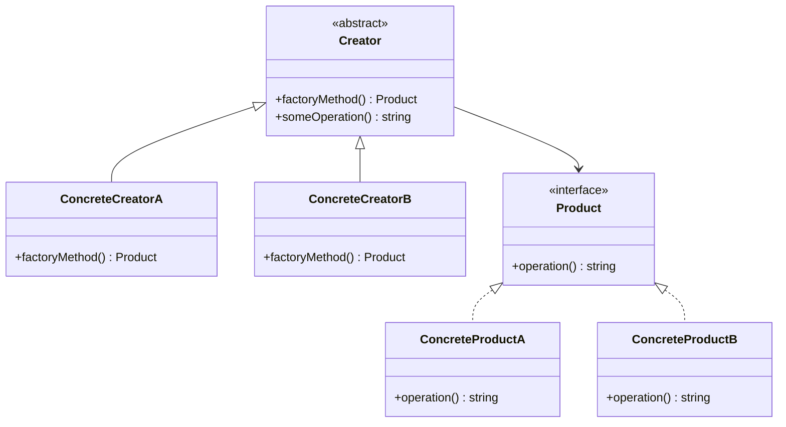

## 3.3.3 Implementation in TypeScript

In this section, we will delve into the implementation of the Factory Method pattern using TypeScript. This pattern is a creational design pattern that provides an interface for creating objects in a superclass but allows subclasses to alter the type of objects that will be created. TypeScript, with its powerful type system, interfaces, and generics, offers a robust environment for implementing this pattern with enhanced flexibility and type safety.

### Understanding the Factory Method Pattern

Before we dive into the implementation, let's briefly revisit the core concepts of the Factory Method pattern. The pattern involves two main components:

1. **Product Interface**: This defines the interface for objects that the factory method creates.
2. **Creator Class**: This class declares the factory method, which returns an object of type Product. Subclasses override this method to create specific products.

### Defining Product Interfaces and Creator Classes

In TypeScript, interfaces are used to define the structure of the objects that the factory method will create. Let's start by defining a simple product interface and an abstract creator class.

```typescript
// Define the Product interface
interface Product {
  operation(): string;
}

// Implement Concrete Products
class ConcreteProductA implements Product {
  public operation(): string {
    return 'Result of ConcreteProductA';
  }
}

class ConcreteProductB implements Product {
  public operation(): string {
    return 'Result of ConcreteProductB';
  }
}

// Define the Creator abstract class
abstract class Creator {
  // The factory method
  public abstract factoryMethod(): Product;

  // Some operation that uses the product
  public someOperation(): string {
    // Call the factory method to create a Product object
    const product = this.factoryMethod();
    // Now, use the product
    return `Creator: The same creator's code has just worked with ${product.operation()}`;
  }
}
```

### Implementing Concrete Creators

Concrete creators override the factory method to change the resulting product's type. Let's implement two concrete creators.

```typescript
// Concrete Creator A
class ConcreteCreatorA extends Creator {
  public factoryMethod(): Product {
    return new ConcreteProductA();
  }
}

// Concrete Creator B
class ConcreteCreatorB extends Creator {
  public factoryMethod(): Product {
    return new ConcreteProductB();
  }
}
```

### Using Generics for Flexibility

Generics in TypeScript allow us to create components that can work with a variety of data types while providing compile-time type safety. Let's enhance our factory method pattern with generics to increase its flexibility.

```typescript
// Generic Product interface
interface GenericProduct<T> {
  operation(): T;
}

// Generic Creator abstract class
abstract class GenericCreator<T> {
  public abstract factoryMethod(): GenericProduct<T>;

  public someOperation(): T {
    const product = this.factoryMethod();
    return product.operation();
  }
}

// Concrete Generic Product
class ConcreteGenericProduct implements GenericProduct<string> {
  public operation(): string {
    return 'Result of ConcreteGenericProduct';
  }
}

// Concrete Generic Creator
class ConcreteGenericCreator extends GenericCreator<string> {
  public factoryMethod(): GenericProduct<string> {
    return new ConcreteGenericProduct();
  }
}
```

### TypeScript's Type System and Contract Adherence

TypeScript's type system enforces contract adherence, ensuring that the objects created by the factory method conform to the expected interface. This helps catch errors at compile-time, providing a more robust and reliable codebase.

Consider the following scenario where a developer mistakenly tries to return an incorrect type from a factory method:

```typescript
class IncorrectProduct {
  public wrongOperation(): string {
    return 'This is not a valid product';
  }
}

class FaultyCreator extends Creator {
  public factoryMethod(): Product {
    // TypeScript will throw an error here
    return new IncorrectProduct(); // Error: Type 'IncorrectProduct' is not assignable to type 'Product'.
  }
}
```

### Code Snippets and Detailed Explanations

Let's break down the code snippets provided above to understand each component's role and how they fit together in the Factory Method pattern.

- **Product Interface**: Defines the operations that all concrete products must implement. This ensures that all products created by the factory method have a consistent interface.
- **Concrete Products**: Implement the Product interface, providing specific implementations of the operations defined in the interface.
- **Creator Class**: Declares the factory method that returns a Product object. It may also include some default implementation that relies on the product objects.
- **Concrete Creators**: Override the factory method to return specific concrete products. This allows the client code to remain decoupled from the concrete product classes.

### How TypeScript Aids in Identifying Errors

TypeScript's compile-time checks help identify errors early in the development process. For example, if a concrete creator returns an object that does not conform to the Product interface, TypeScript will throw a compile-time error, preventing potential runtime errors.

### Try It Yourself

To deepen your understanding, try modifying the code examples provided above. Here are some suggestions:

- Add a new product type and a corresponding concrete creator.
- Use generics to create a factory method that can produce products of different types based on input parameters.
- Experiment with TypeScript's type system by introducing intentional errors and observing how TypeScript helps catch them at compile-time.

### Visualizing the Factory Method Pattern

To better understand the relationships between the components of the Factory Method pattern, let's visualize it using a class diagram.



**Diagram Description**: This class diagram illustrates the Factory Method pattern. The `Creator` class declares the `factoryMethod` and `someOperation` methods. `ConcreteCreatorA` and `ConcreteCreatorB` are subclasses of `Creator` that implement the `factoryMethod` to return specific `Product` objects. `ConcreteProductA` and `ConcreteProductB` are implementations of the `Product` interface.

### References and Links

For further reading and a deeper dive into the Factory Method pattern and TypeScript, consider the following resources:

- [MDN Web Docs on TypeScript](https://developer.mozilla.org/en-US/docs/Web/JavaScript/Reference/Global_Objects/Promise)
- [TypeScript Handbook](https://www.typescriptlang.org/docs/handbook/intro.html)
- [Refactoring Guru: Factory Method Pattern](https://refactoring.guru/design-patterns/factory-method)

### Knowledge Check

To reinforce your understanding of the Factory Method pattern in TypeScript, consider the following questions:

- How does the Factory Method pattern promote loose coupling in software design?
- What are the advantages of using generics in the Factory Method pattern?
- How does TypeScript's type system enhance the implementation of design patterns?

### Embrace the Journey

Remember, mastering design patterns is a journey. As you continue to explore and experiment with different patterns, you'll gain a deeper understanding of how to apply them effectively in your projects. Keep experimenting, stay curious, and enjoy the journey!

## Quiz Time!



### What is the primary purpose of the Factory Method pattern?

- [x] To define an interface for creating objects, but allow subclasses to alter the type of objects that will be created.
- [ ] To provide a simplified interface to a complex subsystem.
- [ ] To compose objects into tree structures to represent part-whole hierarchies.
- [ ] To add responsibilities to objects dynamically.

> **Explanation:** The Factory Method pattern defines an interface for creating objects but allows subclasses to alter the type of objects that will be created.

### How does TypeScript's type system help in implementing the Factory Method pattern?

- [x] By enforcing contract adherence through interfaces and compile-time checks.
- [ ] By allowing dynamic typing and runtime type checking.
- [ ] By providing a simplified syntax for object creation.
- [ ] By enabling the use of decorators for object creation.

> **Explanation:** TypeScript's type system enforces contract adherence through interfaces and compile-time checks, ensuring that objects conform to expected types.

### What is a key benefit of using generics in the Factory Method pattern?

- [x] They enhance flexibility by allowing the factory method to work with various data types.
- [ ] They simplify the syntax of factory methods.
- [ ] They eliminate the need for interfaces in the pattern.
- [ ] They allow for runtime type checking.

> **Explanation:** Generics enhance flexibility by allowing the factory method to work with various data types while maintaining type safety.

### In the Factory Method pattern, what role does the Creator class play?

- [x] It declares the factory method that returns a Product object.
- [ ] It implements the Product interface.
- [ ] It composes objects into tree structures.
- [ ] It provides a simplified interface to a complex subsystem.

> **Explanation:** The Creator class declares the factory method that returns a Product object, allowing subclasses to override this method to create specific products.

### What is the advantage of using interfaces in the Factory Method pattern?

- [x] They define a consistent structure for products, ensuring contract adherence.
- [ ] They allow for dynamic typing and runtime type checking.
- [ ] They simplify the syntax of factory methods.
- [ ] They eliminate the need for concrete creators.

> **Explanation:** Interfaces define a consistent structure for products, ensuring that all products created by the factory method adhere to the expected contract.

### How does the Factory Method pattern promote loose coupling?

- [x] By decoupling the client code from concrete product classes.
- [ ] By providing a simplified interface to a complex subsystem.
- [ ] By composing objects into tree structures.
- [ ] By adding responsibilities to objects dynamically.

> **Explanation:** The Factory Method pattern promotes loose coupling by decoupling the client code from concrete product classes, allowing for more flexible and maintainable code.

### What is a potential drawback of the Factory Method pattern?

- [x] It can introduce complexity by requiring additional classes for each product type.
- [ ] It simplifies the code by eliminating the need for interfaces.
- [ ] It restricts the flexibility of the code by enforcing strict type adherence.
- [ ] It eliminates the need for concrete creators.

> **Explanation:** The Factory Method pattern can introduce complexity by requiring additional classes for each product type, which may increase the overall number of classes in the codebase.

### Why might you choose to use the Factory Method pattern in a project?

- [x] To provide a flexible and scalable way to create objects without specifying their concrete classes.
- [ ] To simplify the syntax of object creation.
- [ ] To eliminate the need for interfaces in the code.
- [ ] To provide a simplified interface to a complex subsystem.

> **Explanation:** The Factory Method pattern provides a flexible and scalable way to create objects without specifying their concrete classes, making it easier to extend and maintain the code.

### How does the Factory Method pattern relate to the Open/Closed Principle?

- [x] It allows the code to be open for extension but closed for modification by enabling new product types to be added without altering existing code.
- [ ] It simplifies the code by eliminating the need for interfaces.
- [ ] It restricts the flexibility of the code by enforcing strict type adherence.
- [ ] It eliminates the need for concrete creators.

> **Explanation:** The Factory Method pattern relates to the Open/Closed Principle by allowing the code to be open for extension but closed for modification, enabling new product types to be added without altering existing code.

### True or False: The Factory Method pattern can only be implemented using classes.

- [ ] True
- [x] False

> **Explanation:** False. While the Factory Method pattern is often implemented using classes, it can also be implemented using other constructs, such as functions, depending on the programming language and design requirements.


