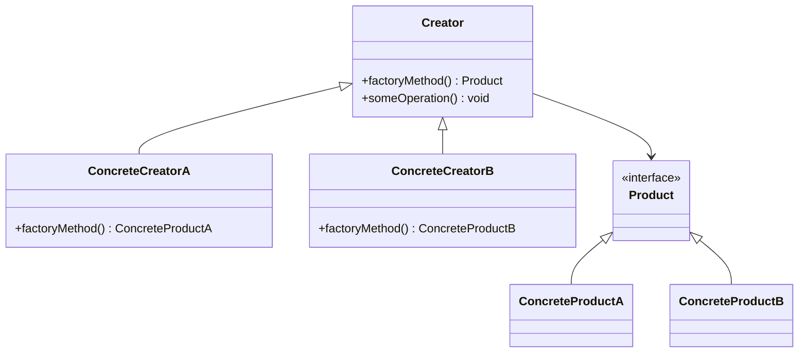
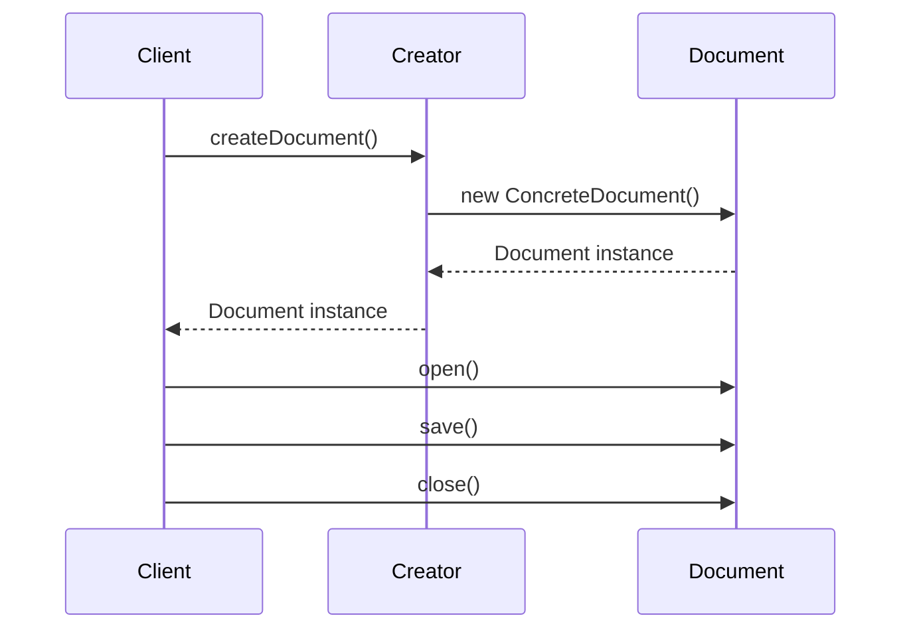

## 3.3.4 Use Cases and Examples

The Factory Method pattern is a creational design pattern that provides an interface for creating objects in a superclass but allows subclasses to alter the type of objects that will be created. This pattern is particularly useful when dealing with scenarios where the exact type of object to be created is determined at runtime. In this section, we'll explore practical examples of the Factory Method pattern in action, focusing on creating different types of documents in an application. We'll also discuss the benefits of this pattern in terms of extensibility and code maintenance.

### Understanding the Factory Method Pattern

Before diving into examples, let's briefly revisit the Factory Method pattern. The core idea is to define an interface for creating an object, but let subclasses decide which class to instantiate. The Factory Method lets a class defer instantiation to subclasses.

Here's a simple UML diagram to visualize the Factory Method pattern:



In this diagram, `Creator` is an abstract class that declares the factory method `factoryMethod`, which returns an object of type `Product`. `ConcreteCreatorA` and `ConcreteCreatorB` are subclasses that implement the factory method to return instances of `ConcreteProductA` and `ConcreteProductB`, respectively.

### Practical Example: Document Creation

Consider an application that needs to create different types of documents, such as PDFs, Word documents, and Excel spreadsheets. Using the Factory Method pattern, we can define a common interface for document creation and let subclasses decide which type of document to create.

#### Step 1: Define the Product Interface

First, we define an interface for the document:

```typescript
// Document.ts
interface Document {
    open(): void;
    save(): void;
    close(): void;
}
```

This interface declares methods that all document types must implement.

#### Step 2: Implement Concrete Products

Next, we implement concrete classes for each type of document:

```typescript
// PdfDocument.ts
class PdfDocument implements Document {
    open(): void {
        console.log("Opening PDF document...");
    }

    save(): void {
        console.log("Saving PDF document...");
    }

    close(): void {
        console.log("Closing PDF document...");
    }
}

// WordDocument.ts
class WordDocument implements Document {
    open(): void {
        console.log("Opening Word document...");
    }

    save(): void {
        console.log("Saving Word document...");
    }

    close(): void {
        console.log("Closing Word document...");
    }
}

// ExcelDocument.ts
class ExcelDocument implements Document {
    open(): void {
        console.log("Opening Excel spreadsheet...");
    }

    save(): void {
        console.log("Saving Excel spreadsheet...");
    }

    close(): void {
        console.log("Closing Excel spreadsheet...");
    }
}
```

Each class implements the `Document` interface and provides specific functionality for opening, saving, and closing the respective document type.

#### Step 3: Create the Creator Class

Now, we define an abstract creator class with a factory method:

```typescript
// DocumentCreator.ts
abstract class DocumentCreator {
    abstract createDocument(): Document;

    openDocument(): void {
        const doc = this.createDocument();
        doc.open();
    }

    saveDocument(): void {
        const doc = this.createDocument();
        doc.save();
    }

    closeDocument(): void {
        const doc = this.createDocument();
        doc.close();
    }
}
```

The `DocumentCreator` class declares the `createDocument` factory method, which returns a `Document` object. It also provides methods to open, save, and close documents, utilizing the factory method.

#### Step 4: Implement Concrete Creators

Finally, we implement concrete creator classes for each document type:

```typescript
// PdfDocumentCreator.ts
class PdfDocumentCreator extends DocumentCreator {
    createDocument(): Document {
        return new PdfDocument();
    }
}

// WordDocumentCreator.ts
class WordDocumentCreator extends DocumentCreator {
    createDocument(): Document {
        return new WordDocument();
    }
}

// ExcelDocumentCreator.ts
class ExcelDocumentCreator extends DocumentCreator {
    createDocument(): Document {
        return new ExcelDocument();
    }
}
```

Each concrete creator class overrides the `createDocument` method to return an instance of the corresponding document type.

#### Using the Factory Method Pattern

Let's see how we can use these classes in practice:

```typescript
function main() {
    const pdfCreator = new PdfDocumentCreator();
    pdfCreator.openDocument();
    pdfCreator.saveDocument();
    pdfCreator.closeDocument();

    const wordCreator = new WordDocumentCreator();
    wordCreator.openDocument();
    wordCreator.saveDocument();
    wordCreator.closeDocument();

    const excelCreator = new ExcelDocumentCreator();
    excelCreator.openDocument();
    excelCreator.saveDocument();
    excelCreator.closeDocument();
}

main();
```

In this example, we create instances of `PdfDocumentCreator`, `WordDocumentCreator`, and `ExcelDocumentCreator` to manage different document types. Each creator is responsible for creating and managing its specific document type.

### Benefits of the Factory Method Pattern

The Factory Method pattern offers several benefits, particularly in terms of extensibility and code maintenance:

1. **Extensibility**: Adding new document types is straightforward. We simply create a new document class and a corresponding creator class without modifying existing code. This adheres to the Open/Closed Principle, which states that software entities should be open for extension but closed for modification.

2. **Code Maintenance**: The pattern centralizes the creation logic, making it easier to manage and update. If the document creation process changes, we only need to update the factory method in the relevant creator class.

3. **Decoupling**: The pattern decouples the client code from the concrete classes it needs to instantiate. This reduces dependencies and enhances flexibility.

4. **Single Responsibility**: Each creator class has a single responsibility: to create a specific type of document. This aligns with the Single Responsibility Principle, which states that a class should have only one reason to change.

### Visualizing the Factory Method Pattern

To better understand how the Factory Method pattern works, let's visualize the process of creating different document types using a sequence diagram:



In this sequence diagram, the client requests a document from the creator. The creator uses the factory method to instantiate the appropriate document type and returns it to the client. The client then interacts with the document instance.

### Try It Yourself

To deepen your understanding of the Factory Method pattern, try modifying the code examples:

- **Add a New Document Type**: Implement a new document type, such as a `PowerPointDocument`, and create a corresponding `PowerPointDocumentCreator`. Update the `main` function to use the new creator.

- **Enhance Document Functionality**: Add additional methods to the `Document` interface, such as `print` or `export`, and implement these methods in each document class.

- **Refactor the Creator Class**: Experiment with different ways to refactor the `DocumentCreator` class to improve code readability or performance.

### Knowledge Check

Before we conclude, let's pose a few questions to reinforce your understanding of the Factory Method pattern:

- What is the primary purpose of the Factory Method pattern?
- How does the Factory Method pattern adhere to the Open/Closed Principle?
- What are the benefits of using the Factory Method pattern in terms of code maintenance?
- How can you add a new product type using the Factory Method pattern without modifying existing code?

### Conclusion

The Factory Method pattern is a powerful tool for managing object creation in a flexible and extensible manner. By defining a common interface for creating objects and allowing subclasses to determine the specific object types, this pattern promotes code maintainability and adherence to design principles. As you continue to explore design patterns, remember that the Factory Method pattern is just one of many techniques available to help you write more scalable and maintainable code.

## Quiz Time!



### What is the primary purpose of the Factory Method pattern?

- [x] To define an interface for creating objects, allowing subclasses to decide which class to instantiate.
- [ ] To create a single instance of a class.
- [ ] To manage complex object hierarchies.
- [ ] To provide a simplified interface to a complex subsystem.

> **Explanation:** The Factory Method pattern defines an interface for creating objects but lets subclasses decide which class to instantiate, promoting flexibility and extensibility.

### How does the Factory Method pattern adhere to the Open/Closed Principle?

- [x] By allowing new product types to be added without modifying existing code.
- [ ] By ensuring that only one instance of a class is created.
- [ ] By providing a simplified interface to a complex subsystem.
- [ ] By managing complex object hierarchies.

> **Explanation:** The Factory Method pattern adheres to the Open/Closed Principle by allowing new product types to be added through new subclasses without modifying existing code.

### What are the benefits of using the Factory Method pattern in terms of code maintenance?

- [x] Centralizes creation logic, making it easier to manage and update.
- [ ] Ensures only one instance of a class is created.
- [ ] Provides a simplified interface to a complex subsystem.
- [ ] Manages complex object hierarchies.

> **Explanation:** The Factory Method pattern centralizes creation logic, making it easier to manage and update, which enhances code maintainability.

### How can you add a new product type using the Factory Method pattern without modifying existing code?

- [x] By creating a new product class and a corresponding creator class.
- [ ] By modifying the existing product classes.
- [ ] By changing the factory method in the existing creator class.
- [ ] By updating the client code to handle the new product type.

> **Explanation:** To add a new product type, you create a new product class and a corresponding creator class, adhering to the Open/Closed Principle.

### Which of the following is a benefit of the Factory Method pattern?

- [x] Decouples client code from concrete classes.
- [ ] Ensures only one instance of a class is created.
- [ ] Provides a simplified interface to a complex subsystem.
- [ ] Manages complex object hierarchies.

> **Explanation:** The Factory Method pattern decouples client code from concrete classes, reducing dependencies and enhancing flexibility.

### What is the role of the creator class in the Factory Method pattern?

- [x] To declare the factory method and manage object creation.
- [ ] To implement the product interface.
- [ ] To provide a simplified interface to a complex subsystem.
- [ ] To manage complex object hierarchies.

> **Explanation:** The creator class declares the factory method and manages object creation, allowing subclasses to determine the specific object types.

### How does the Factory Method pattern promote the Single Responsibility Principle?

- [x] By ensuring each creator class has a single responsibility: creating a specific type of product.
- [ ] By centralizing creation logic in a single class.
- [ ] By providing a simplified interface to a complex subsystem.
- [ ] By managing complex object hierarchies.

> **Explanation:** The Factory Method pattern promotes the Single Responsibility Principle by ensuring each creator class has a single responsibility: creating a specific type of product.

### What is a common use case for the Factory Method pattern?

- [x] Creating different types of documents in an application.
- [ ] Managing complex object hierarchies.
- [ ] Providing a simplified interface to a complex subsystem.
- [ ] Ensuring only one instance of a class is created.

> **Explanation:** A common use case for the Factory Method pattern is creating different types of documents in an application, where the exact type is determined at runtime.

### What is the main advantage of using the Factory Method pattern for extensibility?

- [x] New product types can be added without modifying existing code.
- [ ] Ensures only one instance of a class is created.
- [ ] Provides a simplified interface to a complex subsystem.
- [ ] Manages complex object hierarchies.

> **Explanation:** The main advantage of using the Factory Method pattern for extensibility is that new product types can be added without modifying existing code, adhering to the Open/Closed Principle.

### True or False: The Factory Method pattern is only applicable to document creation scenarios.

- [ ] True
- [x] False

> **Explanation:** False. The Factory Method pattern is not limited to document creation scenarios; it can be applied to any situation where the exact type of object to be created is determined at runtime.



Remember, this is just the beginning. As you progress, you'll build more complex and interactive applications. Keep experimenting, stay curious, and enjoy the journey!
