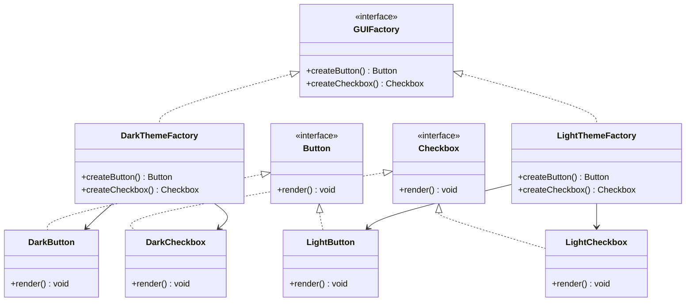

## 3.4.1 Intent and Motivation

The Abstract Factory Pattern is a creational design pattern that provides an interface for creating families of related or dependent objects without specifying their concrete classes. This pattern is particularly useful in systems where a series of related products need to be created, ensuring that these products are compatible with each other. By abstracting the creation process, the pattern promotes consistency and scalability, making it easier to manage complex systems.

### Understanding the Abstract Factory Pattern

To fully grasp the intent and motivation behind the Abstract Factory Pattern, let's start by defining it in the context of software design. The pattern involves an interface or an abstract class that declares a set of methods for creating abstract products. Concrete implementations of this interface or class are responsible for producing specific products that belong to a family.

#### The Problem It Addresses

In software systems, especially those with a graphical user interface (GUI), there is often a need to create families of objects that are related by theme or functionality. For instance, consider a GUI toolkit that supports multiple themes, such as dark mode and light mode. Each theme requires a consistent set of components, like buttons, checkboxes, and text fields, that adhere to the theme's design guidelines.

Without the Abstract Factory Pattern, developers might resort to creating separate classes for each component in every theme, leading to a proliferation of classes and a maintenance nightmare. Moreover, ensuring that components from different themes are not mixed inadvertently becomes a cumbersome task.

#### Promoting Consistency Among Products

The Abstract Factory Pattern addresses these challenges by providing a way to encapsulate a group of individual factories that share a common theme. This ensures that the products created by these factories are consistent with each other. For example, when a dark theme factory is used, it produces a dark-themed button, checkbox, and text field, ensuring that the entire GUI adheres to the dark theme.

By using this pattern, developers can easily switch between different families of products without altering the client code. This promotes flexibility and consistency, as the client code interacts with the abstract factory interface rather than the concrete classes.

### Real-World Analogy

To better illustrate the Abstract Factory Pattern, consider a real-world analogy of a car manufacturing plant. Imagine a plant that produces different types of cars, such as sedans and SUVs. Each type of car requires a specific set of components, like engines, wheels, and interiors, that are tailored to the car's design and functionality.

In this analogy, the car manufacturing plant acts as the abstract factory, while the different assembly lines for sedans and SUVs represent the concrete factories. Each assembly line produces a family of related components that are compatible with the type of car being manufactured. This ensures that a sedan's components are not mixed with those of an SUV, maintaining consistency and quality.

### Comparing Abstract Factory with Factory Method

While both the Abstract Factory and Factory Method patterns are creational patterns used to abstract the instantiation process, they serve different purposes and are used in different scenarios.

- **Factory Method Pattern**: This pattern defines an interface for creating an object but allows subclasses to alter the type of objects that will be created. It's used when there's a need to delegate the instantiation process to subclasses, allowing them to decide which class to instantiate.

- **Abstract Factory Pattern**: In contrast, the Abstract Factory Pattern provides an interface for creating families of related objects. It is used when there is a need to create a set of related products that must be used together. The pattern ensures that the products are compatible and consistent with each other.

In essence, the Factory Method Pattern is more focused on creating a single product, while the Abstract Factory Pattern is concerned with creating a family of related products. The Abstract Factory Pattern is particularly useful in scenarios where the system needs to be independent of how its objects are created, composed, and represented.

### Code Example: Abstract Factory Pattern in JavaScript

Let's explore a practical example of the Abstract Factory Pattern in JavaScript. We'll create a simple GUI toolkit that supports two themes: dark mode and light mode. Each theme will have its own set of components, such as buttons and checkboxes.

```javascript
// Abstract Factory
class GUIFactory {
  createButton() {
    throw new Error("This method must be overridden!");
  }

  createCheckbox() {
    throw new Error("This method must be overridden!");
  }
}

// Concrete Factory for Dark Theme
class DarkThemeFactory extends GUIFactory {
  createButton() {
    return new DarkButton();
  }

  createCheckbox() {
    return new DarkCheckbox();
  }
}

// Concrete Factory for Light Theme
class LightThemeFactory extends GUIFactory {
  createButton() {
    return new LightButton();
  }

  createCheckbox() {
    return new LightCheckbox();
  }
}

// Abstract Product: Button
class Button {
  render() {
    throw new Error("This method must be overridden!");
  }
}

// Concrete Product: Dark Button
class DarkButton extends Button {
  render() {
    console.log("Rendering a dark-themed button.");
  }
}

// Concrete Product: Light Button
class LightButton extends Button {
  render() {
    console.log("Rendering a light-themed button.");
  }
}

// Abstract Product: Checkbox
class Checkbox {
  render() {
    throw new Error("This method must be overridden!");
  }
}

// Concrete Product: Dark Checkbox
class DarkCheckbox extends Checkbox {
  render() {
    console.log("Rendering a dark-themed checkbox.");
  }
}

// Concrete Product: Light Checkbox
class LightCheckbox extends Checkbox {
  render() {
    console.log("Rendering a light-themed checkbox.");
  }
}

// Client Code
function renderUI(factory) {
  const button = factory.createButton();
  const checkbox = factory.createCheckbox();

  button.render();
  checkbox.render();
}

// Usage
const darkFactory = new DarkThemeFactory();
renderUI(darkFactory);

const lightFactory = new LightThemeFactory();
renderUI(lightFactory);
```

In this example, we defined an abstract factory `GUIFactory` with methods `createButton` and `createCheckbox`. The concrete factories `DarkThemeFactory` and `LightThemeFactory` implement these methods to produce dark-themed and light-themed components, respectively. The client code uses these factories to render the UI components, ensuring consistency within each theme.

### Code Example: Abstract Factory Pattern in TypeScript

Now, let's implement the same example using TypeScript to leverage its strong typing capabilities.

```typescript
// Abstract Factory
interface GUIFactory {
  createButton(): Button;
  createCheckbox(): Checkbox;
}

// Concrete Factory for Dark Theme
class DarkThemeFactory implements GUIFactory {
  createButton(): Button {
    return new DarkButton();
  }

  createCheckbox(): Checkbox {
    return new DarkCheckbox();
  }
}

// Concrete Factory for Light Theme
class LightThemeFactory implements GUIFactory {
  createButton(): Button {
    return new LightButton();
  }

  createCheckbox(): Checkbox {
    return new LightCheckbox();
  }
}

// Abstract Product: Button
interface Button {
  render(): void;
}

// Concrete Product: Dark Button
class DarkButton implements Button {
  render(): void {
    console.log("Rendering a dark-themed button.");
  }
}

// Concrete Product: Light Button
class LightButton implements Button {
  render(): void {
    console.log("Rendering a light-themed button.");
  }
}

// Abstract Product: Checkbox
interface Checkbox {
  render(): void;
}

// Concrete Product: Dark Checkbox
class DarkCheckbox implements Checkbox {
  render(): void {
    console.log("Rendering a dark-themed checkbox.");
  }
}

// Concrete Product: Light Checkbox
class LightCheckbox implements Checkbox {
  render(): void {
    console.log("Rendering a light-themed checkbox.");
  }
}

// Client Code
function renderUI(factory: GUIFactory): void {
  const button = factory.createButton();
  const checkbox = factory.createCheckbox();

  button.render();
  checkbox.render();
}

// Usage
const darkFactory: GUIFactory = new DarkThemeFactory();
renderUI(darkFactory);

const lightFactory: GUIFactory = new LightThemeFactory();
renderUI(lightFactory);
```

In the TypeScript example, we used interfaces to define the abstract factory and product types. This ensures that the concrete factories and products adhere to the expected structure, providing compile-time type checking and reducing runtime errors.

### Visualizing the Abstract Factory Pattern

To further enhance our understanding, let's visualize the Abstract Factory Pattern using a class diagram. This diagram illustrates the relationships between the abstract factory, concrete factories, abstract products, and concrete products.



**Diagram Description**: This class diagram represents the Abstract Factory Pattern. The `GUIFactory` interface defines the methods for creating abstract products (`Button` and `Checkbox`). The `DarkThemeFactory` and `LightThemeFactory` classes implement the `GUIFactory` interface to produce concrete products (`DarkButton`, `LightButton`, `DarkCheckbox`, and `LightCheckbox`).

### Try It Yourself

Now that we've explored the Abstract Factory Pattern, let's encourage you to experiment with the code examples. Try modifying the code to add a new theme, such as a "High Contrast" theme, with its own set of components. This exercise will help reinforce your understanding of the pattern and its flexibility.

### Knowledge Check

Before we conclude, let's pose a few questions to test your understanding of the Abstract Factory Pattern:

1. What is the primary intent of the Abstract Factory Pattern?
2. How does the Abstract Factory Pattern promote consistency among products?
3. In what scenarios is the Abstract Factory Pattern particularly useful?
4. How does the Abstract Factory Pattern differ from the Factory Method Pattern?
5. What are the benefits of using interfaces in the TypeScript implementation of the Abstract Factory Pattern?

### Embrace the Journey

Remember, mastering design patterns is a journey that requires practice and experimentation. As you continue to explore and apply these patterns, you'll gain a deeper understanding of how they can enhance your software design. Keep experimenting, stay curious, and enjoy the journey!

## Quiz Time!



### What is the primary intent of the Abstract Factory Pattern?

- [x] Provide an interface for creating families of related or dependent objects without specifying their concrete classes.
- [ ] Define a single method for creating an object.
- [ ] Allow subclasses to alter the type of objects that will be created.
- [ ] Create a single instance of a class.

> **Explanation:** The Abstract Factory Pattern provides an interface for creating families of related or dependent objects without specifying their concrete classes.

### How does the Abstract Factory Pattern promote consistency among products?

- [x] By ensuring that products created by the factories are compatible with each other.
- [ ] By allowing any product to be mixed with others.
- [ ] By creating only one type of product.
- [ ] By using a single factory for all products.

> **Explanation:** The Abstract Factory Pattern promotes consistency by ensuring that products created by the factories are compatible with each other.

### In what scenarios is the Abstract Factory Pattern particularly useful?

- [x] When a system needs to create a set of related products that must be used together.
- [ ] When only one product needs to be created.
- [ ] When products are unrelated.
- [ ] When the system does not require any products.

> **Explanation:** The Abstract Factory Pattern is useful when a system needs to create a set of related products that must be used together.

### How does the Abstract Factory Pattern differ from the Factory Method Pattern?

- [x] The Abstract Factory Pattern provides an interface for creating families of related objects, while the Factory Method Pattern focuses on creating a single product.
- [ ] The Abstract Factory Pattern creates a single product, while the Factory Method Pattern creates families of related objects.
- [ ] Both patterns are identical in functionality.
- [ ] The Factory Method Pattern is used for unrelated products.

> **Explanation:** The Abstract Factory Pattern provides an interface for creating families of related objects, while the Factory Method Pattern focuses on creating a single product.

### What are the benefits of using interfaces in the TypeScript implementation of the Abstract Factory Pattern?

- [x] Ensures that the concrete factories and products adhere to the expected structure.
- [ ] Allows for runtime errors.
- [ ] Reduces flexibility in the code.
- [ ] Increases the number of classes needed.

> **Explanation:** Using interfaces ensures that the concrete factories and products adhere to the expected structure, providing compile-time type checking and reducing runtime errors.

### What is a real-world analogy for the Abstract Factory Pattern?

- [x] A car manufacturing plant with different assembly lines for sedans and SUVs.
- [ ] A single bakery producing one type of bread.
- [ ] A library with only one type of book.
- [ ] A single restaurant serving one dish.

> **Explanation:** A car manufacturing plant with different assembly lines for sedans and SUVs is a real-world analogy for the Abstract Factory Pattern.

### How does the Abstract Factory Pattern ensure flexibility in the client code?

- [x] By allowing the client code to interact with the abstract factory interface rather than concrete classes.
- [ ] By hardcoding the product types in the client code.
- [ ] By using only one type of product.
- [ ] By mixing products from different families.

> **Explanation:** The Abstract Factory Pattern ensures flexibility by allowing the client code to interact with the abstract factory interface rather than concrete classes.

### What is the role of the abstract factory in the pattern?

- [x] To declare a set of methods for creating abstract products.
- [ ] To create only one product.
- [ ] To define concrete product classes.
- [ ] To mix products from different families.

> **Explanation:** The abstract factory declares a set of methods for creating abstract products.

### Why is the Abstract Factory Pattern considered a creational pattern?

- [x] Because it deals with object creation processes.
- [ ] Because it modifies existing objects.
- [ ] Because it deletes objects.
- [ ] Because it only works with singletons.

> **Explanation:** The Abstract Factory Pattern is considered a creational pattern because it deals with object creation processes.

### True or False: The Abstract Factory Pattern can be used to create unrelated products.

- [ ] True
- [x] False

> **Explanation:** False. The Abstract Factory Pattern is used to create families of related or dependent objects.


