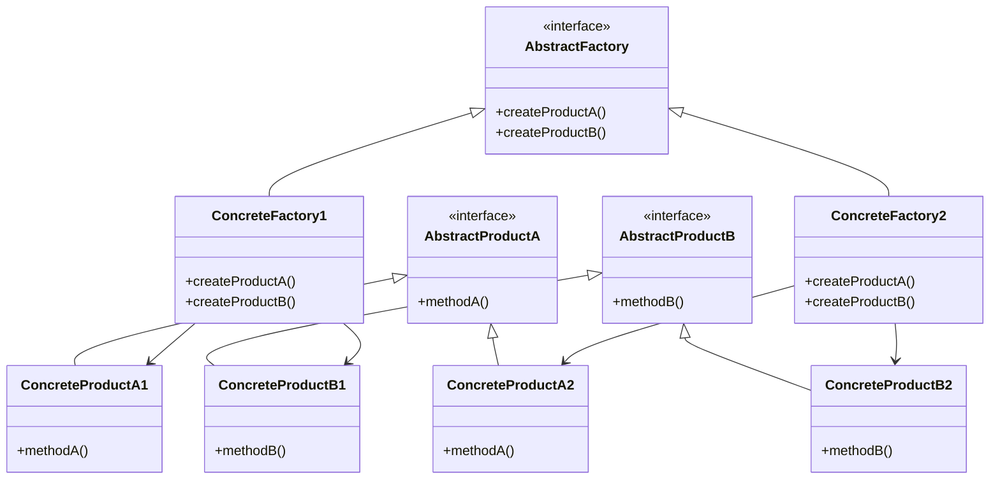

## 3.4.2 Implementation in JavaScript

In this section, we will delve into the Abstract Factory Pattern, a creational design pattern that provides an interface for creating families of related or dependent objects without specifying their concrete classes. This pattern is particularly useful when you need to ensure that the products created by a factory are compatible with each other.

### Understanding the Abstract Factory Pattern

The Abstract Factory Pattern is a step beyond the Factory Method Pattern. While the Factory Method Pattern deals with creating a single product, the Abstract Factory Pattern focuses on creating families of related products. The key idea is to provide a way to encapsulate a group of individual factories that have a common theme.

Let's break down the components of the Abstract Factory Pattern:

1. **Abstract Factory**: An interface with methods for creating each type of product.
2. **Concrete Factory**: Implements the Abstract Factory interface to create concrete products.
3. **Abstract Product**: An interface for a type of product.
4. **Concrete Product**: Implements the Abstract Product interface.

### Structuring Abstract Factories in JavaScript

JavaScript, being a dynamically typed language, does not have interfaces in the traditional sense. However, we can simulate interfaces using classes and objects. Let's start by defining an abstract factory structure in JavaScript.

#### Defining Abstract Products

First, we define abstract products. These are essentially interfaces that concrete products must implement.

```javascript
// Abstract Product A
class AbstractProductA {
    constructor() {
        if (new.target === AbstractProductA) {
            throw new TypeError("Cannot construct AbstractProductA instances directly");
        }
    }

    methodA() {
        throw new Error("Method 'methodA()' must be implemented.");
    }
}

// Abstract Product B
class AbstractProductB {
    constructor() {
        if (new.target === AbstractProductB) {
            throw new TypeError("Cannot construct AbstractProductB instances directly");
        }
    }

    methodB() {
        throw new Error("Method 'methodB()' must be implemented.");
    }
}
```

#### Implementing Concrete Products

Concrete products implement the abstract product interfaces. Each product family will have its own set of concrete products.

```javascript
// Concrete Product A1
class ConcreteProductA1 extends AbstractProductA {
    methodA() {
        console.log("ConcreteProductA1 methodA");
    }
}

// Concrete Product A2
class ConcreteProductA2 extends AbstractProductA {
    methodA() {
        console.log("ConcreteProductA2 methodA");
    }
}

// Concrete Product B1
class ConcreteProductB1 extends AbstractProductB {
    methodB() {
        console.log("ConcreteProductB1 methodB");
    }
}

// Concrete Product B2
class ConcreteProductB2 extends AbstractProductB {
    methodB() {
        console.log("ConcreteProductB2 methodB");
    }
}
```

#### Creating the Abstract Factory

The abstract factory defines methods for creating each type of product. In JavaScript, we can use a class to represent this factory.

```javascript
class AbstractFactory {
    constructor() {
        if (new.target === AbstractFactory) {
            throw new TypeError("Cannot construct AbstractFactory instances directly");
        }
    }

    createProductA() {
        throw new Error("Method 'createProductA()' must be implemented.");
    }

    createProductB() {
        throw new Error("Method 'createProductB()' must be implemented.");
    }
}
```

#### Implementing Concrete Factories

Concrete factories implement the abstract factory interface to create concrete products. Each factory is responsible for creating a family of products.

```javascript
// Concrete Factory 1
class ConcreteFactory1 extends AbstractFactory {
    createProductA() {
        return new ConcreteProductA1();
    }

    createProductB() {
        return new ConcreteProductB1();
    }
}

// Concrete Factory 2
class ConcreteFactory2 extends AbstractFactory {
    createProductA() {
        return new ConcreteProductA2();
    }

    createProductB() {
        return new ConcreteProductB2();
    }
}
```

### Ensuring Product Compatibility

One of the main advantages of the Abstract Factory Pattern is that it ensures that products created by a factory are compatible with each other. This is achieved by having each concrete factory produce products that are designed to work together.

For example, if `ConcreteFactory1` produces `ConcreteProductA1` and `ConcreteProductB1`, these products are designed to be used together. Similarly, `ConcreteFactory2` produces `ConcreteProductA2` and `ConcreteProductB2`, which are also compatible with each other.

### Handling Dependencies Between Products

In some cases, products created by a factory may have dependencies on each other. The Abstract Factory Pattern can handle these dependencies by ensuring that each factory creates a complete set of compatible products.

Let's consider a scenario where `ProductA` and `ProductB` need to interact with each other. We can define methods in the abstract products to facilitate this interaction.

```javascript
// Abstract Product A with dependency on Product B
class AbstractProductA {
    constructor() {
        if (new.target === AbstractProductA) {
            throw new TypeError("Cannot construct AbstractProductA instances directly");
        }
    }

    methodA(productB) {
        throw new Error("Method 'methodA()' must be implemented.");
    }
}

// Concrete Product A1 with dependency on Product B
class ConcreteProductA1 extends AbstractProductA {
    methodA(productB) {
        console.log("ConcreteProductA1 interacting with " + productB.methodB());
    }
}

// Concrete Product B1
class ConcreteProductB1 extends AbstractProductB {
    methodB() {
        return "ConcreteProductB1";
    }
}
```

### Advantages and Challenges in JavaScript

The Abstract Factory Pattern offers several advantages, especially in JavaScript:

- **Flexibility**: It allows for easy swapping of product families without altering the client code.
- **Scalability**: New product families can be added with minimal changes to the existing codebase.
- **Encapsulation**: It encapsulates the creation logic, promoting separation of concerns.

However, there are also challenges:

- **Complexity**: The pattern can introduce additional complexity, especially if there are many product families.
- **Overhead**: Implementing the pattern can lead to increased code overhead, which may not be justified for simple applications.

### Try It Yourself

To better understand the Abstract Factory Pattern, try modifying the code examples provided:

- **Create a new product family**: Add a new concrete factory and corresponding products.
- **Introduce dependencies**: Modify the products to depend on each other and see how the pattern handles these dependencies.
- **Experiment with compatibility**: Ensure that products from different factories are not compatible with each other.

### Visualizing the Abstract Factory Pattern

To help visualize the Abstract Factory Pattern, let's use a class diagram to represent the relationships between the abstract factory, concrete factories, abstract products, and concrete products.



This diagram illustrates how the abstract factory pattern organizes the creation of product families, ensuring that each factory produces a compatible set of products.

### References and Further Reading

- [MDN Web Docs: Classes](https://developer.mozilla.org/en-US/docs/Web/JavaScript/Reference/Classes)
- [W3Schools: JavaScript Classes](https://www.w3schools.com/js/js_classes.asp)
- [Refactoring Guru: Abstract Factory Pattern](https://refactoring.guru/design-patterns/abstract-factory)

### Knowledge Check

Before we conclude, let's reinforce our understanding of the Abstract Factory Pattern with some questions:

- What are the main components of the Abstract Factory Pattern?
- How does the Abstract Factory Pattern ensure product compatibility?
- What are some advantages and challenges of using the Abstract Factory Pattern in JavaScript?

### Embrace the Journey

Remember, mastering design patterns is a journey. As you continue to explore and implement these patterns, you'll gain a deeper understanding of how to create flexible, scalable, and maintainable code. Keep experimenting, stay curious, and enjoy the journey!

## Quiz Time!



### What is the primary purpose of the Abstract Factory Pattern?

- [x] To create families of related or dependent objects without specifying their concrete classes.
- [ ] To create a single object with a specific interface.
- [ ] To provide a way to access the elements of an aggregate object sequentially.
- [ ] To define the skeleton of an algorithm in a method.

> **Explanation:** The Abstract Factory Pattern is used to create families of related or dependent objects without specifying their concrete classes.

### Which of the following is NOT a component of the Abstract Factory Pattern?

- [ ] Abstract Factory
- [ ] Concrete Factory
- [ ] Abstract Product
- [x] Singleton Factory

> **Explanation:** The Singleton Factory is not a component of the Abstract Factory Pattern. The pattern includes Abstract Factory, Concrete Factory, and Abstract Product.

### How does the Abstract Factory Pattern ensure product compatibility?

- [x] By having each concrete factory produce products designed to work together.
- [ ] By using a singleton pattern to manage product instances.
- [ ] By implementing a global variable to track product compatibility.
- [ ] By using a mediator to coordinate product interactions.

> **Explanation:** The Abstract Factory Pattern ensures product compatibility by having each concrete factory produce products that are designed to work together.

### What is a challenge of using the Abstract Factory Pattern in JavaScript?

- [x] Increased complexity and code overhead.
- [ ] Lack of flexibility in product creation.
- [ ] Difficulty in maintaining encapsulation.
- [ ] Inability to create new product families.

> **Explanation:** A challenge of using the Abstract Factory Pattern in JavaScript is the increased complexity and code overhead, especially when dealing with many product families.

### Which of the following best describes a Concrete Factory?

- [x] A class that implements the abstract factory interface to create concrete products.
- [ ] A class that defines the skeleton of an algorithm.
- [ ] A class that provides a simplified interface to a complex subsystem.
- [ ] A class that encapsulates a request as an object.

> **Explanation:** A Concrete Factory is a class that implements the abstract factory interface to create concrete products.

### What is a benefit of using the Abstract Factory Pattern?

- [x] It allows for easy swapping of product families without altering client code.
- [ ] It reduces the number of classes needed in the application.
- [ ] It simplifies the creation of singleton objects.
- [ ] It eliminates the need for interfaces in JavaScript.

> **Explanation:** A benefit of using the Abstract Factory Pattern is that it allows for easy swapping of product families without altering client code.

### In the Abstract Factory Pattern, what role does the Abstract Product play?

- [x] It serves as an interface for a type of product.
- [ ] It creates concrete products.
- [ ] It defines the sequence of operations to perform.
- [ ] It acts as a mediator between different products.

> **Explanation:** In the Abstract Factory Pattern, the Abstract Product serves as an interface for a type of product.

### How can you simulate interfaces in JavaScript?

- [x] By using classes and objects.
- [ ] By using global variables.
- [ ] By using the singleton pattern.
- [ ] By using event listeners.

> **Explanation:** In JavaScript, you can simulate interfaces by using classes and objects.

### What is the role of the Concrete Product in the Abstract Factory Pattern?

- [x] It implements the abstract product interface.
- [ ] It defines the sequence of operations to perform.
- [ ] It provides a simplified interface to a complex subsystem.
- [ ] It encapsulates a request as an object.

> **Explanation:** The role of the Concrete Product in the Abstract Factory Pattern is to implement the abstract product interface.

### True or False: The Abstract Factory Pattern can handle dependencies between products.

- [x] True
- [ ] False

> **Explanation:** True. The Abstract Factory Pattern can handle dependencies between products by ensuring that each factory creates a complete set of compatible products.


