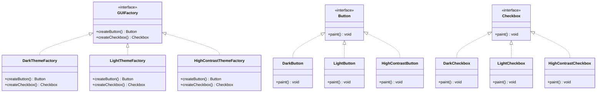

## 3.4.3 Implementation in TypeScript

In this section, we will delve into the implementation of the Abstract Factory Pattern using TypeScript. This pattern is a creational design pattern that provides an interface for creating families of related or dependent objects without specifying their concrete classes. By leveraging TypeScript's static typing and interfaces, we can enhance the robustness and scalability of our code.

### Understanding the Abstract Factory Pattern

The Abstract Factory Pattern involves creating an interface for a factory that can produce different types of related objects. These objects are part of a product family, and the factory ensures that the products are compatible with each other. This pattern is particularly useful when a system needs to be independent of how its objects are created, composed, and represented.

#### Key Components of the Abstract Factory Pattern

1. **Abstract Factory Interface**: Declares a set of methods for creating each of the abstract products.
2. **Concrete Factory Classes**: Implement the creation methods of the abstract factory to produce concrete products.
3. **Abstract Product Interfaces**: Declare interfaces for a set of related products.
4. **Concrete Product Classes**: Implement the abstract product interfaces.

### Implementing the Abstract Factory Pattern in TypeScript

Let's explore how to implement the Abstract Factory Pattern in TypeScript by defining interfaces and classes for a family of products.

#### Step 1: Define Abstract Product Interfaces

First, we define interfaces for the products. Let's consider a scenario where we have a UI component library with different themes. Each theme provides a set of components like buttons and checkboxes.

```typescript
// Abstract Product A
interface Button {
    paint(): void;
}

// Abstract Product B
interface Checkbox {
    paint(): void;
}
```

These interfaces define the operations that all concrete products must implement.

#### Step 2: Create Concrete Product Classes

Next, we implement the concrete product classes for each theme. For simplicity, we'll implement two themes: Dark and Light.

```typescript
// Concrete Product A1
class DarkButton implements Button {
    paint(): void {
        console.log('Rendering a dark-themed button.');
    }
}

// Concrete Product B1
class DarkCheckbox implements Checkbox {
    paint(): void {
        console.log('Rendering a dark-themed checkbox.');
    }
}

// Concrete Product A2
class LightButton implements Button {
    paint(): void {
        console.log('Rendering a light-themed button.');
    }
}

// Concrete Product B2
class LightCheckbox implements Checkbox {
    paint(): void {
        console.log('Rendering a light-themed checkbox.');
    }
}
```

Each concrete product class implements the corresponding abstract product interface.

#### Step 3: Define the Abstract Factory Interface

The abstract factory interface declares methods for creating each type of product.

```typescript
interface GUIFactory {
    createButton(): Button;
    createCheckbox(): Checkbox;
}
```

This interface ensures that all concrete factories provide methods to create the entire family of products.

#### Step 4: Implement Concrete Factory Classes

Concrete factories implement the abstract factory interface to create specific products.

```typescript
// Concrete Factory 1
class DarkThemeFactory implements GUIFactory {
    createButton(): Button {
        return new DarkButton();
    }

    createCheckbox(): Checkbox {
        return new DarkCheckbox();
    }
}

// Concrete Factory 2
class LightThemeFactory implements GUIFactory {
    createButton(): Button {
        return new LightButton();
    }

    createCheckbox(): Checkbox {
        return new LightCheckbox();
    }
}
```

Each concrete factory is responsible for creating products of a specific theme.

#### Step 5: Client Code

The client code works with factories and products only through their abstract interfaces. This allows the client to remain independent of the concrete classes.

```typescript
function renderUI(factory: GUIFactory) {
    const button = factory.createButton();
    const checkbox = factory.createCheckbox();

    button.paint();
    checkbox.paint();
}

// Usage
const darkFactory: GUIFactory = new DarkThemeFactory();
renderUI(darkFactory);

const lightFactory: GUIFactory = new LightThemeFactory();
renderUI(lightFactory);
```

In this example, the `renderUI` function takes a factory as a parameter and uses it to create and render UI components. The client code is not aware of the specific classes of the products it works with.

### Benefits of Using TypeScript for the Abstract Factory Pattern

TypeScript's static typing and interfaces provide several benefits when implementing the Abstract Factory Pattern:

1. **Type Safety**: TypeScript ensures that the correct types are used throughout the code, reducing runtime errors.
2. **Code Completion and Refactoring**: IDEs can provide better code completion and refactoring tools due to TypeScript's type annotations.
3. **Consistent Product Creation**: Interfaces ensure that all products in a family adhere to a consistent contract, making it easier to switch between different product families.

### Adding New Product Families

One of the significant advantages of the Abstract Factory Pattern is the ease of adding new product families. To add a new theme, we simply need to create new concrete product classes and a new concrete factory.

For example, let's add a "HighContrast" theme:

```typescript
// Concrete Product A3
class HighContrastButton implements Button {
    paint(): void {
        console.log('Rendering a high-contrast button.');
    }
}

// Concrete Product B3
class HighContrastCheckbox implements Checkbox {
    paint(): void {
        console.log('Rendering a high-contrast checkbox.');
    }
}

// Concrete Factory 3
class HighContrastThemeFactory implements GUIFactory {
    createButton(): Button {
        return new HighContrastButton();
    }

    createCheckbox(): Checkbox {
        return new HighContrastCheckbox();
    }
}

// Usage
const highContrastFactory: GUIFactory = new HighContrastThemeFactory();
renderUI(highContrastFactory);
```

By following the same pattern, we can easily extend the application to support additional themes without modifying existing code.

### Visualizing the Abstract Factory Pattern

To better understand the relationships between the components in the Abstract Factory Pattern, let's visualize it using a class diagram.



### Try It Yourself

To deepen your understanding of the Abstract Factory Pattern in TypeScript, try modifying the code examples:

1. **Add a New Product**: Introduce a new product type, such as a `Slider`, and update the factories to create sliders for each theme.
2. **Implement a New Theme**: Create a new theme, such as "Retro", and implement the corresponding product classes and factory.
3. **Experiment with Interfaces**: Modify the product interfaces to include additional methods and observe how it affects the concrete classes.

### Knowledge Check

Before we conclude, let's reinforce what we've learned about the Abstract Factory Pattern in TypeScript:

- **What is the primary purpose of the Abstract Factory Pattern?**
  - To provide an interface for creating families of related objects without specifying their concrete classes.

- **How does TypeScript enhance the implementation of the Abstract Factory Pattern?**
  - By providing static typing and interfaces, TypeScript ensures type safety and consistent product creation.

- **What are the benefits of using interfaces in the Abstract Factory Pattern?**
  - Interfaces ensure that all products adhere to a consistent contract, making it easier to switch between product families.

### Conclusion

The Abstract Factory Pattern is a powerful tool for creating families of related products in a scalable and maintainable way. By leveraging TypeScript's static typing and interfaces, we can enhance the robustness of our implementation, ensuring type safety and consistency across product families. As you continue to explore design patterns, remember that the Abstract Factory Pattern is just one of many tools available to help you build flexible and scalable software systems.

## Quiz Time!



### What is the primary purpose of the Abstract Factory Pattern?

- [x] To provide an interface for creating families of related objects without specifying their concrete classes.
- [ ] To create a single instance of a class.
- [ ] To define a one-to-many dependency between objects.
- [ ] To separate an abstraction from its implementation.

> **Explanation:** The Abstract Factory Pattern provides an interface for creating families of related objects without specifying their concrete classes.

### How does TypeScript enhance the implementation of the Abstract Factory Pattern?

- [x] By providing static typing and interfaces, ensuring type safety and consistent product creation.
- [ ] By allowing dynamic typing and runtime checks.
- [ ] By enabling reflection and metaprogramming.
- [ ] By supporting multiple inheritance.

> **Explanation:** TypeScript's static typing and interfaces ensure type safety and consistent product creation, enhancing the implementation of the Abstract Factory Pattern.

### What are the benefits of using interfaces in the Abstract Factory Pattern?

- [x] Interfaces ensure that all products adhere to a consistent contract, making it easier to switch between product families.
- [ ] Interfaces allow for dynamic dispatch and late binding.
- [ ] Interfaces provide a way to implement multiple inheritance.
- [ ] Interfaces enable reflection and runtime type checks.

> **Explanation:** Interfaces ensure that all products adhere to a consistent contract, making it easier to switch between product families.

### Which of the following is a key component of the Abstract Factory Pattern?

- [x] Abstract Factory Interface
- [ ] Singleton Class
- [ ] Observer Interface
- [ ] Command Pattern

> **Explanation:** The Abstract Factory Interface is a key component of the Abstract Factory Pattern, declaring methods for creating each type of product.

### What is the role of a concrete factory in the Abstract Factory Pattern?

- [x] To implement the creation methods of the abstract factory to produce concrete products.
- [ ] To define the skeleton of an algorithm.
- [ ] To encapsulate requests as objects.
- [ ] To allow incompatible interfaces to work together.

> **Explanation:** A concrete factory implements the creation methods of the abstract factory to produce concrete products.

### How can you add a new product family in the Abstract Factory Pattern?

- [x] By creating new concrete product classes and a new concrete factory.
- [ ] By modifying existing product classes.
- [ ] By using inheritance to extend existing factories.
- [ ] By implementing a new singleton class.

> **Explanation:** To add a new product family, you create new concrete product classes and a new concrete factory.

### What is the benefit of using TypeScript's static typing in the Abstract Factory Pattern?

- [x] It ensures that the correct types are used throughout the code, reducing runtime errors.
- [ ] It allows for dynamic typing and runtime checks.
- [ ] It enables reflection and metaprogramming.
- [ ] It supports multiple inheritance.

> **Explanation:** TypeScript's static typing ensures that the correct types are used throughout the code, reducing runtime errors.

### In the Abstract Factory Pattern, what does the client code work with?

- [x] Factories and products only through their abstract interfaces.
- [ ] Concrete product classes directly.
- [ ] Singleton instances.
- [ ] Observer interfaces.

> **Explanation:** In the Abstract Factory Pattern, the client code works with factories and products only through their abstract interfaces.

### Which of the following is an example of a concrete product in the Abstract Factory Pattern?

- [x] DarkButton
- [ ] GUIFactory
- [ ] Button
- [ ] Singleton

> **Explanation:** DarkButton is an example of a concrete product in the Abstract Factory Pattern, implementing the Button interface.

### True or False: The Abstract Factory Pattern can be used to create a single instance of a class.

- [ ] True
- [x] False

> **Explanation:** False. The Abstract Factory Pattern is used to create families of related objects, not a single instance of a class.


