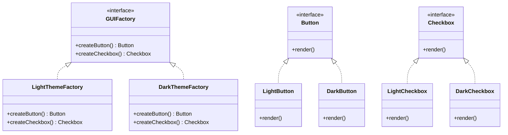

## 3.4.4 Use Cases and Examples

The Abstract Factory Pattern is a creational design pattern that provides an interface for creating families of related or dependent objects without specifying their concrete classes. This pattern is particularly useful in scenarios where a system needs to be independent of how its objects are created, composed, and represented. In this section, we will delve into real-world use cases, provide comprehensive examples, and discuss the advantages of using the Abstract Factory Pattern in JavaScript and TypeScript.

### Real-World Scenarios for Abstract Factory Pattern

#### GUI Toolkits with Multiple Look-and-Feel Standards

One of the classic examples of the Abstract Factory Pattern is its use in GUI toolkits. These toolkits often need to support multiple look-and-feel standards, such as Windows, macOS, and Linux. By using the Abstract Factory Pattern, developers can create a suite of related user interface components (buttons, text fields, checkboxes, etc.) that conform to a particular look-and-feel standard.

**Example:**

Imagine a GUI application that needs to switch between a "Light" theme and a "Dark" theme. Each theme has its own set of UI components. The Abstract Factory Pattern can be used to encapsulate the creation of these components, allowing the application to switch themes seamlessly.

```typescript
// Abstract Factory Interface
interface GUIFactory {
    createButton(): Button;
    createCheckbox(): Checkbox;
}

// Concrete Factory for Light Theme
class LightThemeFactory implements GUIFactory {
    createButton(): Button {
        return new LightButton();
    }
    createCheckbox(): Checkbox {
        return new LightCheckbox();
    }
}

// Concrete Factory for Dark Theme
class DarkThemeFactory implements GUIFactory {
    createButton(): Button {
        return new DarkButton();
    }
    createCheckbox(): Checkbox {
        return new DarkCheckbox();
    }
}

// Abstract Product Interfaces
interface Button {
    render(): void;
}

interface Checkbox {
    render(): void;
}

// Concrete Products for Light Theme
class LightButton implements Button {
    render(): void {
        console.log("Rendering a light-themed button.");
    }
}

class LightCheckbox implements Checkbox {
    render(): void {
        console.log("Rendering a light-themed checkbox.");
    }
}

// Concrete Products for Dark Theme
class DarkButton implements Button {
    render(): void {
        console.log("Rendering a dark-themed button.");
    }
}

class DarkCheckbox implements Checkbox {
    render(): void {
        console.log("Rendering a dark-themed checkbox.");
    }
}

// Client Code
function configureUI(factory: GUIFactory) {
    const button = factory.createButton();
    const checkbox = factory.createCheckbox();
    button.render();
    checkbox.render();
}

// Usage
const lightThemeFactory = new LightThemeFactory();
configureUI(lightThemeFactory);

const darkThemeFactory = new DarkThemeFactory();
configureUI(darkThemeFactory);
```

### Advantages of the Abstract Factory Pattern

#### Scalability and Maintainability

The Abstract Factory Pattern enhances scalability by allowing new product families to be added with minimal changes to existing code. This is achieved by introducing new concrete factories that implement the abstract factory interface. The pattern also improves maintainability by centralizing the creation logic for related objects, making it easier to manage and update.

#### Adherence to the Open/Closed Principle

The Open/Closed Principle states that software entities should be open for extension but closed for modification. The Abstract Factory Pattern facilitates adherence to this principle by allowing new product families to be introduced without altering existing code. This is accomplished by defining new concrete factories and products that implement the existing interfaces.

### When to Use the Abstract Factory Pattern

Consider using the Abstract Factory Pattern when:

1. **A System Needs to Be Independent of How Its Products Are Created**: If your system needs to be decoupled from the creation process of its objects, the Abstract Factory Pattern provides a way to encapsulate the creation logic.

2. **You Need to Support Multiple Product Families**: If your application needs to support different sets of related products, such as different themes or platforms, the Abstract Factory Pattern allows you to switch between these families seamlessly.

3. **You Want to Adhere to the Open/Closed Principle**: If you anticipate the need to add new product families in the future, the Abstract Factory Pattern allows you to do so without modifying existing code.

### Practical Examples

#### Example 1: Cross-Platform Application Development

In cross-platform application development, the Abstract Factory Pattern can be used to create platform-specific components. For instance, a mobile application might need to support both iOS and Android platforms, each with its own set of UI components.

```typescript
// Abstract Factory Interface
interface MobileUIFactory {
    createNavigationBar(): NavigationBar;
    createButton(): MobileButton;
}

// Concrete Factory for iOS
class iOSUIFactory implements MobileUIFactory {
    createNavigationBar(): NavigationBar {
        return new iOSNavigationBar();
    }
    createButton(): MobileButton {
        return new iOSButton();
    }
}

// Concrete Factory for Android
class AndroidUIFactory implements MobileUIFactory {
    createNavigationBar(): NavigationBar {
        return new AndroidNavigationBar();
    }
    createButton(): MobileButton {
        return new AndroidButton();
    }
}

// Abstract Product Interfaces
interface NavigationBar {
    render(): void;
}

interface MobileButton {
    render(): void;
}

// Concrete Products for iOS
class iOSNavigationBar implements NavigationBar {
    render(): void {
        console.log("Rendering iOS navigation bar.");
    }
}

class iOSButton implements MobileButton {
    render(): void {
        console.log("Rendering iOS button.");
    }
}

// Concrete Products for Android
class AndroidNavigationBar implements NavigationBar {
    render(): void {
        console.log("Rendering Android navigation bar.");
    }
}

class AndroidButton implements MobileButton {
    render(): void {
        console.log("Rendering Android button.");
    }
}

// Client Code
function setupMobileUI(factory: MobileUIFactory) {
    const navBar = factory.createNavigationBar();
    const button = factory.createButton();
    navBar.render();
    button.render();
}

// Usage
const iOSFactory = new iOSUIFactory();
setupMobileUI(iOSFactory);

const androidFactory = new AndroidUIFactory();
setupMobileUI(androidFactory);
```

#### Example 2: Database Connection Management

The Abstract Factory Pattern can be used to manage database connections for different types of databases, such as SQL and NoSQL. This allows an application to switch between different database systems without altering its core logic.

```typescript
// Abstract Factory Interface
interface DatabaseFactory {
    createConnection(): DatabaseConnection;
    createCommand(): DatabaseCommand;
}

// Concrete Factory for SQL Database
class SQLDatabaseFactory implements DatabaseFactory {
    createConnection(): DatabaseConnection {
        return new SQLConnection();
    }
    createCommand(): DatabaseCommand {
        return new SQLCommand();
    }
}

// Concrete Factory for NoSQL Database
class NoSQLDatabaseFactory implements DatabaseFactory {
    createConnection(): DatabaseConnection {
        return new NoSQLConnection();
    }
    createCommand(): DatabaseCommand {
        return new NoSQLCommand();
    }
}

// Abstract Product Interfaces
interface DatabaseConnection {
    connect(): void;
}

interface DatabaseCommand {
    execute(): void;
}

// Concrete Products for SQL Database
class SQLConnection implements DatabaseConnection {
    connect(): void {
        console.log("Connecting to SQL database.");
    }
}

class SQLCommand implements DatabaseCommand {
    execute(): void {
        console.log("Executing SQL command.");
    }
}

// Concrete Products for NoSQL Database
class NoSQLConnection implements DatabaseConnection {
    connect(): void {
        console.log("Connecting to NoSQL database.");
    }
}

class NoSQLCommand implements DatabaseCommand {
    execute(): void {
        console.log("Executing NoSQL command.");
    }
}

// Client Code
function manageDatabase(factory: DatabaseFactory) {
    const connection = factory.createConnection();
    const command = factory.createCommand();
    connection.connect();
    command.execute();
}

// Usage
const sqlFactory = new SQLDatabaseFactory();
manageDatabase(sqlFactory);

const noSQLFactory = new NoSQLDatabaseFactory();
manageDatabase(noSQLFactory);
```

### Visualizing the Abstract Factory Pattern

To better understand the Abstract Factory Pattern, let's visualize the relationships between the components using a class diagram.



**Diagram Explanation:**

- **GUIFactory**: The abstract factory interface that defines methods for creating abstract products.
- **LightThemeFactory** and **DarkThemeFactory**: Concrete factories that implement the abstract factory interface to create specific products.
- **Button** and **Checkbox**: Abstract product interfaces that define the operations that concrete products must implement.
- **LightButton**, **LightCheckbox**, **DarkButton**, and **DarkCheckbox**: Concrete products that implement the abstract product interfaces.

### Try It Yourself

To deepen your understanding of the Abstract Factory Pattern, try modifying the code examples provided:

1. **Add a New Theme**: Extend the GUI example by adding a new theme, such as "High Contrast". Implement the necessary concrete factory and products.

2. **Introduce a New Product**: In the mobile UI example, add a new product, such as a "Slider", and update the factories accordingly.

3. **Switch Database Types**: In the database management example, introduce a new database type, such as "Graph Database", and implement the corresponding factory and products.

### Knowledge Check

To reinforce your understanding of the Abstract Factory Pattern, consider the following questions:

- How does the Abstract Factory Pattern enhance scalability and maintainability?
- In what scenarios would you choose the Abstract Factory Pattern over other creational patterns?
- How does the Abstract Factory Pattern adhere to the Open/Closed Principle?

### Embrace the Journey

Remember, mastering design patterns is a journey. As you continue to explore and apply these patterns, you'll develop a deeper understanding of how to create scalable, maintainable, and flexible software architectures. Keep experimenting, stay curious, and enjoy the process!

## Quiz Time!



### Which of the following is a key advantage of the Abstract Factory Pattern?

- [x] It allows for the creation of families of related objects without specifying their concrete classes.
- [ ] It simplifies the code by reducing the number of classes.
- [ ] It is the most efficient pattern for all scenarios.
- [ ] It eliminates the need for interfaces.

> **Explanation:** The Abstract Factory Pattern provides an interface for creating families of related or dependent objects without specifying their concrete classes, enhancing scalability and maintainability.

### In the context of GUI applications, what does the Abstract Factory Pattern help achieve?

- [x] It allows switching between different look-and-feel standards.
- [ ] It reduces the number of UI components needed.
- [ ] It eliminates the need for event handling.
- [ ] It simplifies the rendering process.

> **Explanation:** The Abstract Factory Pattern is useful in GUI applications for switching between different look-and-feel standards by encapsulating the creation of related UI components.

### How does the Abstract Factory Pattern adhere to the Open/Closed Principle?

- [x] By allowing new product families to be added without modifying existing code.
- [ ] By reducing the number of classes in the system.
- [ ] By eliminating the need for inheritance.
- [ ] By making all classes final.

> **Explanation:** The Abstract Factory Pattern adheres to the Open/Closed Principle by enabling the addition of new product families through new concrete factories, without altering existing code.

### Which of the following scenarios is NOT suitable for the Abstract Factory Pattern?

- [ ] A system that needs to be independent of how its objects are created.
- [ ] An application that supports multiple product families.
- [ ] A scenario where new product families are frequently added.
- [x] A simple application with only one type of product.

> **Explanation:** The Abstract Factory Pattern is not suitable for simple applications with only one type of product, as it introduces unnecessary complexity.

### What is the role of a concrete factory in the Abstract Factory Pattern?

- [x] To implement the abstract factory interface and create specific products.
- [ ] To define the interface for creating products.
- [ ] To store the state of the products.
- [ ] To manage the lifecycle of the products.

> **Explanation:** In the Abstract Factory Pattern, a concrete factory implements the abstract factory interface and is responsible for creating specific products.

### True or False: The Abstract Factory Pattern can be used to manage database connections for different types of databases.

- [x] True
- [ ] False

> **Explanation:** True. The Abstract Factory Pattern can be used to manage database connections for different types of databases, allowing an application to switch between them seamlessly.

### Which of the following is a real-world example of the Abstract Factory Pattern?

- [x] A GUI toolkit supporting multiple themes.
- [ ] A single-threaded application.
- [ ] A simple calculator program.
- [ ] A static website.

> **Explanation:** A GUI toolkit supporting multiple themes is a real-world example of the Abstract Factory Pattern, as it involves creating families of related UI components.

### What is the primary purpose of the Abstract Factory Pattern?

- [x] To provide an interface for creating families of related objects.
- [ ] To reduce the number of classes in a system.
- [ ] To eliminate the need for inheritance.
- [ ] To simplify the user interface.

> **Explanation:** The primary purpose of the Abstract Factory Pattern is to provide an interface for creating families of related or dependent objects without specifying their concrete classes.

### Which of the following best describes a product in the Abstract Factory Pattern?

- [x] An object created by a concrete factory.
- [ ] A class that implements the abstract factory interface.
- [ ] A method for creating objects.
- [ ] A static variable.

> **Explanation:** In the Abstract Factory Pattern, a product is an object created by a concrete factory, implementing the abstract product interface.

### True or False: The Abstract Factory Pattern is always the best choice for any application.

- [ ] True
- [x] False

> **Explanation:** False. The Abstract Factory Pattern is not always the best choice for every application. It is most suitable for scenarios where a system needs to be independent of how its objects are created and when multiple product families are involved.


