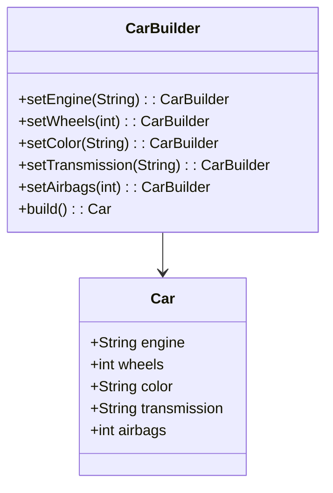

## 3.5.1 Builder Pattern: Intent and Motivation

In the realm of software design, the Builder pattern stands out as a powerful tool for constructing complex objects. Its primary intent is to separate the construction of an object from its representation, allowing the same construction process to create different representations. This separation not only enhances code maintainability but also provides flexibility in object creation, which is particularly beneficial in languages like JavaScript and TypeScript.

### Understanding the Builder Pattern

The Builder pattern is a creational design pattern that addresses the issue of constructing complex objects. In many software applications, objects can have numerous attributes, and their construction can become cumbersome and error-prone when done directly. The Builder pattern encapsulates the construction process, allowing developers to create objects step by step, ensuring that the final product is consistent and complete.

#### Defining the Builder Pattern

The Builder pattern involves several key components:

1. **Builder Interface**: Defines the steps required to build a product.
2. **Concrete Builder**: Implements the Builder interface and provides specific implementations for the construction steps.
3. **Director**: Oversees the construction process, using the Builder interface to create a product.
4. **Product**: The final object that is constructed.

By using these components, the Builder pattern allows for the creation of complex objects in a controlled and flexible manner.

### Problems with Direct Construction of Complex Objects

Constructing complex objects directly can lead to several issues:

- **Complexity**: As the number of attributes increases, the constructor becomes more complex and difficult to manage.
- **Immutability**: Direct construction can lead to mutable objects, making it challenging to ensure consistency.
- **Readability**: Long constructors with numerous parameters can be difficult to read and understand.
- **Error-Prone**: It is easy to make mistakes when passing parameters directly, especially if they are of similar types.

Consider a scenario where we need to create a `Car` object with multiple attributes such as `engine`, `wheels`, `color`, `transmission`, and `airbags`. Constructing such an object directly can lead to the aforementioned problems.

### The Builder Pattern Solution

The Builder pattern offers a solution by encapsulating the construction process. It allows developers to create objects step by step, providing a clear and flexible way to manage the construction of complex objects.

#### Encapsulating the Construction Process

By encapsulating the construction process, the Builder pattern provides several benefits:

- **Flexibility**: Different builders can be used to create different representations of the same object.
- **Clarity**: The construction process is broken down into discrete steps, making it easier to understand and manage.
- **Reusability**: Builders can be reused across different parts of an application, reducing code duplication.
- **Immutability**: The Builder pattern can help create immutable objects by ensuring that all necessary attributes are set before the object is constructed.

Let's explore how the Builder pattern can be implemented in JavaScript and TypeScript.

### Implementing the Builder Pattern in JavaScript

In JavaScript, the Builder pattern can be implemented using classes and methods to encapsulate the construction process.

```javascript
// Product class
class Car {
  constructor(engine, wheels, color, transmission, airbags) {
    this.engine = engine;
    this.wheels = wheels;
    this.color = color;
    this.transmission = transmission;
    this.airbags = airbags;
  }
}

// Builder class
class CarBuilder {
  constructor() {
    this.engine = 'default';
    this.wheels = 4;
    this.color = 'white';
    this.transmission = 'manual';
    this.airbags = 2;
  }

  setEngine(engine) {
    this.engine = engine;
    return this;
  }

  setWheels(wheels) {
    this.wheels = wheels;
    return this;
  }

  setColor(color) {
    this.color = color;
    return this;
  }

  setTransmission(transmission) {
    this.transmission = transmission;
    return this;
  }

  setAirbags(airbags) {
    this.airbags = airbags;
    return this;
  }

  build() {
    return new Car(this.engine, this.wheels, this.color, this.transmission, this.airbags);
  }
}

// Usage
const car = new CarBuilder()
  .setEngine('V8')
  .setColor('red')
  .setTransmission('automatic')
  .build();

console.log(car);
```

In this example, the `CarBuilder` class encapsulates the construction of a `Car` object. Each method in the builder class sets a specific attribute and returns the builder itself, allowing for method chaining. The `build` method constructs the final `Car` object with the specified attributes.

### Implementing the Builder Pattern in TypeScript

TypeScript enhances the Builder pattern with strong typing, ensuring that the construction process is type-safe.

```typescript
// Product class
class Car {
  constructor(
    public engine: string,
    public wheels: number,
    public color: string,
    public transmission: string,
    public airbags: number
  ) {}
}

// Builder class
class CarBuilder {
  private engine: string = 'default';
  private wheels: number = 4;
  private color: string = 'white';
  private transmission: string = 'manual';
  private airbags: number = 2;

  setEngine(engine: string): CarBuilder {
    this.engine = engine;
    return this;
  }

  setWheels(wheels: number): CarBuilder {
    this.wheels = wheels;
    return this;
  }

  setColor(color: string): CarBuilder {
    this.color = color;
    return this;
  }

  setTransmission(transmission: string): CarBuilder {
    this.transmission = transmission;
    return this;
  }

  setAirbags(airbags: number): CarBuilder {
    this.airbags = airbags;
    return this;
  }

  build(): Car {
    return new Car(this.engine, this.wheels, this.color, this.transmission, this.airbags);
  }
}

// Usage
const car = new CarBuilder()
  .setEngine('V8')
  .setColor('red')
  .setTransmission('automatic')
  .build();

console.log(car);
```

In TypeScript, the `CarBuilder` class uses type annotations to ensure that each attribute is set with the correct type. This provides additional safety and clarity during the construction process.

### Creating Different Representations

One of the key benefits of the Builder pattern is its ability to create different representations of the same object. By using different builders, we can construct variations of an object based on specific requirements.

#### Example: Building Different Types of Cars

Let's extend our previous example to create different types of cars using the Builder pattern.

```typescript
// SportsCarBuilder class
class SportsCarBuilder extends CarBuilder {
  constructor() {
    super();
    this.setEngine('V8').setWheels(4).setColor('red').setTransmission('automatic').setAirbags(4);
  }
}

// SUVBuilder class
class SUVBuilder extends CarBuilder {
  constructor() {
    super();
    this.setEngine('V6').setWheels(4).setColor('black').setTransmission('manual').setAirbags(6);
  }
}

// Usage
const sportsCar = new SportsCarBuilder().build();
const suv = new SUVBuilder().build();

console.log(sportsCar);
console.log(suv);
```

In this example, we have created two different builders: `SportsCarBuilder` and `SUVBuilder`. Each builder sets specific attributes to construct a different type of car. This demonstrates the flexibility of the Builder pattern in creating different representations of the same object.

### Builder Pattern vs. Abstract Factory

While both the Builder pattern and the Abstract Factory pattern are used to create objects, they serve different purposes and are used in different contexts.

- **Builder Pattern**: Focuses on constructing complex objects step by step. It is used when the construction process is complex and involves multiple steps.
- **Abstract Factory Pattern**: Provides an interface for creating families of related objects. It is used when there is a need to create a group of related objects without specifying their concrete classes.

The Builder pattern is more concerned with the construction process, while the Abstract Factory pattern is focused on the creation of related objects.

### Visualizing the Builder Pattern

To better understand the Builder pattern, let's visualize its components and interactions using a class diagram.



This diagram illustrates the relationship between the `Car` class and the `CarBuilder` class. The `CarBuilder` class provides methods to set each attribute of the `Car` and a `build` method to construct the final object.

### Try It Yourself

Experiment with the Builder pattern by modifying the code examples provided. Here are some suggestions:

- Add new attributes to the `Car` class, such as `sunroof` or `GPS`, and update the `CarBuilder` class to include methods for setting these attributes.
- Create additional builder classes for different types of vehicles, such as `TruckBuilder` or `MotorcycleBuilder`.
- Implement a `Director` class that uses the `CarBuilder` to construct a `Car` with a predefined configuration.

### References and Further Reading

For more information on the Builder pattern and other design patterns, consider exploring the following resources:

- [MDN Web Docs: Design Patterns](https://developer.mozilla.org/en-US/docs/Web/JavaScript/Guide/Design_Patterns)
- [Refactoring Guru: Builder Pattern](https://refactoring.guru/design-patterns/builder)
- [W3Schools: JavaScript Classes](https://www.w3schools.com/js/js_classes.asp)

### Knowledge Check

Before we conclude, let's review some key concepts:

- The Builder pattern separates the construction of an object from its representation.
- It is particularly useful for constructing complex objects with multiple attributes.
- The pattern involves a Builder interface, Concrete Builder, Director, and Product.
- The Builder pattern differs from the Abstract Factory pattern in its focus on the construction process.

### Embrace the Journey

Remember, the Builder pattern is just one of many design patterns that can enhance your software development skills. As you continue to explore and experiment with different patterns, you'll gain a deeper understanding of how to create flexible, maintainable, and scalable code. Keep experimenting, stay curious, and enjoy the journey!

## Quiz Time!



### What is the primary intent of the Builder pattern?

- [x] To separate the construction of a complex object from its representation.
- [ ] To create a family of related objects without specifying their concrete classes.
- [ ] To provide a simplified interface to a complex subsystem.
- [ ] To allow incompatible interfaces to work together.

> **Explanation:** The Builder pattern's primary intent is to separate the construction of a complex object from its representation, allowing the same construction process to create different representations.

### Which component of the Builder pattern defines the steps required to build a product?

- [ ] Director
- [x] Builder Interface
- [ ] Concrete Builder
- [ ] Product

> **Explanation:** The Builder Interface defines the steps required to build a product, which are then implemented by the Concrete Builder.

### What problem does the Builder pattern solve when constructing complex objects?

- [x] It encapsulates the construction process, making it flexible and manageable.
- [ ] It provides a simplified interface to a complex subsystem.
- [ ] It allows incompatible interfaces to work together.
- [ ] It creates a family of related objects.

> **Explanation:** The Builder pattern solves the problem of constructing complex objects by encapsulating the construction process, making it flexible and manageable.

### How does the Builder pattern enhance code readability?

- [x] By breaking down the construction process into discrete steps.
- [ ] By providing a simplified interface to a complex subsystem.
- [ ] By allowing incompatible interfaces to work together.
- [ ] By creating a family of related objects.

> **Explanation:** The Builder pattern enhances code readability by breaking down the construction process into discrete steps, making it easier to understand and manage.

### What is the difference between the Builder pattern and the Abstract Factory pattern?

- [x] The Builder pattern focuses on constructing complex objects step by step, while the Abstract Factory pattern creates families of related objects.
- [ ] The Builder pattern provides a simplified interface to a complex subsystem, while the Abstract Factory pattern allows incompatible interfaces to work together.
- [ ] The Builder pattern creates families of related objects, while the Abstract Factory pattern focuses on constructing complex objects step by step.
- [ ] The Builder pattern allows incompatible interfaces to work together, while the Abstract Factory pattern provides a simplified interface to a complex subsystem.

> **Explanation:** The Builder pattern focuses on constructing complex objects step by step, while the Abstract Factory pattern creates families of related objects.

### In the Builder pattern, what role does the Director play?

- [x] It oversees the construction process using the Builder interface.
- [ ] It defines the steps required to build a product.
- [ ] It implements the Builder interface.
- [ ] It is the final object that is constructed.

> **Explanation:** The Director oversees the construction process using the Builder interface to create a product.

### How can the Builder pattern help create immutable objects?

- [x] By ensuring all necessary attributes are set before the object is constructed.
- [ ] By providing a simplified interface to a complex subsystem.
- [ ] By allowing incompatible interfaces to work together.
- [ ] By creating a family of related objects.

> **Explanation:** The Builder pattern can help create immutable objects by ensuring all necessary attributes are set before the object is constructed.

### What is a key benefit of using different builders in the Builder pattern?

- [x] They can create different representations of the same object.
- [ ] They provide a simplified interface to a complex subsystem.
- [ ] They allow incompatible interfaces to work together.
- [ ] They create a family of related objects.

> **Explanation:** A key benefit of using different builders in the Builder pattern is that they can create different representations of the same object.

### True or False: The Builder pattern is used to provide a simplified interface to a complex subsystem.

- [ ] True
- [x] False

> **Explanation:** False. The Builder pattern is not used to provide a simplified interface to a complex subsystem; that is the role of the Facade pattern.

### True or False: The Builder pattern is particularly useful for constructing objects with a small number of attributes.

- [ ] True
- [x] False

> **Explanation:** False. The Builder pattern is particularly useful for constructing complex objects with multiple attributes, not for objects with a small number of attributes.


