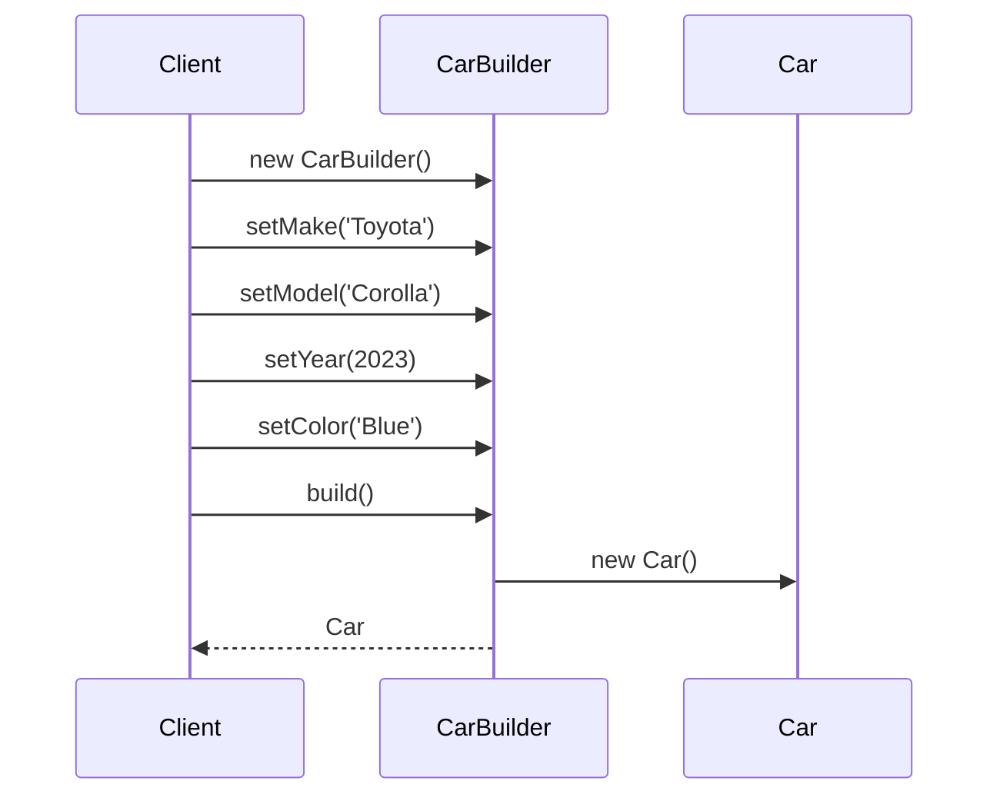

## 3.5.2 Implementation in JavaScript

The Builder Pattern is a creational design pattern that provides a flexible solution to constructing complex objects. In this section, we will delve into the implementation of the Builder Pattern in JavaScript, exploring how it can enhance the construction of objects with multiple configurations. We will cover the fundamental concepts, provide detailed code examples, and discuss the benefits of using this pattern in JavaScript.

### Understanding the Builder Pattern

The Builder Pattern separates the construction of a complex object from its representation, allowing the same construction process to create different representations. This pattern is particularly useful when an object requires numerous configurations or when the construction process is complex.

In JavaScript, the Builder Pattern can be implemented using classes or functions, leveraging method chaining and fluent interfaces to create a more readable and maintainable codebase.

### Defining Builder Classes

To implement the Builder Pattern, we start by defining a builder class that encapsulates the construction logic. This class will provide methods to set various properties of the object being constructed.

```javascript
class Car {
  constructor() {
    this.make = '';
    this.model = '';
    this.year = 0;
    this.color = '';
  }
}

class CarBuilder {
  constructor() {
    this.car = new Car();
  }

  setMake(make) {
    this.car.make = make;
    return this; // Enable method chaining
  }

  setModel(model) {
    this.car.model = model;
    return this;
  }

  setYear(year) {
    this.car.year = year;
    return this;
  }

  setColor(color) {
    this.car.color = color;
    return this;
  }

  build() {
    return this.car;
  }
}
```

In this example, `CarBuilder` is responsible for constructing a `Car` object. Each method in the builder class sets a property of the `Car` object and returns `this`, allowing for method chaining.

### Method Chaining and Fluent Interfaces

Method chaining is a technique where each method returns the current object, enabling multiple method calls to be chained together. This results in a fluent interface, which enhances code readability and reduces the need for temporary variables.

```javascript
const myCar = new CarBuilder()
  .setMake('Toyota')
  .setModel('Corolla')
  .setYear(2023)
  .setColor('Blue')
  .build();

console.log(myCar);
```

The above code demonstrates how method chaining allows us to construct a `Car` object in a single, fluent statement. This approach not only improves readability but also makes the code more intuitive.

### Separating Construction Logic

One of the key advantages of the Builder Pattern is the separation of construction logic from the actual object. This separation allows for greater flexibility and maintainability, as changes to the construction process do not affect the object itself.

```javascript
class CarDirector {
  static constructSportsCar(builder) {
    return builder.setMake('Porsche')
      .setModel('911')
      .setYear(2022)
      .setColor('Red')
      .build();
  }

  static constructSUV(builder) {
    return builder.setMake('Ford')
      .setModel('Explorer')
      .setYear(2023)
      .setColor('Black')
      .build();
  }
}

const sportsCar = CarDirector.constructSportsCar(new CarBuilder());
const suv = CarDirector.constructSUV(new CarBuilder());

console.log(sportsCar);
console.log(suv);
```

In this example, the `CarDirector` class encapsulates the construction logic for different types of cars. This approach allows us to easily create different configurations of `Car` objects without modifying the `Car` or `CarBuilder` classes.

### Building Objects with Multiple Configurations

The Builder Pattern is particularly useful when an object can be configured in multiple ways. By defining different builder methods, we can easily create objects with varying configurations.

```javascript
class Computer {
  constructor() {
    this.cpu = '';
    this.ram = '';
    this.storage = '';
    this.gpu = '';
  }
}

class ComputerBuilder {
  constructor() {
    this.computer = new Computer();
  }

  setCPU(cpu) {
    this.computer.cpu = cpu;
    return this;
  }

  setRAM(ram) {
    this.computer.ram = ram;
    return this;
  }

  setStorage(storage) {
    this.computer.storage = storage;
    return this;
  }

  setGPU(gpu) {
    this.computer.gpu = gpu;
    return this;
  }

  build() {
    return this.computer;
  }
}

const gamingPC = new ComputerBuilder()
  .setCPU('Intel i9')
  .setRAM('32GB')
  .setStorage('1TB SSD')
  .setGPU('NVIDIA RTX 3080')
  .build();

const officePC = new ComputerBuilder()
  .setCPU('Intel i5')
  .setRAM('16GB')
  .setStorage('512GB SSD')
  .build();

console.log(gamingPC);
console.log(officePC);
```

Here, the `ComputerBuilder` class allows us to create different configurations of `Computer` objects, such as a gaming PC and an office PC. This flexibility is one of the main benefits of the Builder Pattern.

### Flexibility and Readability Benefits

The Builder Pattern offers several advantages in JavaScript:

- **Flexibility**: It allows for the creation of complex objects with varying configurations without modifying the underlying class.
- **Readability**: The use of method chaining and fluent interfaces results in more readable and maintainable code.
- **Separation of Concerns**: By separating the construction logic from the object itself, changes to the construction process do not affect the object.

### Visualizing the Builder Pattern

To better understand the Builder Pattern, let's visualize the process of constructing a `Car` object using a sequence diagram.



This diagram illustrates the interaction between the client, the `CarBuilder`, and the `Car` object during the construction process.

### Try It Yourself

To solidify your understanding of the Builder Pattern, try modifying the code examples provided. Here are some suggestions:

- Add additional properties to the `Car` or `Computer` classes and update the builder methods accordingly.
- Create a new builder class for a different type of object, such as a `House` or `Smartphone`.
- Experiment with different configurations and see how the Builder Pattern simplifies the construction process.

### References and Further Reading

For more information on the Builder Pattern and other design patterns, consider exploring the following resources:

- [MDN Web Docs: JavaScript](https://developer.mozilla.org/en-US/docs/Web/JavaScript)
- [Refactoring Guru: Builder Pattern](https://refactoring.guru/design-patterns/builder)
- [W3Schools: JavaScript Classes](https://www.w3schools.com/js/js_classes.asp)

### Knowledge Check

To reinforce your understanding of the Builder Pattern, consider the following questions:

- What are the key benefits of using the Builder Pattern in JavaScript?
- How does method chaining enhance the readability of code?
- Why is it important to separate construction logic from the object itself?

### Embrace the Journey

Remember, this is just the beginning. As you progress, you'll build more complex and interactive applications using the Builder Pattern and other design patterns. Keep experimenting, stay curious, and enjoy the journey!

## Quiz Time!



### What is the primary purpose of the Builder Pattern?

- [x] To separate the construction of a complex object from its representation.
- [ ] To provide a single interface to a set of interfaces in a subsystem.
- [ ] To define a family of algorithms and make them interchangeable.
- [ ] To ensure a class has only one instance.

> **Explanation:** The Builder Pattern's main purpose is to separate the construction of a complex object from its representation, allowing the same construction process to create different representations.

### How does method chaining improve code readability?

- [x] By allowing multiple method calls to be chained together, creating a fluent interface.
- [ ] By reducing the number of lines of code required.
- [ ] By enforcing strict type checking.
- [ ] By eliminating the need for comments.

> **Explanation:** Method chaining allows multiple method calls to be chained together, creating a fluent interface that enhances code readability and reduces the need for temporary variables.

### Which of the following is a benefit of using the Builder Pattern?

- [x] Flexibility in creating complex objects with varying configurations.
- [ ] Ensuring a class has only one instance.
- [ ] Providing a single interface to a set of interfaces in a subsystem.
- [ ] Defining a family of algorithms and making them interchangeable.

> **Explanation:** The Builder Pattern provides flexibility in creating complex objects with varying configurations without modifying the underlying class.

### What is the role of the `build()` method in a builder class?

- [x] To return the constructed object.
- [ ] To initialize the builder class.
- [ ] To set a property of the object being constructed.
- [ ] To validate the constructed object.

> **Explanation:** The `build()` method in a builder class is responsible for returning the constructed object after all properties have been set.

### In the context of the Builder Pattern, what does "separation of concerns" refer to?

- [x] Separating the construction logic from the object itself.
- [ ] Separating the user interface from the business logic.
- [ ] Separating the data access layer from the presentation layer.
- [ ] Separating the client code from the server code.

> **Explanation:** In the context of the Builder Pattern, "separation of concerns" refers to separating the construction logic from the object itself, allowing for greater flexibility and maintainability.

### What is a fluent interface?

- [x] An interface that uses method chaining to improve readability.
- [ ] An interface that enforces strict type checking.
- [ ] An interface that provides a single entry point to a subsystem.
- [ ] An interface that ensures a class has only one instance.

> **Explanation:** A fluent interface uses method chaining to improve readability, allowing multiple method calls to be chained together in a single statement.

### Which of the following is an example of method chaining?

- [x] `builder.setMake('Toyota').setModel('Corolla').setYear(2023).build();`
- [ ] `builder.setMake('Toyota'); builder.setModel('Corolla'); builder.setYear(2023); builder.build();`
- [ ] `builder.setMake('Toyota').setModel('Corolla');`
- [ ] `builder.setMake('Toyota').build();`

> **Explanation:** Method chaining involves chaining multiple method calls together, as shown in the example `builder.setMake('Toyota').setModel('Corolla').setYear(2023).build();`.

### What is the primary advantage of using method chaining in the Builder Pattern?

- [x] It creates a more readable and maintainable codebase.
- [ ] It enforces strict type checking.
- [ ] It reduces the number of lines of code required.
- [ ] It eliminates the need for comments.

> **Explanation:** The primary advantage of using method chaining in the Builder Pattern is that it creates a more readable and maintainable codebase by allowing multiple method calls to be chained together.

### True or False: The Builder Pattern is only useful for constructing objects with a single configuration.

- [ ] True
- [x] False

> **Explanation:** False. The Builder Pattern is particularly useful for constructing objects with multiple configurations, allowing for flexibility and customization.

### Which method in the builder class is responsible for setting a property of the object being constructed?

- [x] `setMake()`
- [ ] `build()`
- [ ] `initialize()`
- [ ] `validate()`

> **Explanation:** The `setMake()` method (and similar methods) in the builder class is responsible for setting a property of the object being constructed.


