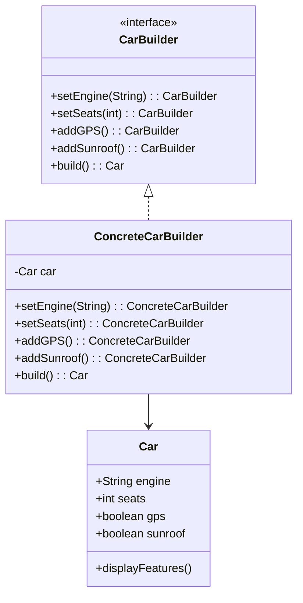

## 3.5.3 Implementation in TypeScript

The Builder Pattern is a creational design pattern that allows for the step-by-step construction of complex objects. In TypeScript, we can leverage its powerful features such as classes, interfaces, and method overloading to implement this pattern effectively. This section will guide you through the process of implementing the Builder Pattern in TypeScript, demonstrating how to create flexible and type-safe object construction.

### Understanding the Builder Pattern

Before diving into the implementation, let's briefly revisit what the Builder Pattern is. The Builder Pattern separates the construction of a complex object from its representation, allowing the same construction process to create different representations. This pattern is particularly useful when an object needs to be created with many optional parameters or when the construction process involves several steps.

### Leveraging TypeScript Features

TypeScript enhances the Builder Pattern with its type system, ensuring that the objects we build are type-safe. We can use TypeScript's classes to define builders, interfaces to enforce contracts, and method overloading to handle different construction scenarios.

#### Classes and Interfaces

In TypeScript, classes are used to define the structure and behavior of objects. Interfaces, on the other hand, define contracts that classes can implement. By combining these features, we can create builders that are both flexible and reliable.

#### Method Overloading

Method overloading allows us to define multiple methods with the same name but different parameter types. This feature is useful in the Builder Pattern when we want to provide different ways to set properties or configure the object being built.

### Implementing the Builder Pattern in TypeScript

Let's walk through the implementation of the Builder Pattern in TypeScript with a practical example. We'll create a `Car` object with various optional features such as a GPS system, a sunroof, and a powerful engine.

#### Step 1: Define the Product Class

First, we need to define the class for the product we want to build. In this case, it's the `Car` class.

```typescript
class Car {
  public engine: string;
  public seats: number;
  public gps: boolean;
  public sunroof: boolean;

  constructor() {
    this.engine = 'Standard';
    this.seats = 4;
    this.gps = false;
    this.sunroof = false;
  }

  public displayFeatures(): void {
    console.log(`Car with ${this.engine} engine, ${this.seats} seats, GPS: ${this.gps}, Sunroof: ${this.sunroof}`);
  }
}
```

#### Step 2: Create the Builder Interface

Next, we define an interface for the builder. This interface declares the methods required to build the product.

```typescript
interface CarBuilder {
  setEngine(engine: string): this;
  setSeats(seats: number): this;
  addGPS(): this;
  addSunroof(): this;
  build(): Car;
}
```

#### Step 3: Implement the Concrete Builder

Now, we implement the `CarBuilder` interface in a concrete builder class. This class will provide the implementation for the methods defined in the interface.

```typescript
class ConcreteCarBuilder implements CarBuilder {
  private car: Car;

  constructor() {
    this.car = new Car();
  }

  public setEngine(engine: string): this {
    this.car.engine = engine;
    return this;
  }

  public setSeats(seats: number): this {
    this.car.seats = seats;
    return this;
  }

  public addGPS(): this {
    this.car.gps = true;
    return this;
  }

  public addSunroof(): this {
    this.car.sunroof = true;
    return this;
  }

  public build(): Car {
    return this.car;
  }
}
```

#### Step 4: Use the Builder

With the builder in place, we can now use it to construct different versions of the `Car` object.

```typescript
const builder = new ConcreteCarBuilder();
const sportsCar = builder.setEngine('V8').setSeats(2).addGPS().addSunroof().build();
sportsCar.displayFeatures();

const familyCar = builder.setEngine('V6').setSeats(5).build();
familyCar.displayFeatures();
```

### Enhancing the Builder with TypeScript's Type Checking

TypeScript's type checking ensures that the builder is used correctly. For example, if we try to pass an invalid type to the `setEngine` method, TypeScript will raise a compile-time error.

```typescript
// This will cause a TypeScript error
// builder.setEngine(123);
```

### Using Generics in the Builder Pattern

Generics can further enhance the Builder Pattern by allowing the builder to work with different types of products. Let's modify our example to demonstrate this.

#### Step 1: Define a Generic Builder Interface

We start by defining a generic builder interface that can work with any product type.

```typescript
interface Builder<T> {
  build(): T;
}
```

#### Step 2: Implement a Generic Builder

Now, let's implement a generic builder for the `Car` class.

```typescript
class GenericCarBuilder<T extends Car> implements Builder<T> {
  private car: T;

  constructor(car: T) {
    this.car = car;
  }

  public setEngine(engine: string): this {
    this.car.engine = engine;
    return this;
  }

  public setSeats(seats: number): this {
    this.car.seats = seats;
    return this;
  }

  public addGPS(): this {
    this.car.gps = true;
    return this;
  }

  public addSunroof(): this {
    this.car.sunroof = true;
    return this;
  }

  public build(): T {
    return this.car;
  }
}
```

#### Step 3: Use the Generic Builder

We can now use the generic builder to create different types of `Car` objects.

```typescript
const genericBuilder = new GenericCarBuilder(new Car());
const luxuryCar = genericBuilder.setEngine('V12').setSeats(4).addGPS().addSunroof().build();
luxuryCar.displayFeatures();
```

### Visualizing the Builder Pattern

To better understand the Builder Pattern, let's visualize the process using a class diagram.



### Try It Yourself

Experiment with the code examples provided. Try adding new features to the `Car` class, such as a stereo system or a custom paint job. Modify the builder to include methods for these new features and observe how the flexibility of the Builder Pattern allows you to easily extend the product's capabilities.

### References and Links

For more information on the Builder Pattern and TypeScript, consider exploring the following resources:

- [MDN Web Docs: Classes](https://developer.mozilla.org/en-US/docs/Web/JavaScript/Reference/Classes)
- [TypeScript Handbook: Interfaces](https://www.typescriptlang.org/docs/handbook/interfaces.html)
- [TypeScript Handbook: Generics](https://www.typescriptlang.org/docs/handbook/generics.html)

### Knowledge Check

To reinforce your understanding of the Builder Pattern in TypeScript, consider the following questions:

- What are the key benefits of using the Builder Pattern?
- How does TypeScript's type system enhance the reliability of builders?
- What role do interfaces play in the Builder Pattern?
- How can generics be used to create flexible builders?

### Embrace the Journey

Remember, mastering design patterns is a journey. The Builder Pattern is just one of many patterns that can help you write more maintainable and scalable code. Keep experimenting, stay curious, and enjoy the process of learning and applying these powerful tools in your projects.

## Quiz Time!



### What is the primary purpose of the Builder Pattern?

- [x] To construct complex objects step-by-step
- [ ] To create a single instance of a class
- [ ] To provide a simplified interface to a complex system
- [ ] To allow incompatible interfaces to work together

> **Explanation:** The Builder Pattern is used to construct complex objects step-by-step, separating the construction process from the representation.

### How does TypeScript enhance the Builder Pattern?

- [x] By providing type safety and method overloading
- [ ] By allowing multiple inheritance
- [ ] By enabling dynamic typing
- [ ] By supporting global variables

> **Explanation:** TypeScript enhances the Builder Pattern by providing type safety, method overloading, and other features that ensure reliable object construction.

### Which TypeScript feature is used to enforce contracts in the Builder Pattern?

- [x] Interfaces
- [ ] Classes
- [ ] Modules
- [ ] Namespaces

> **Explanation:** Interfaces in TypeScript are used to define contracts that classes can implement, ensuring that builders adhere to a specific structure.

### What is the role of method overloading in the Builder Pattern?

- [x] To provide different ways to set properties or configure the object being built
- [ ] To allow multiple classes to inherit from a single class
- [ ] To enable dynamic method invocation
- [ ] To simplify the user interface

> **Explanation:** Method overloading allows the builder to provide different ways to set properties or configure the object being built, enhancing flexibility.

### How can generics be used in the Builder Pattern?

- [x] To create builders that work with different types of products
- [ ] To enforce strict type checking
- [ ] To allow multiple inheritance
- [ ] To enable dynamic typing

> **Explanation:** Generics allow builders to work with different types of products, making them more flexible and reusable.

### What is the benefit of using a builder interface?

- [x] It defines the methods required to build the product
- [ ] It allows for dynamic method invocation
- [ ] It simplifies the user interface
- [ ] It enables multiple inheritance

> **Explanation:** A builder interface defines the methods required to build the product, ensuring that the builder adheres to a specific structure.

### What is the advantage of using a concrete builder class?

- [x] It provides the implementation for the methods defined in the builder interface
- [ ] It allows for dynamic method invocation
- [ ] It simplifies the user interface
- [ ] It enables multiple inheritance

> **Explanation:** A concrete builder class provides the implementation for the methods defined in the builder interface, enabling the construction of the product.

### What is the purpose of the `build` method in a builder?

- [x] To return the constructed product
- [ ] To set a property on the product
- [ ] To initialize the builder
- [ ] To define the product's interface

> **Explanation:** The `build` method in a builder is used to return the constructed product, completing the construction process.

### How does the Builder Pattern improve code maintainability?

- [x] By separating the construction of an object from its representation
- [ ] By allowing multiple inheritance
- [ ] By enabling dynamic typing
- [ ] By supporting global variables

> **Explanation:** The Builder Pattern improves code maintainability by separating the construction of an object from its representation, making it easier to manage and extend.

### True or False: The Builder Pattern is only useful for creating objects with a large number of parameters.

- [x] True
- [ ] False

> **Explanation:** The Builder Pattern is particularly useful for creating objects with a large number of parameters or when the construction process involves several steps.


