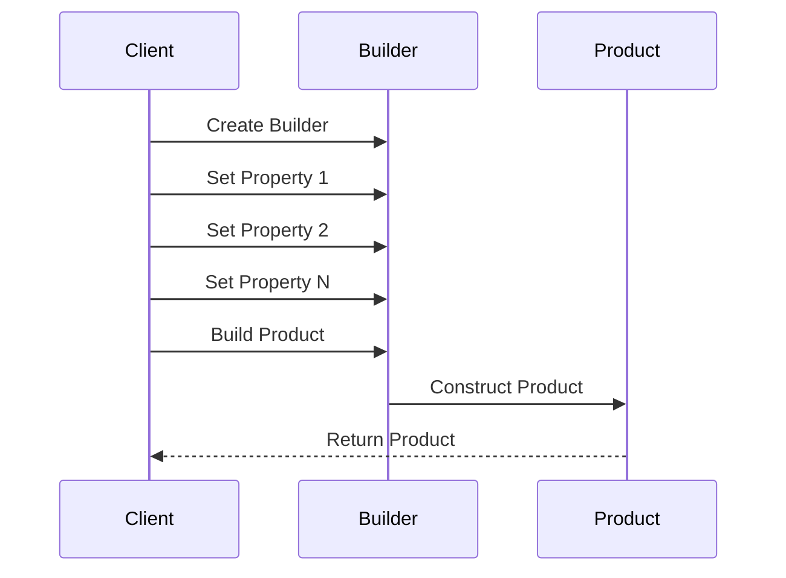

## 3.5.4 Use Cases and Examples

In the realm of software design, the Builder pattern stands out as a powerful tool for constructing complex objects. This pattern is particularly useful when an object requires numerous parameters or when the construction process involves multiple steps. In this section, we will delve into various real-world scenarios where the Builder pattern can be effectively employed, provide detailed code examples, and discuss the benefits and best practices associated with its use.

### Understanding the Builder Pattern

Before diving into use cases, let's briefly revisit what the Builder pattern is. The Builder pattern is a creational design pattern that separates the construction of a complex object from its representation. This allows the same construction process to create different representations. It is particularly useful when:

- An object needs to be created with many optional parameters.
- The construction process must allow different representations for the object.
- The construction process involves several steps that can vary independently.

### When to Use the Builder Pattern

The Builder pattern is most beneficial in scenarios where:

1. **Complex Configuration Objects**: When constructing objects that require a multitude of configuration options, the Builder pattern provides a clean and readable way to manage these options.

2. **Parser Outputs**: In applications that involve parsing data (e.g., JSON, XML), the Builder pattern can help in constructing the output objects in a structured manner.

3. **Assembling UI Components**: For complex UI components that require various configurations and states, the Builder pattern can simplify the setup process.

4. **Immutable Objects**: When creating immutable objects that require a large number of parameters, the Builder pattern allows for a more manageable construction process.

### Code Example: Constructing Complex Configuration Objects

Let's explore a practical example where the Builder pattern is used to construct a complex configuration object. Consider a scenario where we need to configure a server with various optional settings.

```javascript
// JavaScript Example

class ServerConfig {
  constructor(builder) {
    this.host = builder.host;
    this.port = builder.port;
    this.protocol = builder.protocol;
    this.timeout = builder.timeout;
    this.retries = builder.retries;
  }
}

class ServerConfigBuilder {
  constructor() {
    this.host = 'localhost';
    this.port = 80;
    this.protocol = 'http';
    this.timeout = 3000;
    this.retries = 3;
  }

  setHost(host) {
    this.host = host;
    return this;
  }

  setPort(port) {
    this.port = port;
    return this;
  }

  setProtocol(protocol) {
    this.protocol = protocol;
    return this;
  }

  setTimeout(timeout) {
    this.timeout = timeout;
    return this;
  }

  setRetries(retries) {
    this.retries = retries;
    return this;
  }

  build() {
    return new ServerConfig(this);
  }
}

// Usage
const serverConfig = new ServerConfigBuilder()
  .setHost('example.com')
  .setPort(8080)
  .setProtocol('https')
  .setTimeout(5000)
  .build();

console.log(serverConfig);
```

In this example, the `ServerConfigBuilder` class provides a fluent interface for setting various configuration options. The `build()` method constructs the final `ServerConfig` object, encapsulating all the specified settings.

### Code Example: Assembling UI Components

The Builder pattern is also useful in assembling complex UI components. Let's consider a scenario where we need to create a customizable dialog box.

```typescript
// TypeScript Example

interface Dialog {
  title: string;
  message: string;
  buttons: string[];
  isModal: boolean;
}

class DialogBuilder {
  private title: string = '';
  private message: string = '';
  private buttons: string[] = [];
  private isModal: boolean = false;

  setTitle(title: string): DialogBuilder {
    this.title = title;
    return this;
  }

  setMessage(message: string): DialogBuilder {
    this.message = message;
    return this;
  }

  setButtons(buttons: string[]): DialogBuilder {
    this.buttons = buttons;
    return this;
  }

  setModal(isModal: boolean): DialogBuilder {
    this.isModal = isModal;
    return this;
  }

  build(): Dialog {
    return {
      title: this.title,
      message: this.message,
      buttons: this.buttons,
      isModal: this.isModal,
    };
  }
}

// Usage
const dialog = new DialogBuilder()
  .setTitle('Confirmation')
  .setMessage('Are you sure you want to proceed?')
  .setButtons(['Yes', 'No'])
  .setModal(true)
  .build();

console.log(dialog);
```

In this TypeScript example, the `DialogBuilder` class provides methods to configure various aspects of a dialog box. The `build()` method returns a `Dialog` object with the specified properties.

### Benefits of Using the Builder Pattern

The Builder pattern offers several advantages:

- **Improved Readability**: The pattern provides a fluent interface, making the code more readable and easier to understand.
- **Flexibility**: It allows for flexible object construction, enabling different configurations without altering the client code.
- **Maintainability**: By separating the construction logic from the object itself, the pattern enhances maintainability and reduces code duplication.
- **Immutability**: It supports the creation of immutable objects by ensuring that all necessary parameters are set before the object is constructed.

### Comparing the Builder Pattern with Other Creational Patterns

While the Builder pattern is highly effective in certain scenarios, it's important to understand how it compares to other creational patterns:

- **Factory Method**: The Factory Method pattern is used to create objects without specifying the exact class of object that will be created. It is more suitable for scenarios where the object creation process is simple and does not involve multiple steps.

- **Abstract Factory**: The Abstract Factory pattern provides an interface for creating families of related objects. It is useful when there are multiple types of objects that need to be created in a coordinated manner.

- **Prototype**: The Prototype pattern is used to create new objects by copying existing ones. It is ideal for scenarios where object creation is costly and involves complex initialization.

Each pattern has its own strengths and is suited to different types of problems. The Builder pattern is particularly advantageous when dealing with complex object construction that involves numerous optional parameters or steps.

### Best Practices and Potential Pitfalls

When implementing the Builder pattern, consider the following best practices:

- **Use Fluent Interfaces**: Implement fluent interfaces to enhance readability and make the construction process intuitive.
- **Ensure Immutability**: If possible, design the final object to be immutable to prevent unintended modifications.
- **Avoid Overcomplication**: Do not use the Builder pattern for simple objects that do not require complex construction logic.
- **Document the Construction Process**: Clearly document the steps involved in the construction process to aid future developers.

### Visualizing the Builder Pattern

To better understand the Builder pattern, let's visualize the process using a sequence diagram.



**Diagram Description**: This sequence diagram illustrates the interaction between the client, builder, and product. The client creates a builder, sets various properties, and then requests the builder to construct the final product.

### Try It Yourself

Now that we've explored the Builder pattern, try modifying the code examples to suit different scenarios. For instance, add more configuration options to the `ServerConfigBuilder` or create a new builder for a different type of UI component. Experimenting with these examples will deepen your understanding of the pattern and its applications.

### Knowledge Check

- What are the key benefits of using the Builder pattern?
- How does the Builder pattern improve code maintainability?
- In what scenarios is the Builder pattern most useful?

### Conclusion

The Builder pattern is a versatile tool in the software developer's toolkit, offering a structured approach to constructing complex objects. By separating the construction process from the representation, it enhances code readability, flexibility, and maintainability. As you continue to explore design patterns, consider how the Builder pattern can be applied to your own projects to simplify object construction and improve code quality.

## Quiz Time!



### What is the primary purpose of the Builder pattern?

- [x] To separate the construction of a complex object from its representation.
- [ ] To create a single instance of a class.
- [ ] To provide an interface for creating families of related objects.
- [ ] To create new objects by copying existing ones.

> **Explanation:** The Builder pattern separates the construction of a complex object from its representation, allowing the same construction process to create different representations.

### In which scenario is the Builder pattern most useful?

- [x] Constructing objects with numerous optional parameters.
- [ ] Creating a single instance of a class.
- [ ] Coordinating the creation of multiple related objects.
- [ ] Copying existing objects to create new ones.

> **Explanation:** The Builder pattern is most useful when constructing objects with numerous optional parameters, as it provides a clean and readable way to manage these options.

### What is a key benefit of using the Builder pattern?

- [x] Improved code readability through fluent interfaces.
- [ ] Ensuring a single instance of a class.
- [ ] Coordinating the creation of related objects.
- [ ] Reducing memory usage by sharing common parts.

> **Explanation:** The Builder pattern improves code readability through fluent interfaces, making the construction process intuitive and easy to understand.

### How does the Builder pattern enhance maintainability?

- [x] By separating construction logic from the object itself.
- [ ] By ensuring a single instance of a class.
- [ ] By coordinating the creation of related objects.
- [ ] By reducing memory usage through shared parts.

> **Explanation:** The Builder pattern enhances maintainability by separating the construction logic from the object itself, reducing code duplication and making the code easier to manage.

### Which of the following is a potential pitfall when using the Builder pattern?

- [x] Overcomplicating the construction process for simple objects.
- [ ] Ensuring a single instance of a class.
- [ ] Coordinating the creation of related objects.
- [ ] Reducing memory usage through shared parts.

> **Explanation:** A potential pitfall of the Builder pattern is overcomplicating the construction process for simple objects that do not require complex logic.

### How does the Builder pattern compare to the Factory Method pattern?

- [x] The Builder pattern is used for complex object construction, while the Factory Method is for simple object creation.
- [ ] Both patterns are used for creating a single instance of a class.
- [ ] Both patterns are used for coordinating the creation of related objects.
- [ ] The Builder pattern is used for copying existing objects.

> **Explanation:** The Builder pattern is used for complex object construction, involving multiple steps, while the Factory Method is more suitable for simple object creation.

### What is a best practice when implementing the Builder pattern?

- [x] Use fluent interfaces to enhance readability.
- [ ] Ensure a single instance of a class.
- [ ] Coordinate the creation of related objects.
- [ ] Reduce memory usage through shared parts.

> **Explanation:** A best practice when implementing the Builder pattern is to use fluent interfaces, which enhance readability and make the construction process intuitive.

### How can the Builder pattern support immutability?

- [x] By ensuring all necessary parameters are set before constructing the object.
- [ ] By creating a single instance of a class.
- [ ] By coordinating the creation of related objects.
- [ ] By reducing memory usage through shared parts.

> **Explanation:** The Builder pattern supports immutability by ensuring all necessary parameters are set before constructing the object, preventing unintended modifications.

### What is a common use case for the Builder pattern in UI development?

- [x] Assembling complex UI components with various configurations.
- [ ] Creating a single instance of a UI component.
- [ ] Coordinating the creation of related UI components.
- [ ] Copying existing UI components to create new ones.

> **Explanation:** A common use case for the Builder pattern in UI development is assembling complex UI components with various configurations, simplifying the setup process.

### True or False: The Builder pattern is ideal for creating immutable objects with many parameters.

- [x] True
- [ ] False

> **Explanation:** True. The Builder pattern is ideal for creating immutable objects with many parameters, as it allows for a manageable construction process.


