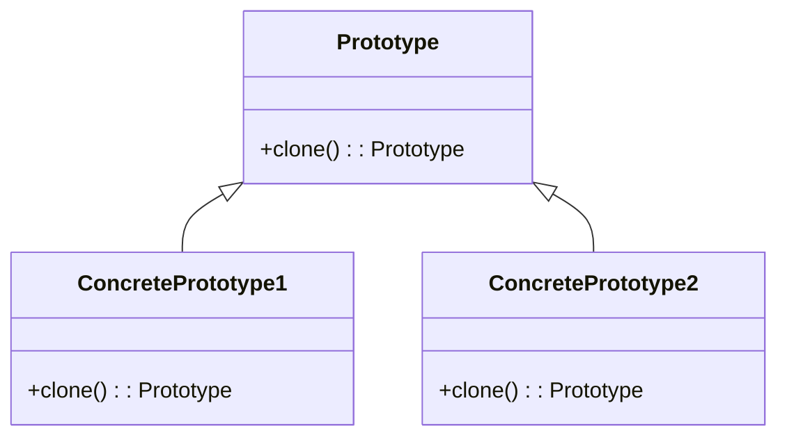

## 3.6.1 Intent and Motivation

The Prototype Pattern is a creational design pattern that focuses on the concept of cloning objects to create new instances. This pattern is particularly useful when the cost of creating a new object is more expensive than copying an existing one. By using a prototypical instance as a blueprint, we can efficiently create new objects that share the same properties and behaviors.

### Understanding the Prototype Pattern

The Prototype Pattern allows us to specify the kinds of objects to create using a prototypical instance and create new objects by copying this prototype. This approach is beneficial in scenarios where object creation is costly in terms of time or resources. Instead of instantiating a new object from scratch, we clone an existing object, which can be much faster and more efficient.

#### The Intent of the Prototype Pattern

The primary intent of the Prototype Pattern is to:

- **Reduce the overhead of creating complex objects**: By cloning an existing object, we avoid the potentially expensive process of setting up a new instance from scratch.
- **Facilitate the creation of objects with complex configurations**: When objects have intricate configurations or states, cloning a prototype ensures consistency and reduces the likelihood of errors.
- **Enable dynamic object creation**: The Prototype Pattern allows for the creation of objects at runtime without knowing their exact types, promoting flexibility and adaptability.

### Scenarios for Using the Prototype Pattern

The Prototype Pattern is particularly useful in the following scenarios:

1. **Resource-Intensive Object Creation**: When creating an object is resource-intensive, cloning an existing instance can save time and computational resources. This is common in applications where objects have complex initialization processes.

2. **Dynamic Object Creation**: In situations where the system needs to create objects dynamically at runtime, the Prototype Pattern provides a mechanism to do so without tightly coupling the code to specific classes.

3. **Complex Object Configurations**: When objects have complex configurations that are costly to replicate manually, using a prototype ensures that new instances are created with the same configuration effortlessly.

4. **Avoiding Subclass Explosion**: In systems with numerous subclasses, the Prototype Pattern can help manage complexity by allowing objects to be cloned rather than subclassed.

### Benefits of the Prototype Pattern

The Prototype Pattern offers several benefits, particularly in terms of performance and resource management:

- **Performance Optimization**: Cloning an object is often faster than creating a new one, especially when the object requires significant setup or initialization.
  
- **Resource Management**: By reusing existing objects as prototypes, we can reduce memory consumption and improve the efficiency of the application.

- **Flexibility and Extensibility**: The Prototype Pattern allows for flexible and extensible designs, as new object types can be introduced without altering existing code.

- **Decoupling and Reusability**: By decoupling the object creation process from specific classes, the Prototype Pattern promotes reusability and reduces dependencies.

### Analogies to Clarify the Prototype Concept

To better understand the Prototype Pattern, consider the following analogies:

- **Cookie Cutter Analogy**: Imagine you have a cookie cutter that shapes dough into cookies. The cutter is the prototype, and each cookie is a clone of the original shape. This analogy illustrates how the Prototype Pattern allows us to create identical objects efficiently.

- **Photocopy Machine Analogy**: Think of a photocopy machine that duplicates documents. The original document is the prototype, and each copy is a clone. This analogy highlights the efficiency and speed of creating new instances by copying an existing one.

### Implementing the Prototype Pattern in JavaScript

In JavaScript, the Prototype Pattern can be implemented using the `Object.create()` method, which allows us to create a new object with a specified prototype.

```javascript
// Define a prototype object
const carPrototype = {
  drive() {
    console.log(`Driving a ${this.make} ${this.model}`);
  }
};

// Create a new object using the prototype
const car1 = Object.create(carPrototype);
car1.make = 'Toyota';
car1.model = 'Corolla';
car1.drive(); // Output: Driving a Toyota Corolla

// Clone the object to create another instance
const car2 = Object.create(car1);
car2.make = 'Honda';
car2.model = 'Civic';
car2.drive(); // Output: Driving a Honda Civic
```

In this example, `carPrototype` serves as the prototype for creating new car objects. By using `Object.create()`, we can efficiently clone the prototype and create new instances with minimal overhead.

### Implementing the Prototype Pattern in TypeScript

In TypeScript, we can enhance the Prototype Pattern by leveraging interfaces and classes to ensure type safety.

```typescript
// Define an interface for the prototype
interface Car {
  make: string;
  model: string;
  drive(): void;
}

// Define a prototype object
const carPrototype: Car = {
  make: '',
  model: '',
  drive() {
    console.log(`Driving a ${this.make} ${this.model}`);
  }
};

// Create a new object using the prototype
const car1: Car = Object.create(carPrototype);
car1.make = 'Toyota';
car1.model = 'Corolla';
car1.drive(); // Output: Driving a Toyota Corolla

// Clone the object to create another instance
const car2: Car = Object.create(car1);
car2.make = 'Honda';
car2.model = 'Civic';
car2.drive(); // Output: Driving a Honda Civic
```

By defining an interface `Car`, we ensure that all objects created from the prototype adhere to a specific structure, providing type safety and consistency.

### Visualizing the Prototype Pattern

To better understand the Prototype Pattern, let's visualize the process of creating objects using a prototype.



In this diagram, `Prototype` is the base class with a `clone()` method. `ConcretePrototype1` and `ConcretePrototype2` are subclasses that implement the `clone()` method to create new instances.

### Try It Yourself

Experiment with the Prototype Pattern by modifying the code examples. Try creating different types of objects using the prototype and observe how changes to the prototype affect the cloned instances.

### Knowledge Check

- **Question**: What is the primary intent of the Prototype Pattern?
- **Question**: How does the Prototype Pattern improve performance?
- **Question**: In what scenarios is the Prototype Pattern particularly useful?

### Embrace the Journey

Remember, mastering design patterns is a journey. As you explore the Prototype Pattern, you'll discover its potential to optimize performance and manage resources effectively. Keep experimenting, stay curious, and enjoy the journey!

## Quiz Time!



### What is the primary intent of the Prototype Pattern?

- [x] To create new objects by copying an existing prototype.
- [ ] To define a family of algorithms and make them interchangeable.
- [ ] To separate the construction of a complex object from its representation.
- [ ] To provide a simplified interface to a complex subsystem.

> **Explanation:** The primary intent of the Prototype Pattern is to create new objects by copying an existing prototype, which is efficient and resource-saving.

### How does the Prototype Pattern improve performance?

- [x] By reducing the overhead of creating complex objects.
- [ ] By allowing incompatible interfaces to work together.
- [ ] By decoupling an abstraction from its implementation.
- [ ] By composing objects into tree structures.

> **Explanation:** The Prototype Pattern improves performance by reducing the overhead of creating complex objects, as cloning is often faster than instantiation.

### In what scenarios is the Prototype Pattern particularly useful?

- [x] When object creation is resource-intensive.
- [ ] When adding responsibilities to objects dynamically.
- [ ] When providing a surrogate for another object.
- [ ] When capturing and restoring an object's internal state.

> **Explanation:** The Prototype Pattern is useful when object creation is resource-intensive, allowing for efficient cloning of existing instances.

### What method is commonly used in JavaScript to implement the Prototype Pattern?

- [x] Object.create()
- [ ] Array.map()
- [ ] Function.bind()
- [ ] String.split()

> **Explanation:** The `Object.create()` method is commonly used in JavaScript to implement the Prototype Pattern by creating a new object with a specified prototype.

### Which analogy best describes the Prototype Pattern?

- [x] Cookie Cutter
- [ ] Bridge
- [ ] Facade
- [ ] Chain of Responsibility

> **Explanation:** The Cookie Cutter analogy best describes the Prototype Pattern, as it illustrates how identical objects are created efficiently.

### What is a benefit of using the Prototype Pattern?

- [x] It facilitates dynamic object creation.
- [ ] It allows for adding responsibilities to objects dynamically.
- [ ] It provides a simplified interface to a complex subsystem.
- [ ] It captures and restores an object's internal state.

> **Explanation:** A benefit of the Prototype Pattern is that it facilitates dynamic object creation, allowing for flexibility and adaptability in the system.

### How does the Prototype Pattern promote resource management?

- [x] By reusing existing objects as prototypes.
- [ ] By separating the construction of a complex object from its representation.
- [ ] By defining a family of algorithms and making them interchangeable.
- [ ] By providing a surrogate for another object.

> **Explanation:** The Prototype Pattern promotes resource management by reusing existing objects as prototypes, reducing memory consumption and improving efficiency.

### What is a key feature of the Prototype Pattern?

- [x] Cloning existing objects.
- [ ] Adding responsibilities to objects dynamically.
- [ ] Providing a simplified interface to a complex subsystem.
- [ ] Decoupling an abstraction from its implementation.

> **Explanation:** A key feature of the Prototype Pattern is cloning existing objects, which allows for efficient and flexible object creation.

### How does the Prototype Pattern enhance flexibility?

- [x] By allowing new object types to be introduced without altering existing code.
- [ ] By providing a simplified interface to a complex subsystem.
- [ ] By separating the construction of a complex object from its representation.
- [ ] By capturing and restoring an object's internal state.

> **Explanation:** The Prototype Pattern enhances flexibility by allowing new object types to be introduced without altering existing code, promoting extensibility.

### True or False: The Prototype Pattern is useful for avoiding subclass explosion.

- [x] True
- [ ] False

> **Explanation:** True. The Prototype Pattern is useful for avoiding subclass explosion by allowing objects to be cloned rather than subclassed, managing complexity effectively.


