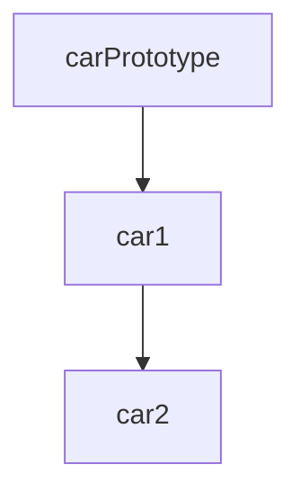

## 3.6.2 Implementation in JavaScript

The Prototype Pattern is a creational design pattern that allows you to create new objects by copying existing ones. JavaScript, with its unique prototypal inheritance model, provides built-in mechanisms to implement this pattern effectively. In this section, we'll explore how to clone objects using prototypes, delve into JavaScript's prototypal inheritance, and demonstrate both shallow and deep copying techniques. We'll also discuss how to handle complex objects and share properties among cloned objects.

### Understanding Prototypal Inheritance

Before we dive into cloning objects, it's essential to understand JavaScript's prototypal inheritance. Unlike classical inheritance found in languages like Java or C++, JavaScript uses prototypes to share properties and methods among objects.

When you create an object in JavaScript, it has an internal link to another object called its prototype. This prototype object can have its own prototype, forming a prototype chain. When you access a property on an object, JavaScript first looks for the property on the object itself. If it doesn't find it, it continues searching up the prototype chain until it finds the property or reaches the end of the chain.

### Cloning Objects Using `Object.create()`

One of the simplest ways to clone objects in JavaScript is by using the `Object.create()` method. This method creates a new object with the specified prototype object and properties.

```javascript
// Define a prototype object
const carPrototype = {
  start() {
    console.log(`Starting the ${this.make} ${this.model}`);
  }
};

// Create a new object using the prototype
const car1 = Object.create(carPrototype);
car1.make = 'Toyota';
car1.model = 'Corolla';
car1.start(); // Output: Starting the Toyota Corolla

// Clone the object
const car2 = Object.create(car1);
car2.make = 'Honda';
car2.model = 'Civic';
car2.start(); // Output: Starting the Honda Civic
```

In this example, `car2` is created using `car1` as its prototype. This means `car2` inherits properties and methods from `car1`, which in turn inherits from `carPrototype`.

### Shallow Copy vs. Deep Copy

When cloning objects, it's crucial to understand the difference between shallow and deep copies.

- **Shallow Copy**: A shallow copy of an object is a copy whose properties are references to the same memory locations as the original object. If the original object contains nested objects, the shallow copy will share these nested objects with the original.

- **Deep Copy**: A deep copy of an object is a copy whose properties are completely independent of the original object. All nested objects are also copied, resulting in a new object with no shared references.

#### Implementing Shallow Copy

JavaScript provides several ways to create shallow copies, such as using the spread operator (`...`) or `Object.assign()`.

```javascript
// Original object
const original = {
  name: 'Alice',
  address: {
    city: 'Wonderland'
  }
};

// Shallow copy using Object.assign
const shallowCopy1 = Object.assign({}, original);

// Shallow copy using spread operator
const shallowCopy2 = { ...original };

// Modifying the nested object
shallowCopy1.address.city = 'New Wonderland';

console.log(original.address.city); // Output: New Wonderland
console.log(shallowCopy2.address.city); // Output: New Wonderland
```

In this example, modifying the `city` property in `shallowCopy1` also affects `original` and `shallowCopy2` because they share the same reference to the `address` object.

#### Implementing Deep Copy

To create a deep copy, you can use libraries like Lodash or implement a custom function. Here's a simple example using JSON methods:

```javascript
// Deep copy using JSON methods
const deepCopy = JSON.parse(JSON.stringify(original));

// Modifying the nested object
deepCopy.address.city = 'Old Wonderland';

console.log(original.address.city); // Output: New Wonderland
console.log(deepCopy.address.city); // Output: Old Wonderland
```

This method works well for objects that can be serialized to JSON, but it has limitations, such as not handling functions or special object types like `Date`.

### Cloning Complex Objects

When dealing with complex objects that include functions, dates, or other non-serializable types, you'll need a more sophisticated approach to deep copying. Here's an example of a custom deep copy function:

```javascript
function deepClone(obj) {
  if (obj === null || typeof obj !== 'object') {
    return obj;
  }

  if (obj instanceof Date) {
    return new Date(obj.getTime());
  }

  if (obj instanceof Array) {
    return obj.map(item => deepClone(item));
  }

  const clonedObj = {};
  for (let key in obj) {
    if (obj.hasOwnProperty(key)) {
      clonedObj[key] = deepClone(obj[key]);
    }
  }
  return clonedObj;
}

// Example usage
const complexObject = {
  name: 'Bob',
  birthdate: new Date(1990, 1, 1),
  hobbies: ['reading', 'gaming'],
  greet() {
    console.log(`Hello, my name is ${this.name}`);
  }
};

const clonedComplexObject = deepClone(complexObject);
clonedComplexObject.name = 'Charlie';
clonedComplexObject.greet(); // Output: Hello, my name is Charlie
```

This function handles arrays, dates, and nested objects, but it doesn't clone functions, as functions are typically shared among instances.

### Sharing Properties with Prototypes

One of the advantages of using prototypes is the ability to share properties and methods among cloned objects. This can be particularly useful for methods that don't change between instances.

```javascript
// Define a prototype with shared methods
const animalPrototype = {
  speak() {
    console.log(`${this.name} makes a noise.`);
  }
};

// Create an animal object
const dog = Object.create(animalPrototype);
dog.name = 'Dog';
dog.speak(); // Output: Dog makes a noise.

// Clone the animal object
const cat = Object.create(dog);
cat.name = 'Cat';
cat.speak(); // Output: Cat makes a noise.
```

In this example, both `dog` and `cat` share the `speak` method defined in `animalPrototype`, demonstrating how prototypes can be used to efficiently share functionality.

### Language Features Facilitating the Prototype Pattern

JavaScript provides several features that facilitate the implementation of the Prototype Pattern:

- **Prototypes**: As discussed, prototypes allow objects to inherit properties and methods from other objects, making it easy to share functionality.

- **`Object.create()`**: This method creates a new object with a specified prototype, providing a straightforward way to implement the Prototype Pattern.

- **Spread Operator and `Object.assign()`**: These tools allow for easy cloning of objects, although they are limited to shallow copies.

- **`JSON.parse()` and `JSON.stringify()`**: These methods provide a simple way to create deep copies of objects that can be serialized to JSON.

### Visualizing Prototypal Inheritance

To better understand how prototypal inheritance works in JavaScript, let's visualize the prototype chain using a diagram.



**Figure 1**: This diagram illustrates how `car2` inherits from `car1`, which in turn inherits from `carPrototype`. Each arrow represents a prototype link, showing the chain of inheritance.

### Try It Yourself

Now that we've explored the Prototype Pattern in JavaScript, it's time to experiment. Try modifying the code examples to:

- Add new properties or methods to the prototypes and observe how they affect cloned objects.
- Implement a custom deep copy function that handles additional data types, such as `Map` or `Set`.
- Create a prototype chain with more than two levels and test property access along the chain.

### Further Reading

For more information on JavaScript's prototypal inheritance and object cloning, check out these resources:

- [MDN Web Docs: Prototypal Inheritance](https://developer.mozilla.org/en-US/docs/Web/JavaScript/Inheritance_and_the_prototype_chain)
- [MDN Web Docs: Object.create()](https://developer.mozilla.org/en-US/docs/Web/JavaScript/Reference/Global_Objects/Object/create)
- [Lodash's Deep Clone](https://lodash.com/docs/4.17.15#cloneDeep)

### Knowledge Check

Before we wrap up, let's reinforce what we've learned:

- What is the difference between shallow and deep copy?
- How does `Object.create()` facilitate the Prototype Pattern?
- Why might you choose to use prototypes to share properties among objects?

### Embrace the Journey

Remember, mastering design patterns like the Prototype Pattern is a journey. As you continue to experiment and apply these concepts, you'll gain a deeper understanding of JavaScript's capabilities. Keep exploring, stay curious, and enjoy the process!

## Quiz Time!



### What is the primary purpose of the Prototype Pattern in JavaScript?

- [x] To create new objects by copying existing ones
- [ ] To define a class-based inheritance model
- [ ] To encapsulate object creation logic
- [ ] To manage object state transitions

> **Explanation:** The Prototype Pattern allows for creating new objects by copying existing ones, leveraging JavaScript's prototypal inheritance.

### Which method is used to create a new object with a specified prototype in JavaScript?

- [ ] Object.assign()
- [x] Object.create()
- [ ] JSON.parse()
- [ ] JSON.stringify()

> **Explanation:** `Object.create()` is used to create a new object with a specified prototype.

### What is a shallow copy?

- [x] A copy where properties are references to the same memory locations as the original
- [ ] A copy where all properties are duplicated independently
- [ ] A copy that includes only primitive data types
- [ ] A copy that excludes nested objects

> **Explanation:** A shallow copy shares references to the same memory locations for nested objects.

### How can you create a deep copy of an object in JavaScript?

- [ ] Using Object.create()
- [ ] Using Object.assign()
- [x] Using JSON.parse() and JSON.stringify()
- [ ] Using the spread operator

> **Explanation:** JSON methods can be used to create deep copies, though with limitations on non-serializable types.

### What is a limitation of using JSON methods for deep copying?

- [x] They do not handle functions or special object types like Date
- [ ] They are too slow for large objects
- [ ] They cannot copy primitive values
- [ ] They require external libraries

> **Explanation:** JSON methods do not handle functions or special object types like `Date`.

### How does prototypal inheritance work in JavaScript?

- [x] Objects inherit properties and methods from other objects via a prototype chain
- [ ] Objects inherit properties from classes
- [ ] Objects share a global prototype
- [ ] Objects cannot inherit properties in JavaScript

> **Explanation:** JavaScript uses a prototype chain for inheritance, where objects inherit from other objects.

### What is the advantage of using prototypes to share methods among objects?

- [x] It reduces memory usage by sharing methods
- [ ] It makes objects immutable
- [ ] It allows for dynamic method creation
- [ ] It prevents method overriding

> **Explanation:** Sharing methods via prototypes reduces memory usage as methods are not duplicated for each instance.

### Which of the following is not a feature that facilitates the Prototype Pattern in JavaScript?

- [ ] Prototypes
- [ ] Object.create()
- [ ] JSON.parse() and JSON.stringify()
- [x] Class-based inheritance

> **Explanation:** JavaScript does not use class-based inheritance; it uses prototypes for inheritance.

### What happens when you access a property on an object that is not directly present on it?

- [ ] JavaScript throws an error
- [x] JavaScript searches up the prototype chain
- [ ] JavaScript returns undefined
- [ ] JavaScript creates the property on the object

> **Explanation:** JavaScript searches up the prototype chain to find the property.

### True or False: A deep copy of an object shares references to nested objects with the original.

- [ ] True
- [x] False

> **Explanation:** A deep copy creates independent copies of nested objects, not shared references.




