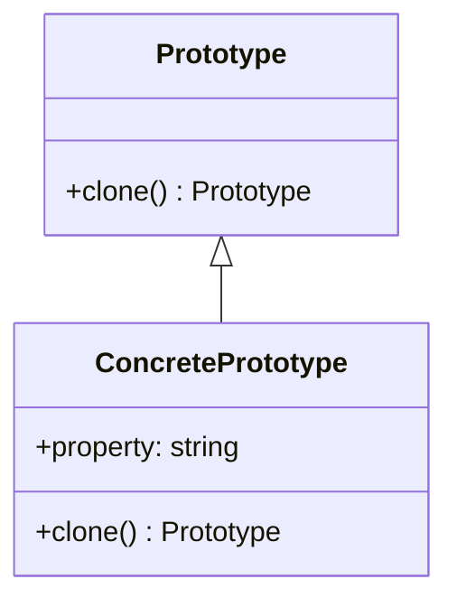

## 3.6.3 Implementation in TypeScript

In this section, we will delve into the implementation of the Prototype Pattern in TypeScript, focusing on how to achieve cloning with type safety. The Prototype Pattern is a creational design pattern that allows you to create new objects by copying existing ones, which can be particularly useful when the cost of creating a new instance of an object is more expensive than copying an existing one.

### Understanding the Prototype Pattern

The Prototype Pattern involves creating a new object by copying an existing object, known as the prototype. This pattern is particularly useful when the initialization of an object is resource-intensive, and you want to avoid the overhead of creating new instances from scratch.

#### Key Concepts

- **Prototype**: The original object that serves as a template for creating new objects.
- **Cloning**: The process of creating a new object by copying the prototype.
- **Type Safety**: Ensuring that the cloned object maintains the correct types as defined in TypeScript.

### Implementing the Prototype Pattern in TypeScript

Let's explore how to implement the Prototype Pattern in TypeScript, leveraging its strong typing system to ensure type safety.

#### Step 1: Define a Prototype Interface

First, we need to define an interface that will represent the prototype. This interface will include a method for cloning objects.

```typescript
interface Prototype {
    clone(): Prototype;
}
```

In this interface, the `clone` method returns a new instance of the `Prototype` type, ensuring that any class implementing this interface will provide a way to clone itself.

#### Step 2: Implement the Prototype Interface

Next, we create a class that implements the `Prototype` interface. This class will define the properties and the `clone` method.

```typescript
class ConcretePrototype implements Prototype {
    public property: string;

    constructor(property: string) {
        this.property = property;
    }

    public clone(): Prototype {
        return new ConcretePrototype(this.property);
    }
}
```

In this example, `ConcretePrototype` implements the `Prototype` interface. The `clone` method creates a new instance of `ConcretePrototype`, copying the `property` value from the existing instance.

#### Step 3: Use the Prototype Pattern

Now, let's see how to use the `ConcretePrototype` class to create clones.

```typescript
const original = new ConcretePrototype("Original Property");
const clone = original.clone();

console.log(original.property); // Output: Original Property
console.log(clone.property);    // Output: Original Property
```

In this code, we create an instance of `ConcretePrototype` and then use the `clone` method to create a copy. Both the original and the clone have the same property value, demonstrating the cloning process.

### Addressing Cloning Issues in TypeScript

While the Prototype Pattern is straightforward, there are potential issues to consider, especially when dealing with complex objects.

#### Deep vs. Shallow Cloning

The example above demonstrates shallow cloning, where only the top-level properties are copied. If the object contains nested objects, you may need to implement deep cloning to ensure all levels are copied.

```typescript
class ComplexPrototype implements Prototype {
    public property: string;
    public nestedObject: { [key: string]: any };

    constructor(property: string, nestedObject: { [key: string]: any }) {
        this.property = property;
        this.nestedObject = nestedObject;
    }

    public clone(): Prototype {
        // Deep clone the nested object
        const nestedClone = JSON.parse(JSON.stringify(this.nestedObject));
        return new ComplexPrototype(this.property, nestedClone);
    }
}
```

In this example, we use `JSON.parse(JSON.stringify(...))` to deep clone the `nestedObject`. However, be cautious with this approach, as it may not work for objects with functions or circular references.

#### Handling Circular References

When dealing with objects that have circular references, deep cloning becomes more complex. In such cases, consider using libraries like `lodash` which provide robust deep cloning functions.

```typescript
import _ from 'lodash';

class CircularPrototype implements Prototype {
    public property: string;
    public selfReference: CircularPrototype | null = null;

    constructor(property: string) {
        this.property = property;
    }

    public clone(): Prototype {
        // Use lodash to deep clone
        return _.cloneDeep(this);
    }
}
```

Here, we use `lodash`'s `cloneDeep` method to handle circular references effectively.

### Best Practices for Implementing the Prototype Pattern in TypeScript

- **Use Interfaces**: Define interfaces to ensure that all prototypes conform to a common structure.
- **Consider Cloning Depth**: Decide whether you need shallow or deep cloning based on your application's requirements.
- **Leverage TypeScript's Type System**: Use TypeScript's type annotations to ensure that your clones maintain the correct types.
- **Handle Complex Objects Carefully**: For objects with nested structures or circular references, use robust cloning techniques or libraries.

### Visualizing the Prototype Pattern

To better understand the Prototype Pattern, let's visualize the process of cloning objects using a class diagram.



**Diagram Description**: This class diagram illustrates the relationship between the `Prototype` interface and the `ConcretePrototype` class. The `ConcretePrototype` class implements the `Prototype` interface, providing a concrete implementation of the `clone` method.

### Try It Yourself

To deepen your understanding, try modifying the code examples:

- **Add More Properties**: Extend the `ConcretePrototype` class with additional properties and ensure they are cloned correctly.
- **Implement Deep Cloning**: Modify the `clone` method to perform deep cloning for nested objects.
- **Experiment with Circular References**: Create a prototype with circular references and use a library to clone it.

### References and Further Reading

- [MDN Web Docs: Object Cloning](https://developer.mozilla.org/en-US/docs/Web/JavaScript/Guide/Working_with_Objects)
- [TypeScript Handbook: Interfaces](https://www.typescriptlang.org/docs/handbook/interfaces.html)
- [Lodash Documentation](https://lodash.com/docs/4.17.15#cloneDeep)

### Knowledge Check

- What is the primary purpose of the Prototype Pattern?
- How does TypeScript's type system enhance the implementation of the Prototype Pattern?
- What are the differences between shallow and deep cloning?

### Embrace the Journey

Remember, mastering design patterns like the Prototype Pattern is a journey. As you continue to explore and experiment, you'll gain deeper insights into creating efficient and maintainable code. Keep pushing the boundaries, stay curious, and enjoy the process of learning and growing as a developer!

## Quiz Time!



### What does the Prototype Pattern primarily focus on?

- [x] Creating new objects by copying existing ones
- [ ] Defining a family of algorithms
- [ ] Separating the construction of a complex object from its representation
- [ ] Allowing incompatible interfaces to work together

> **Explanation:** The Prototype Pattern is a creational pattern that focuses on creating new objects by copying existing ones, which can be more efficient than creating new instances from scratch.

### What is a key benefit of using TypeScript for implementing the Prototype Pattern?

- [x] Type safety
- [ ] Faster execution
- [ ] Smaller code size
- [ ] Easier debugging

> **Explanation:** TypeScript provides type safety, ensuring that cloned objects maintain the correct types, which is a significant advantage when implementing the Prototype Pattern.

### Which method is commonly used for deep cloning in JavaScript?

- [ ] Object.assign()
- [x] JSON.parse(JSON.stringify(...))
- [ ] Array.prototype.slice()
- [ ] String.prototype.split()

> **Explanation:** `JSON.parse(JSON.stringify(...))` is a common method for deep cloning objects in JavaScript, although it has limitations with functions and circular references.

### What is a potential issue with using JSON.parse(JSON.stringify(...)) for cloning?

- [ ] It is too slow
- [x] It cannot handle functions or circular references
- [ ] It changes the object type
- [ ] It is not supported in all browsers

> **Explanation:** This method cannot handle objects with functions or circular references, which can lead to errors or incomplete clones.

### What library can be used to handle deep cloning with circular references?

- [ ] jQuery
- [x] Lodash
- [ ] Axios
- [ ] React

> **Explanation:** Lodash provides a robust `cloneDeep` method that can handle deep cloning with circular references effectively.

### What should you consider when deciding between shallow and deep cloning?

- [x] The complexity of the object structure
- [ ] The speed of the cloning process
- [ ] The size of the object
- [ ] The number of properties

> **Explanation:** The complexity of the object structure, especially if it contains nested objects or references, determines whether shallow or deep cloning is appropriate.

### How can you ensure type safety when implementing the Prototype Pattern in TypeScript?

- [x] Use TypeScript interfaces and type annotations
- [ ] Use JavaScript's `typeof` operator
- [ ] Avoid using any types
- [ ] Use only primitive types

> **Explanation:** TypeScript's interfaces and type annotations help ensure that cloned objects maintain the correct types, providing type safety.

### What is the primary role of the `clone` method in the Prototype Pattern?

- [x] To create a new instance of the prototype
- [ ] To modify the prototype
- [ ] To delete the prototype
- [ ] To compare two prototypes

> **Explanation:** The `clone` method is responsible for creating a new instance of the prototype, effectively copying its properties and state.

### Which of the following is NOT a characteristic of the Prototype Pattern?

- [ ] It can improve performance by avoiding expensive object creation
- [ ] It allows for easy creation of complex objects
- [ ] It requires a deep understanding of the object's structure
- [x] It is primarily used for managing object lifecycles

> **Explanation:** The Prototype Pattern is not primarily used for managing object lifecycles; it focuses on creating new objects by copying existing ones.

### True or False: The Prototype Pattern is only useful for objects with simple structures.

- [ ] True
- [x] False

> **Explanation:** The Prototype Pattern can be useful for both simple and complex objects, especially when initialization is resource-intensive.


