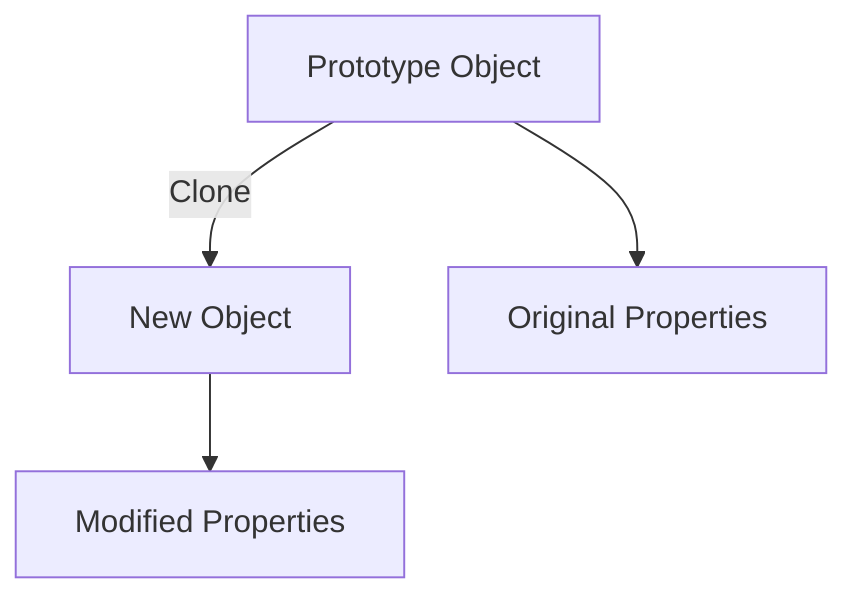

## 3.6.4 Use Cases and Examples

In this section, we delve into the practical applications of the Prototype pattern, a creational design pattern that is particularly useful in scenarios where the cost of creating a new instance of an object is high. We'll explore how this pattern can be implemented in JavaScript and TypeScript, focusing on examples such as cloning configuration objects, game objects, and UI elements. We'll also discuss when the Prototype pattern is preferred over other creational patterns and provide tips on managing prototypes and ensuring data integrity.

### Understanding the Prototype Pattern

The Prototype pattern is a creational design pattern that allows you to create new objects by copying an existing object, known as the prototype. This approach is beneficial when the cost of initializing a new instance is high, or when you want to avoid the complexities of creating an object from scratch.

#### Key Concepts

- **Prototype**: An existing object that serves as a blueprint for creating new objects.
- **Cloning**: The process of creating a new object by copying the prototype.
- **Shallow Copy**: A copy where the new object shares references to the same objects as the original.
- **Deep Copy**: A copy where the new object is completely independent of the original, with its own copies of all nested objects.

### When to Use the Prototype Pattern

The Prototype pattern is particularly useful in the following scenarios:

1. **High Cost of Object Creation**: When creating a new instance of an object is resource-intensive, cloning an existing object can be more efficient.
2. **Complex Object Initialization**: When the initialization of an object involves complex logic or configuration, using a prototype can simplify the process.
3. **Dynamic Object Creation**: When you need to create objects at runtime with varying configurations, the Prototype pattern provides flexibility.
4. **Avoiding Subclassing**: When subclassing is impractical or leads to a complex hierarchy, prototypes offer a simpler alternative.

### Practical Examples

Let's explore some practical examples of the Prototype pattern in action.

#### Cloning Configuration Objects

Configuration objects often contain a variety of settings and parameters that define the behavior of an application. Cloning these objects can be useful when you need to create multiple configurations with slight variations.

```javascript
// JavaScript Example: Cloning Configuration Objects

const configPrototype = {
  apiEndpoint: "https://api.example.com",
  timeout: 5000,
  headers: {
    "Content-Type": "application/json",
  },
  clone() {
    return Object.assign({}, this);
  },
};

const newConfig = configPrototype.clone();
newConfig.timeout = 10000;

console.log(newConfig);
console.log(configPrototype);
```

In this example, we define a `configPrototype` object with default settings. The `clone` method creates a shallow copy of the prototype, allowing us to modify the `timeout` property without affecting the original configuration.

#### Game Objects

In game development, creating multiple instances of similar objects, such as enemies or power-ups, is common. The Prototype pattern can simplify this process by allowing you to clone existing objects.

```typescript
// TypeScript Example: Cloning Game Objects

class GameObject {
  x: number;
  y: number;
  sprite: string;

  constructor(x: number, y: number, sprite: string) {
    this.x = x;
    this.y = y;
    this.sprite = sprite;
  }

  clone(): GameObject {
    return new GameObject(this.x, this.y, this.sprite);
  }
}

const enemyPrototype = new GameObject(0, 0, "enemySprite.png");
const enemyClone = enemyPrototype.clone();
enemyClone.x = 100;
enemyClone.y = 200;

console.log(enemyClone);
console.log(enemyPrototype);
```

Here, we define a `GameObject` class with a `clone` method that creates a new instance with the same properties. This approach allows us to quickly generate new game objects with different positions.

#### UI Elements

User interface elements, such as buttons or panels, often share common properties and behaviors. The Prototype pattern can be used to clone these elements, making it easy to create consistent UI components.

```javascript
// JavaScript Example: Cloning UI Elements

const buttonPrototype = {
  label: "Click Me",
  color: "blue",
  onClick() {
    console.log("Button clicked!");
  },
  clone() {
    return Object.assign({}, this);
  },
};

const newButton = buttonPrototype.clone();
newButton.label = "Submit";

console.log(newButton);
console.log(buttonPrototype);
```

In this example, we define a `buttonPrototype` object with default properties and behaviors. The `clone` method allows us to create a new button with a different label while retaining the original behavior.

### Managing Prototypes and Ensuring Data Integrity

When using the Prototype pattern, it's important to manage prototypes carefully to ensure data integrity. Here are some tips:

1. **Use Deep Copies for Complex Objects**: If your objects contain nested structures, consider using deep copies to avoid shared references.
2. **Encapsulate Cloning Logic**: Encapsulate the cloning logic within the prototype to maintain control over the cloning process.
3. **Avoid Modifying Prototypes Directly**: Modifying the prototype directly can lead to unexpected behavior. Always clone the prototype before making changes.
4. **Leverage TypeScript for Type Safety**: In TypeScript, use interfaces and classes to define prototypes, ensuring type safety and consistency.

### Visualizing the Prototype Pattern

To better understand the Prototype pattern, let's visualize the process of cloning an object.



In this diagram, the prototype object is cloned to create a new object. The new object can have modified properties, while the original properties remain unchanged in the prototype.

### Prototype Pattern vs. Other Creational Patterns

The Prototype pattern is one of several creational design patterns. Here's how it compares to others:

- **Singleton Pattern**: Ensures a class has only one instance. Use the Prototype pattern when you need multiple instances with similar properties.
- **Factory Method Pattern**: Defines an interface for creating objects but allows subclasses to alter the type of objects. Use the Prototype pattern when subclassing is impractical.
- **Abstract Factory Pattern**: Provides an interface for creating families of related objects. Use the Prototype pattern for simpler object creation without complex hierarchies.
- **Builder Pattern**: Separates the construction of a complex object from its representation. Use the Prototype pattern for cloning existing objects rather than constructing new ones.

### Try It Yourself

Experiment with the Prototype pattern by modifying the code examples provided. Try creating deep copies of objects, or implement the pattern in a different context, such as cloning data models or network requests.

### References and Further Reading

- [MDN Web Docs: Object.assign()](https://developer.mozilla.org/en-US/docs/Web/JavaScript/Reference/Global_Objects/Object/assign)
- [TypeScript Handbook: Classes](https://www.typescriptlang.org/docs/handbook/classes.html)
- [Refactoring Guru: Prototype Pattern](https://refactoring.guru/design-patterns/prototype)

### Knowledge Check

Before we conclude, let's reinforce what we've learned with some questions and exercises.

## Quiz Time!



### What is the primary purpose of the Prototype pattern?

- [x] To create new objects by copying existing ones
- [ ] To ensure a class has only one instance
- [ ] To define an interface for creating objects
- [ ] To separate the construction of a complex object from its representation

> **Explanation:** The Prototype pattern is used to create new objects by copying existing ones, which is particularly useful when the cost of initializing a new instance is high.

### When is the Prototype pattern preferred over the Factory Method pattern?

- [x] When subclassing is impractical
- [ ] When you need a single instance of a class
- [ ] When you want to create families of related objects
- [ ] When you need to separate construction from representation

> **Explanation:** The Prototype pattern is preferred over the Factory Method pattern when subclassing is impractical or leads to a complex hierarchy.

### Which method is commonly used for cloning objects in JavaScript?

- [x] Object.assign()
- [ ] JSON.parse()
- [ ] Array.prototype.slice()
- [ ] document.createElement()

> **Explanation:** Object.assign() is commonly used for creating shallow copies of objects in JavaScript, which is a key aspect of the Prototype pattern.

### What is a shallow copy?

- [x] A copy where the new object shares references to the same objects as the original
- [ ] A copy where the new object is completely independent of the original
- [ ] A copy that includes only primitive values
- [ ] A copy that excludes all methods

> **Explanation:** A shallow copy is a copy where the new object shares references to the same objects as the original, meaning changes to nested objects affect both copies.

### What should you consider when cloning objects with nested structures?

- [x] Use deep copies to avoid shared references
- [ ] Use shallow copies to improve performance
- [ ] Modify the prototype directly
- [ ] Avoid encapsulating cloning logic

> **Explanation:** When cloning objects with nested structures, it's important to use deep copies to avoid shared references and ensure data integrity.

### Which of the following is a benefit of using the Prototype pattern?

- [x] Simplifies object creation when initialization is complex
- [ ] Ensures a class has only one instance
- [ ] Provides an interface for creating families of related objects
- [ ] Separates the construction of a complex object from its representation

> **Explanation:** The Prototype pattern simplifies object creation when initialization is complex, making it easier to create objects with similar properties.

### How can TypeScript enhance the use of the Prototype pattern?

- [x] By providing type safety and consistency
- [ ] By allowing direct modification of prototypes
- [ ] By eliminating the need for cloning
- [ ] By enforcing a single instance of a class

> **Explanation:** TypeScript enhances the use of the Prototype pattern by providing type safety and consistency, ensuring that cloned objects adhere to defined interfaces and classes.

### What is a deep copy?

- [x] A copy where the new object is completely independent of the original
- [ ] A copy where the new object shares references to the same objects as the original
- [ ] A copy that includes only primitive values
- [ ] A copy that excludes all methods

> **Explanation:** A deep copy is a copy where the new object is completely independent of the original, with its own copies of all nested objects.

### Which pattern is used to create a single instance of a class?

- [ ] Prototype Pattern
- [x] Singleton Pattern
- [ ] Factory Method Pattern
- [ ] Builder Pattern

> **Explanation:** The Singleton pattern is used to ensure a class has only one instance, whereas the Prototype pattern is used for cloning existing objects.

### True or False: The Prototype pattern is useful for creating objects with varying configurations at runtime.

- [x] True
- [ ] False

> **Explanation:** True. The Prototype pattern is useful for creating objects with varying configurations at runtime, providing flexibility and efficiency.



Remember, this is just the beginning. As you progress, you'll build more complex and interactive applications using the Prototype pattern. Keep experimenting, stay curious, and enjoy the journey!
