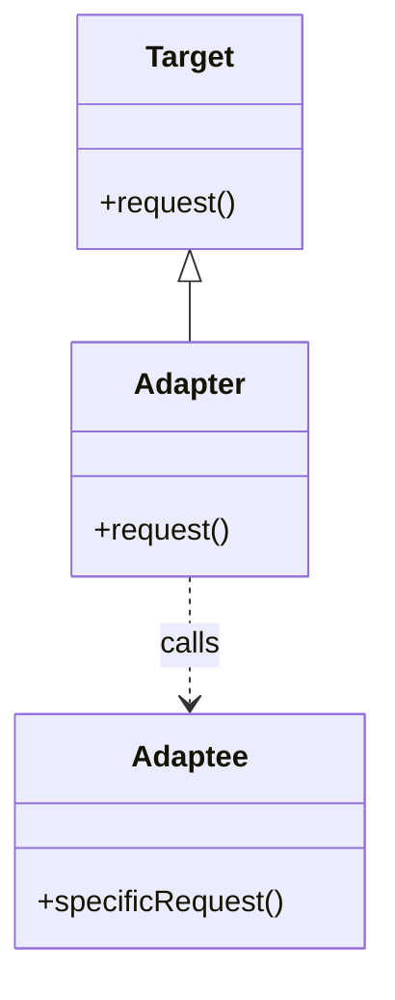
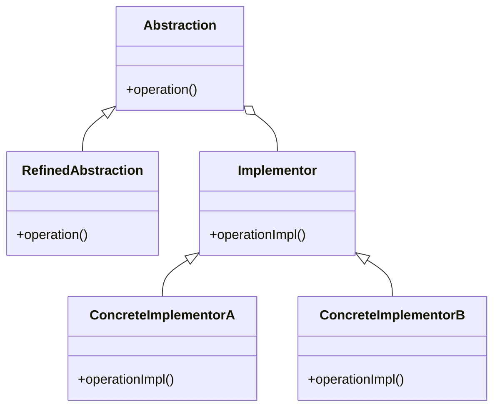
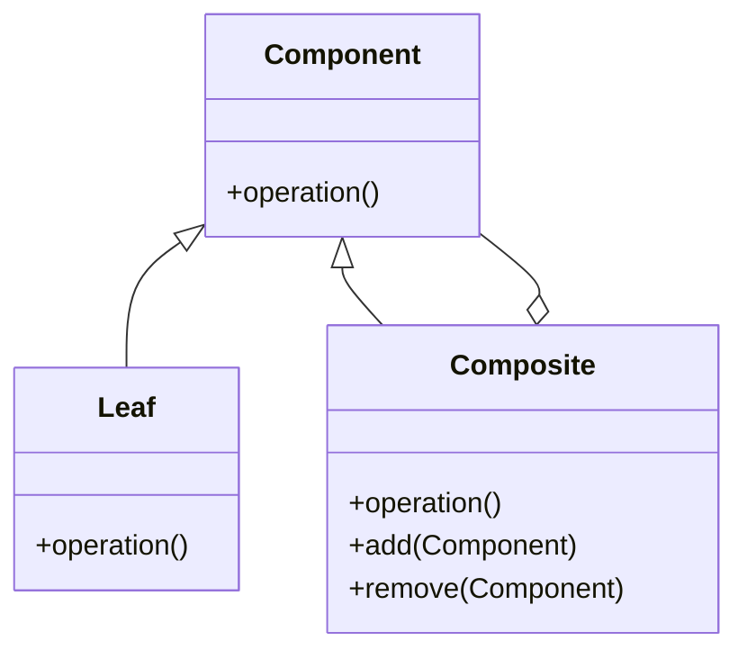
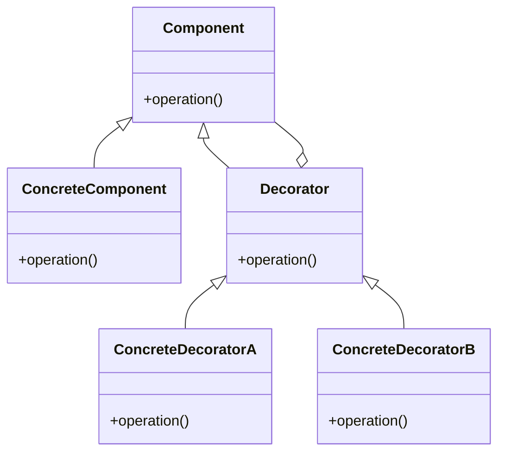
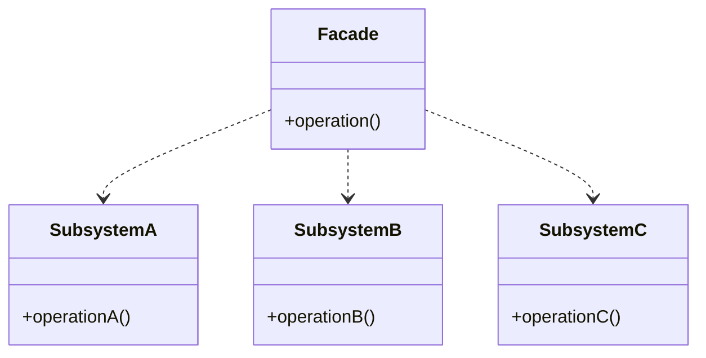
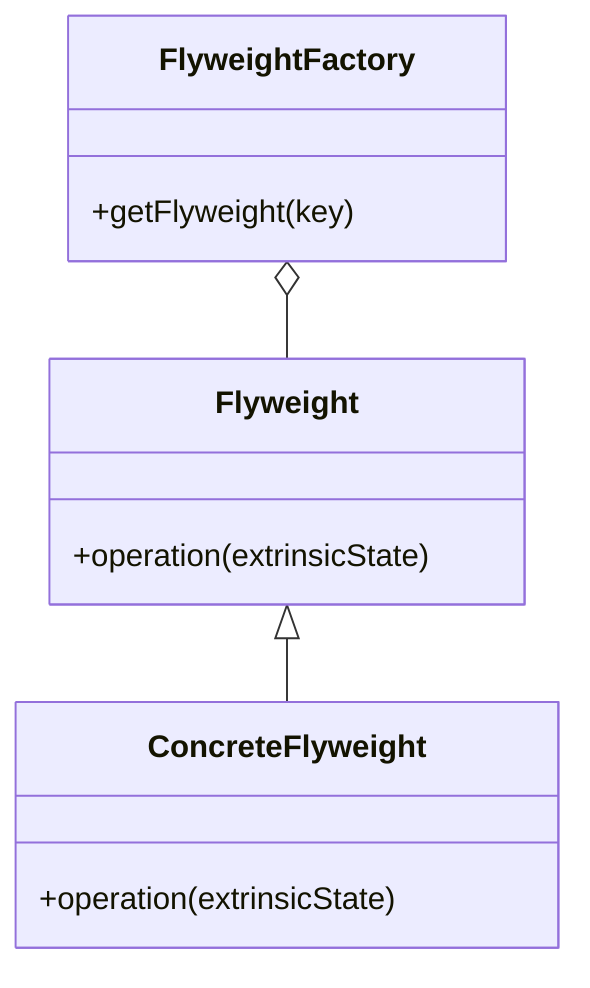
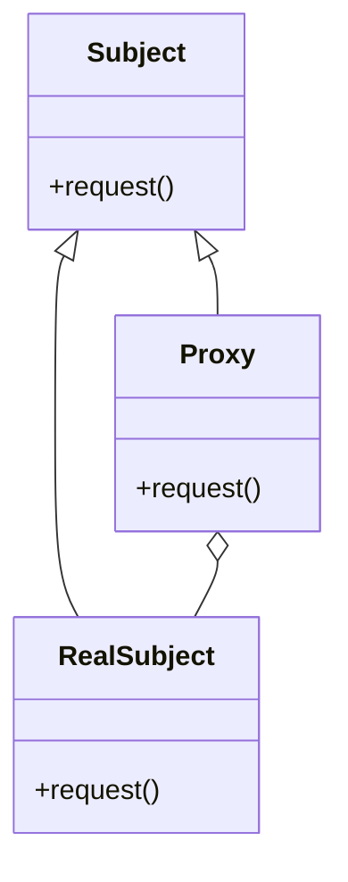

## 4.1 Overview of Structural Patterns

In the realm of software development, design patterns serve as blueprints for solving common problems in code architecture. Structural design patterns, in particular, focus on the composition of classes and objects to form larger structures. They help developers manage relationships between entities, ensuring that systems are both scalable and maintainable. In this section, we will delve into the world of structural design patterns, exploring their significance and application in JavaScript and TypeScript.

### Understanding Structural Design Patterns

Structural design patterns are concerned with how classes and objects are composed to form larger structures. They provide solutions for assembling objects and classes into complex structures while keeping these structures flexible and efficient. By focusing on the organization of code, structural patterns help in achieving scalability, reusability, and efficiency in software systems.

#### Role in Software Architecture

The primary role of structural design patterns is to simplify the design by identifying efficient ways to realize relationships between entities. These patterns help in:

- **Organizing Code**: By defining clear relationships between classes and objects, structural patterns make code easier to understand and maintain.
- **Enhancing Scalability**: As applications grow, structural patterns ensure that the system can scale without becoming unwieldy.
- **Promoting Reusability**: By encouraging modular design, structural patterns allow components to be reused across different parts of an application or even in different projects.
- **Improving Efficiency**: By optimizing the way objects are composed, these patterns can lead to more efficient code execution.

### The Importance of Structural Patterns

Understanding structural design patterns is crucial for building robust JavaScript and TypeScript applications. These patterns provide a framework for organizing code in a way that is both efficient and adaptable to change. Whether you're working on a small project or a large enterprise application, structural patterns can help you manage complexity and ensure that your codebase remains maintainable over time.

### Key Structural Patterns

In this section, we will introduce seven key structural patterns that are widely used in software development. Each pattern addresses a specific problem related to the composition of classes and objects. Let's briefly explore each one:

#### 1. Adapter Pattern

The Adapter Pattern allows incompatible interfaces to work together. It acts as a bridge between two incompatible interfaces, enabling them to communicate. This pattern is particularly useful when integrating third-party libraries or legacy code into a new system.

#### 2. Bridge Pattern

The Bridge Pattern decouples an abstraction from its implementation, allowing the two to vary independently. This pattern is useful when you want to separate the abstraction of a feature from its implementation, enabling flexibility and scalability.

#### 3. Composite Pattern

The Composite Pattern allows you to compose objects into tree structures to represent part-whole hierarchies. It enables clients to treat individual objects and compositions of objects uniformly, making it easier to work with complex structures.

#### 4. Decorator Pattern

The Decorator Pattern adds new responsibilities to objects dynamically. It provides a flexible alternative to subclassing for extending functionality, allowing you to add behavior to individual objects without affecting others.

#### 5. Facade Pattern

The Facade Pattern provides a simplified interface to a complex subsystem. It hides the complexities of the system and provides an easy-to-use interface, making it easier for clients to interact with the system.

#### 6. Flyweight Pattern

The Flyweight Pattern reduces memory usage by sharing common parts of objects. It is particularly useful when dealing with a large number of similar objects, allowing you to minimize memory consumption.

#### 7. Proxy Pattern

The Proxy Pattern provides a surrogate or placeholder for another object. It controls access to the original object, allowing you to add additional functionality such as lazy loading, access control, or logging.

### Visualizing Structural Patterns

To better understand how these patterns work, let's visualize the relationships and interactions they facilitate. Below are diagrams illustrating the core concepts of each pattern.

#### Adapter Pattern



*Diagram 1: The Adapter Pattern bridges the gap between incompatible interfaces.*

#### Bridge Pattern



*Diagram 2: The Bridge Pattern separates abstraction from implementation.*

#### Composite Pattern



*Diagram 3: The Composite Pattern organizes objects into tree structures.*

#### Decorator Pattern



*Diagram 4: The Decorator Pattern adds responsibilities to objects dynamically.*

#### Facade Pattern



*Diagram 5: The Facade Pattern simplifies interactions with complex subsystems.*

#### Flyweight Pattern



*Diagram 6: The Flyweight Pattern shares common parts of objects to save memory.*

#### Proxy Pattern



*Diagram 7: The Proxy Pattern controls access to another object.*

### Applying Structural Patterns in JavaScript and TypeScript

Now that we've introduced the key structural patterns, let's explore how they can be applied in JavaScript and TypeScript. These languages offer unique features that can enhance the implementation of structural patterns, such as dynamic typing in JavaScript and strong typing in TypeScript.

#### Adapter Pattern in JavaScript

The Adapter Pattern can be implemented in JavaScript by creating a class that wraps the incompatible interface and exposes a compatible one.

```javascript
// Adaptee with an incompatible interface
class OldSystem {
    oldRequest() {
        return 'Old system request';
    }
}

// Target interface
class NewSystem {
    request() {
        return 'New system request';
    }
}

// Adapter class
class Adapter extends NewSystem {
    constructor() {
        super();
        this.oldSystem = new OldSystem();
    }

    request() {
        return this.oldSystem.oldRequest();
    }
}

// Usage
const adapter = new Adapter();
console.log(adapter.request()); // Output: Old system request
```

#### Adapter Pattern in TypeScript

In TypeScript, we can leverage interfaces to define the expected interface and ensure type safety.

```typescript
// Adaptee with an incompatible interface
class OldSystem {
    oldRequest(): string {
        return 'Old system request';
    }
}

// Target interface
interface NewSystem {
    request(): string;
}

// Adapter class
class Adapter implements NewSystem {
    private oldSystem: OldSystem;

    constructor() {
        this.oldSystem = new OldSystem();
    }

    request(): string {
        return this.oldSystem.oldRequest();
    }
}

// Usage
const adapter: NewSystem = new Adapter();
console.log(adapter.request()); // Output: Old system request
```

### Try It Yourself

Experiment with the Adapter Pattern by modifying the `OldSystem` class to include additional methods. Update the `Adapter` class to expose these methods through the `NewSystem` interface. This exercise will help you understand how adapters can bridge multiple incompatible interfaces.

### Conclusion

Structural design patterns play a vital role in organizing code and managing relationships between entities in software systems. By understanding and applying these patterns, you can create scalable, reusable, and efficient applications in JavaScript and TypeScript. As you continue your journey in software development, remember that these patterns are tools to help you build robust systems. Keep experimenting, stay curious, and enjoy the process of learning and applying design patterns.

## Quiz Time!



### What is the primary role of structural design patterns?

- [x] To simplify the design by identifying efficient ways to realize relationships between entities.
- [ ] To provide a blueprint for creating objects.
- [ ] To manage the behavior of objects.
- [ ] To optimize the performance of algorithms.

> **Explanation:** Structural design patterns focus on the composition of classes and objects to form larger structures, simplifying the design by identifying efficient ways to realize relationships between entities.

### Which pattern allows incompatible interfaces to work together?

- [x] Adapter Pattern
- [ ] Bridge Pattern
- [ ] Composite Pattern
- [ ] Proxy Pattern

> **Explanation:** The Adapter Pattern acts as a bridge between two incompatible interfaces, enabling them to communicate.

### Which pattern decouples an abstraction from its implementation?

- [ ] Adapter Pattern
- [x] Bridge Pattern
- [ ] Composite Pattern
- [ ] Decorator Pattern

> **Explanation:** The Bridge Pattern decouples an abstraction from its implementation, allowing the two to vary independently.

### What is the main benefit of the Composite Pattern?

- [ ] It adds new responsibilities to objects dynamically.
- [ ] It provides a simplified interface to a complex subsystem.
- [x] It allows you to compose objects into tree structures to represent part-whole hierarchies.
- [ ] It reduces memory usage by sharing common parts of objects.

> **Explanation:** The Composite Pattern allows you to compose objects into tree structures to represent part-whole hierarchies, enabling clients to treat individual objects and compositions of objects uniformly.

### Which pattern adds new responsibilities to objects dynamically?

- [ ] Adapter Pattern
- [ ] Bridge Pattern
- [x] Decorator Pattern
- [ ] Facade Pattern

> **Explanation:** The Decorator Pattern adds new responsibilities to objects dynamically, providing a flexible alternative to subclassing for extending functionality.

### What does the Facade Pattern provide?

- [ ] A surrogate or placeholder for another object.
- [ ] A way to reduce memory usage by sharing common parts of objects.
- [x] A simplified interface to a complex subsystem.
- [ ] A method for composing objects into tree structures.

> **Explanation:** The Facade Pattern provides a simplified interface to a complex subsystem, making it easier for clients to interact with the system.

### Which pattern reduces memory usage by sharing common parts of objects?

- [ ] Adapter Pattern
- [ ] Bridge Pattern
- [ ] Composite Pattern
- [x] Flyweight Pattern

> **Explanation:** The Flyweight Pattern reduces memory usage by sharing common parts of objects, which is particularly useful when dealing with a large number of similar objects.

### What is the purpose of the Proxy Pattern?

- [x] To provide a surrogate or placeholder for another object.
- [ ] To decouple an abstraction from its implementation.
- [ ] To add new responsibilities to objects dynamically.
- [ ] To compose objects into tree structures.

> **Explanation:** The Proxy Pattern provides a surrogate or placeholder for another object, controlling access to the original object.

### How does the Adapter Pattern work in JavaScript?

- [x] By creating a class that wraps the incompatible interface and exposes a compatible one.
- [ ] By decoupling an abstraction from its implementation.
- [ ] By adding new responsibilities to objects dynamically.
- [ ] By reducing memory usage by sharing common parts of objects.

> **Explanation:** In JavaScript, the Adapter Pattern works by creating a class that wraps the incompatible interface and exposes a compatible one, enabling communication between incompatible interfaces.

### True or False: Structural patterns are only useful for large enterprise applications.

- [ ] True
- [x] False

> **Explanation:** Structural patterns are useful for both small projects and large enterprise applications. They help manage complexity and ensure that codebases remain maintainable over time.


