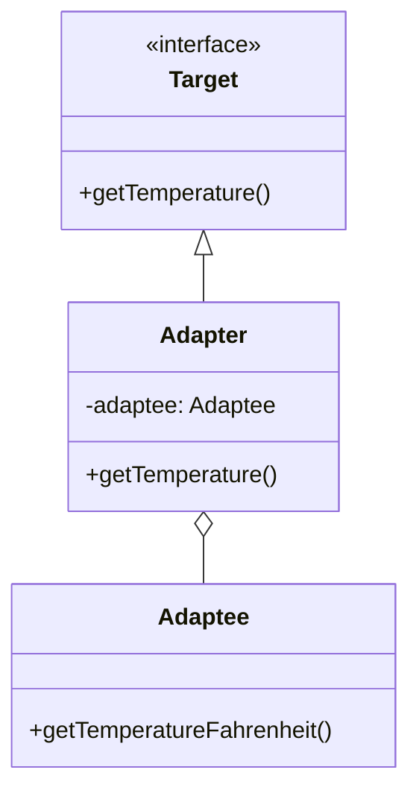

## 4.2.1 Intent and Motivation

In the realm of software design, the Adapter Pattern plays a crucial role in ensuring that incompatible interfaces can work together seamlessly. This pattern is particularly useful when integrating disparate systems or components that were not designed to cooperate. By converting one interface into another that clients expect, the Adapter Pattern allows for greater flexibility and reusability in code.

### Understanding the Adapter Pattern

The Adapter Pattern is a structural design pattern that allows objects with incompatible interfaces to collaborate. It acts as a bridge between two incompatible interfaces, enabling them to work together without modifying their existing code. This pattern is akin to an electrical adapter that allows a plug designed for one type of socket to fit into another, ensuring that the electrical device can operate regardless of the socket's configuration.

#### Real-World Analogy: Electrical Adapters

Consider the scenario of traveling to a foreign country with a different electrical socket standard. Your electronic devices, such as a laptop or phone charger, have plugs designed for your home country's sockets. Without an adapter, you wouldn't be able to use these devices abroad. An electrical adapter converts the plug's configuration to match the foreign socket, allowing your devices to function as intended.

Similarly, in software design, an adapter converts the interface of a class into another interface that a client expects. This conversion enables classes with incompatible interfaces to work together, much like how an electrical adapter allows devices to function in different socket configurations.

### Scenarios Requiring the Adapter Pattern

The need for the Adapter Pattern arises in several scenarios, particularly when dealing with legacy systems or integrating third-party libraries. Let's explore some common situations where this pattern proves invaluable:

1. **Legacy System Integration**: When modernizing an application, you might need to integrate new components with legacy systems that have outdated interfaces. The Adapter Pattern allows you to wrap the legacy system's interface with a new one, enabling seamless interaction with modern components.

2. **Third-Party Library Integration**: Often, third-party libraries come with their own interfaces that might not align with your application's architecture. Using an adapter, you can convert the library's interface to match your application's expected interface, facilitating smooth integration.

3. **Interface Standardization**: In large systems, different components might have been developed independently, resulting in varied interfaces. The Adapter Pattern helps standardize these interfaces, allowing components to communicate effectively without altering their original code.

4. **Cross-Platform Development**: In cross-platform applications, different platforms might require different interfaces. Adapters can bridge these differences, ensuring that the application functions consistently across platforms.

### Problems Without an Adapter

Without the Adapter Pattern, integrating components with incompatible interfaces can lead to several issues:

- **Code Duplication**: Developers might resort to duplicating code to accommodate different interfaces, leading to maintenance challenges and increased risk of errors.

- **Tight Coupling**: Directly modifying components to match interfaces can result in tight coupling, making the system less flexible and harder to maintain.

- **Increased Complexity**: Attempting to manually handle interface incompatibilities can increase the complexity of the codebase, making it harder to understand and extend.

- **Limited Reusability**: Components with incompatible interfaces might not be reusable in different contexts, limiting their applicability.

### Resolving Interface Incompatibilities with the Adapter Pattern

The Adapter Pattern resolves these issues by providing a clear and structured way to handle interface incompatibilities. Here's how it works:

1. **Define the Target Interface**: Identify the interface that the client expects. This interface serves as the standard that the adapter will conform to.

2. **Implement the Adapter**: Create an adapter class that implements the target interface. This class will contain a reference to the adaptee (the class with the incompatible interface) and delegate calls to it, converting the interface as needed.

3. **Use the Adapter**: The client interacts with the adapter as if it were the target interface. The adapter handles the conversion and communication with the adaptee, ensuring seamless integration.

#### Code Example: Adapter Pattern in JavaScript

Let's illustrate the Adapter Pattern with a simple example in JavaScript. Suppose we have a legacy system that provides temperature readings in Fahrenheit, but our application expects temperatures in Celsius.

```javascript
// The legacy system providing temperature in Fahrenheit
class FahrenheitSensor {
  getTemperature() {
    return 100; // Temperature in Fahrenheit
  }
}

// The target interface expected by the client
class CelsiusSensor {
  getTemperature() {
    throw new Error("This method should be overridden.");
  }
}

// The adapter class converting Fahrenheit to Celsius
class TemperatureAdapter extends CelsiusSensor {
  constructor(fahrenheitSensor) {
    super();
    this.fahrenheitSensor = fahrenheitSensor;
  }

  getTemperature() {
    const fahrenheit = this.fahrenheitSensor.getTemperature();
    return ((fahrenheit - 32) * 5) / 9; // Convert to Celsius
  }
}

// Client code
const fahrenheitSensor = new FahrenheitSensor();
const adapter = new TemperatureAdapter(fahrenheitSensor);

console.log(`Temperature in Celsius: ${adapter.getTemperature()}`); // Output: Temperature in Celsius: 37.77777777777778
```

In this example, the `TemperatureAdapter` class acts as an adapter, converting the temperature from Fahrenheit to Celsius. The client interacts with the `TemperatureAdapter` as if it were a `CelsiusSensor`, unaware of the underlying conversion process.

### Benefits of Using the Adapter Pattern

The Adapter Pattern offers several benefits that enhance code integration and reuse:

- **Decoupling**: By separating the interface conversion logic from the client and adaptee, the Adapter Pattern promotes loose coupling, making the system more flexible and easier to maintain.

- **Reusability**: Adapters can be reused across different contexts, allowing components with incompatible interfaces to be integrated without modification.

- **Simplified Integration**: The Adapter Pattern simplifies the integration of third-party libraries and legacy systems, reducing the need for extensive code changes.

- **Improved Maintainability**: By encapsulating the interface conversion logic within the adapter, the pattern improves code maintainability, making it easier to update and extend the system.

### Visualizing the Adapter Pattern

To better understand the Adapter Pattern, let's visualize its structure using a class diagram:



**Diagram Description**: The class diagram illustrates the relationship between the `Target` interface, the `Adaptee` class, and the `Adapter` class. The `Adapter` implements the `Target` interface and holds a reference to the `Adaptee`, enabling it to convert the interface as needed.

### Try It Yourself

Now that we've explored the Adapter Pattern, let's encourage some experimentation. Try modifying the code example to adapt a different type of sensor, such as a humidity sensor that provides readings in a different format. Consider how you might extend the adapter to handle multiple conversions.

### References and Further Reading

For more information on the Adapter Pattern and its applications, consider exploring the following resources:

- [MDN Web Docs: Design Patterns](https://developer.mozilla.org/en-US/docs/Web/JavaScript/Guide/Design_Patterns)
- [Refactoring Guru: Adapter Pattern](https://refactoring.guru/design-patterns/adapter)
- [W3Schools: JavaScript Design Patterns](https://www.w3schools.com/js/js_design_patterns.asp)

### Knowledge Check

To reinforce your understanding of the Adapter Pattern, consider the following questions:

- What is the primary purpose of the Adapter Pattern?
- How does the Adapter Pattern promote loose coupling in a system?
- In what scenarios is the Adapter Pattern particularly useful?

### Embrace the Journey

Remember, mastering design patterns is an ongoing journey. As you continue to explore and apply these patterns, you'll gain a deeper understanding of how to create flexible, maintainable, and scalable software systems. Keep experimenting, stay curious, and enjoy the journey!

## Quiz Time!



### What is the primary purpose of the Adapter Pattern?

- [x] To allow incompatible interfaces to work together
- [ ] To enhance the performance of a system
- [ ] To simplify the codebase by removing unnecessary classes
- [ ] To provide a new interface for existing classes

> **Explanation:** The Adapter Pattern is designed to allow incompatible interfaces to work together by converting one interface into another that clients expect.

### How does the Adapter Pattern promote loose coupling?

- [x] By separating the interface conversion logic from the client and adaptee
- [ ] By merging the client and adaptee into a single class
- [ ] By eliminating the need for interfaces altogether
- [ ] By tightly integrating the client and adaptee

> **Explanation:** The Adapter Pattern promotes loose coupling by encapsulating the interface conversion logic within the adapter, allowing the client and adaptee to remain independent.

### In what scenarios is the Adapter Pattern particularly useful?

- [x] When integrating legacy systems with modern components
- [x] When using third-party libraries with different interfaces
- [ ] When optimizing the performance of a system
- [ ] When simplifying the user interface of an application

> **Explanation:** The Adapter Pattern is particularly useful when integrating legacy systems with modern components and when using third-party libraries with different interfaces.

### What is a real-world analogy for the Adapter Pattern?

- [x] An electrical adapter that allows a plug to fit into a different socket
- [ ] A power strip that provides multiple outlets
- [ ] A transformer that changes voltage levels
- [ ] A circuit breaker that protects against overloads

> **Explanation:** An electrical adapter is a real-world analogy for the Adapter Pattern, as it allows a plug designed for one type of socket to fit into another.

### What problem does the Adapter Pattern solve?

- [x] Interface incompatibility between classes
- [ ] Memory leaks in large applications
- [ ] Performance bottlenecks in data processing
- [ ] Security vulnerabilities in network communication

> **Explanation:** The Adapter Pattern solves the problem of interface incompatibility between classes, allowing them to work together seamlessly.

### Which of the following is a benefit of using the Adapter Pattern?

- [x] Improved code maintainability
- [ ] Increased execution speed
- [ ] Reduced memory usage
- [ ] Enhanced security features

> **Explanation:** The Adapter Pattern improves code maintainability by encapsulating the interface conversion logic within the adapter, making it easier to update and extend the system.

### How does the Adapter Pattern simplify integration?

- [x] By reducing the need for extensive code changes
- [ ] By eliminating the need for interfaces
- [ ] By merging all components into a single class
- [ ] By removing the need for third-party libraries

> **Explanation:** The Adapter Pattern simplifies integration by reducing the need for extensive code changes, allowing components with incompatible interfaces to be integrated seamlessly.

### What is the role of the adapter class in the Adapter Pattern?

- [x] To convert the interface of the adaptee to match the target interface
- [ ] To replace the adaptee with a new implementation
- [ ] To eliminate the need for a target interface
- [ ] To merge the client and adaptee into a single class

> **Explanation:** The adapter class converts the interface of the adaptee to match the target interface, enabling seamless interaction between the client and adaptee.

### Which of the following is NOT a problem that arises without an adapter?

- [ ] Code duplication
- [ ] Tight coupling
- [ ] Increased complexity
- [x] Enhanced performance

> **Explanation:** Without an adapter, issues such as code duplication, tight coupling, and increased complexity can arise, but enhanced performance is not a problem.

### True or False: The Adapter Pattern can be used to standardize interfaces in large systems.

- [x] True
- [ ] False

> **Explanation:** True. The Adapter Pattern can be used to standardize interfaces in large systems, allowing components to communicate effectively without altering their original code.


